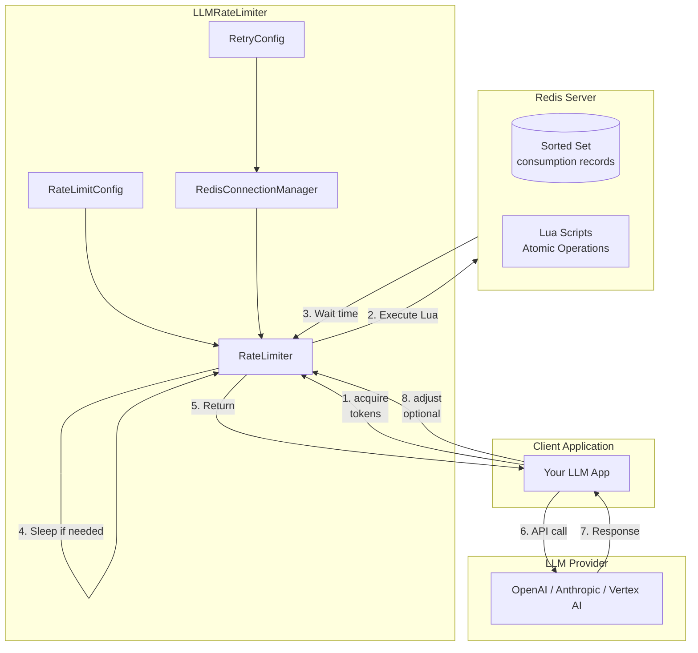
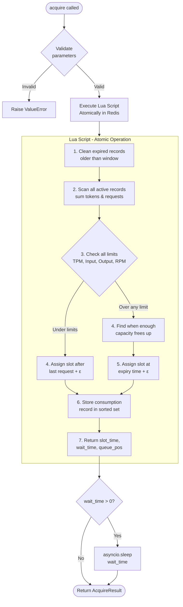
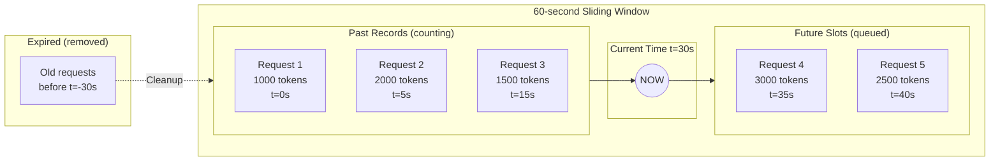
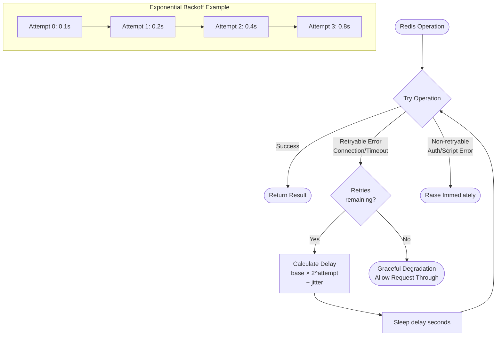
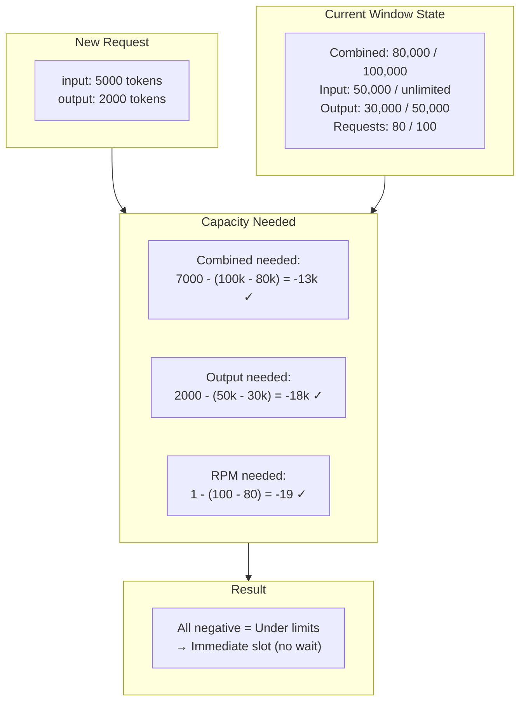

# Usage Guide

This guide covers all the ways to use LLMRateLimiter for different LLM providers and configurations.

## Rate Limiting Modes

LLMRateLimiter supports three modes based on how your LLM provider counts tokens:

| Mode | Use Case | Configuration |
|------|----------|---------------|
| **Combined** | OpenAI, Anthropic | `tpm=100000` |
| **Split** | GCP Vertex AI | `input_tpm=4000000, output_tpm=128000` |
| **Mixed** | Custom setups | Both combined and split limits |

## Combined TPM Mode

Use this mode for providers like OpenAI and Anthropic that have a single tokens-per-minute limit.

```python
import asyncio
from llmratelimiter import RateLimiter

async def main():
    limiter = RateLimiter(
        "redis://localhost:6379", "gpt-4",
        tpm=100_000,      # 100K tokens per minute
        rpm=100,          # 100 requests per minute
    )

    # Recommended: specify input and output tokens separately
    result = await limiter.acquire(input_tokens=3000, output_tokens=2000)
    print(f"Wait time: {result.wait_time:.2f}s, Queue position: {result.queue_position}")

    # Now safe to make API call
    # response = await openai.chat.completions.create(...)

asyncio.run(main())
```

!!! tip "Recommended: Use input_tokens and output_tokens"
    Always prefer `acquire(input_tokens=X, output_tokens=Y)` over `acquire(tokens=N)`.
    This enables accurate burndown rate calculations for providers like AWS Bedrock,
    and provides better tracking of token usage.

### AcquireResult

The `acquire()` method returns an `AcquireResult` with:

- `slot_time`: When the request was scheduled
- `wait_time`: How long the caller waited (0 if no wait)
- `queue_position`: Position in queue (0 = immediate)
- `record_id`: Unique ID for this consumption record

## Split TPM Mode

Use this mode for providers like GCP Vertex AI that have separate limits for input and output tokens.

```python
from llmratelimiter import RateLimiter

# GCP Vertex AI Gemini 1.5 Pro limits
limiter = RateLimiter(
    "redis://localhost:6379", "gemini-1.5-pro",
    input_tpm=4_000_000,   # 4M input tokens per minute
    output_tpm=128_000,    # 128K output tokens per minute
    rpm=360,               # 360 requests per minute
)

# Estimate output tokens upfront
result = await limiter.acquire(input_tokens=5000, output_tokens=2048)

# Make API call
response = await vertex_ai.generate(...)

# Adjust with actual output tokens
await limiter.adjust(result.record_id, actual_output=response.output_tokens)
```

### Why Adjust?

When using split mode, you must estimate output tokens before the call. After the call completes, use `adjust()` to correct the estimate:

- If actual < estimated: Frees up capacity for other requests
- If actual > estimated: Uses additional capacity retroactively

## Mixed Mode

You can combine both TPM limits for complex scenarios:

```python
from llmratelimiter import RateLimiter

limiter = RateLimiter(
    "redis://localhost:6379", "custom-model",
    tpm=500_000,           # Combined limit
    input_tpm=4_000_000,   # Input-specific limit
    output_tpm=128_000,    # Output-specific limit
    rpm=360,
)

# All three limits are checked independently
result = await limiter.acquire(input_tokens=5000, output_tokens=2048)
```

## Burndown Rate (AWS Bedrock)

AWS Bedrock uses a "token burndown rate" where output tokens count more heavily toward the TPM limit. For example, Claude models on AWS Bedrock use a 5x multiplier for output tokens.

```python
from llmratelimiter import RateLimiter

# AWS Bedrock Claude with 5x burndown rate
limiter = RateLimiter(
    "redis://localhost:6379", "claude-sonnet",
    tpm=100_000,         # TPM limit
    rpm=100,
    burndown_rate=5.0,   # Output tokens count 5x toward TPM
)

# Use input_tokens and output_tokens for accurate calculation
await limiter.acquire(input_tokens=3000, output_tokens=1000)
# TPM consumption: 3000 + (5.0 * 1000) = 8000 tokens
```

The burndown rate formula is: `effective_tpm = input_tokens + (burndown_rate * output_tokens)`

| Provider | `burndown_rate` |
|----------|-----------------|
| OpenAI/Anthropic (direct) | 1.0 (default) |
| AWS Bedrock Claude | 5.0 |
| Other providers | Check documentation |

!!! note
    The burndown rate only affects the combined TPM limit. Split input/output TPM limits (like GCP Vertex AI) are not affected by the burndown rate.

## Connection Management

For production use, use `RedisConnectionManager` for automatic connection pooling and retry on transient failures.

### Basic Connection Manager

```python
from llmratelimiter import RedisConnectionManager, RateLimiter

manager = RedisConnectionManager(
    "redis://localhost:6379",
    max_connections=10,
)

limiter = RateLimiter(manager, "gpt-4", tpm=100_000, rpm=100)
```

### With Retry Configuration

```python
from llmratelimiter import RedisConnectionManager, RetryConfig

manager = RedisConnectionManager(
    "redis://:secret@redis.example.com:6379",
    retry_config=RetryConfig(
        max_retries=5,        # Retry up to 5 times
        base_delay=0.1,       # Start with 100ms delay
        max_delay=10.0,       # Cap at 10 seconds
        exponential_base=2.0, # Double delay each retry
        jitter=0.1,           # Add ±10% randomness
    ),
)
```

### Context Manager

Use the connection manager as an async context manager for automatic cleanup:

```python
from llmratelimiter import RedisConnectionManager, RateLimiter

async with RedisConnectionManager("redis://localhost:6379") as manager:
    limiter = RateLimiter(manager, "gpt-4", tpm=100_000, rpm=100)
    await limiter.acquire(tokens=5000)
# Connection pool automatically closed
```

## Error Handling and Graceful Degradation

LLMRateLimiter is designed to fail open - if Redis is unavailable, requests are allowed through rather than blocking indefinitely.

### Retryable vs Non-Retryable Errors

**Retryable** (automatic retry with backoff):
- `ConnectionError` - Network issues
- `TimeoutError` - Redis timeout
- `BusyLoadingError` - Redis loading data

**Non-Retryable** (fail immediately):
- `AuthenticationError` - Wrong password
- `ResponseError` - Script errors

### Example with Error Handling

```python
from llmratelimiter import RateLimiter, RateLimitConfig

config = RateLimitConfig(tpm=100_000, rpm=100)
limiter = RateLimiter(manager, "gpt-4", config)

# Even if Redis fails, this returns immediately with a valid result
result = await limiter.acquire(tokens=5000)

if result.wait_time == 0 and result.queue_position == 0:
    # Either no rate limiting needed, or Redis was unavailable
    pass

# Safe to proceed with API call
response = await openai.chat.completions.create(...)
```

## Monitoring

Use `get_status()` to monitor current rate limit usage:

```python
status = await limiter.get_status()

print(f"Model: {status.model}")
print(f"Tokens used: {status.tokens_used}/{status.tokens_limit}")
print(f"Input tokens: {status.input_tokens_used}/{status.input_tokens_limit}")
print(f"Output tokens: {status.output_tokens_used}/{status.output_tokens_limit}")
print(f"Requests: {status.requests_used}/{status.requests_limit}")
print(f"Queue depth: {status.queue_depth}")
```

## Configuration Reference

### RateLimiter

The main class accepts a Redis connection and rate limit configuration:

| Parameter | Type | Default | Description |
|-----------|------|---------|-------------|
| `redis` | str \| Redis \| RedisConnectionManager | required | Redis URL, client, or manager |
| `model` | str | required | Model name (used for Redis key namespace) |
| `config` | RateLimitConfig | None | Configuration object (alternative to kwargs) |
| `tpm` | int | 0 | Combined tokens-per-minute limit |
| `rpm` | int | 0 | Requests-per-minute limit |
| `input_tpm` | int | 0 | Input tokens-per-minute limit (split mode) |
| `output_tpm` | int | 0 | Output tokens-per-minute limit (split mode) |
| `window_seconds` | int | 60 | Sliding window duration |
| `burst_multiplier` | float | 1.0 | Multiply limits for burst allowance |
| `burndown_rate` | float | 1.0 | Output token multiplier for combined TPM (AWS Bedrock: 5.0) |
| `password` | str | None | Redis password (for URL connections) |
| `db` | int | 0 | Redis database number (for URL connections) |
| `max_connections` | int | 10 | Connection pool size (for URL connections) |
| `retry_config` | RetryConfig | None | Retry configuration (for URL connections) |

### RateLimitConfig

| Parameter | Type | Default | Description |
|-----------|------|---------|-------------|
| `tpm` | int | 0 | Combined tokens-per-minute limit |
| `input_tpm` | int | 0 | Input tokens-per-minute limit |
| `output_tpm` | int | 0 | Output tokens-per-minute limit |
| `rpm` | int | 0 | Requests-per-minute limit |
| `window_seconds` | int | 60 | Sliding window duration |
| `burst_multiplier` | float | 1.0 | Multiply limits for burst allowance |
| `burndown_rate` | float | 1.0 | Output token multiplier for combined TPM |

### RetryConfig

| Parameter | Type | Default | Description |
|-----------|------|---------|-------------|
| `max_retries` | int | 3 | Maximum retry attempts |
| `base_delay` | float | 0.1 | Initial delay (seconds) |
| `max_delay` | float | 5.0 | Maximum delay cap (seconds) |
| `exponential_base` | float | 2.0 | Backoff multiplier |
| `jitter` | float | 0.1 | Random variation (0-1) |

### RedisConnectionManager

| Parameter | Type | Default | Description |
|-----------|------|---------|-------------|
| `url` | str | None | Redis URL (e.g., "redis://localhost:6379", "rediss://..." for SSL) |
| `host` | str | "localhost" | Redis host (if url not provided) |
| `port` | int | 6379 | Redis port (if url not provided) |
| `db` | int | 0 | Redis database number |
| `password` | str | None | Redis password |
| `max_connections` | int | 10 | Connection pool size |
| `retry_config` | RetryConfig | RetryConfig() | Retry configuration |

## SSL Connections

Use the `rediss://` URL scheme for SSL/TLS connections:

```python
from llmratelimiter import RateLimiter

# SSL connection
limiter = RateLimiter("rediss://localhost:6379", "gpt-4", tpm=100_000, rpm=100)

# SSL with password in URL
limiter = RateLimiter("rediss://:secret@localhost:6379", "gpt-4", tpm=100_000)

# SSL with password as kwarg
limiter = RateLimiter("rediss://localhost:6379", "gpt-4", tpm=100_000, password="secret")
```

## Connection Options

You can pass Redis connection parameters directly to RateLimiter:

```python
from llmratelimiter import RateLimiter

# With password
limiter = RateLimiter(
    "redis://localhost:6379", "gpt-4",
    tpm=100_000,
    password="secret",
)

# With database number
limiter = RateLimiter(
    "redis://localhost:6379", "gpt-4",
    tpm=100_000,
    db=2,
)

# With connection pool size
limiter = RateLimiter(
    "redis://localhost:6379", "gpt-4",
    tpm=100_000,
    max_connections=20,
)

# All options combined
limiter = RateLimiter(
    "rediss://localhost:6379", "gpt-4",
    tpm=100_000,
    password="secret",
    db=2,
    max_connections=20,
)
```

!!! note
    When both URL and kwargs specify the same parameter (e.g., password), the kwarg value takes precedence.

## How It Works

This section explains the internal architecture and algorithms used by LLMRateLimiter.

### Architecture Overview



### Acquire Flow

When you call `acquire()`, the following happens atomically in Redis:



### Sliding Window with FIFO Queue

The rate limiter maintains a sliding window of requests. Past requests count toward the limit, and future requests are queued:



### Rate Limit Modes Comparison

```mermaid
flowchart TB
    subgraph Combined["Combined Mode (OpenAI/Anthropic)"]
        C_Config["RateLimitConfig(<br/>tpm=100_000,<br/>rpm=100)"]
        C_Acquire["acquire(tokens=5000)"]
        C_Check["Check: tokens ≤ TPM limit"]
    end

    subgraph Split["Split Mode (Vertex AI)"]
        S_Config["RateLimitConfig(<br/>input_tpm=4_000_000,<br/>output_tpm=128_000,<br/>rpm=360)"]
        S_Acquire["acquire(<br/>input_tokens=5000,<br/>output_tokens=2048)"]
        S_Check["Check: input ≤ input_limit<br/>AND output ≤ output_limit"]
        S_Adjust["adjust(record_id,<br/>actual_output=1500)"]
    end

    subgraph Mixed["Mixed Mode"]
        M_Config["RateLimitConfig(<br/>tpm=500_000,<br/>input_tpm=4_000_000,<br/>output_tpm=128_000)"]
        M_Check["Check ALL limits<br/>independently"]
    end

    C_Config --> C_Acquire --> C_Check
    S_Config --> S_Acquire --> S_Check --> S_Adjust
    M_Config --> M_Check
```



### Retry with Exponential Backoff

When Redis operations fail, the connection manager retries with exponential backoff:



### Capacity Calculation

The Lua script calculates whether capacity is available by checking all configured limits:



If any capacity check is positive (over limit), the script finds the earliest time when enough records expire to free up the required capacity.
