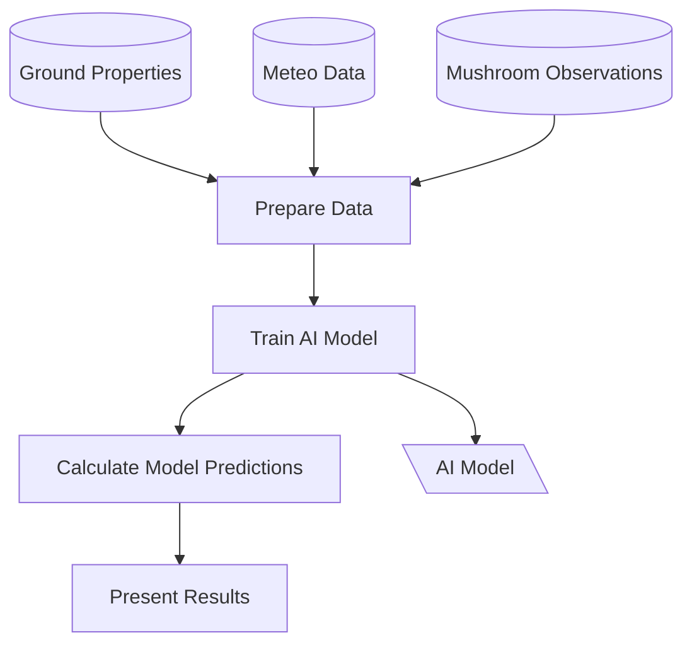

# MeteoShrooms

  

With _MeteoShrooms_, you can keep track of the perfect conditions for mushroom hunting.
We take Open Government Data (OGD) from the official Swiss Meteorological Service MeteoSwiss to calculate key metrics.

<dl><dt><strong>📌 NOTE</strong></dt><dd>

Contributors Welcome!
See [Contributing Guidelines](https://github.com/networkscientist/meteoshrooms/blob/master/docs/CONTRIBUTING.adoc) for more info...
</dd></dl>

<dl><dt><strong>📌 NOTE</strong></dt><dd>

Name changed: I discovered the project [meteofunghi](https://www.meteofunghi.it/), an Italian web site that seems to predict mushrooms occurences with meteo data.
I had not previously known of the project; however, since its purpose is very similar to ours and their name is nearly identical, I decided to change the name of our project.
Their work deserves respect and they were the first ones to come up with the name meteofunghi, so it is only fair that we adapt.
Therefore, the MeteoFungi repository has changed its name to MeteoShrooms.
This means that the dashboard is now available at [https://meteoshrooms.streamlit.app](https://meteoshrooms.streamlit.app)
</dd></dl>

## Motivation

While hunting mushrooms happens in nature, a lot of the planning can be carried out beforehand.

Where are possible areas to find king boletes?

Should you leave the house right now or are you already too late?

And will your current small basket be large enough or is it time to invest in something bigger?

Meteorological data, time series of past findings as well as other datasets can give us valuable insights.

## Concept

### Overarching Vision

The main goal is to develop a model to predict mushrooms occurences using OGD data.
I suggest starting with _meteo_ data by [MeteoSwiss](https://www.meteoswiss.admin.ch/services-and-publications/service/open-data.html), _soil_ properties (see for example [data.geo.admin.ch](https://data.geo.admin.ch/browser/index.html) or [opendata.swiss](https://opendata.swiss/de)) and using open _mushroom observation data_ from [GBIF](https://www.gbif.org/).

### Spatial

Currently, the _MeteoShrooms_ project is focussed on Switzerland, as the Swiss meteorological agency [MeteoSwiss](https://www.meteoswiss.admin.ch) has started to provide access to their data as [Open Government Data (OGD)](https://www.meteoswiss.admin.ch/services-and-publications/service/open-data.html).

### Technical

A main aim is to have sound results calculated efficiently.
Therefore, Python _Polars_ is used for calculations, wherever possible.
Its _LazyFrames_ optimize the workflow.
Data quality is validated through _Pandera_.
Compressed _Parquet_-Files save storage space and up-/download bandwith.

Currently, the repository hosts all parts of the modelling process: 1. Data Preparation, 2. Model Calculations and 3. Data Presentation:

1. Data Preparation: Download data from OGD sources and bring them into form needed for next step.
Ensure data quality,
2. Model Calculations: Perform the calculations to generate predictions from observed data,
3. Data Presentation: Show results on map and/or dashboard.
Include documentation of sources and methodology.

### Visualization

Metrics and time series visulizations are currently hosted as a Streamlit dashboard, so [check it out](https://meteoshrooms.streamlit.app).

## Roadmap

For a more detailed overview, see either [Issues](https://github.com/networkscientist/meteoshrooms/issues) or the detailed [Project Planner](https://github.com/users/networkscientist/projects/7), where the project is managed.
