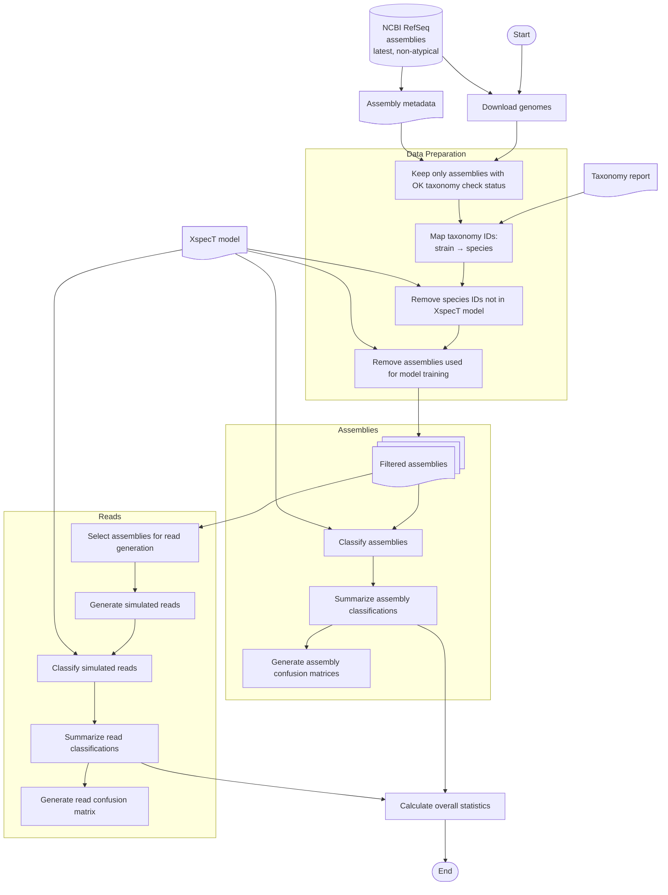

# Benchmark

XspecT is a tool designed for fast and accurate species classification of genome assemblies and simulated reads. To evaluate its classification accuracy, we conducted a benchmark using a set of *Acinetobacter* genomes.



The benchmark was performed by first downloading all available *Acinetobacter* genomes from RefSeq (latest version only, excluding atypical), filtered on a passed ("OK") taxonomy check status and on them not being part of the training dataset. Genomes assigned to strain IDs were remapped to their respective species IDs, after which genomes with species IDs not contained in the XspecT *Acinetobacter* model were removed. The remaining genomes were then used to classify both assemblies and simulated reads generated from them. Simulated reads were generated by first filtering on genomes that were categorized as "complete" or "chromosome" by NCBI. The reads were then simulated from the longest contig of each genome (assumed to be the chromosome) using InSilicoSeq. 100 000 reads were simulated for each genome based on the NovaSeq profile, with a read length of 150 bp. The reads were then classified using XspecT with predictions based on the maximum-scoring species. 

## Benchmark Results

The benchmark results show that XspecT achieves very high classification accuracy of nearly 100% for whole genomes and strong but reduced accuracy of 76% for simulated reads. However, the low macro-average F1 score (0.24) for the read dataset highlights a substantial class imbalance.

| Dataset   | Total Samples | Matches   | Mismatches | Match Rate | Mismatch Rate | Accuracy | Macro Avg F1 | Weighted Avg F1 |
|-----------|--------------:|----------:|-----------:|-----------:|--------------:|---------:|-------------:|----------------:|
| Assemblies| 13,786        | 13,776    | 19         | 99.86%     | 0.14%         | ≈1.00    | 0.96         | ≈1.00           |
| Reads     | 121,800,000   | 88,368,547| 33,431,453 | 72.55%     | 27.45%        | 0.73     | 0.21         | 0.81            |

Counting instances in which the highest number of hits are shared by multiple species as abstentions, the a selective accuracy of 82.80% is achieved for simulated reads, with a coverage of 87.63%. Rejection recall is 45.09%.

## Running the benchmark yourself

To benchmark XspecT performance yourself, you can use the Nextflow workflow provided in the `scripts/benchmark` directory. This workflow allows you to run XspecT on a set of samples and measure species classification accuracy on both genome assemblies, as well as on simulated reads.

Before you run the benchmark, you first need to download benchmarking data to the `data` directory, for example from NCBI. To do so, you can use the bash script in `scripts/benchmark-data` to download the data using the [NCBI Datasets CLI](https://www.ncbi.nlm.nih.gov/datasets/docs/v2/command-line-tools/download-and-install/), which needs to be installed first. The script will download all available *Acinetobacter* genomes, as well as taxonomic data.

To run the benchmark, install [Nextflow](https://www.nextflow.io/docs/latest/install.html) and run the following command:

```bash
nextflow run scripts/benchmark
```

The workflow can be parameterized using the following flags/arguments:

- `--publishDir`: Directory to save benchmark results to (default: `results/benchmark`)
- `--xspectModel`: XspecT model to use for classification (default: `Acinetobacter`)
- `--excludedSpeciesIDs`: Comma-separated list of species IDs to exclude from the benchmark (default: none)
- `--maxForks`: Maximum number of parallel processes to use (default: 50)
- `--validate`: Whether to use mapping-based classification validation (default: false)
- `--seqPlatform`: InSilicoSeq profile to use for read simulation (default: `NovaSeq` for NovaSeq)

Workflow results will be saved in the `results` directory:

- `results/classifications.tsv` for classifications of the assemblies
- `results/read_classifications.tsv` for classifications of the simulated reads
- `results/confusion_matrix.png` for a confusion matrix of genome assembly classifications
- `results/mismatches_confusion_matrix.png` for a confusion matrix filtered on mismatches of genome assembly classifications
- `results/read_confusion_matrix.png` for a confusion matrix of simulated read classifications
- `results/stats.txt` for overall statistics of the benchmark run