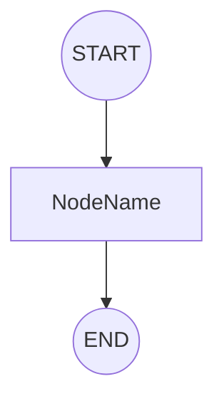
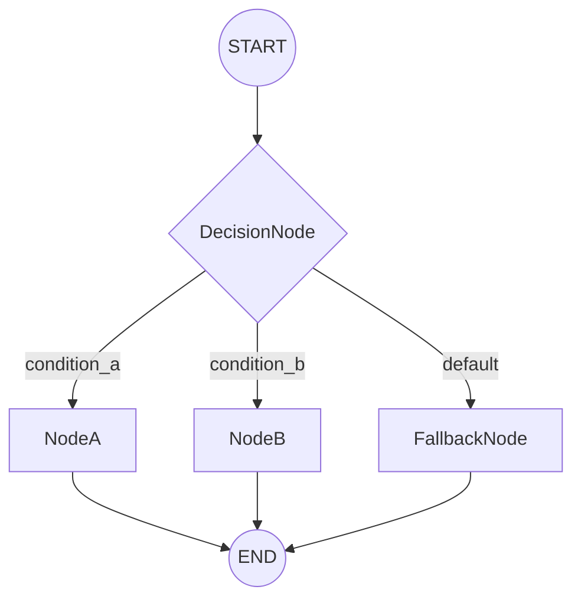
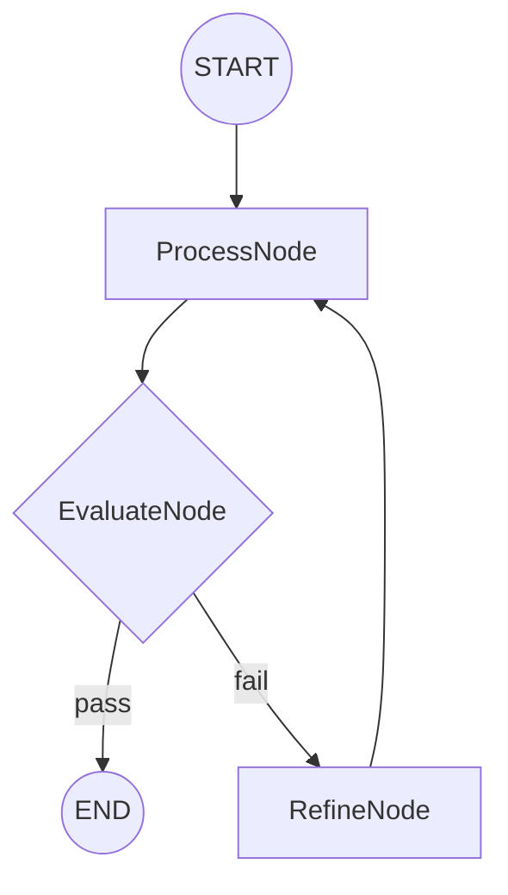

# Architecture Diagram Guide

Guide for creating clear Mermaid diagrams that represent your Cast architecture.

## Design Process

1. Start with START node
2. Add nodes based on selected pattern
3. Connect nodes with edges (normal or conditional)
4. Ensure all paths reach END
5. Add exit conditions for loops

## Mermaid Syntax

### Basic Structure

### Conditional Routing

### Loops

## Node Shapes

- **START/END**: `((START))`, `((END))`
- **Normal Node**: `[NodeName]`
- **Decision Node**: `{DecisionNode}` (diamond shape for conditional routing)

## Design Principles

**Clarity:** Each node should be clearly labeled with CamelCase names

**Completeness:** All paths must reach END

**Loops:** Must show exit condition and loop path

**Conditionals:** Label edges with conditions (e.g., `|condition|`)

## Checklist

- [ ] START node present
- [ ] All nodes connected
- [ ] All paths reach END
- [ ] Conditional edges labeled with conditions
- [ ] Loop exit conditions shown
- [ ] Node names use CamelCase
