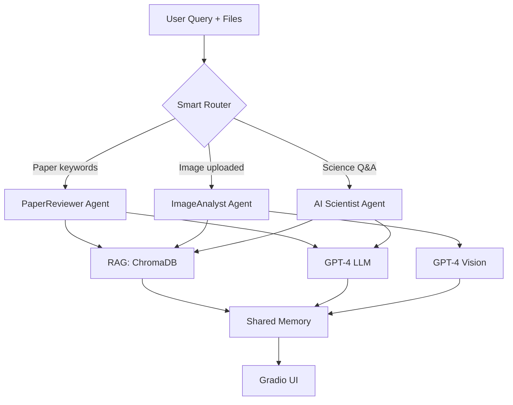

# 🔬 AI Scientist: Multi-Agent System for Biomedical Imaging

> **A modular, intelligent research assistant that combines literature search, image analysis, and paper review in one conversational interface.**

[](https://pypi.org/project/aibioagent/)
[](https://pepy.tech/projects/aibioagent)
[](https://opensource.org/licenses/MIT)
[](https://www.python.org/downloads/)
[](https://langchain.com/)

The **AI Scientist** project is a multi-agent framework that unifies **retrieval-augmented generation (RAG)**, **conversational memory**, and **multimodal vision** to accelerate research in **biomedical imaging**.  

### 💡 What Makes It Special?
- 🤖 **3 Specialized AI Agents** that automatically route based on your question
- 📄 **Upload & Review Papers** - Extract and analyze PDFs instantly
- 🖼️ **Upload Microscopy Images** - Get AI-powered workflow suggestions
- 🧠 **Conversational Memory** - Agents remember context across questions
- 📚 **RAG-Powered** - Answers grounded in your scientific literature database
- 🎯 **Smart Routing** - Automatically picks the right agent for your task
- ⚙️ **Configurable Models** - Choose your LLM, vision, and embedding models
- 💰 **Cost Tracking** - Monitor token usage and API costs in real-time

---

## 🚀 Quick Demo

**Ask about literature:**
```
💬 "What are the latest techniques in adaptive optics microscopy?"
→ Routes to AI Scientist Agent
```

**Upload an image:**
```
🖼️ [Upload: cells.tif]
💬 "Design a segmentation workflow for these nuclei"
→ Routes to Image Analyst Agent
```

**Review a paper:**
```
📄 [Upload: paper.pdf]
💬 "Critique the methodology in this paper"
→ Routes to Paper Reviewer Agent
```

---

## 📦 Installation & Quick Start

### Install via pip
```bash
pip install aibioagent
```

**Package Links:**
- 📦 PyPI: https://pypi.org/project/aibioagent/

### Quick Start (3 lines)
```python
import aibioagent as aba

aba.quickstart(api_key="sk-your-key")  # Setup
response = aba.ask("What is adaptive optics?")  # Ask anything
print(response)
```

### Full Setup
```python
import aibioagent as aba

# 1. Set API key
aba.set_api_key("sk-your-openai-key")

# 2. (Optional) Configure models for better quality
aba.set_llm_model("gpt-4o")              # Text generation (default: gpt-4o-mini)
aba.set_vision_model("gpt-4o")           # Image analysis (default: gpt-4o-mini)
aba.set_embed_model("text-embedding-3-large")  # Embeddings (default: text-embedding-3-small)

# 3. Add your research papers (single file or folder)
aba.add_papers("paper.pdf", collection="my_paper")  # Single file
aba.add_papers("papers/microscopy", collection="microscopy_papers")  # Folder

# 4. Add code documentation (URLs)
# Default URLs for ImageJ, scikit-image, OpenCV, Pillow are included
# Add more if needed:
aba.add_urls(["https://napari.org/"], collection="napari_docs")

# 5. Ask questions
response = aba.ask("What segmentation methods are best for cells?")

# 6. Analyze images
response = aba.ask(
    "Suggest a workflow for this image",
    image_path="microscopy.tif"
)

# 7. Review papers
response = aba.ask(
    "Summarize the methodology",
    pdf_path="research_paper.pdf"
)

# 8. Track usage and costs
stats = aba.get_usage_stats()
print(f"Total cost: ${stats['total_cost_usd']:.4f}")
aba.get_usage_stats(print_summary=True)  # Detailed breakdown
aba.reset_usage_stats()  # Reset tracking

# 9. Check configuration
aba.info()  # Shows current models, database path, etc.
```

### ⚙️ Model Configuration

You can customize which OpenAI models to use for different tasks:

**Available Models:**
```python
# LLM Models (text generation)
aba.set_llm_model("gpt-4o")         # Most capable, expensive
aba.set_llm_model("gpt-4o-mini")    # Balanced (default)
aba.set_llm_model("gpt-3.5-turbo")  # Fastest, cheapest

# Vision Models (image analysis)
aba.set_vision_model("gpt-4o")      # Best vision understanding
aba.set_vision_model("gpt-4o-mini") # Good balance (default)

# Embedding Models (vector database)
aba.set_embed_model("text-embedding-3-large")  # 3072 dim, best quality
aba.set_embed_model("text-embedding-3-small")  # 1536 dim, balanced (default)
aba.set_embed_model("text-embedding-ada-002")  # 1536 dim, legacy

# Check current configuration
models = aba.get_models()
print(models)  # {'llm': 'gpt-4o-mini', 'vision': 'gpt-4o-mini', 'embed': 'text-embedding-3-small'}
```

**⚠️ Important:** If you change the embedding model, you must rebuild all vector databases:
```python
aba.set_embed_model("text-embedding-3-large")

# Delete old collections first (incompatible embeddings)
aba.delete_collection("my_papers", confirm=False)
aba.delete_collection("my_docs", confirm=False)

# Now rebuild with new embedding model:
aba.add_papers("papers/", collection="my_papers")  # Create fresh
aba.add_urls(urls, collection="my_docs")           # Create fresh
```

**Note:** `add_papers()` and `add_urls()` **append** to existing collections. If you want to replace a collection, delete it first using `delete_collection()`.

### Two Types of Knowledge Bases

The agents automatically search **ALL collections** you create, so you don't need to specify which database to query.

**📄 Papers Database** (Research Literature)
- Built from PDF research papers
- Use `add_papers()` with your PDF files/folders
- Default collection: `"papers"`
- Example: `aba.add_papers("papers/", collection="microscopy_papers")`

**💻 Code Documentation Database** (Technical Docs)
- Built from web documentation URLs
- Use `add_urls()` to add online docs
- Default collection: `"code_docs"`
- Default URLs included: ImageJ, scikit-image, OpenCV, Pillow, LangChain
- Example: `aba.add_urls(["https://napari.org/"], collection="napari_docs")`
- See defaults: `aba.get_default_urls()`

**How It Works:**
```python
# Build multiple collections
aba.add_papers("papers/microscopy", collection="microscopy_papers")
aba.add_papers("papers/crispr", collection="crispr_papers")
aba.add_urls(["https://napari.org/"], collection="napari_docs")

# Query - automatically searches ALL collections!
response = aba.ask("What are watershed segmentation methods?")
# The agent searches microscopy_papers, crispr_papers, AND napari_docs
```

**See [USER_GUIDE.md](USER_GUIDE.md) for complete API documentation**

---

## 🧩 Architecture Overview

This system is built around specialized AI "agents," each designed for a specific research task:
- **AI_scientist_agent.py** → text-based RAG for scientific Q&A
- **Image_analyst_agent.py** → multimodal vision + RAG for workflow design
- **paper_reviewer_agent.py** → PDF analysis + RAG for paper review
- **Router** → intelligent routing based on query intent + shared memory
- **GLOBAL_MEMORY** → unified conversation context across agents

| Agent | Primary Function |
|--------|------------------|
| **AI Scientist Agent** | Literature-grounded scientific reasoning via RAG |
| **ImageAnalyst Agent** | Workflow generation and interpretation of microscopy images |
| **PaperReviewer Agent** | Scientific paper analysis, critique, and literature review with PDF support |

Each agent is implemented as a composable LangChain `Runnable` pipeline with shared memory, individual prompt templates, and retrieval logic.  
The architecture is fully extensible — future agents (e.g., `DataAnalystAgent`, or `ModelTrainerAgent`) can be added easily.

---

## 📚 User API Functions

### Configuration
- `set_api_key(key)` - Set OpenAI API key
- `get_api_key()` - Get current API key
- `set_llm_model(name)` - Set text generation model (e.g., "gpt-4o")
- `set_vision_model(name)` - Set image analysis model (e.g., "gpt-4o-mini")
- `set_embed_model(name)` - Set embedding model (e.g., "text-embedding-3-large")
- `get_models()` - Get current model configuration
- `info()` - Show package configuration (includes all models)

### Knowledge Base Management
- `add_papers(folder, collection)` - Add PDF papers to database
- `add_urls(urls, collection)` - Scrape web documentation
- `get_default_urls()` - Show included documentation URLs
- `list_collections()` - Show all databases
- `search_collection(query, collection)` - Search specific database
- `delete_collection(name, confirm=True)` - Remove database

### Query & Chat
- `ask(question, image_path, pdf_path)` - Ask the AI agent
- `chat(mode="cli"|"gradio")` - Start interactive session

### Usage Tracking & Cost Management 💰
- `get_usage_stats(print_summary=False, save_to_file=None)` - Get token usage and estimated costs
- `reset_usage_stats()` - Reset usage tracking to zero

**Example:**
```python
import aibioagent as aba

# Do some work
aba.ask("What is CRISPR?")
aba.ask("Explain microscopy techniques")

# Check costs
stats = aba.get_usage_stats(print_summary=True)
print(f"Total cost: ${stats['total_cost_usd']:.4f}")

# Save detailed log
aba.get_usage_stats(save_to_file="usage_log.json")
```

**Output:**
```
======================================================================
Token Usage & Cost Summary
======================================================================
Session Start: 2024-12-15T10:30:00

API Calls:
  Total Calls:      5
  LLM Calls:        4
  Embedding Calls:  1
  Vision Calls:     0

Token Usage:
  Input Tokens:     3,420
  Output Tokens:    856
  Total Tokens:     4,276

Estimated Cost:
  Total Cost (USD): $0.0012
  ⚠️  Note: Estimates based on Dec 2024 pricing

Breakdown by Model:
  gpt-4o-mini:
    Calls:        4
    Total Tokens: 4,120
    Cost (USD):   $0.0011
  text-embedding-3-small:
    Calls:        1
    Total Tokens: 156
    Cost (USD):   $0.0000
======================================================================
```

**Why Cost Tracking Matters:**
- 💰 **Budget Management**: Set spending limits and track costs during experiments
- 🔍 **Model Comparison**: Compare costs between different models (gpt-4o vs gpt-4o-mini)
- 📊 **Usage Optimization**: Identify expensive operations and optimize workflows
- 📈 **Reporting**: Generate cost reports for grant proposals or institutional billing
- ⚠️ **Real-time Alerts**: Monitor costs during long-running operations

### Advanced
- `get_scientist_agent()` - Direct agent access
- `get_image_analyst()` - Direct agent access
- `get_paper_reviewer()` - Direct agent access
- `get_router()` - Direct router access

**Full API: [USER_GUIDE.md](USER_GUIDE.md)**

---

## 1️⃣ AI Scientist Agent
**Your literature-powered research assistant**

### What It Does
- 📚 Answers questions using your scientific literature database
- 🔍 Retrieves relevant papers and documentation via RAG
- 💬 Maintains conversation context across multiple questions
- 📖 Provides citations and grounded explanations

### Example Use Cases
- "What are the advantages of adaptive optics in microscopy?"
- "Explain the difference between confocal and two-photon imaging"
- "What papers discuss neuronal imaging in vivo?"
- "How does STED microscopy achieve super-resolution?"

---

## 2️⃣ ImageAnalyst Agent
**Multimodal vision AI for microscopy workflow design**

### What It Does
- 🖼️ Analyzes uploaded microscopy images (TIFF, PNG, JPG)
- 🔬 Understands image content using GPT-4 Vision
- 📋 Generates detailed Fiji/Python processing workflows
- 🎯 Tailors recommendations to your specific data characteristics

### Technical Capabilities
- Supports multi-channel, Z-stack, and time-series images
- Handles various microscopy formats (widefield, confocal, etc.)
- Retrieves relevant protocols from Fiji documentation database
- Provides step-by-step implementation instructions

### Example Use Cases
- Upload cells.tif → "Design a segmentation pipeline for these nuclei"
- "What preprocessing steps do I need for this noisy image?"
- "How can I quantify organelle colocalization in this data?"
- "Suggest a pipeline for tracking moving cells in this time-lapse"

---

## ImageAnalyst Agent
### **Description**
The **ImageAnalyst Agent** bridges raw microscopy data and AI-assisted workflow design.
It reads uploaded images, extracts metadata and intensity statistics, and proposes step-by-step Fiji or Python analysis pipelines tailored to the data’s characteristics.


### **Key Features**
- **Raw Image Understanding** - Accepts microscopy images.
- **Workflow Recommendation** - Suggests details Fiji or python pipeliness.
- **RAG-based Fiji Knowledge** - Retrieves plugin documentation and tutorials from a continuously updated Fiji and other open source packages knowledge base.
1. Could accept two inputs, raw image, the user goal/question/description, optionally include summary
2. vision-capable LLM
3. searches both databases (tech docs and scientific papers)
4. return: detailed fiji/python workflow, a rationale grounded in both the image and context.


## 3️⃣ PaperReviewer Agent
**Upload PDFs and get instant, evidence-based critiques**

### What It Does
- 📄 Extracts full text, tables, and figure captions from uploaded papers
- 🔍 Combines paper content with relevant literature from database
- ✍️ Provides structured reviews covering methodology, novelty, and rigor
- 💡 Offers constructive, actionable feedback

### Example Use Cases
- "Critique the experimental design in this paper"
- "Summarize recent advances in live-cell imaging"
- "What are the limitations of this methodology?"
- "Compare this approach to state-of-the-art methods"

---

## 🎯 Real-World Use Cases

### For Researchers
- 📖 **Literature Review**: "Summarize papers on STORM super-resolution microscopy"
- 🔬 **Experiment Design**: Upload image → "How should I segment these organelles?"
- 📊 **Paper Review**: Upload paper → "Is this methodology sound?"

### For Students
- 🎓 **Learning**: "Explain the principles of confocal microscopy"
- 🖼️ **Assignment Help**: Upload data → "What analysis pipeline should I use?"
- 📝 **Writing Support**: "What are the key papers on this topic?"

### For Lab Groups
- 🤝 **Knowledge Sharing**: Centralized database of lab papers and protocols
- 🔄 **Reproducibility**: Get standardized workflow recommendations
- 💬 **Quick Answers**: No more digging through papers for answers

---

# 🏗️ System Architecture



**Key Components:**
- 🎯 **Smart Router**: Intent-based routing with LLM fallback
- 🗄️ **Vector Database**: ChromaDB with scientific literature embeddings
- 🧠 **Shared Memory**: Session-aware context across all agents
- 🖼️ **Vision Support**: GPT-4 Vision for microscopy image understanding
- 💬 **Interactive UI**: Gradio web interface with streaming responses

---

# ⚡ Quick Start

### 1️⃣ Install Dependencies
```bash
pip install -r requirements.txt
```

### 2️⃣ Set Up OpenAI API Key
Create a `.env` file in the project root:
```bash
OPENAI_API_KEY=your_api_key_here
```

**Need an API key?** See [API_KEY_SETUP.md](API_KEY_SETUP.md) for detailed instructions.

**Just want to run tests?** No API key needed - tests use mocks:
```bash
pytest  # Works without API key!
```

### 3️⃣ Build Your Knowledge Base
```bash
# Add your PDFs to data/papers/
python -m data.document_loader
```

### 4️⃣ Launch the Application
```bash
# Web UI (recommended)
python main.py

# Or CLI mode
python main.py -m cli
```

Visit `http://localhost:7860` and start chatting! 🎉

---

# 🛠️ Tech Stack

| Category | Technology |
|----------|-----------|
| **LLM** | OpenAI GPT-4, GPT-4 Vision |
| **Framework** | LangChain (agents, RAG, memory) |
| **Vector DB** | ChromaDB (document embeddings) |
| **UI** | Gradio (web interface) |
| **PDF Processing** | Docling, PyPDF |
| **Image Processing** | PIL, scikit-image, tifffile |
| **Language** | Python 3.10+ |

---

# 📊 Features Comparison

| Feature | AI Scientist | Image Analyst | Paper Reviewer |
|---------|-------------|---------------|----------------|
| Text Q&A | ✅ | ✅ | ✅ |
| Image Upload | ❌ | ✅ | ❌ |
| PDF Upload | ❌ | ❌ | ✅ |
| RAG Retrieval | ✅ | ✅ | ✅ |
| Vision Model | ❌ | ✅ | ❌ |
| Workflow Design | ❌ | ✅ | ❌ |
| Paper Critique | ❌ | ❌ | ✅ |

---

# 🤝 Contributing

Contributions are welcome! Future agent ideas:
- 📈 **DataAnalyst Agent**: Statistical analysis and visualization
- 🧬 **ProtocolAgent**: Step-by-step experimental protocols
- 🤖 **ModelTrainer Agent**: ML model training for image analysis
- 📊 **FigureGenerator Agent**: Automated figure creation from data

---

# 📜 License

MIT License - feel free to use and modify for your research!

---

# 📧 Contact

Questions? Issues? Open an issue or reach out to the maintainers! I am also open to new ideas!