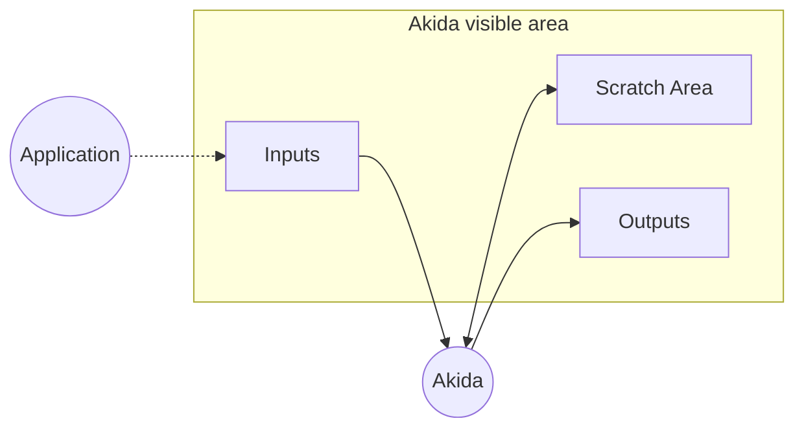

# Akida Engine library

The **Akida Engine** library is a C++ library allowing to perform an inference
on an Akida model loaded into an Akida compatible device.

As a prerequisite, the Akida model program has to be generated on a host using
the [Akida python package](https://pypi.org/project/Akida/).

The engine library is deployed in source. The deployment can be done using the
python package CLI:

~~~sh
akida engine deploy --dest-path .
~~~

This document focuses on how to build and use the library.

## Building the library

### Build system

The Akida Engine library does not have any specific build system requirements.

### Toolchain/Compiler

The Akida Engine library requires a 32 or 64 bit little endian toolchain with
support for floating point numbers.

The toolchain must include a C++ compiler supporting at least C++ 17.

The toolchain must provide a minimal implementation of the C standard library,
like for instance GCC newlib and the corresponding target-specific stubs.

The Akida Engine library does not use C++ exceptions, so exception support can
be disabled when generating binaries for embedded targets.

### Dependencies

The library relies on external symbols whose target-specific implementation must
be provided by the build system.

#### Google flatbuffers

The library has a dependency towards the Google flatbuffer header-only library:
   https://github.com/google/flatbuffers/releases/tag/v2.0.8

The sources must be downloaded from the link above and made available to the
library as an additional include path.

#### Standard Template Library (STL)

The Akida Engine library relies on a few C++ STL classes whose implementation
must be provided by the build system.

The following headers must be supported:

~~~~cpp
<algorithm>
<array>
<cassert>
<cstddef>
<cstdint>
<cstdio>
<cstring>
<initializer_list>
<limits>
<map>
<memory>
<queue>
<set>
<tuple>
<typeindex>
<utility>
<vector>
~~~~

#### System infra

The Akida Engine library requires a few system methods to be implemented.

Please refer to `api/infra/system.h` for a list and description of the methods to
implement.

### Building a static library

A basic cmake build file is provided for convenience:

~~~~
mkdir build
cmake . -B build
make -C build
~~~~

### Using the library

#### Hardware driver

The Akida Engine library main usage is to program and perform an inference on
a hardware device. To do that it is necessary to obtain a `HardwareDevice`
class instance.

One can obtain an `HardwareDevice` instance by passing a target-specific
`HardwareDriver` instance to the `HardwareDevice::create()` static function.

~~~~cpp
#include "akida/hardware_device.h"
#include "infra/hardware_driver.h"

class MyDriver : public HardwareDriver {
...
}

...

auto driver = MyDriver();
auto device = HardwareDevice::create(driver);
~~~~

The `HardwareDriver` main purpose is to abstract the read and write operations
into the Akida DMA.
It also provides:
- the base address for Akida blocks registers
- the 'scratch' memory region addressable by Akida. If the scratch
memory required is not large enough to complete programming or inference, the
application will panic at runtime (this will depend on the batch size used and
the program settings).
- the 'visible from akida' memory region, defining the memory region where
Akida DMAs can directly access data. This would contain the scratch memory
region, and if it contains the location where program and inputs are stored, they
will not need to be copied to scratch memory.
Data put in this area will not be copied to scratch memory.

Please refer to `api/infra/hardware_driver.h` for a complete description of the
HardwareDriver API and how to implement your specific driver.

##### BareMetalDriver class

BareMetalDriver, a custom HardwareDriver implementation, is provided as an
example of driver.
Its constructor takes 4 arguments that you can use to customize your
application:
- `scratch_base_address`: the base 'scratch' memory address.
- `scratch_size`: the size of 'scratch' memory that can be used.
- `akida_visible_memory_base`: the base address for the akida visible memory
region.
- `akida_visible_memory_size`: the size of the visible memory region.

#### Generate model programs

To generate a program for a compatible Akida device does not require a host
machine with an Akida device connected. The program generated can be used later
to program the device using the Akida engine.

The following example shows how to generate a program from the Keyword Spotting
(KWS) model targeting the AKD1000 chip.

For the details on how to use the akida_models and cnn2snn tools to retrieve
and convert a model, please refer to the [online documentation](https://doc.brainchipinc.com/).

~~~~python
#!/usr/bin/env python
import os
from akida import AKD1000
from akida.generate import array_to_cpp
from cnn2snn import AkidaVersion, convert, set_akida_version
from akida_models import ds_cnn_kws_pretrained

with set_akida_version(AkidaVersion.v1):
    # Load Keras pre-trained model from Akida model zoo
    model_keras = ds_cnn_kws_pretrained()
    # Convert Keras model to Akida
    model_akida = convert(model_keras)

# Map/compile converted model for an AKD1000 device
model_akida.map(device=AKD1000(), hw_only=True)

# Check model mapping: NP allocation and binary size
model_akida.summary()

# Retrieve model program binary
program = model_akida.sequences[0].program

# Generate a binary that can be flashed
with open('kws_model.bin', 'wb') as file:
    file.write(program)
    file.close()

# Or generate source files to be included -> kws_model.{cpp,h}
array_to_cpp('.', program, 'kws_model')
~~~~

#### Load model programs

Once loaded in memory, the raw bytes buffer corresponding to a model program
can be passed to the HardwareDevice to program the model on the device.

~~~~cpp
#include "kws_model.h"

// Load program
device->program(kws_model, kws_model_size);
~~~~

#### Set batch size

After programming, you must configure the batch size to the number of inputs
that can be enqueued before fetching for outputs. A higher batch size has
higher memory requirements, but can allow input pipelining. The batch size
must be set by calling `set_batch_size` function.
This function takes a `requested_batch_size` parameter, which is the batch size
to set, and a boolean `allocate_inputs` to allocate space for inputs
in scratch memory.
`allocate_inputs` must be set to `true` if inputs are not in the range
specified by `akida_visible_memory_base` and `akida_visible_memory_size`.
Outputs are always allocated in scratch memory.

Note: the maximum effective batch size is 16 for a single pass program, or 1 if
the program is multi pass, or learning mode has been enabled. Passing a higher
value is allowed, but the effective batch size that has been set is returned by
`set_batch_size` method.

~~~~cpp
// Assume device has been programmed

// set a batch size of 2, and do not allocate space for inputs (they must be in
// the range specified by driver->akida_visible_memory_base(),
// driver->akida_visible_memory_size())
device->set_batch_size(2, false);
~~~~

#### Perform an inference

Once a model has been programmed and a batch size is set, inputs Tensor can be
enqueued into the device inference pipeline, by calling `enqueue` function. The
function immediately returns a boolean set to true if the tensor was
successfully enqueued, or false if the pipeline was full.
Depending on your program and device, you may have to convert your inputs to a
sparse format.

Two types of tensors can be passed as input and returned as outputs:
- Dense tensors are standard contiguous buffers whose items are ordered either
using the row-major or col-major convention,
- Sparse tensors are list of coordinates and values. These cannot be directly
constructed, they are output from Akida, or converted from a Dense.

Several static constructors are available to create tensors, depending on your
use case: pre-allocate, copy, etc.
Conversion functions also exist.

~~~~cpp
#include "akida/dense.h"

// Assume input_buf is a char array pointer to the input data. A Dense object
// wrapper can be easily created:
auto input = Dense::create_view(input_buf, TensorType::uint8, {49, 10, 1},
                                TensorLayout::RowMajor);
// Enqueue a single input from a raw input dense buffer
bool success = device->enqueue(*input);
~~~~

Then you can periodically check for outputs, by calling `fetch` function.
The function returns a pointer to an output Tensor, or `nullptr` if no output
was available.

~~~~cpp
auto output = device->fetch();
if (output != nullptr) {
    // application can now use output
}
~~~~

If your program last layer ends with an activation, the outputs are normalized
n-bit values.
Otherwise, if your program does not end with an activation, you must dequantize
the output potentials to float values to project them in the same scale before
processing them. You can use the `dequantize` method to do so.

~~~cpp
auto dequantized_output =
    device->dequantize(*akida::conversion::as_dense(*output));
~~~

In some cases, it could be possible that the input buffer is not produced by
the host device, and that can be written directly to the scratch buffer that is
addressable by Akida DMA controllers. To take advantage of this, it is possible
to use an API that allows to allocate/free memory from the scratch buffer, and
enqueue using a signature that allows to use a dedicated API to avoid using
input tensors.

~~~cpp
  // Allocate input memory and obtain address
  auto addr_input = hw_device->scratch_alloc(input_size);

  // Fill Akida memory at addr_input0 address here. The data that should be
  // written should be only the data buffer, corresponding to an input tensor
  // input_tensor->buffer()->data().

  // Enqueue using this address
  hw_device->enqueue(add_input);
  // Fetch output when ready
  auto output = hw_device->fetch();
  // Free input memory
  hw_device->scratch_free(addr_input);
~~~

#### Perform edge learning

To perform edge learning, the generated model should have been compiled
beforehand.

Example:
~~~~python
model.compile(
    optimizer=akida.AkidaUnsupervised(
        num_weights=num_weights,
        num_classes=num_classes,
        learning_competition=learning_competition
        )
    )
~~~~

See https://doc.brainchipinc.com/examples/index.html#edge-examples
for more information about learning and learning parameters.

To activate edge learning in your application, you must call
`toggle_learn` method with the `learn_en` parameter set to `true`.
You can then pass a label corresponding to your input when calling `enqueue`.
Learning can be disabled by calling `toggle_learn` again with the `learn_en`
parameter set to `false`.
~~~~cpp
#include "akida/dense.h"

#include "kws_model.h"

// Program device (this is not required if you already did it previously)
device->program(kws_model, kws_model_size);

// Turn learning mode on because learning is disabled by default
device->toggle_learn(true);

// Set batch size to 1 because learning is on
device->set_batch_size(1, false);

// Enqueue a single input from a raw input dense buffer
auto input = Dense::create_view(input_buf, TensorType::uint8, {49, 10, 1},
                                TensorLayout::RowMajor);
// passing a single label
bool success = device->enqueue(input, 1);
~~~~

##### Updating weights

Weights used for learn are initially stored in the program buffer, then used to
program the FNP (FullyConnected Neural Processor) that will perform the learn.

Akida has weights stored in its own SRAM, so a copy back from
internal SRAM to application memory must be done. To do that, a buffer must be
allocated with the correct size. `HardwareDevice::learn_mem_size()` method can
be called to know this size.
The output of this function is the number of 32-bit words required.
Then you can call `HardwareDevice::learn_mem(output_buffer)` that will copy
weights to the `output_buffer` parameter.

~~~~cpp
std::vector<uint32_t> updated_weights(device->learn_mem_size());
device->learn_mem(updated_weights.data());
~~~~

The application can then store this buffer.
This can be reprogrammed by calling
`HardwareDevice::update_learn_mem(stored_weights)`, e.g. to restore learned
 weights after a power cycle.

~~~~cpp
// program Akida, e.g. after power cycle
device->program(model_buffer, model_size);

// toggle learning mode on
device->toggle_learn(true);

// set batch size to 1 because learning is on
device->set_batch_size(1, false);

// load weights from application
std::vector<uint32_t> stored_weights =
// program previously saved weights to Akida
device->update_learn_mem(stored_weights.data());
~~~~

#### Higher level API

A higher level API is available for convenience:
- `forward` method that performs inference on vector of input Tensor, and
returns a vector of output Tensor.
- `predict` method, similar to forward but also performing the dequantize step.
- `fit` method that performs inference on vector of input Tensor, along with a
vector of labels, and returns a vector of output Tensor.

##### Host-provided drivers

When working on a linux platform, it is possible to use the drivers included in
the host python package. This can be convenient to evaluate inference on a host
system connected to an Akida device.
To do that, you can invoke the deploy CLI command using the
`--with-host-examples` switch:

~~~sh
akida engine deploy --dest-path . --with-host-examples
~~~

This will generate an additional CMake file under `test/akd1000` that can be used
to build the host examples with the host runtime library that contains the engine
and the available drivers.

For example, to build the *build_simple_conv_v2* example, you can do:

~~~sh
mkdir build_simple_conv_v2
cmake test/akd1000/simple_conv_v2/ -B build_simple_conv_v2/
make -C build_simple_conv_v2
~~~

The example's `main.cpp` file will retrieve all the driver instances the host
library can retrieve using the `akida::get_drivers()` function. The obtained driver
instance is then used in the `simple_conv_v2()` function in the `test.cpp` file:

~~~cpp
  // Instantiate the device for the corresponding driver
  auto device = akida::HardwareDevice::create(driver);
~~~

The programming and inference on such device can be done as described in the
previous paragraphs.

## Licensing

Copyright 2023 Brainchip, Inc

Licensed under the Apache License, Version 2.0 (the "License");
you may not use this file except in compliance with the License.
You may obtain a copy of the License at

    http://www.apache.org/licenses/LICENSE-2.0

    Unless required by applicable law or agreed to in writing, software
    distributed under the License is distributed on an "AS IS" BASIS,
    WITHOUT WARRANTIES OR CONDITIONS OF ANY KIND, either express or implied.
    See the License for the specific language governing permissions and
    limitations under the License.
