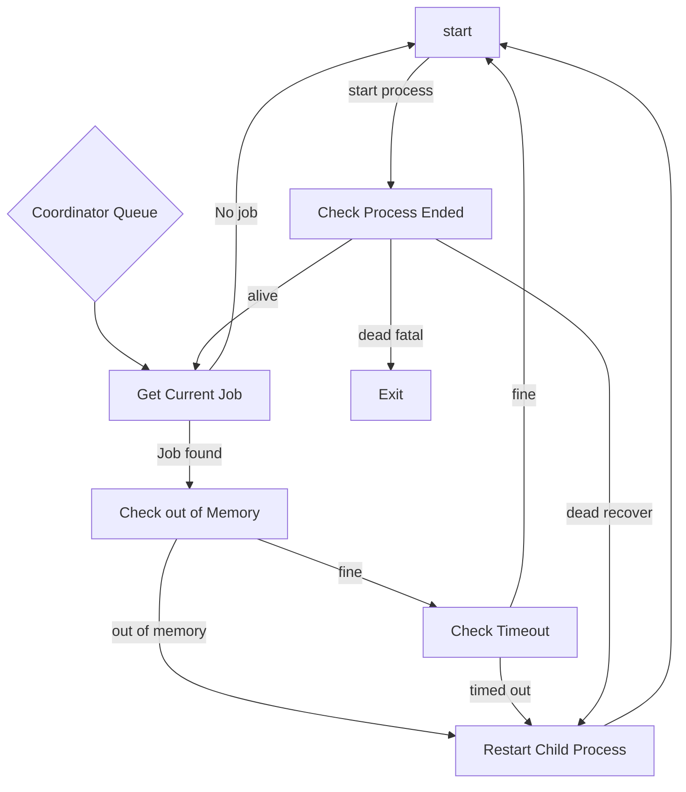
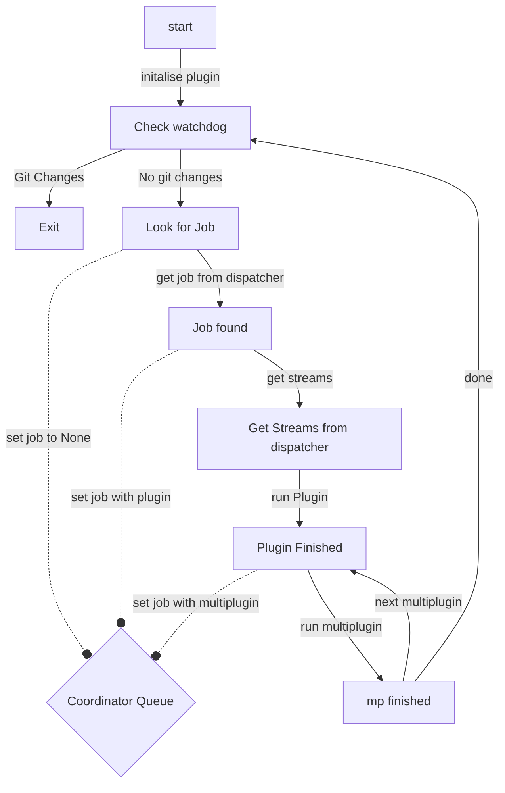

# Logic for Coordinator and Monitor

This documentation goes through the logic of how monitor and coordinator interact.

## Monitor logic flow
Monitor operates by starting the child process which is coordinator.
It is continually checking if the coordinator child process has exited or not
and then getting a new job from coordinator if there are any.

If the job acquired from the queue is None it means coordinator is waiting for a job.
Monitor will then continue to verify the subprocess is still alive until it sees a job.

Once there is a job being processed by the plugin monitor will continually check to see
if the plugin has run out of memory, run out of time or needs to send a heartbeat.
It will send a message to dispatcher in any of those cases.

Finally if the child process does exit monitor will check the exit code and depending on the 
value either restart the child process or exit the application.

## Coordinator logic flow

Coordinator sets it's queue to None initially and then sends a request to dispatcher to get a job.
This is done so monitor won't timeout as it has a None job to indicate coordinator is looking for work.

Once Coordinator gets a job from dispatcher it will then put that job into the communication queue
back to monitor.

It will then download the job's streams from dispatcher, and run the job in the plugin.
Coordinator will then run any multiplugin's ensuring to add the job with the multiplugin that is running
to the queue for monitor to ensure if the plugin times out which multiplugin failed can be determined.

