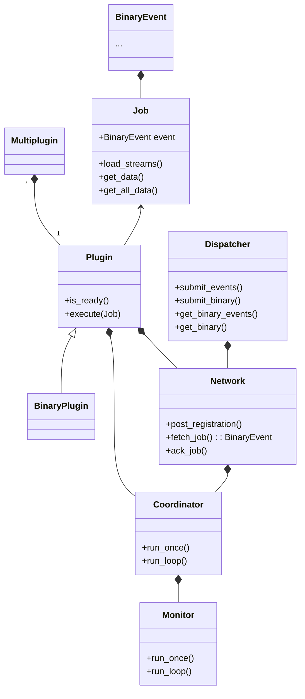
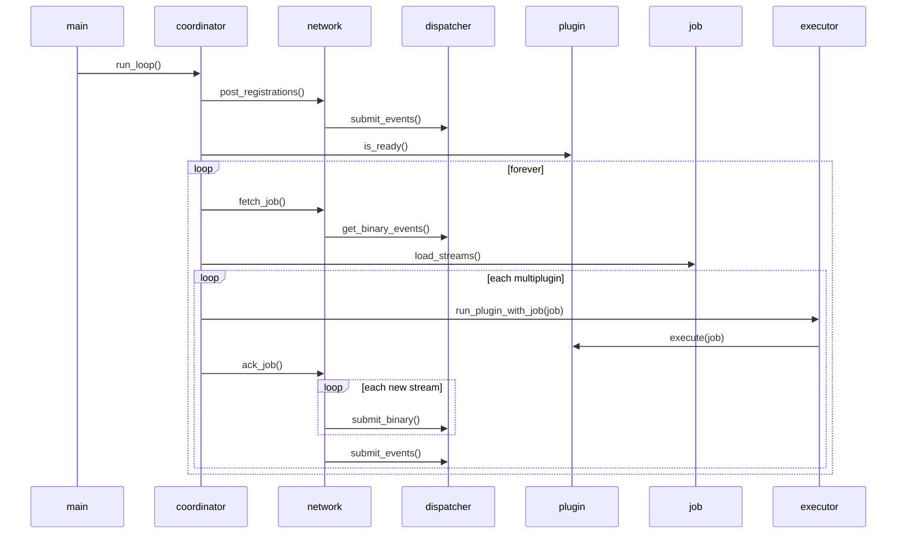

Azul-runner is split into modules based on related functionality.

All names necessary for plugins are imported into the package
namespace, so users can simply write `from azul_runner import thing`.

## Class Diagram

## Sequence Diagram

Simple case for looping plugin execution.

## binary_plugin.py

Subclass of Plugin designed for processing binary files.

## coordinator.py

Handle full Plugin execution loop.

## dispatcher.py

Handle interaction with dispatcher restapi.

## identify.py

Python implementation of the Dispatcher identify code.

It is intended for use during plugin tests only.

## main.py

CLI based execution of plugins for local testing or remote deployment.

## models.py

Data structures used by plugins to record job results, such as features, info, data.

## monitor.py

Uses multiprocessing to monitor the process of a plugin running in coordinator and track memory
and create heartbeat events.

## network_transform.py

Transform models to/from network event format and runner internal format.

## network.py

Higher level interactions with Azul Dispatcher vs dispatcher.py.

## plugin_executor.py

Execute Plugin with Job and return JobResult instance.

## plugin.py

Plugin template for handling plugin metadata and execution methods.

## settings.py

Plugin settings, using pydantic environment parsing.

## storage_spooled.py

Guarantee a valid path to a SpooledTemporaryFile after rollover has occurred.

## storage.py

Defines a file-like interface to S3-compatible storage.

Used by plugins to access event binary data.

## test_template.py

Contains a template test case class to simplify testing of Azul plugins.
