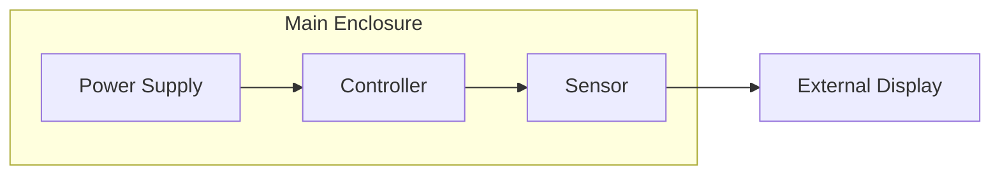

# blockbom

A Python library to generate hierarchical Bills of Materials (BOMs) from Mermaid flowchart diagrams.

## Installation

```bash
# Using uv
uv add blockbom

# Using pip
pip install blockbom
```

## Quick Start

```python
from blockbom import generate_bom

# Generate a BOM from a Mermaid diagram
items = generate_bom("diagram.mmd", "output.csv")

# With part metadata
items = generate_bom("diagram.mmd", "output.csv", "parts.yaml")
```

## Usage

### Input: Mermaid Flowchart

Create a Mermaid flowchart file (`.mmd`):



### Optional: Part Metadata

Create a YAML file to enrich your BOM with part numbers, links, and costs:

```yaml
# parts.yaml
A:
  part_number: "PS-12V-5A"
  link: "https://example.com/power-supply"
  cost: 25.99

B:
  part_number: "MCU-ARM-01"
  link: "https://example.com/controller"
  cost: 15.00
```

### Output: CSV BOM

```csv
Level,Qty,Description,Part Number,Purchase Link,Cost
0,1,Main Enclosure,,,
1,1,Power Supply,PS-12V-5A,https://example.com/power-supply,25.99
1,1,Controller,MCU-ARM-01,https://example.com/controller,15.00
1,1,Sensor,,,
0,1,External Display,,,
```

The `Level` column indicates hierarchy:
- Level 0: Top-level assemblies or standalone components
- Level 1+: Components nested within subgraphs

## API Reference

### `generate_bom(mermaid_file, output_file, metadata_file=None)`

Generate a BOM CSV from a Mermaid flowchart.

**Parameters:**
- `mermaid_file`: Path to the `.mmd` file
- `output_file`: Path for the output CSV
- `metadata_file`: Optional path to `.yaml` metadata file

**Returns:** List of `BOMItem` objects

### `parse_mermaid(content)`

Parse Mermaid flowchart content into a structured format.

```python
from blockbom import parse_mermaid

diagram = parse_mermaid('''
flowchart LR
    A["Component 1"] --> B["Component 2"]
''')

for node_id, node in diagram.nodes.items():
    print(f"{node_id}: {node.label}")
```

**Returns:** `ParsedDiagram` with `nodes`, `edges`, `subgraphs`, and `root_node_ids`

## Supported Mermaid Syntax

- Diagram types: `flowchart` and `graph` (TD, LR, TB, BT, RL)
- Node shapes: `[]`, `()`, `{}`, `(())`, `[[]]`, `[()]`, `{{}}`, and `@{}` extended syntax
- Edges: `-->`, `-- label -->`, `-->|label|`
- Multiple targets: `A --> B & C & D`
- Subgraphs: `subgraph id["Title"] ... end`
- YAML frontmatter (stripped automatically)

## Development

```bash
# Clone and install
git clone https://github.com/keen/blockbom.git
cd blockbom
uv sync --dev

# Run tests
uv run pytest -v

# Type checking
uv run mypy src/blockbom

# Linting
uv run ruff check src/blockbom
```

## License

MIT
