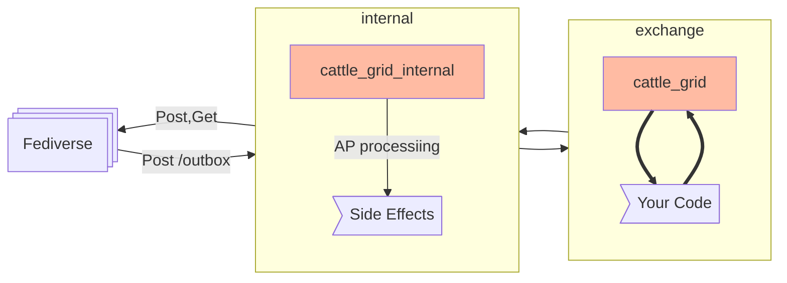

# ActivityPub Processing

!!! info
    This is meant as the cattle_grid internal processing,
    taking care of letting ActivityPub Actors be
    ActivityPub Actors that talk well with each other.

    Please use exchange to run your own code.

- [:material-api:{ .lg .middle } __OpenAPI__](../assets/redoc.html?url=openapi_ap.json)

    Describes the HTTP routes offered by the
    included ActivityPub server.

- [:material-api:{ .lg .middle } __AsyncAPI__](../assets/asyncapi.html?url=asyncapi_ap.json)

    The ActivityPub processor has an AsyncAPI
    schema that can be expected to get a high level
    overview on which messages are handled by
    the cattle_grid processor.

cattle_grid is a middle ware that isolates your
application from some of the complications
of the Fediverse. For this it handles:

- Authentication of both incoming and outgoing requests
- Followers / Following management
- Message distribution
- Normalization of activities and objects

## Design

where RabbitMQ exchanges are slightly red. As long as
your application does not need to modify standard
behavior of the Fediverse, you will only need to
interact with __exchange__.
