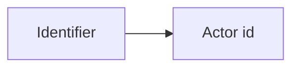

# Public identifiers

In this document, we will discuss how cattle_grid
manages identifiers, and related properties for
actors managed by it. The problem of discovering,
verifying, and managing the identifiers associated
with remove accounts is separate.

Furthermore, some things such as

- webfinger
- The `preferredUsername` property of an actor

are parts of the public identifier logic.

## PublicIdentifier

cattle_grid has the concept of public identifiers, see
[cattle_grid.database.activity_pub_actor.PublicIdentifier][] for
their model. They represent the set of URIs that can be
used to reference an actor.

In simplest terms public identifier is a mapping



where the actor id, would be considered a self mapping.

### Webfinger

Generally for a public identifier pair `(identifier, actor_id)`,
webfinger should return

```json title="GET /.well-known/webfinger?resource=identifier"
{
    "subject": identifier,
    "links": [
        {
            "rel": "self",
            "type": "application/activity+json",
            "href": actor_id
        }
    ]
}
```

We note that this jrd document might contain additional information.

## Verifying identifiers

You obviously cannot use any identifier. The `preferredUsername`
logic used by large parts of the Fediverse forces the identifier
to be on the same domain as the actor.

The current implementation of cattle_grid verifies identifiers
if

- They are `acct:` URIs and the domain corresponds to one listed
in the configuration `base_urls`.

!!! todo
    Implement further verification methods

## Properties of the actor object

...

### The `preferredUsername` property

The `preferredUsername` property is determined via
the [cattle_grid.activity_pub.actor.identifiers.determine_preferred_username][] method.

!!! info
    This feature exists to ensure compatibility with many Fediverse
    applications. cattle_grid itself does not allow you to set
    the `preferredUsername` property. It is as side effect of
    public identifiers.

### The `identifiers` property

This contains an ordered list of the verified public identifiers.
This means a server should display the first element of this
list as the identifier of the actor (after verifying it of course).
