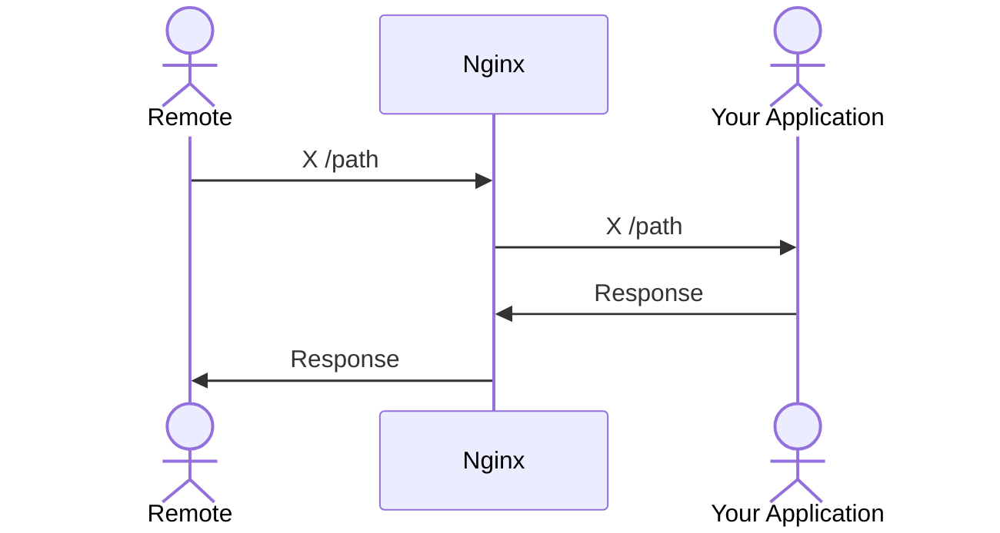
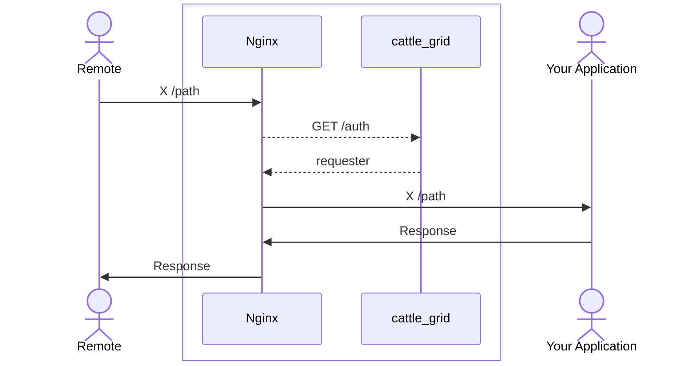

# Request flow

On this page, the request flows with and without cattle_grid are described.
The request flows here assume the usual setup of nginx as a reverse proxy.

## Nginx usage without cattle grid

We recall that the basic usage of nginx
as a reverse proxy can be described by the following sequence
diagram.



Here X represents the request type.

```nginx title="/etc/nginx/conf.d/your_application.conf"
server {
    listen 80 default_server;

    location / {
        proxy_pass http://your_application;
        proxy_set_header Host $host;
        proxy_set_header X-Real-IP $remote_addr;
        proxy_set_header X-Forwarded-for $remote_addr;
    }
}
```

This will lead to the request headers:

```http
User-Agent: bovine/0.5.1
Date: Mon, 06 Nov 2023 15:53:28 GMT
Accept: application/activity+json
Signature: keyId="http://pasture_verify_actor/actor#main",\
    algorithm="rsa-sha256",headers="(request-target) host date accept",\
    signature="XIVOBDTZAIGH9N...3mdXg=="
```

## With cattle_grid

We now move on what happens, when you integrate cattle_grid.
Basically, an additional request is performed before proxying
the request. This causes the `X-Cattle-Grid-Requester` to be
set if the request has a valid signature.



This now leads to the nginx configuration:

```nginx title="/etc/nginx/conf.d/your_application.conf"
server {
    listen 80 default_server;

    location / {
        auth_request /auth;
        auth_request_set $requester $upstream_http_x_cattle_grid_requester;

        proxy_pass http://your_application;
        proxy_set_header Host $host;
        proxy_set_header X-Real-IP $remote_addr;
        proxy_set_header X-Forwarded-for $remote_addr;
        proxy_set_header X-Cattle-Grid-Requester $requester;
    }

    location = /auth {
        internal;
        proxy_pass http://cattle_grid;
        proxy_pass_request_body off;
        proxy_set_header X-Original-URI $request_uri;
        proxy_set_header X-Original-Method $request_method;
        proxy_set_header X-Original-Host $host;
        proxy_set_header X-Original-Port $server_port;
    }
}
```

One will also need to setup cattle_grid as a service and configure it.
The request headers have now the form

```http
User-Agent: bovine/0.5.1
Date: Mon, 06 Nov 2023 15:53:28 GMT
Accept: application/activity+json
Signature: keyId="http://pasture_verify_actor/actor#main",\
    algorithm="rsa-sha256",headers="(request-target) host date accept",\
    signature="XIVOBDTZAIGH9NiOQV...VSdMc+3mdXg=="
X-Cattle-Grid-Requester: http://pasture_verify_actor/actor
```

The only change is the last header, which is new.
