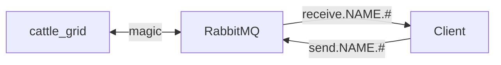
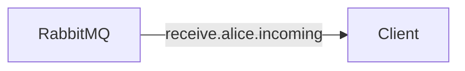
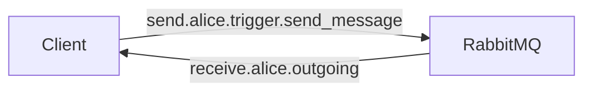
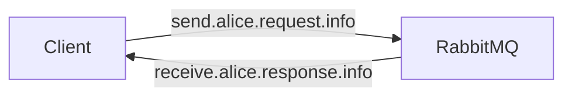
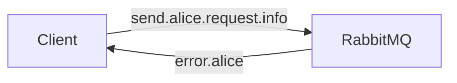
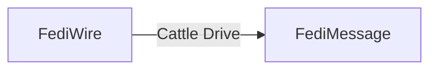

# The Cattle Drive Protocol

<div class="grid cards" markdown>

- [:material-api:{ .lg .middle } __Account AsyncAPI__](./assets/asyncapi.html?url=asyncapi_account.json)
- [:material-download:{ .lg .middle } __Download AsyncAPI.json__](./assets/schemas/asyncapi_account.json)

- [:material-code-tags:{ .lg .middle } __almabtrieb__](https://bovine.codeberg.page/almabtrieb/)

    Python client library

</div>

!!! info Version
    This is version 0.1.1. See [cattle_grid.account.processing.info.cattle_drive_version][].

!!! todo
    The above API has incorrect payloads, see [faststream#2040](https://github.com/airtai/faststream/issues/2040).

For a given account on `cattle_grid` the __cattle drive protocol__ is meant to be used by a __single__ client to manage everything about the account, this includes:

- Creating new Fediverse actors
- Performing actions as these Fediverse actors, e.g. posting, following other actors, or looking up (remote) objects
- Managing the actors, e.g. updating their profile
- Deleting the Actors

The name __cattle drive protocol__ is a work in progress and might still be changed.

!!! info
    In [info](#info), I introduce a protocol parameter. As many Fediverse applications are single actor, and thus are not really able to implement creating and deleting actors in a meaningful way, they should set this parameter to `CowDrive`. However, I believe these are still valid use cases of this protocol.

!!! todo
    Clarify the relationship to ActivityPub. See [Relationship to ActivityPub](#relationship-to-activitypub). One might call the protocol implemented
    by cattle_grid as `ActivityDrive`. It would correspond to FediWire + CattleDrive. The advantage of `ActivityDrive` would be that it has a test suite.

## Basics

An account has a name `NAME`. Corresponding to each account are two channels, one for receiving messages and one for sending messages. These are called `receive.NAME` and `send.NAME` in the following diagram and the current implementation.



### Message Types

- [__Events__](#events): Events in cattle_grid triggering a message on `receive.NAME`. Examples are: cattle_grid receiving a message from the Fediverse for one of the actors associated with the account. Similarly, for one of the actors associated with the account sending a message.
- [__Triggers__](#triggers): Triggering an event from the client through sending a message on `send.NAME`. Examples are: An actor sending a message to its followers. We note that this also triggers a message on `receive.NAME`, but this is an indirect side effect of how processing works.
- [__Requests__](#requests-and-responses): Messages on `send.NAME` requesting something for cattle_grid, e.g. create a new actor, list existing actors, or fetching an object.
- [__Responses__](#requests-and-responses): Messages on `receive.NAME` containing the result of a request on `send.NAME`. The result and request can be matched via the correlation data.

### Used topics

| type | Topics | Comments |
|--------|--------|--------|
| Events | `receive.NAME.incoming`, `receive.NAME.outgoing` | The format can be extended by using transformer extensions |
| Triggers | `send.NAME.trigger.#` | Supported by default are `send_message`, `update_actor`, and `delete_actor`. Additional methods can be added through extensions |
| Requests | `send.NAME.request.create_actor`, `send.NAME.request.info`, `send.NAME.request.fetch` | Only the response to fetch can be extended, and it through transformers |
| Responses | `receive.NAME.response.create_actor`, `receive.NAME.response.info`, `receive.NAME.response.fetch`, `receive.NAME.response.trigger` | Corresponds to a request. Uses correlation data to be matched. |
| Errors | `error.NAME` | Something has gone wrong |

Here `NAME` is the name of the account. Furthermore, one should ensure that only authorized accounts have access to these topics.

### Message flows

Let us revisit what the different channels look like.
First for an incoming message from the Fediverse:



This should be most messages. Messages such as Blocks or messages failing validation will not be forwarded. Next, we have the trigger



This is due to triggers being the way to send messages. Most triggers will follow the above pattern. The same holds true for requests and responses:



The difference between a request and a trigger is that requests are features of the server. In difference to this triggers create a cascade of effects that can be modified. For cattle_grid, one can create new triggers and add side effects to existing ones using extensions.

Lastly, when something fails one can expect an error message:



We note that error messages are not guaranteed to be send if something goes wrong for triggers.

## Discussion

### Scope of the protocol

There are two main issues that stop the Cattle Drive Protocol from being useful for general purpose clients:

- The protocol does not contain any information that would allow to route to a client. This means that all messages are send to each client, and no filtering occurs server side.
- The protocol has no history mechanism. That means it is only useful for clients that are always online.

We note that there is nothing stopping one to use this protocol as an intermediate between `cattle_grid` and a server supporting multiple clients.

Similarly, this protocol is good for always online stuff such as building Fediverse bots.

### Relationship to ActivityPub

Some people think the Fediverse implements [ActivityPub](https://www.w3.org/TR/activitypub/).
As what I propose doing requires some mental gymnastics
to decide if it implements ActivityPub or not, I will try to explain the relationship between the two.

There are at least two things that are in ActivityPub

- A way to create decentralized servers hosting actors that exchange messages via HTTP post requests and look up information via HTTP get requests.
- A way to format these messages (mostly in the introduction).

I will call the first part FediWire and the second part FediMessage. With this I would say that we implement



This means that __Cattle Drive__ allows one to communicate between something implementing FediWire and something implementing FediMessage.

!!! info
    A formal specification of Cattle Drive would not involve ActivityPub. The protocol would specify the asynchronous API. Implementing Fediverse Applications that do ActivityPub would then be the main example.

#### FediWire as implemented by cattle_grid

FediWire could be specified as what cattle_grid implements. This means

- Handling the actor profile, its inbox, followers, and following
- Posting messages to the inboxes of other Fediverse actors with correctly resolving the recipients, i.e. resolving the followers collection
- Handling Follow and Block requests
- Handling a subset of Accept, Reject, Delete, Undo, and Update requests
- Sending appropriate Update, Delete, and Accept rejects (in certain cases)

The rest is handled either through extensions or FediMessage. If you are looking for something where the division FediWire vs FediMessage is in particular vague, consider [Publish Object through the Simple Storage Extension of cattle_grid][cattle_grid.extensions.examples.simple_storage.simple_storage_publish_object]. With this the person implementing a client through Cattle Drive, does not need to know about Create activities. Without it, the client needs to know about create activities.

Similarly, the entire question about who assigns what ids to activities and objects is at best vague in the above division and at worst undefined.

### MooQTT a concrete application

MooQTT is the codename for connecting to the RabbitMQ broker baking up cattle_grid through the [web_mqtt](https://www.rabbitmq.com/docs/web-mqtt) plugin of RabbitMQ.

This means that for MooQTT just two topics are relevant: `send.NAME` and `receive.NAME`.

## Message Formats

In these messages, we assume the actor is `http://host.example/actor/123` and the account name is `alice`. We use the format

```json title="routing_key"
{
  "message": "body"
}
```

to describe the message being send. We use AMQP notation for the routing keys. To use it with MQTT, you should replace the dot `.` with a slash `/`.

### Events

<div class="grid cards" markdown>

- :material-code-tags:{ .lg .middle } [cattle_grid.model.account.EventInformation][]

</div>

There are two types of events `incoming` and `outgoing`.
These events corresponds to messages on ActivityExchange
being created with a routing key `incoming.#` or `outgoing.#`. These correspond to messages being received from respectively sent to the Fediverse.

These events have the form

```json title="receive.alice.incoming"
{
  "event_type": "incoming",
  "actor": "http://host.example/actor/123",
  "data": {
    "raw": {
      "@context": "https://www.w3.org/ns/activitystreams",
      "type": "Create",
      ...
    }, ...
  }
}
```

here `data.raw` is the ActivityPub object. The other entries
of data are produced by the transformers specified through the
[extension mechanism](./extensions/index.md).

### Triggers

<div class="grid cards" markdown>

- :material-code-tags:{ .lg .middle } [cattle_grid.model.account.TriggerMessage][]

</div>

Triggers have the following form

```json title="trigger.alice.send_message"
{
  "actor": "http://host.example/actor/123",
  "data": {
    "@context": "https://www.w3.org/ns/activitystreams",
    "type": "Follow",
    ...
  }
}
```

`method` indicates the method to call. These are implemented as routing keys on the ActivityExchange in cattle_grid, and by default

- `send_message` delivers the object to the Fediverse
- `update_actor`
- `delete_actor`

should be implemented. Further methods can be implemented through
[extensions](./extensions/index.md).

`data` is the ActivityPub object, e.g. for `send_message` the
activity to send.

#### with replies

In order to build a trigger that replies, one first needs to inform the user
of this behavior. This is done by setting the `replies` property of the `methodInformation`
to true.

```json title="receive.alice.response.info"
{
 "methodInformation": [
    {
      "routing_key": "replies",
      "module": "my.module",
      "description": "Replies to the trigger",
      "replies": true
    }, ...
  ], ...
}
```

Next, one triggers this method with a known correlation id, i.e.

```json title="send.alice.trigger.replies; correlationId=8e9b3a3f-4b8a-4dc3-9a36-84f3dc0f08c2"
{}
```

A reply is then send as

```json title="receive.alice.response.trigger; correlationId=8e9b3a3f-4b8a-4dc3-9a36-84f3dc0f08c2"
{
  "some": "data"
}
```

### Requests and Responses

There are three types of requests and responses:

- `info` returns information about the account and underlying server
- `create_actor` creates a new actor associated with the account
- `fetch` allows one to retrieve an object from the Fediverse as an actor

Correlation of request and response is done via correlation id for AMQP
and the correlation data for MQTT. We assume that these values are uuids.

!!! info
    `info` and `create_actor` are only necessary if the underlying
    server allows one to manage multiple actors. If one retrofits
    an existing Fediverse server to use this protocol, one will
    probably want to only allow one actor.
    There will be some way to creating actors is impossible in
    info for this case. One should still implement the info request
    as it allows one to communicate the protocol version and the
    available actor id.

#### info

<div class="grid cards" markdown>

- :material-code-tags:{ .lg .middle } [cattle_grid.model.account.InformationResponse][]

</div>

Requesting the information is done with an empty message

```json title="send.alice.request.info"
{}
```

The response has the form

```json title="receive.alice.response.info"
{
  "accountName": "your_account",
  "actors": ["http://host.example/actor/1", "http://host.example/actor/2"],
  "baseUrls": ["http://host.example"],
  "protocol": {
    "name": "CattleDrive",
    "version": "1alpha"
  },
  "backend": {
    "name": "cattle_grid",
    "version": "0.2.0alpha"
  },
  "methodInformation": [
    {
      "routing_key": "send_message",
      "module": "cattle_grid.exchange",
      "description": "Takes an activity and sends it to its recipients",
      "replies": false
    }, ...
  ]
}
```

#### create_actor

<div class="grid cards" markdown>

- :material-code-tags:{ .lg .middle } [cattle_grid.model.account.CreateActorRequest][]

</div>

A request has the following form

```json title="send.alice.request.create_actor"
{
  "baseUrl": "http://host.example",
  "profile": {
    "name": "A new actor",
    "summary": "A new actor just created through this fancy protocol",
  },
  "automaticallyAcceptFollowers": true
}
```

where the exact allowed value in `profile` may depend on the implications. Similarly, the allowed options for the actor.

The response currently is the actor object

```json title="receive.alice.response.create_actor"
{
  "@context": "https://www.w3.org/ns/activitystreams",
  "id": "http://host.example/actor/new", 
  "type": "Person",
  "name": "A new actor",
  "summary": "A new actor just created through this fancy protocol", ...
}
```

!!! todo
    Is this really the response one wants?

#### fetch

<div class="grid cards" markdown>

- :material-code-tags:{ .lg .middle } [FetchMessage][cattle_grid.model.account.FetchMessage]
- :material-code-tags:{ .lg .middle } [FetchResponse][cattle_grid.model.account.FetchResponse]

</div>

This is done via

```json title="send.alice.request.fetch"
{
  "actor": "http://host.example/actor/123",
  "uri": "http://remote.example/object/4"
}
```

where the result will be transformed to

```json title="receive.alice.response.fetch"
{
  "actor": "http://host.example/actor/123",
  "uri": "http://remote.example/object/4",
  "data": {
    "raw": {
      "@context": "https://www.w3.org/ns/activitystreams",
      "id": "http://remote.example/object/4", ...
    }, ...
  }
}
```

where the same can be said about applying the transformers
as for the [received events](#events).

## Error handling

<div class="grid cards" markdown>

- :material-code-tags:{ .lg .middle } [cattle_grid.model.account.ErrorMessage][]

</div>

If an error happens, it should create a message of the form

```json title="error.alice"
{
  "error": "This preferredUsername is already taken",
  "routing_key": "send.alice.request.create_actor"
  ...
}
```

where additional fields are allowed.

## Changes

### 0.1.1

- Fixed typo [cattle_grid#191](https://codeberg.org/bovine/cattle_grid/issues/191)
- Added `replies` to `MethodInformation` and the routing_key `receive.NAME.response.trigger`.
- Added information on how replies work for triggers
