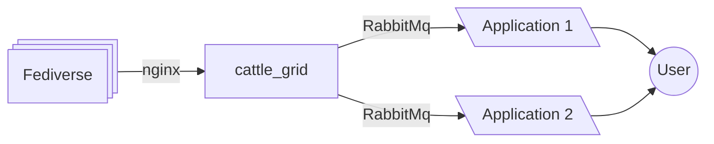

# cattle_grid

cattle_grid is a different take on a Fediverse application
than the more common monolithic social web server e.g. Mastodon.
While both types of applications offer federation through
ActivityPub, a social web server then provides one experience
to its users. In particular, it restricts users to a certain
subset of data the server understands.

## Features

<div class="grid cards" markdown>

- [:material-lock:{ .lg .middle } __Authentication Layer__](./authentication/index.md)

    ---

    Checking HTTP signatures is an ubiquitous problem
    of Fediverse implementations. cattle_grid can
    be used in combination with a reverse proxy
    to externalize this problem.

    In particular, this allows to reject requests
    without processing their body.

- [:material-puzzle:{ .lg .middle } __Extensions__](./extensions/index.md)

    ---

    cattle_grid is made to be modified by you. Instead
    of having a monolithic architecture, there are
    plenty of points, you can modify it.


- [:material-test-tube:{ .lg .middle } __Testable__](./testing/index.md)

    ---

    cattle_grid is meant to be testable. See in particular

    - [Set up BDD tests for behave](./testing/feature.md)
    - [Predefined behave steps](./testing/steps.md)
    - [Codeberg CI](https://ci.codeberg.org/repos/14146)
    - [Reports from BDD tests](https://bovine.codeberg.page/cattle_grid/@report/)

- :octicons-people-24:{ .lg .middle } __Actor Management__

    ----

    cattle_grid manages your actors. Actors are grouped by account.

    Federation behavior is documented in [FEDERATION.md](https://codeberg.org/bovine/cattle_grid/src/branch/main/FEDERATION.md).


</div>

## Architecture

cattle_grid is meant as an extensible middleware
simplifying building Fediverse applications. A basic
overview of the envisioned architecture is shown below:



Here cattle_grid takes care of the communication part
of the Fediverse, this means that you will not have
to worry about:

- managing followers
- managing block lists
- distributing messages
- the actor profile object

Other parts can be extended through extensions, for example
cattle_grid provides the default lookup of an object
treating its URI as an URL. Other lookup mechanisms can
be implemented through [extensions](./extensions/index.md).

### Software Dependencies

While other choices might be workable, cattle_grid is tested with the following components:

- nginx as a reverse proxy
- RabbitMQ as a message broker
- PostgreSQL as a database
- Redis as a cache (really a cache), this is also optional
- [bovine](https://bovine.readthedocs.io/en/latest/) is used to provide basic Fediverse features
- [FastAPI](https://fastapi.tiangolo.com/) is for the HTTP API
- [faststream](https://faststream.airt.ai/latest/) is used to connect to the message broker

One could make a longer list of choices made. As mentioned above one of the goals is to make extending cattle_grid possible. Unfortunately, this makes me force a lot of software choices on the possible implementer.

### As a middleware

Instead of extending cattle_grid through [extensions](./extensions/index.md), one can also subscribe to either the ActivityExchange or the AccountExchange and make modifications from it. This reduces the number of choices imposed on you through cattle_grid, however it also limits the options (e.g. transformers and lookups are impossible like this).

## Installation

cattle_grid is a python application based on [bovine](https://bovine.readthedocs.io/en/latest/). It can be installed from PyPI via

```bash
pip install cattle_grid
```

The minimal configuration can then be done via

```bash
python -mcattle_grid.auth new-config\
    https://your_domain.example/cattle_grid_actor
```

There will be more to configure, e.g.

- extensions
- block lists
- databases

### Basic commands to run cattle_grid

You can run the HTTP server via

```bash
uvicorn --factory cattle_grid:create_app
```

and the message processor via

```bash
faststream run cattle_grid.processor:app
```

## Developing cattle_grid

cattle_grid uses [astral-uv](https://docs.astral.sh/uv/) and
docker to run tests, etc. First, clone the git repository,
then install dependencies via

```bash
uv sync --frozen
```

### Formatting and linting

By running

```bash
uv run ruff format .
```

you can format the code and by running

```bash
uv run ruff check .
```

you can lint it.

### Running unit tests

One can run the unit tests via

```bash
uv run pytest
```

alternatively, one can run them using a watcher via

```bash
uv run ptw path_to_watch path_to_tests
```

For example, to watch changes to all files, and only
run the tests in `cattle_grid/exchange` run

```bash
uv run ptw . cattle_grid/exchange
```

### Running the docker tests

First, you will need to download the [fediverse-features](https://codeberg.org/helge/fediverse-features) using

```bash
uv run fediverse-features
```

the configuration for this is in `fediverse-features.toml`.
Then start the docker compose setup via

```bash
docker compose up --wait
```

This unfortunately takes a while, you can watch what is happening
via

```bash
docker compose logs -f
```

Once the containers are up (seen by `docker compose up --wait` terminating), you can start the runner via

```bash
docker compose run --rm cattle_grid_app /bin/sh
```

and then once it has started run the tests with

```bash
uv run behave
```

You can also use this containers to run the pytests and ruff.

### Modifying the database schema

After editing the models run

```bash
python -mcattle_grid create-db-migration --name description_of_what_you_did
```

to generate the database migration.
