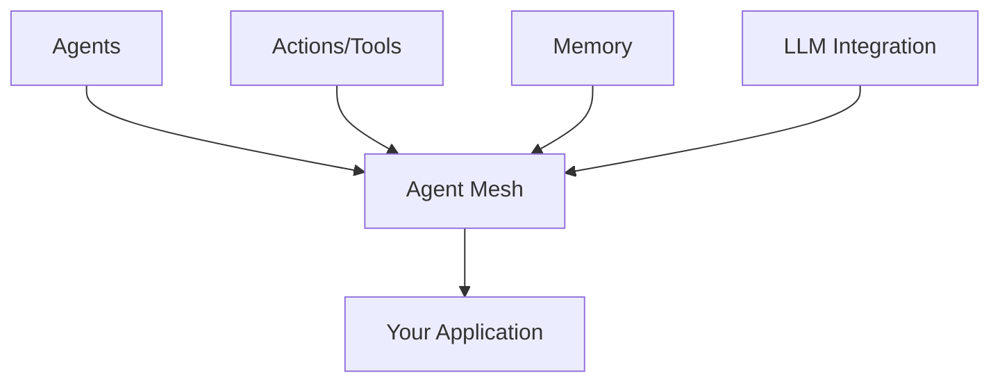
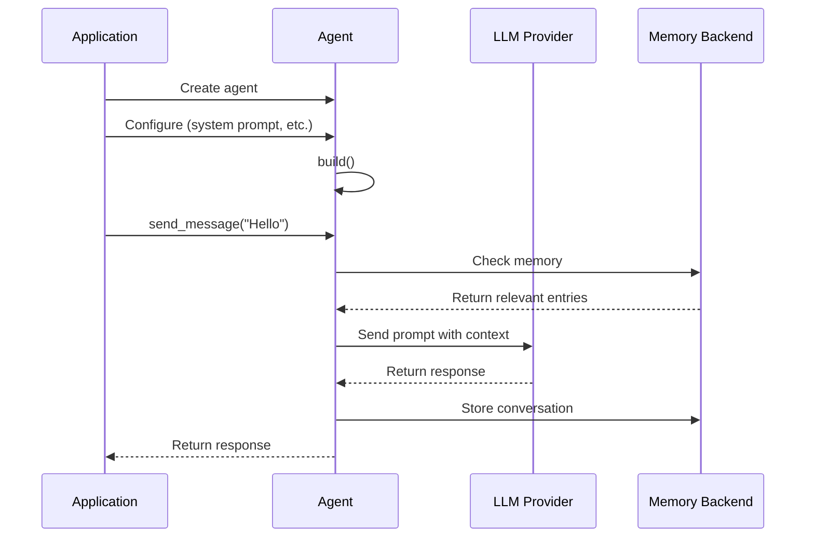

# Core Concepts

Understanding Ceylon AI's core concepts will help you build powerful agent systems. This guide covers the fundamental building blocks.

## Architecture Overview

Ceylon AI is built on four main pillars:



### 1. Agents

**Agents** are autonomous entities that can:

- Receive and process messages
- Maintain state
- Execute actions
- Communicate with other agents

```python
from ceylonai_next import Agent

class MyAgent(Agent):
    def on_message(self, message, context=None):
        # Process the message
        return "Response"
```

**Types of Agents:**

- **Basic Agent**: Custom message handling logic
- **LLM Agent**: Powered by Large Language Models
- **Hybrid Agent**: Combines LLM with custom logic

### 2. Actions (Tools)

**Actions** are capabilities that agents can perform. They're defined as methods with:

- Clear descriptions
- Type-annotated parameters
- Return values

```python
class CalculatorAgent(Agent):
    @Agent.action(name="add", description="Add two numbers")
    def add(self, a: int, b: int) -> int:
        return a + b
```

Ceylon automatically generates **JSON schemas** from type hints, making actions compatible with LLMs.

### 3. Memory

**Memory** gives agents the ability to store and retrieve information:

```python
from ceylonai_next import InMemoryBackend, MemoryEntry

# Create memory
memory = InMemoryBackend()

# Store information
entry = MemoryEntry("Important fact")
entry.with_metadata("category", "knowledge")
memory.store(entry)

# Use with agent
agent.with_memory(memory)
```

**Memory Features:**

- **TTL (Time-To-Live)**: Automatic expiration
- **Metadata**: Flexible key-value tags
- **Queries**: Search and filter entries
- **Custom Backends**: Implement your own storage

### 4. Mesh Networking

The **Mesh** connects agents, enabling communication:

```python
from ceylonai_next import LocalMesh

mesh = LocalMesh()
mesh.add_agent(agent1)
mesh.add_agent(agent2)

# Agents can now communicate
```

**Mesh Types:**

- **Local Mesh**: In-process communication
- **Distributed Mesh** (planned): Cross-process/network communication

## Agent Lifecycle



### Lifecycle Stages

1. **Creation**: Instantiate the agent
2. **Configuration**: Set system prompt, temperature, memory, etc.
3. **Building**: Call `build()` to finalize configuration
4. **Operation**: Send/receive messages
5. **Cleanup**: Resources cleaned up automatically

## Message Flow

```python
# User sends message
user_message = "What is Python?"

# Agent processes with context
context = {
    "memory": [relevant_memories],
    "actions": [available_actions],
    "system_prompt": "You are helpful"
}

# LLM generates response
response = llm.generate(user_message, context)

# Agent returns response
return response
```

## Context

**Context** provides agents with runtime information:

```python
from ceylonai_next import PyAgentContext

class MyAgent(Agent):
    def on_message(self, message, context=None):
        if context:
            print(f"Sender: {context.sender}")
            print(f"Timestamp: {context.timestamp}")
        return "Response"
```

**Context Contains:**

- Sender information
- Timestamp
- Mesh reference
- Custom metadata

## Action System

### Schema Generation

Ceylon automatically generates JSON schemas:

```python
def calculate(self, x: int, y: int, operation: str = "add") -> float:
    """Perform a calculation."""
    pass
```

Generates:

```json
{
  "type": "object",
  "properties": {
    "x": { "type": "integer" },
    "y": { "type": "integer" },
    "operation": { "type": "string" }
  },
  "required": ["x", "y"]
}
```

### Tool Invocation

```python
from ceylonai_next import PyToolInvoker

invoker = PyToolInvoker()
invoker.register(action)

# LLM or other agents can invoke actions
result = invoker.invoke("action_name", inputs)
```

## Memory System

### Storage

```python
# Create entry
entry = MemoryEntry("Ceylon is a Rust-based framework")

# Add metadata
entry.with_metadata("type", "fact")
entry.with_metadata("importance", "high")
entry.with_metadata("source", "docs")

# Set expiration (optional)
entry.with_ttl_seconds(3600)  # Expires in 1 hour

# Store
entry_id = memory.store(entry)
```

### Retrieval

```python
# By ID
entry = memory.get(entry_id)

# By query
from ceylonai_next import MemoryQuery

query = MemoryQuery()
query.with_filter("type", "fact")
query.with_filter("importance", "high")
query.with_limit(10)

results = memory.search(query)
```

## LLM Integration

### Provider Configuration

Ceylon supports multiple providers with a unified API:

```python
# Ollama (local)
agent = LlmAgent("assistant", "ollama::llama3.2:latest")

# OpenAI
agent = LlmAgent("assistant", "openai::gpt-4")
agent.with_api_key("sk-...")

# Anthropic
agent = LlmAgent("assistant", "anthropic::claude-3-sonnet")
agent.with_api_key("sk-ant-...")
```

### Model Format

```
provider::model_name
```

**Examples:**

- `ollama::llama3.2:latest`
- `openai::gpt-4`
- `anthropic::claude-3-sonnet`
- `openai::gpt-3.5-turbo`

### Configuration Parameters

```python
agent = LlmAgent("assistant", "ollama::llama3.2:latest")

# Behavior
agent.with_system_prompt("You are helpful")  # Defines personality

# Generation
agent.with_temperature(0.7)    # 0.0 = deterministic, 2.0 = creative
agent.with_max_tokens(1000)    # Max response length

# Memory
agent.with_memory(memory)      # Add memory capabilities

# Authentication
agent.with_api_key("key")      # For cloud providers

# Finalize
agent.build()
```

## Async Support

Ceylon supports async/await for concurrent operations:

```python
import asyncio

async def main():
    agent = LlmAgent("assistant", "ollama::llama3.2:latest")
    agent.build()

    # Concurrent queries (send_message is async by default)
    results = await asyncio.gather(
        agent.send_message("Query 1"),
        agent.send_message("Query 2"),
        agent.send_message("Query 3")
    )

asyncio.run(main())
```

> [!NOTE] > **Async-First API:** Use `await agent.send_message()` for async. For blocking calls, use `agent.send_message_sync()`.

**Benefits:**

- Execute multiple queries in parallel
- Better resource utilization
- Faster overall execution time
- Non-blocking I/O

## Error Handling

### Common Errors

```python
from ceylonai_next import LlmAgent

try:
    agent = LlmAgent("assistant", "ollama::llama3.2:latest")
    agent.build()
    response = agent.send_message("Hello")

except ValueError as e:
    # Configuration errors
    print(f"Configuration error: {e}")

except RuntimeError as e:
    # Runtime errors (model not available, etc.)
    print(f"Runtime error: {e}")

except Exception as e:
    # Other errors
    print(f"Unexpected error: {e}")
```

### Best Practices

1. **Always call `build()`** before sending messages
2. **Handle LLM errors** - Models may be unavailable
3. **Validate inputs** - Check user input before processing
4. **Use timeouts** - Prevent hanging on slow responses
5. **Log errors** - Keep track of failures for debugging

## Design Patterns

### Builder Pattern

Ceylon uses the builder pattern extensively:

```python
agent = (LlmAgent("assistant", "ollama::llama3.2:latest")
    .with_system_prompt("You are helpful")
    .with_temperature(0.7)
    .with_memory(memory)
    .build())
```

### Decorator Pattern

Actions use decorators for registration:

```python
@Agent.action(name="tool", description="A tool")
def my_tool(self, param: str) -> str:
    return f"Processed: {param}"
```

### Factory Pattern

Create agents from configuration:

```python
def create_agent(config):
    agent = LlmAgent(config['name'], config['model'])
    agent.with_system_prompt(config['prompt'])
    agent.with_temperature(config['temperature'])
    return agent.build()
```

## Next Steps

Now that you understand the core concepts:

- [**Agents Guide**](../guide/agents/overview.md) - Deep dive into agents
- [**Actions Guide**](../guide/actions/overview.md) - Master the action system
- [**LLM Guide**](../guide/llm/overview.md) - Work with language models
- [**Memory Guide**](../guide/memory/overview.md) - Implement memory systems
- [**Examples**](../examples/index.md) - See concepts in action
