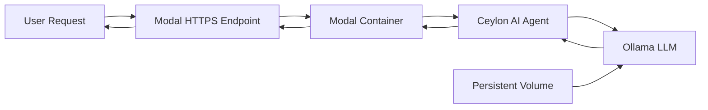

# Deploying to Modal.com

Ceylon AI agents can be easily deployed to [Modal](https://modal.com), a serverless platform for running Python code in the cloud. This guide shows you how to deploy your agents for production use.

## What is Modal?

Modal is a serverless compute platform that makes it easy to run Python applications in the cloud without managing infrastructure. It's perfect for deploying Ceylon AI agents because:

- **Zero Infrastructure Management**: No servers to configure or maintain
- **Automatic Scaling**: Handles traffic spikes automatically
- **GPU Support**: Optional GPU acceleration for larger models
- **Fast Cold Starts**: Optimized for quick startup times
- **Cost Effective**: Pay only for what you use

## Prerequisites

Before you begin, make sure you have:

1. **Ceylon AI installed**:

   ```bash
   pip install ceylonai-next
   ```

2. **Modal installed**:

   ```bash
   pip install modal
   ```

3. **Modal account**: Sign up at [modal.com](https://modal.com)

4. **Modal authentication**:
   ```bash
   modal setup
   ```
   This will open a browser window to authenticate.

## Quick Start

### Step 1: Install Dependencies

```bash
pip install ceylonai-next modal
```

### Step 2: Authenticate with Modal

```bash
modal setup
```

Follow the browser prompts to complete authentication.

### Step 3: Create Your First Modal Agent

Create a file called `simple_modal_agent.py`:

```python
import modal

# Create a Modal app
app = modal.App("my-ceylon-agent")

# Create persistent volume for Ollama models
ollama_volume = modal.Volume.from_name("ollama-models", create_if_missing=True)

# Define image with Ceylon AI and Ollama
image = (
    modal.Image.from_registry("ubuntu:24.04", add_python="3.12")
    .apt_install("curl")
    .run_commands("curl -fsSL https://ollama.ai/install.sh | sh")
    .pip_install("ceylonai-next>=0.2.5")
)

def ensure_ollama_running():
    """Start Ollama and ensure model is available."""
    import subprocess
    import time

    subprocess.Popen(["ollama", "serve"],
                     stdout=subprocess.DEVNULL,
                     stderr=subprocess.DEVNULL)
    time.sleep(3)

    # Pull model if not available
    result = subprocess.run(["ollama", "list"],
                           capture_output=True, text=True)
    if "qwen2.5:0.5b" not in result.stdout:
        subprocess.run(["ollama", "pull", "qwen2.5:0.5b"], check=True)
        ollama_volume.commit()

@app.function(
    image=image,
    timeout=900,
    volumes={"/root/.ollama": ollama_volume},
)
async def chat(message: str) -> dict:
    """Simple chat function using Ceylon AI."""
    from ceylonai_next import LlmAgent

    ensure_ollama_running()

    # Create and configure agent
    agent = LlmAgent("assistant", "ollama::qwen2.5:0.5b")
    agent.with_system_prompt("You are a helpful assistant.")
    agent.build()

    # Get response
    response = await agent.send_message_async(message)

    return {
        "message": message,
        "response": response,
        "status": "success"
    }

@app.local_entrypoint()
def main():
    """Test the agent locally."""
    result = chat.remote("Hello! How are you?")
    print(f"Agent: {result['response']}")

if __name__ == "__main__":
    print("Run with: modal run simple_modal_agent.py")
```

### Step 4: Test Locally

```bash
modal run simple_modal_agent.py
```

The first run will download the Ollama model (~397 MB). Subsequent runs will be faster.

### Step 5: Deploy to Production

```bash
modal deploy simple_modal_agent.py
```

Modal will provide a URL for your deployed function.

## Complete Examples

Ceylon AI provides several ready-to-use Modal examples in the `examples/modal_examples` directory:

### 1. Simple Chatbot

**File**: `simple_chatbot_modal.py`

A basic conversational agent with multiple personality modes (friendly, professional, humorous).

```bash
modal run simple_chatbot_modal.py
```

**Features**:

- Multiple personality configurations
- Single-turn and multi-turn conversations
- FastAPI web endpoint

### 2. Agent with Custom Actions

**File**: `action_tools_modal.py`

An agent with custom tool-calling abilities.

```bash
modal run action_tools_modal.py
```

**Available Tools**:

- Current time/date
- Math calculator
- Weather lookup
- Knowledge base search
- Temperature conversion

### 3. Multi-Agent System

**File**: `multi_agent_modal.py`

A customer service routing system with specialized agents.

```bash
modal run multi_agent_modal.py
```

**Features**:

- Multiple specialized agents
- Intelligent query routing
- Agent coordination via PyLocalMesh

### 4. Conversation Agent

**File**: `memory_agent_modal.py`

An agent that maintains conversation context.

```bash
modal run memory_agent_modal.py
```

**Features**:

- Multi-turn conversation handling
- Context retention across messages
- Session-based tracking

## Adding a Web API Endpoint

To make your agent accessible via HTTP, add a FastAPI endpoint:

```python
@app.function(
    image=image,
    timeout=900,
    volumes={"/root/.ollama": ollama_volume},
)
@modal.web_endpoint(method="POST")
async def api(request: dict) -> dict:
    """Web API endpoint for the agent."""
    message = request.get("message", "")

    if not message:
        return {"error": "No message provided"}

    result = await chat.remote.aio(message)
    return result
```

Deploy with:

```bash
modal deploy simple_modal_agent.py
```

Test the endpoint:

```bash
curl -X POST <your-modal-url> \
  -H "Content-Type: application/json" \
  -d '{"message": "Hello!"}'
```

## Architecture Overview



## Best Practices

### 1. Use Small Models for Cost Efficiency

```python
# Recommended for most use cases
agent = LlmAgent("assistant", "ollama::qwen2.5:0.5b")

# For better quality (higher cost)
agent = LlmAgent("assistant", "ollama::llama3.2:1b")
```

### 2. Persist Ollama Models

Always use a persistent volume to avoid re-downloading models:

```python
ollama_volume = modal.Volume.from_name("ollama-models", create_if_missing=True)

@app.function(volumes={"/root/.ollama": ollama_volume})
async def my_function():
    # Ollama models cached in volume
    pass
```

### 3. Set Appropriate Timeouts

```python
@app.function(
    timeout=900,  # 15 minutes for first run (model download)
)
async def chat(message: str):
    # Subsequent runs will be much faster
    pass
```

### 4. Use Ubuntu 24.04 for GLIBC Compatibility

```python
image = modal.Image.from_registry("ubuntu:24.04", add_python="3.12")
```

Ceylon AI requires GLIBC 2.38+, which Ubuntu 24.04 provides.

## Deployment Workflow

### Development

```bash
# Test locally
modal run my_agent.py

# Live development with hot reload
modal serve my_agent.py
```

### Production

```bash
# Deploy to Modal
modal deploy my_agent.py

# View deployed apps
modal app list

# View logs
modal app logs <app-name>
```

## Monitoring and Debugging

### View Logs

```bash
modal app logs my-ceylon-agent
```

### Check Function Status

Visit the [Modal Dashboard](https://modal.com/apps) to:

- View function execution times
- Monitor resource usage
- Check error logs
- Track costs

### Common Issues

#### Ollama Model Not Found

**Problem**: Model downloads fail or timeout

**Solution**:

```python
# Increase timeout for first run
@app.function(timeout=1200)  # 20 minutes
```

#### Function Timeout

**Problem**: Function times out on first run

**Solution**: Model download can take 5-10 minutes. Set appropriate timeout:

```python
@app.function(timeout=900)  # 15 minutes minimum
```

#### GLIBC Version Error

**Problem**: `GLIBC_2.38 not found`

**Solution**: Use Ubuntu 24.04:

```python
image = modal.Image.from_registry("ubuntu:24.04", add_python="3.12")
```

## Cost Optimization

### 1. Choose the Right Model

| Model        | Size   | Speed      | Quality    | Cost   |
| ------------ | ------ | ---------- | ---------- | ------ |
| qwen2.5:0.5b | 397 MB | ⭐⭐⭐⭐⭐ | ⭐⭐⭐     | 💰     |
| llama3.2:1b  | 1.3 GB | ⭐⭐⭐⭐   | ⭐⭐⭐⭐   | 💰💰   |
| gemma2:2b    | 1.6 GB | ⭐⭐⭐     | ⭐⭐⭐⭐⭐ | 💰💰💰 |

### 2. Use Persistent Volumes

Prevents re-downloading models on every deployment:

```python
ollama_volume = modal.Volume.from_name("ollama-models", create_if_missing=True)
```

Saves both time and bandwidth costs.

### 3. Set Realistic Timeouts

Don't over-allocate:

```python
# First deployment
@app.function(timeout=900)

# After model is cached
@app.function(timeout=300)  # 5 minutes is plenty
```

## Advanced Features

### GPU Support (Optional)

For larger models, you can request GPU resources:

```python
@app.function(
    image=image,
    gpu="T4",  # or "A10G", "A100"
    timeout=900,
)
async def gpu_chat(message: str):
    # Use larger models with GPU acceleration
    agent = LlmAgent("assistant", "ollama::llama3.2:7b")
    # ...
```

!!! warning "GPU Costs"
GPU instances are significantly more expensive. Use only when necessary.

### Scheduled Jobs

Run agents on a schedule:

```python
@app.function(
    schedule=modal.Period(hours=24),  # Every 24 hours
    image=image,
    volumes={"/root/.ollama": ollama_volume},
)
async def daily_task():
    """Run agent task daily."""
    from ceylonai_next import LlmAgent

    ensure_ollama_running()
    agent = LlmAgent("scheduler", "ollama::qwen2.5:0.5b")
    agent.build()

    # Perform scheduled task
    result = await agent.send_message_async("Generate daily summary")
    # Save or send result
```

### Batch Processing

Process multiple messages efficiently:

```python
@app.function(
    image=image,
    volumes={"/root/.ollama": ollama_volume},
)
async def batch_chat(messages: list[str]) -> list[dict]:
    """Process multiple messages with one agent instance."""
    from ceylonai_next import LlmAgent

    ensure_ollama_running()

    agent = LlmAgent("batch_agent", "ollama::qwen2.5:0.5b")
    agent.build()

    results = []
    for msg in messages:
        response = await agent.send_message_async(msg)
        results.append({"message": msg, "response": response})

    return results
```

## Next Steps

- Explore the [example files](https://github.com/ceylonai/next-processor/tree/main/bindings/python/examples/modal_examples)
- Read [Modal's documentation](https://modal.com/docs)
- Check out [Ollama models](https://ollama.ai/library) for different options
- Join the Ceylon AI community for support

## Resources

- [Modal Documentation](https://modal.com/docs)
- [Ceylon AI GitHub](https://github.com/ceylonai/next-processor)
- [Ollama Models](https://ollama.ai/library)
- [Example Code](https://github.com/ceylonai/next-processor/tree/main/bindings/python/examples/modal_examples)
