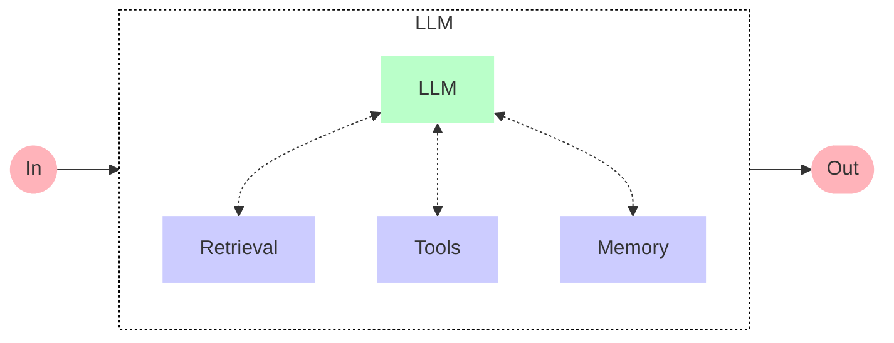
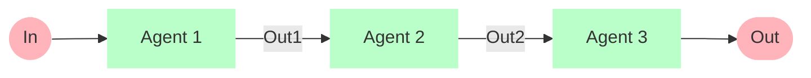
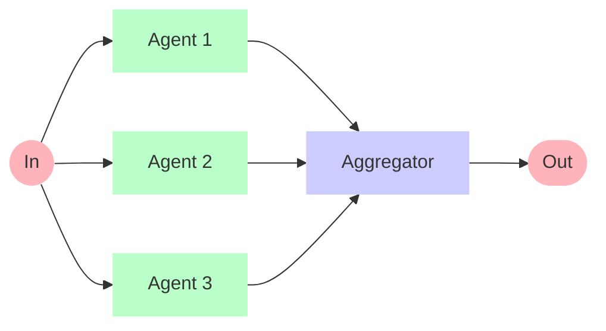
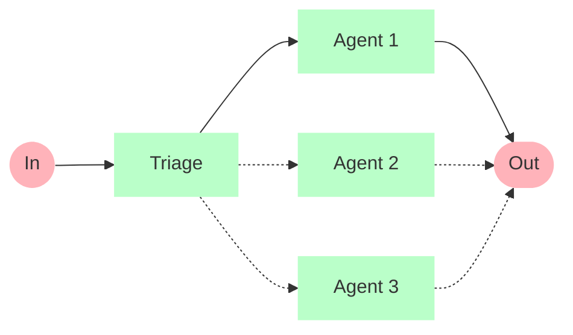
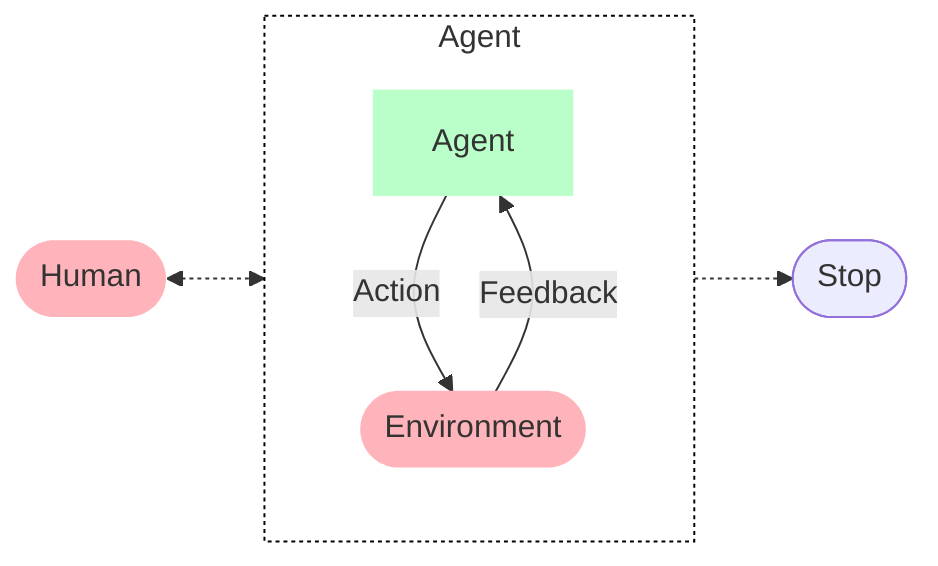

# Coagent
[](https://github.com/OpenCSGs/coagent/actions?query=event%3Apush+branch%3Amain+workflow%3ACI)

An open-source framework for building monolithic or distributed agentic systems, ranging from simple LLM calls to compositional workflows and autonomous agents.


<p align="center">

</p>


## Latest Updates

- 🚀 **2025-10-24**: Added support for [ReAct](https://arxiv.org/abs/2210.03629) agents, check out [Autonomous Agents](#autonomous-agents).
- **2025-07-18**: Added support for [A2A](https://a2a-protocol.org/), check out the [example](examples/a2a).
- **2025-02-08**: Added support for [DeepSeek-R1](https://api-docs.deepseek.com/news/news250120), check out the [example](examples/deepseek-r1).
- **2025-01-28**: Added support for [Structured Outputs][2].
- **2025-01-22**: Added support for [Model Context Protocol][3].
- **2025-01-17**: Added integration with [LiteLLM](https://github.com/BerriAI/litellm).


## Features

- [x] Event-driven & Scalable on-demand
- [x] Monolithic or Distributed
    - [x] Local Runtime (In-process Runtime)
    - [x] HTTP Runtime (HTTP-based Distributed Runtime)
    - [x] NATS Runtime (NATS-based Distributed Runtime)
        - [ ] Using NATS [JetStream][1]
- [x] Single-agent
    - [x] [Function calling](https://platform.openai.com/docs/guides/function-calling)
    - [x] [Structured Outputs][2] ([example](examples/structured-outputs))
    - [x] ReAct agents ([example](examples/patterns/autonomous_agent.py))
- [x] Multi-agent orchestration
    - [x] Agent Discovery
    - [x] Static orchestration
        - [x] Sequential
        - [x] Parallel
    - [x] Dynamic orchestration
        - [x] Triage
        - [x] Handoffs (based on async Swarm)
- [x] Support any LLM
- [x] Support [Model Context Protocol][3] ([example](examples/mcp))
- [x] [CoS](coagent/cos) (Multi-language support)
    - [x] [Python](examples/cos/cos.py)
    - [x] [Node.js](examples/cos/cos.js)
    - [x] [Go](examples/cos/goagent)
    - [ ] Zig
    - [ ] Rust


## Three-tier Architecture

<p align="center">

</p>


## Installation

```bash
pip install coagent-python
```

To install with A2A support:

```bash
pip install "coagent-python[a2a]"
```


## Quick Start


### Monolithic

Implement the agent:

```python
# translator.py

import asyncio
import os

from coagent.agents import ChatAgent, ChatMessage, Model
from coagent.core import AgentSpec, new, init_logger
from coagent.runtimes import LocalRuntime

translator = AgentSpec(
    "translator",
    new(
        ChatAgent,
        system="You are a professional translator that can translate Chinese to English.",
        model=Model(id="openai/gpt-4o", api_key=os.getenv("OPENAI_API_KEY")),
    ),
)


async def main():
    async with LocalRuntime() as runtime:
        await runtime.register(translator)

        result = await translator.run(
            ChatMessage(role="user", content="你好，世界").encode(),
            stream=True,
        )
        async for chunk in result:
            msg = ChatMessage.decode(chunk)
            print(msg.content, end="", flush=True)


if __name__ == "__main__":
    init_logger()
    asyncio.run(main())
```

Run the agent:

```bash
export OPENAI_API_KEY="your-openai-key"
python translator.py
```


### Distributed

Start a NATS server ([docs][4]):

```bash
docker run -p 4222:4222 --name nats-server -ti nats:latest
```

Implement the agent:

```python
# translator.py

import asyncio
import os

from coagent.agents import ChatAgent, Model
from coagent.core import AgentSpec, new, init_logger
from coagent.runtimes import NATSRuntime

translator = AgentSpec(
    "translator",
    new(
        ChatAgent,
        system="You are a professional translator that can translate Chinese to English.",
        model=Model(id="openai/gpt-4o", api_key=os.getenv("OPENAI_API_KEY")),
    ),
)


async def main():
    async with NATSRuntime.from_servers("nats://localhost:4222") as runtime:
        await runtime.register(translator)
        await runtime.wait_for_shutdown()


if __name__ == "__main__":
    init_logger()
    asyncio.run(main())
```

Run the agent as a daemon:

```bash
export OPENAI_API_KEY="your-openai-key"
python translator.py
```

Communicate with the agent using the `coagent` CLI:

```bash
coagent translator -H type:ChatMessage --chat -d '{"role": "user", "content": "你好，世界"}'
```


## Patterns

(The following patterns are mainly inspired by [Anthropic's Building effective agents][5] and [OpenAI's Handoffs][6].)

### Basic: Augmented LLM

**Augmented LLM** is an LLM enhanced with augmentations such as retrieval, tools, and memory. Our current models can actively use these capabilities—generating their own search queries, selecting appropriate tools, and determining what information to retain.



**Example** (see [examples/patterns/augmented_llm.py](examples/patterns/augmented_llm.py) for a runnable example):

```python
from coagent.agents import ChatAgent, Model, tool
from coagent.core import AgentSpec, new


class Assistant(ChatAgent):
    system = """You are an agent who can use tools."""
    model = Model(...)

    @tool
    async def query_weather(self, city: str) -> str:
        """Query the weather in the given city."""
        return f"The weather in {city} is sunny."


assistant = AgentSpec("assistant", new(Assistant))
```

### Workflow: Chaining

**Chaining** decomposes a task into a sequence of steps, where each agent processes the output of the previous one.



**When to use this workflow:** This workflow is ideal for situations where the task can be easily and cleanly decomposed into fixed subtasks. The main goal is to trade off latency for higher accuracy, by making each agent an easier task.

**Example** (see [examples/patterns/chaining.py](examples/patterns/chaining.py) for a runnable example):

```python
from coagent.agents import ChatAgent, Sequential, Model
from coagent.core import AgentSpec, new

model = Model(...)

extractor = AgentSpec(
    "extractor",
    new(
        ChatAgent,
        system="""\
Extract only the numerical values and their associated metrics from the text.
Format each as 'value: metric' on a new line.
Example format:
92: customer satisfaction
45%: revenue growth\
""",
        model=model,
    ),
)

converter = AgentSpec(
    "converter",
    new(
        ChatAgent,
        system="""\
Convert all numerical values to percentages where possible.
If not a percentage or points, convert to decimal (e.g., 92 points -> 92%).
Keep one number per line.
Example format:
92%: customer satisfaction
45%: revenue growth\
""",
        model=model,
    ),
)

sorter = AgentSpec(
    "sorter",
    new(
        ChatAgent,
        system="""\
Sort all lines in descending order by numerical value.
Keep the format 'value: metric' on each line.
Example:
92%: customer satisfaction
87%: employee satisfaction\
""",
        model=model,
    ),
)

formatter = AgentSpec(
    "formatter",
    new(
        ChatAgent,
        system="""\
Format the sorted data as a markdown table with columns:
| Metric | Value |
|:--|--:|
| Customer Satisfaction | 92% |\
""",
        model=model,
    ),
)

chain = AgentSpec(
    "chain", new(Sequential, "extractor", "converter", "sorter", "formatter")
)
```

### Workflow: Parallelization

**Parallelization** distributes independent subtasks across multiple agents for concurrent processing.



**When to use this workflow:** Parallelization is effective when the divided subtasks can be parallelized for speed, or when multiple perspectives or attempts are needed for higher confidence results.

**Example** (see [examples/patterns/parallelization.py](examples/patterns/parallelization.py) for a runnable example):

```python
from coagent.agents import Aggregator, ChatAgent, Model, Parallel
from coagent.core import AgentSpec, new

model = Model(...)

customer = AgentSpec(
    "customer",
    new(
        ChatAgent,
        system="""\
Customers:
- Price sensitive
- Want better tech
- Environmental concerns\
""",
        model=model,
    ),
)

employee = AgentSpec(
    "employee",
    new(
        ChatAgent,
        system="""\
Employees:
- Job security worries
- Need new skills
- Want clear direction\
""",
        model=model,
    ),
)

investor = AgentSpec(
    "investor",
    new(
        ChatAgent,
        system="""\
Investors:
- Expect growth
- Want cost control
- Risk concerns\
""",
        model=model,
    ),
)

supplier = AgentSpec(
    "supplier",
    new(
        ChatAgent,
        system="""\
Suppliers:
- Capacity constraints
- Price pressures
- Tech transitions\
""",
        model=model,
    ),
)

aggregator = AgentSpec("aggregator", new(Aggregator))

parallel = AgentSpec(
    "parallel",
    new(
        Parallel,
        "customer",
        "employee",
        "investor",
        "supplier",
        aggregator="aggregator",
    ),
)
```


### Workflow: Triaging & Routing

**Triaging** classifies an input and directs it to a specialized followup agent. This workflow allows for separation of concerns, and building more specialized agents.



**When to use this workflow:** This workflow works well for complex tasks where there are distinct categories that are better handled separately, and where classification can be handled accurately, either by an LLM (using Prompting or Function-calling) or a more traditional classification model/algorithm.

**Example** (see [examples/patterns/triaging.py](examples/patterns/triaging.py) for a runnable example):

```python
from coagent.agents import ChatAgent, Triage, Model
from coagent.core import AgentSpec, new

model = Model(...)

billing = AgentSpec(
    "billing",
    new(
        ChatAgent,
        system="""\
You are a billing support specialist. Follow these guidelines:
1. Always start with "Billing Support Response:"
2. First acknowledge the specific billing issue
3. Explain any charges or discrepancies clearly
4. List concrete next steps with timeline
5. End with payment options if relevant

Keep responses professional but friendly.\
""",
        model=model,
    ),
)

account = AgentSpec(
    "account",
    new(
        ChatAgent,
        system="""\
You are an account security specialist. Follow these guidelines:
1. Always start with "Account Support Response:"
2. Prioritize account security and verification
3. Provide clear steps for account recovery/changes
4. Include security tips and warnings
5. Set clear expectations for resolution time

Maintain a serious, security-focused tone.\
""",
        model=model,
    ),
)

triage = AgentSpec(
    "triage",
    new(
        Triage,
        system="""You are a triage agent who will delegate to sub-agents based on the conversation content.""",
        model=model,
        static_agents=["billing", "account"],
    ),
)
```


### Autonomous Agents

**Agents** are emerging in production as LLMs mature in key capabilities—understanding complex inputs, engaging in reasoning and planning, using tools reliably, and recovering from errors.



**When to use agents:** Agents can be used for open-ended problems where it’s difficult or impossible to predict the required number of steps, and where you can’t hardcode a fixed path. The Agent will potentially operate for many turns, and you must have some level of trust in its decision-making. Agents' autonomy makes them ideal for scaling tasks in trusted environments.

**Example** (see [examples/patterns/autonomous_agent.py](examples/patterns/autonomous_agent.py) for a runnable example):

```python
from coagent.agents import Model
from coagent.agents.react_agent import ReActAgent, RunContext
from coagent.core import AgentSpec, new

async def get_current_city(ctx: RunContext) -> str:
    """Get the current city."""
    ctx.report_progress(message="Getting the current city...")
    return "Beijing"


async def query_weather(ctx: RunContext, city: str) -> str:
    """Query the weather in the given city."""
    ctx.report_progress(message=f"Querying the weather in {city}...")
    return f"The weather in {city} is sunny."


reporter = AgentSpec(
    "reporter",
    new(
        ReActAgent,
        name="reporter",
        system="You are a helpful weather reporter",
        model=Model(...),
        tools=[get_current_city, query_weather],
    ),
)
```


## Examples

- [patterns](examples/patterns)
- [agents-as-tools](examples/agents-as-tools)
- [react-mcp](examples/react-mcp)
- [a2a](examples/a2a)
- [mcp](examples/mcp)
- [mcp-new](examples/mcp-new)
- [structured-outputs](examples/structured-outputs)
- [deepseek-r1](examples/deepseek-r1)
- [translator](examples/translator)
- [discovery](examples/discovery)
- [notification](examples/notification)
- [app-builder](examples/app-builder)
- [opencsg](examples/opencsg)
- [framework-integration](examples/framework-integration)
- [ping-pong](examples/ping-pong)
- [stream-ping-pong](examples/stream-ping-pong)
- [cos](examples/cos)


[1]: https://docs.nats.io/nats-concepts/jetstream
[2]: https://platform.openai.com/docs/guides/structured-outputs
[3]: https://modelcontextprotocol.io/introduction
[4]: https://docs.nats.io/running-a-nats-service/nats_docker/nats-docker-tutorial
[5]: https://www.anthropic.com/research/building-effective-agents
[6]: https://cookbook.openai.com/examples/orchestrating_agents
