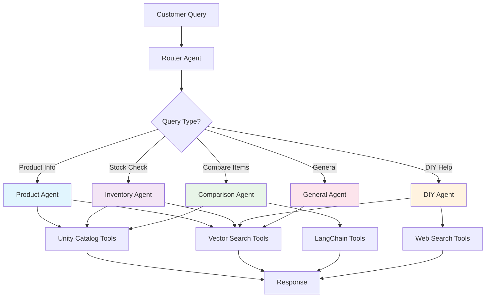

# Retail AI Agents & Tools Overview

The Retail AI system is built around specialized AI agents that orchestrate multiple tools to handle complex retail operations. This guide explains how to build and use these agents for retail customer assistance, inventory management, and product discovery.

## What are Retail AI Agents?

Retail AI agents are autonomous, conversational AI systems that:
- **Reason and plan** multi-step workflows to solve customer problems
- **Use specialized tools** for data access, search, and analysis
- **Maintain conversation context** across multiple interactions
- **Apply business rules** and safety guardrails
- **Specialize in retail domains** like products, inventory, and customer service

### Agent Architecture



---

## Implemented Agents Summary

### Product Agent
**Specialization:** Product discovery, details, and recommendations
- Exact product lookup by SKU or UPC
- Semantic product search using natural language
- Product feature extraction and analysis
- Cross-selling and upselling recommendations

### Inventory Agent
**Specialization:** Stock levels, availability, and inventory management
- Real-time inventory checking across stores and warehouses
- Stock level monitoring and alerts
- Product availability by location
- Inventory movement tracking

### Comparison Agent
**Specialization:** Product comparisons and recommendation analysis
- Side-by-side product comparisons
- Feature analysis and scoring
- Pros and cons evaluation
- Personalized recommendations based on user needs

### DIY Agent
**Specialization:** Project guidance, tutorials, and general assistance
- Web search for external information
- General product discovery
- Open-ended customer assistance
- Fallback for queries outside other agent specializations

### General Agent
**Specialization:** Store policies, hours, and general customer service
- Store information and policies
- General customer service inquiries
- Fallback for unrouted queries
- Policy and procedure guidance

### Recommendation Agent
**Specialization:** Product recommendations and suggestions
- Personalized product recommendations
- Cross-selling and upselling
- Product discovery based on preferences
- Recommendation explanations

**For detailed agent specifications, configurations, and examples, see [Agent Reference](references/agent-reference.md)**

---

## Tools Overview

Agents use different types of tools depending on their needs. Here's an overview of available tool categories:

### Unity Catalog Functions
**High-performance SQL functions for exact data lookups**

**Best for:** Known SKUs/UPCs, real-time inventory checks, exact product matches

- `find_product_by_sku` - Product details by SKU
- `find_product_by_upc` - Product details by UPC  
- `find_inventory_by_sku` - Global inventory levels
- `find_store_inventory_by_sku` - Store-specific inventory

**Performance:** ~200ms average latency, 99.5% success rate

### Vector Search Tools
**Semantic search for natural language queries**

**Best for:** Natural language product discovery, "find similar" queries, content search

- Semantic product search using embeddings
- Natural language query understanding
- Similarity-based product recommendations

**Performance:** ~300ms average latency, 98.8% success rate

### LangChain Tools
**AI-powered analysis and processing tools**

**Best for:** Product comparison, text extraction, classification, complex analysis

- `product_comparison` - Detailed product analysis
- `sku_extraction` - Extract SKUs from text
- `product_classification` - Categorize products

**Performance:** ~1.5s average latency, 97.9% success rate

### External Tools
**Web search and external data sources**

**Best for:** Real-time information, tutorials, general knowledge, trending topics

- Web search capabilities
- External API integrations
- Real-time data access

**Performance:** ~2.0s average latency, 96.5% success rate

**For complete tool specifications, input/output examples, and implementation details, see [Tools Reference](references/tools-reference.md)**

---

## Best Practices

### Key Guidelines

- **Single Responsibility** - Each agent should have a focused purpose
- **Fail Gracefully** - Always provide meaningful fallbacks
- **Context Awareness** - Leverage available context for better responses
- **Performance First** - Choose tools based on performance requirements
- **Safety & Compliance** - Implement comprehensive guardrails

### Development Principles

- Clear role definition in prompts
- Structured response formats
- Comprehensive error handling
- Performance monitoring
- Gradual deployment strategies

**For comprehensive best practices, safety guidelines, and deployment strategies, see [Agent Best Practices](agents/agent-best-practices.md)**

---

## Troubleshooting

### Common Issues

- **Agent Not Responding** - Check configuration, model endpoints, and tool availability
- **Tool Errors** - Verify authentication, permissions, and data access
- **Performance Issues** - Analyze response times, optimize tool selection
- **Authentication Problems** - Validate Databricks credentials and permissions

### Quick Diagnostics

```python
# Test agent configuration
diagnose_agent_config(agent_name, model_config)

# Test tool availability
test_tools(agent_tools)

# Check authentication
diagnose_databricks_auth()
```

**For comprehensive troubleshooting guides, diagnostic tools, and solutions, see [Agent Troubleshooting](agent-troubleshooting.md)**

---

## Documentation Navigation

### Agent Documentation
- **[Agent Reference](references/agent-reference.md)** - Detailed specifications for all implemented agents
- **[Agent Quickstart](agents/agent-quickstart.md)** - Quick guide to building and optimizing agents
- **[Agent Development Patterns](agents/agent-development-patterns.md)** - Common patterns and implementation techniques
- **[Agent Performance](agents/agent-performance.md)** - Performance metrics, optimization, and monitoring
- **[Agent Best Practices](agents/agent-best-practices.md)** - Guidelines for development and deployment
- **[Agent Troubleshooting](agent-troubleshooting.md)** - Debugging and problem resolution

### Tool Documentation
- **[Tools Reference](references/tools-reference.md)** - Complete technical specifications for all tools
- **[AI Agent Implementation](ai-agents.md)** - Advanced agent patterns

### Development Resources
- **[Development Guide](../development/contributing.md)** - Building custom agents and tools
- **[Architecture Overview](../architecture/overview.md)** - System design and patterns
- **[Deployment Guide](../deployment/production.md)** - Production deployment strategies

---

## Next Steps

1. **Explore Agent Capabilities** - Review the [Agent Reference](references/agent-reference.md) to understand what each agent can do
2. **Quick Start Building** - Follow the [Agent Quickstart](agents/agent-quickstart.md) to build your first agent
3. **Understand Tools** - Check the [Tools Reference](references/tools-reference.md) for implementation details
4. **Learn Patterns** - Study [Development Patterns](agents/agent-development-patterns.md) for advanced techniques
5. **Optimize Performance** - Use [Performance Guidelines](agents/agent-performance.md) to improve response times
6. **Deploy Safely** - Apply [Best Practices](agents/agent-best-practices.md) for production deployment

Ready to build intelligent retail AI agents? Start with the [Agent Quickstart](agents/agent-quickstart.md) for a hands-on guide! 