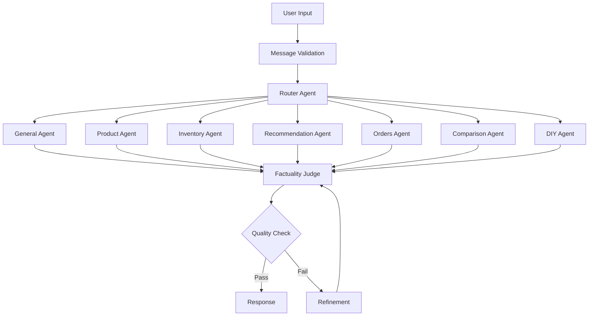

# Architecture Overview

The Retail AI system is built as a sophisticated agent-based architecture that routes queries to specialized agents based on the nature of the request. This approach enables domain-specific handling while maintaining a unified interface.

## 🏗️ Core Components

### Message Routing and Processing

- **Message Validation**: Validates incoming requests against required configuration parameters
- **Router Agent**: Analyzes user queries and routes them to the appropriate specialized agent
- **Factuality Check**: Ensures responses are factually accurate through iterative refinement

### Specialized Agents

The system includes seven specialized agents, each optimized for specific retail operations:

1. **General Agent**: Handles general inquiries about store policies and basic information
2. **Product Agent**: Provides detailed product specifications, availability, and compatibility
3. **Inventory Agent**: Offers real-time inventory checks and stock availability across locations
4. **Recommendation Agent**: Suggests products based on user preferences and purchase history
5. **Orders Agent**: Manages order status inquiries, tracking, and order history
6. **Comparison Agent**: Compares different products to help customers make informed decisions
7. **DIY Agent**: Offers project advice, tutorials, and step-by-step instructions for DIY projects

### Guardrails and Quality Control

- **Factuality Judge**: Evaluates responses for factual accuracy and triggers refinement when needed
- **Configuration Validation**: Ensures all required parameters are provided before processing
- **Retry Mechanism**: Implements intelligent retry logic when responses don't meet quality thresholds

## 🔧 Technical Implementation

The system is implemented using:

- **LangGraph**: For workflow orchestration and state management
- **LangChain**: For LLM interactions and chain composition
- **MLflow**: For model deployment and serving
- **Databricks LLM APIs**: As the foundation models for natural language processing

### Architecture Flow

The architecture follows a graph-based state machine pattern:

1. **User Input**: Messages enter through validation
2. **Routing**: Messages are routed by the router agent
3. **Processing**: Specialized agents process domain-specific requests
4. **Quality Check**: Responses undergo factuality checking
5. **Refinement**: If needed, responses are refined until they meet quality thresholds



## 🗂️ Project Structure

```
retail_ai/
├── agents.py          # Agent implementations
├── catalog.py         # Unity Catalog integration
├── graph.py           # LangGraph workflow definition
├── models.py          # MLflow model integration
├── nodes.py           # Agent node definitions
├── tools.py           # Tool definitions
└── vector_search.py   # Vector search utilities

notebooks/
├── 05_agent_as_code_driver.py    # Model logging & registration
├── 06_evaluate_agent.py          # Model evaluation
└── 07_deploy_agent.py            # Model deployment & permissions

streamlit_store_app/   # Store management interface
├── app.py            # Main Streamlit application
├── components/       # Reusable UI components
├── pages/           # Application pages
└── utils/           # Utility functions
```

## 🔄 Development Workflow

The development workflow is organized into focused notebooks:

1. **Data Setup**: `01_ingest-and-transform.py`, `02_provision-vector-search.py`
2. **Model Development**: `05_agent_as_code_driver.py` - Model development, logging, and registration
3. **Evaluation**: `06_evaluate_agent.py` - Formal MLflow evaluation and performance metrics
4. **Deployment**: `07_deploy_agent.py` - Model alias management, endpoint deployment, and permissions

## 🛠️ Technology Stack

### Core Technologies

- **Python 3.12+**: Primary development language
- **LangGraph**: Workflow orchestration and state management
- **LangChain**: LLM interactions and tool composition
- **MLflow**: Model lifecycle management and serving
- **Pydantic**: Data validation and serialization

### Databricks Platform

- **Unity Catalog**: Data governance and function management
- **Vector Search**: Semantic search capabilities
- **Model Serving**: LLM endpoint hosting
- **Genie**: Natural language to SQL conversion
- **SQL Warehouse**: Query execution engine

### Frontend & Interface

- **Streamlit**: Store management interface
- **REST APIs**: Model serving endpoints
- **WebSocket**: Real-time chat functionality

## 🔐 Security & Governance

### Data Security

- **Unity Catalog**: Centralized data governance
- **Row-level Security**: Fine-grained access control
- **Audit Logging**: Complete activity tracking
- **Encryption**: Data at rest and in transit

### Model Governance

- **MLflow Model Registry**: Version control and lineage
- **Model Validation**: Automated quality checks
- **A/B Testing**: Safe model deployment
- **Performance Monitoring**: Real-time metrics

## 📊 Monitoring & Observability

### Application Monitoring

- **MLflow Tracing**: End-to-end request tracking
- **Custom Metrics**: Business-specific KPIs
- **Error Tracking**: Comprehensive error logging
- **Performance Metrics**: Latency and throughput monitoring

### Data Quality

- **Data Validation**: Input/output schema validation
- **Drift Detection**: Model performance monitoring
- **Quality Metrics**: Accuracy and relevance scoring
- **Alerting**: Automated issue detection

This architecture provides a robust, scalable foundation for retail AI operations while maintaining flexibility for future enhancements and integrations. 