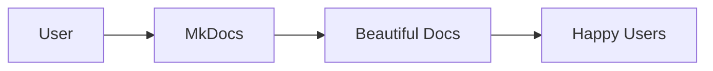

# MkDocs Quickstart Guide

This guide will get you up and running with the MkDocs documentation system for Retail AI in just a few minutes.

## What is MkDocs?

MkDocs is a fast, simple static site generator that builds beautiful documentation from Markdown files. Your Retail AI project uses MkDocs with the Material theme for a modern, professional documentation experience.

## 🚀 Quick Setup (2 minutes)

### Step 1: Install Dependencies

Choose one of these methods:

=== "Using Make (Recommended)"

    ```bash
    make docs-install
    ```

=== "Using pip directly"

    ```bash
    pip install -r requirements-docs.txt
    ```

=== "Using the setup script"

    ```bash
    ./scripts/setup-docs.sh
    ```

### Step 2: Start the Development Server

```bash
make docs-serve
```

Or directly:
```bash
mkdocs serve
```

### Step 3: Open Your Browser

Navigate to: **http://localhost:8000**

🎉 **That's it!** Your documentation is now running locally.

## 📝 Creating Your First Page

### 1. Create a New Markdown File

```bash
# Create a new guide
touch docs/guides/my-first-guide.md
```

### 2. Add Content

```markdown
# My First Guide

This is my first documentation page!

## Features

- Easy to write in Markdown
- Live preview with auto-reload
- Beautiful Material Design theme

## Code Examples

```python
def hello_world():
    print("Hello, MkDocs!")
```

## Next Steps

- [Tools Overview](../agents-and-tools/overview.md)
- [Quick Start](../getting-started/quick-start.md)
```

### 3. Add to Navigation

Edit `mkdocs.yml` and add your page to the navigation:

```yaml
nav:
  - Home: index.md
  - Getting Started:
    - Quick Start: getting-started/quick-start.md
    - MkDocs Guide: getting-started/mkdocs-quickstart.md
  - User Guides:
    - My First Guide: guides/my-first-guide.md  # Add this line
```

### 4. See Your Changes

The page will automatically appear in your browser at http://localhost:8000

## 🎨 Styling and Features

### Admonitions (Callout Boxes)

```markdown
!!! note "Pro Tip"
    This creates a blue info box

!!! warning "Important"
    This creates a yellow warning box

!!! danger "Critical"
    This creates a red danger box

!!! success "Great Job"
    This creates a green success box
```

Result:
!!! note "Pro Tip"
    This creates a blue info box

### Code Blocks with Syntax Highlighting

```markdown
```python title="example.py"
def find_product(sku: str) -> dict:
    """Find a product by SKU."""
    return {"sku": sku, "name": "Coffee Pods"}
```
```

### Tabbed Content

```markdown
=== "Python"

    ```python
    print("Hello from Python!")
    ```

=== "JavaScript"

    ```javascript
    console.log("Hello from JavaScript!");
    ```

=== "Bash"

    ```bash
    echo "Hello from Bash!"
    ```
```

Result:
=== "Python"

    ```python
    print("Hello from Python!")
    ```

=== "JavaScript"

    ```javascript
    console.log("Hello from JavaScript!");
    ```

=== "Bash"

    ```bash
    echo "Hello from Bash!"
    ```

### Mermaid Diagrams

```markdown

```

Result:


## 🔧 Essential Commands

### Development Commands

| Command | Purpose | When to Use |
|---------|---------|-------------|
| `make docs-serve` | Start development server | Writing documentation |
| `make docs-build` | Build static site | Testing before deploy |
| `make docs-deploy` | Deploy to GitHub Pages | Publishing changes |
| `make docs-clean` | Clean build files | Troubleshooting |

### Advanced Commands

```bash
# Build with strict mode (fails on warnings)
mkdocs build --strict

# Serve on different port
mkdocs serve --dev-addr=127.0.0.1:8001

# Build to custom directory
mkdocs build --site-dir custom-site

# Deploy with custom message
mkdocs gh-deploy --message "Updated documentation"
```

## 📁 File Organization

### Recommended Structure

```
docs/
├── index.md                    # Homepage
├── getting-started/            # Getting started guides
│   ├── quick-start.md
│   ├── installation.md
│   └── mkdocs-quickstart.md
├── tools/                      # Tool documentation
│   ├── overview.md
│   └── unity-catalog-functions.md
├── guides/                     # User guides
│   └── store-manager.md
├── development/                # Developer docs
│   └── setup.md
├── api/                        # API reference
│   └── functions.md
└── examples/                   # Examples and tutorials
    └── basic-usage.md
```

### File Naming Conventions

- Use lowercase with hyphens: `my-awesome-guide.md`
- Be descriptive: `unity-catalog-functions.md` not `uc-funcs.md`
- Group related files in directories
- Use `index.md` for directory landing pages

## 🔗 Linking Between Pages

### Relative Links

```markdown
# Link to another page
[Quick Start Guide](../getting-started/quick-start.md)

# Link to a section
[Unity Catalog Functions](../agents-and-tools/overview.md#unity-catalog-functions)

# Link to external site
[MkDocs Documentation](https://www.mkdocs.org/)
```

### Navigation Links

Links in the navigation are automatically generated from your `mkdocs.yml` configuration.

## 🎯 Best Practices

### Writing Tips

1. **Start with an outline** - Plan your page structure first
2. **Use headings hierarchically** - H1 → H2 → H3, don't skip levels
3. **Include code examples** - Show, don't just tell
4. **Add cross-references** - Link to related pages
5. **Keep paragraphs short** - Easier to read online

### Technical Tips

1. **Test your links** - Use `mkdocs build --strict` to catch broken links
2. **Optimize images** - Keep file sizes reasonable
3. **Use consistent formatting** - Follow the existing style
4. **Preview before committing** - Always check in the browser first

## 🚀 Publishing Your Documentation

### Automatic Deployment (Recommended)

Your project is set up with GitHub Actions for automatic deployment:

1. **Push to main branch**
2. **GitHub Actions builds and deploys automatically**
3. **Documentation is live at your GitHub Pages URL**

### Manual Deployment

```bash
# Deploy to GitHub Pages
make docs-deploy

# Or directly
mkdocs gh-deploy
```

## 🔍 Troubleshooting

### Common Issues

**Port already in use**
```bash
# Use a different port
mkdocs serve --dev-addr=127.0.0.1:8001
```

**Broken links warning**
```bash
# Find and fix broken links
mkdocs build --strict
```

**Changes not showing**
```bash
# Hard refresh browser (Ctrl+F5 or Cmd+Shift+R)
# Or clear browser cache
```

**Build fails**
```bash
# Check for syntax errors in mkdocs.yml
# Validate YAML syntax online
```

### Getting Help

1. **Check the MkDocs logs** in your terminal
2. **Validate your YAML** configuration
3. **Test with `mkdocs build --strict`**
4. **Check the [MkDocs documentation](https://www.mkdocs.org/)**

## 📚 Next Steps

Now that you know the basics:

1. **Explore the Material theme features**: [Material for MkDocs](https://squidfunk.github.io/mkdocs-material/)
2. **Add more content** to your documentation
3. **Customize the theme** in `mkdocs.yml`
4. **Set up automatic deployment** with GitHub Actions
5. **Share your documentation** with your team

## 🎉 You're Ready!

You now have everything you need to create beautiful documentation with MkDocs. Start writing, and remember:

- **Keep it simple** - Markdown is easy to learn
- **Focus on content** - The theme handles the styling
- **Iterate quickly** - Use the live preview to see changes instantly
- **Have fun** - Good documentation makes everyone's life easier!

Happy documenting! 📖✨ 