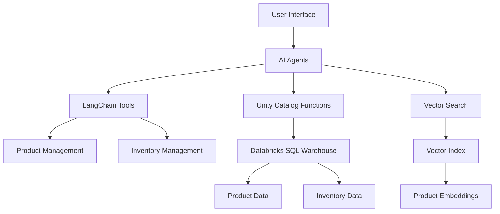

# Retail AI Documentation

Welcome to the Retail AI multi-agent system documentation. This system provides intelligent retail management capabilities through AI-powered agents, Unity Catalog functions, and vector search technologies.

## What is Retail AI?

Retail AI is a comprehensive multi-agent system designed for retail operations, featuring:

- **Product Management**: Intelligent product search, comparison, and recommendation
- **Inventory Management**: Real-time inventory tracking across stores and warehouses  
- **Customer Interaction**: Natural language interfaces for customer service
- **Data Integration**: Seamless integration with Databricks and Unity Catalog

## Key Features

### 🤖 AI-Powered Agents
Multi-agent system with specialized roles for different retail operations

### 🔍 Advanced Search
Vector-based semantic search for products and inventory

### 📊 Real-time Data
Live inventory and product data through Unity Catalog functions

### 🛠️ Extensible Tools
Modular tool architecture for easy customization and extension

### 🎯 Store-Specific Operations
Location-aware functionality for multi-store operations

## Quick Start

Get started with Retail AI in minutes:

```bash
# Clone the repository
git clone https://github.com/your-org/retail-ai.git
cd retail-ai

# Install dependencies
pip install -r requirements.txt

# Configure your environment
cp .env.example .env
# Edit .env with your Databricks credentials

# Run the setup
python 04_unity_catalog_tools.py
```

## Architecture Overview



## Use Cases

### Store Manager Assistant
Help store managers with inventory checks, product recommendations, and customer inquiries.

### Customer Service Agent
Provide intelligent customer support with product information and availability.

### Inventory Analyst
Analyze inventory levels, predict demand, and optimize stock management.

### Product Specialist
Compare products, analyze features, and provide detailed product information.

## Getting Help

- 📖 **Documentation**: Browse the comprehensive guides and API reference
- 🐛 **Issues**: Report bugs and request features on GitHub
- 💬 **Discussions**: Join the community discussions
- 📧 **Support**: Contact the development team

## Next Steps

- [Quick Start Guide](getting-started/quick-start.md) - Get up and running quickly
- [Architecture Overview](architecture/overview.md) - Understand the system design
- [Tools Reference](agents-and-tools/overview.md) - Explore available tools and functions
- [Developer Guide](development/setup.md) - Start contributing to the project 