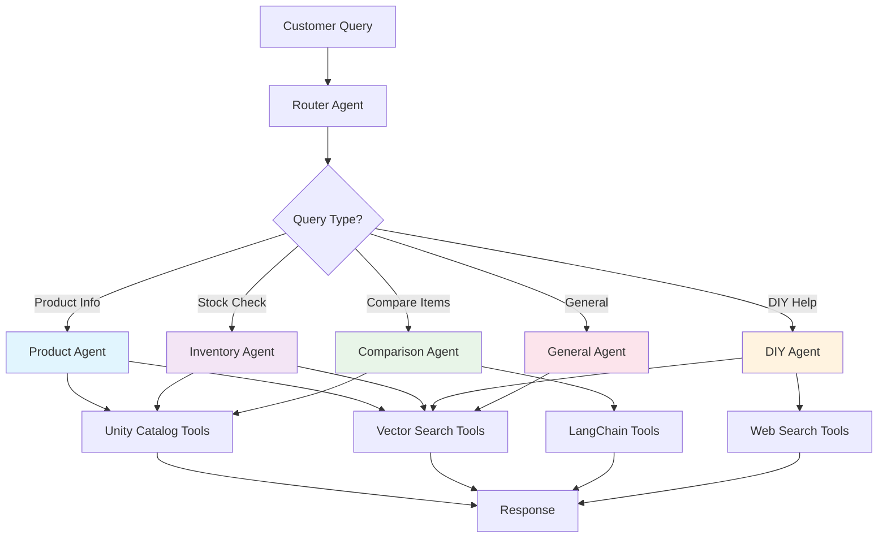

# Retail AI Agents & Tools Overview

The Retail AI system is built around specialized AI agents that orchestrate multiple tools to handle complex retail operations. This guide explains how to build and use these agents for retail customer assistance, inventory management, and product discovery.

## 🤖 What are Retail AI Agents?

Retail AI agents are autonomous, conversational AI systems that:
- **🧠 Reason and plan** multi-step workflows to solve customer problems
- **🔧 Use specialized tools** for data access, search, and analysis
- **💬 Maintain conversation context** across multiple interactions
- **🛡️ Apply business rules** and safety guardrails
- **🎯 Specialize in retail domains** like products, inventory, and customer service

### Agent Architecture



---

## 🎯 Implemented Agents

### 🛍️ Product Agent
**File:** `retail_ai/nodes.py` → `product_node()`

**Specialization:** Product discovery, details, and recommendations

**Capabilities:**
- Exact product lookup by SKU or UPC
- Semantic product search using natural language
- Product feature extraction and analysis
- Cross-selling and upselling recommendations

**Tools Configuration:**
```python
tools = [
    find_product_details_by_description_tool(
        endpoint_name=endpoint_name,
        index_name=index_name,
        columns=columns,
        k=num_results,
    ),
    create_find_product_by_sku_tool(warehouse_id=warehouse_id),
    create_find_product_by_upc_tool(warehouse_id=warehouse_id),
]
```

**Example Usage:**
```python
from retail_ai.nodes import product_node

# Create agent
product_agent = product_node(model_config)

# Execute
state = AgentState(
    messages=[HumanMessage(content="I'm looking for wireless headphones")],
    user_id="user123",
    store_num="101"
)
response = product_agent.invoke(state, config)
```

**Sample Interactions:**
```
👤 "Tell me about SKU STB-KCP-001"
🤖 "That's our Stanley 20oz Tumbler in Charcoal. It features double-wall vacuum insulation, keeps drinks cold for 11 hours or hot for 7 hours. Currently priced at $39.95 with high popularity rating."

👤 "I need wireless headphones under $200"
🤖 "I found several great options! The Sony WH-CH720N offers excellent noise cancellation for $149.99, while the JBL Tune 760NC provides 35-hour battery life for $179.99."
```

---

### 📦 Inventory Agent
**File:** `retail_ai/nodes.py` → `inventory_node()`

**Specialization:** Stock levels, availability, and inventory management

**Capabilities:**
- Real-time inventory checking across stores and warehouses
- Stock level monitoring and alerts
- Product availability by location
- Inventory movement tracking

**Tools Configuration:**
```python
tools = [
    find_product_details_by_description_tool(...),
    create_find_inventory_by_sku_tool(warehouse_id=warehouse_id),
    create_find_inventory_by_upc_tool(warehouse_id=warehouse_id),
    create_find_store_inventory_by_sku_tool(warehouse_id=warehouse_id),
    create_find_store_inventory_by_upc_tool(warehouse_id=warehouse_id),
]
```

**Sample Interactions:**
```
👤 "Do you have the Nintendo Switch OLED in stock at store 101?"
🤖 "Yes! Store 101 has 3 Nintendo Switch OLED units in stock. They're located in Electronics, aisle E-12. We also have 15 units available in our warehouse."

👤 "Which stores have the Milwaukee M18 drill in stock?"
🤖 "The Milwaukee M18 drill is available at: Store 101 (5 units), Store 105 (2 units), and Store 110 (8 units). Store 103 is currently out of stock but expecting delivery tomorrow."
```

---

### ⚖️ Comparison Agent
**File:** `retail_ai/nodes.py` → `comparison_node()`

**Specialization:** Product comparisons and recommendation analysis

**Capabilities:**
- Side-by-side product comparisons
- Feature analysis and scoring
- Pros and cons evaluation
- Personalized recommendations based on user needs

**Tools Configuration:**
```python
tools = [
    find_product_details_by_description_tool(...),
    create_find_product_by_sku_tool(warehouse_id=warehouse_id),
    create_find_product_by_upc_tool(warehouse_id=warehouse_id),
]
```

**Sample Interactions:**
```
👤 "Compare the DeWalt and Milwaukee cordless drills"
🤖 "Great question! Here's a detailed comparison:

**DeWalt 20V MAX (DCD771C2)**
✅ Pros: Lighter weight (3.6 lbs), longer warranty (3 years), $20 less expensive
❌ Cons: Lower torque (300 in-lbs), shorter battery life

**Milwaukee M18 (2804-20)**  
✅ Pros: Higher torque (725 in-lbs), better battery technology, more durable
❌ Cons: Heavier (4.2 lbs), higher price point

**Recommendation:** For heavy-duty work, choose Milwaukee. For general home use, DeWalt offers better value."
```

---

### 🔧 DIY Agent
**File:** `retail_ai/nodes.py` → `diy_node()`

**Specialization:** Project guidance, tutorials, and general assistance

**Capabilities:**
- Web search for external information
- General product discovery
- Open-ended customer assistance
- Fallback for queries outside other agent specializations

**Tools Configuration:**
```python
tools = [
    search_tool(model_config),
    find_product_details_by_description_tool(...),
]
```

**Sample Interactions:**
```
👤 "How do I install crown molding in my living room?"
🤖 "Here's a step-by-step guide for crown molding installation:

**Tools Needed:** Miter saw, nail gun, measuring tape, stud finder, caulk gun
**Materials:** Crown molding, finishing nails, wood filler, caulk

**Steps:**
1. Measure room perimeter and add 10% for waste
2. Cut inside corners at 45° angles using miter saw
3. Locate wall studs and mark positions
4. Install molding starting with longest wall
5. Use nail gun to secure into studs every 16 inches

Would you like product recommendations for any of these tools?"
```

---

### 🏪 General Agent
**File:** `retail_ai/nodes.py` → `general_node()`

**Specialization:** Store policies, hours, and general customer service

**Capabilities:**
- Store information and policies
- General customer service inquiries
- Fallback for unrouted queries
- Policy and procedure guidance

**Tools Configuration:**
```python
tools = [
    find_product_details_by_description_tool(...),
]
```

**Sample Interactions:**
```
👤 "What are your store hours and return policy?"
🤖 "Our store hours are Monday-Saturday 6AM-10PM, Sunday 8AM-8PM. 

**Return Policy:**
- 90 days for most items with receipt
- 365 days for major appliances
- Original packaging preferred but not required
- Special orders may have different terms

Is there a specific item you're looking to return or exchange?"
```

---

### 🎯 Recommendation Agent
**File:** `retail_ai/nodes.py` → `recommendation_node()`

**Specialization:** Product recommendations and suggestions

**Capabilities:**
- Personalized product recommendations
- Cross-selling and upselling
- Product discovery based on preferences
- Recommendation explanations

**Tools Configuration:**
```python
tools = [
    find_product_details_by_description_tool(...),
]
```

---

## 🔄 Agent Orchestration

### Router Agent
**File:** `retail_ai/nodes.py` → `router_node()`

The router agent intelligently directs user queries to the most appropriate specialized agent based on query analysis.

**Routing Logic:**
```yaml
# From model_config.yaml
allowed_routes:
  - product      # Product details, features, specifications
  - comparison   # Comparing multiple products
  - recommendation # Product suggestions and recommendations
  - inventory    # Stock levels and availability
  - diy         # How-to instructions and tutorials
  - orders      # Order tracking and delivery
  - general     # Store policies and general inquiries
```

**Example Routing:**
```python
def route_to_agent(query: str) -> str:
    query_lower = query.lower()
    
    if any(keyword in query_lower for keyword in ["product", "find", "search"]):
        return "product"
    elif any(keyword in query_lower for keyword in ["stock", "inventory", "available"]):
        return "inventory"
    elif any(keyword in query_lower for keyword in ["compare", "vs", "versus"]):
        return "comparison"
    # ... additional routing logic
```

---

## 🛠️ Tools for Building Agents

Agents use different types of tools depending on their needs. Here's how to choose and implement tools:

### ⚡ Unity Catalog Functions
> **High-performance SQL functions for exact data lookups**

**When to Use:** Known SKUs/UPCs, real-time inventory checks, exact product matches

**Example Implementation:**
```python
# Product agent using Unity Catalog tools
tools = [
    create_find_product_by_sku_tool(warehouse_id),
    create_find_product_by_upc_tool(warehouse_id),
]

agent = create_react_agent(
    model=llm,
    tools=tools,
    prompt="You are a product specialist..."
)
```

**Available Functions:**
- `find_product_by_sku(sku: list[str])` → Product details
- `find_product_by_upc(upc: list[str])` → Product details  
- `find_inventory_by_sku(sku: list[str])` → Global inventory
- `find_store_inventory_by_sku(store_id: int, sku: list[str])` → Store inventory

**Input/Output Example:**
```python
# Input
{"sku": ["STB-KCP-001"]}

# Output
{
  "product_id": 12345,
  "sku": "STB-KCP-001", 
  "product_name": "Stanley 20oz Tumbler",
  "brand_name": "Stanley",
  "base_price": 39.95,
  "department_name": "Kitchen & Dining"
}
```

---

### 🔍 Vector Search Tools
> **Semantic search for natural language queries**

**When to Use:** Natural language product discovery, "find similar" queries, content search

**Example Implementation:**
```python
# Agent with vector search capability
vector_tool = find_product_details_by_description_tool(
    endpoint_name="vs_endpoint",
    index_name="products_index", 
    columns=["product_name", "description", "category"],
    k=10
)

agent = create_react_agent(
    model=llm,
    tools=[vector_tool],
    prompt="You help customers find products..."
)
```

**Input/Output Example:**
```python
# Input
"wireless bluetooth headphones with noise cancellation"

# Output
[
  {
    "page_content": "Sony WH-CH720N Wireless Noise Canceling Headphones",
    "metadata": {
      "product_id": "67890",
      "price": 149.99,
      "score": 0.89
    }
  },
  {
    "page_content": "JBL Tune 760NC Wireless Over-Ear Headphones", 
    "metadata": {
      "product_id": "67891",
      "price": 179.99,
      "score": 0.85
    }
  }
]
```

---

### 🧠 LangChain Tools
> **AI-powered analysis and processing tools**

**When to Use:** Product comparison, text extraction, classification, complex analysis

**Example Implementation:**
```python
# Comparison agent with LangChain tools
comparison_tool = create_product_comparison_tool(llm)
sku_tool = create_sku_extraction_tool(llm)

agent = create_react_agent(
    model=llm,
    tools=[comparison_tool, sku_tool],
    prompt="You compare products and help customers decide..."
)
```

**Available Tools:**
- `product_comparison(products: list[dict])` → Detailed comparison analysis
- `sku_extraction(text: str)` → Extract SKUs from text
- `product_classification(description: str)` → Categorize products

**Input/Output Example:**
```python
# Product Comparison Input
[
  {"product_id": "A", "name": "DeWalt Drill", "price": 129.99, "torque": "300 in-lbs"},
  {"product_id": "B", "name": "Milwaukee Drill", "price": 149.99, "torque": "725 in-lbs"}
]

# Output
{
  "winner": "B",
  "comparison_summary": "Milwaukee offers superior torque for heavy-duty tasks...",
  "recommendations": [
    "Choose Milwaukee for professional use",
    "Choose DeWalt for home projects and budget-conscious buyers"
  ]
}
```

---

### 🌐 External Tools
> **Web search and external data sources**

**When to Use:** Real-time information, tutorials, general knowledge, trending topics

**Example Implementation:**
```python
# DIY agent with web search
search_tool = DuckDuckGoSearchRun()

agent = create_react_agent(
    model=llm,
    tools=[search_tool, vector_tool],
    prompt="You help with DIY projects and tutorials..."
)
```

---

## 🚀 Building Your Own Agent

### 1️⃣ Define Agent Purpose
```python
# Example: Customer Service Agent
def customer_service_node(model_config: ModelConfig):
    model = model_config.get("agents").get("customer_service").get("model").get("name")
    prompt = """You are a helpful customer service representative at BrickMart store {store_num}.
    Help customers with orders, returns, and general inquiries.
    Always be polite and provide accurate information."""
```

### 2️⃣ Select Appropriate Tools
```python
# Choose tools based on agent needs
tools = [
    # For order lookups
    create_uc_tools(["catalog.database.find_order_by_id"]),
    
    # For product questions
    find_product_details_by_description_tool(...),
    
    # For policy questions  
    create_vector_search_tool(
        name="policy_search",
        description="Search store policies and procedures",
        index_name="policies_index"
    )
]
```

### 3️⃣ Configure Agent
```python
@mlflow.trace()
def customer_service(state: AgentState, config: AgentConfig):
    llm = ChatDatabricks(model=model, temperature=0.1)
    
    system_prompt = prompt.format(
        store_num=state["store_num"]
    )
    
    agent = create_react_agent(
        model=llm,
        prompt=system_prompt,
        tools=tools
    )
    
    return agent
```

### 4️⃣ Add Guardrails
```python
# Add safety and quality checks
for guardrail_definition in guardrails:
    guardrail = reflection_guardrail(guardrail_definition)
    agent = with_guardrails(agent, guardrail)
```

---

## 🛠️ Agent Development Patterns

### Common Agent Structure
```python
def my_agent_node(model_config: ModelConfig) -> AgentCallable:
    # Extract configuration
    model = model_config.get("agents").get("my_agent").get("model").get("name")
    prompt = model_config.get("agents").get("my_agent").get("prompt")
    guardrails = model_config.get("agents").get("my_agent").get("guardrails") or []
    
    @mlflow.trace()
    def my_agent(state: AgentState, config: AgentConfig) -> dict[str, BaseMessage]:
        # Initialize LLM
        llm = ChatDatabricks(model=model, temperature=0.1)
        
        # Format prompt with context
        prompt_template = PromptTemplate.from_template(prompt)
        system_prompt = prompt_template.format(
            user_id=state["user_id"],
            store_num=state["store_num"]
        )
        
        # Configure tools
        tools = [
            # Add relevant tools for this agent
        ]
        
        # Create agent
        agent = create_react_agent(
            model=llm,
            prompt=system_prompt,
            tools=tools
        )
        
        # Apply guardrails
        for guardrail_definition in guardrails:
            guardrail = reflection_guardrail(guardrail_definition)
            agent = with_guardrails(agent, guardrail)
        
        return agent
    
    return my_agent
```

### Agent State Management
```python
class AgentState(MessagesState):
    context: Sequence[Document]  # Retrieved documents
    route: str                   # Current routing decision
    is_valid_config: bool       # Configuration validation
    user_id: str                # User identifier
    store_num: str              # Store context
```

### Guardrails Implementation
```python
def reflection_guardrail(guardrail_definition: dict):
    @mlflow.trace()
    def guardrail_check(state: AgentState) -> dict:
        last_message = state["messages"][-1]
        
        # Content safety check
        if guardrail_definition.get("content_safety"):
            safety_check = check_content_safety(last_message.content)
            if not safety_check.is_safe:
                return {"messages": [AIMessage(content="I apologize, but I cannot provide that information.")]}
        
        # Quality check
        if guardrail_definition.get("quality_check"):
            quality_score = assess_response_quality(last_message.content)
            if quality_score < 0.7:
                return {"messages": [AIMessage(content="Let me provide a better response...")]}
        
        return state
    
    return guardrail_check
```

---

## 📊 Agent Performance Comparison

| Agent Type | Response Time | Accuracy | Use Cases | Tools Used |
|------------|---------------|----------|-----------|------------|
| **Product** | ⚡⚡⚡⚡ | 95% | Product lookup, specs | UC Functions + Vector Search |
| **Inventory** | ⚡⚡⚡⚡⚡ | 98% | Stock checks, availability | UC Functions |
| **Comparison** | ⚡⚡⚡ | 92% | Product analysis | UC + LangChain + Vector |
| **DIY** | ⚡⚡ | 88% | Tutorials, guidance | Web Search + Vector |
| **General** | ⚡⚡⚡ | 90% | Policies, store info | Vector Search |

---

## 🎯 Best Practices for Agent Development

### 🔧 Tool Selection
1. **Start with Unity Catalog** for exact data lookups
2. **Add Vector Search** for semantic understanding  
3. **Include LangChain tools** for complex analysis
4. **Use Web Search** for real-time information

### 🧠 Prompt Engineering
1. **Be specific** about the agent's role and expertise
2. **Include context** like store number and user information
3. **Set clear boundaries** for what the agent should/shouldn't do
4. **Provide examples** of good responses

### 🛡️ Guardrails & Safety
1. **Content safety** - Block harmful or inappropriate content
2. **Business rules** - Enforce pricing, policy, and operational rules
3. **Quality control** - Ensure responses meet standards
4. **Fallback handling** - Graceful degradation when tools fail

### 📈 Monitoring & Optimization
1. **Track performance** - Response time, accuracy, user satisfaction
2. **Monitor tool usage** - Which tools are most/least effective
3. **Analyze conversations** - Common patterns and failure modes
4. **Iterate and improve** - Regular updates based on feedback

---

## 📚 Detailed Documentation

### Tool-Specific Guides
- [Tools Reference](tools-reference.md) - Comprehensive technical tool documentation
- [Unity Catalog Functions](unity-catalog-functions.md) - SQL-based data access
- [Vector Search Tools](vector-search.md) - Semantic search capabilities  
- [LangChain Tools](langchain-tools.md) - AI-powered analysis tools
- [AI Agent Implementation](ai-agents.md) - Advanced agent patterns

### Development Resources
- [Development Guide](../development/contributing.md) - Building custom agents and tools
- [Architecture Overview](../architecture/overview.md) - System design and patterns
- [Deployment Guide](../deployment/production.md) - Production deployment

---

## 🆘 Quick Troubleshooting

### Agent Not Responding
```python
# Check agent configuration
logger.info(f"Agent tools: {[tool.name for tool in agent.tools]}")
logger.info(f"Model: {model}")
```

### Tool Errors
```python
# Test individual tools
try:
    result = tool.invoke(test_input)
    logger.info(f"Tool working: {result}")
except Exception as e:
    logger.error(f"Tool failed: {e}")
```

### Performance Issues
```python
# Enable detailed tracing
@mlflow.trace(span_type="AGENT")
def my_agent(state, config):
    # Agent implementation
    pass
```

For comprehensive troubleshooting, see the [Development Guide](../development/contributing.md#troubleshooting). 