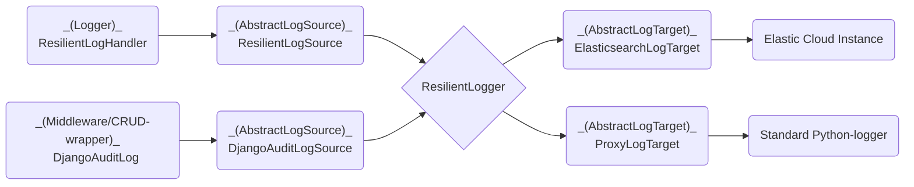

```mermaid
flowchart LR
A1("
  _(Logger)_
  ResilientLogHandler
") --> B1

A2("
  _(Middleware/CRUD-wrapper)_
  DjangoAuditLog
") --> B2

B1("
  _(AbstractLogSource)_
  ResilientLogSource
") --> C1

B2("
  _(AbstractLogSource)_
  DjangoAuditLogSource
") --> C1

C1{"
  ResilientLogger
"} --> D1

C1{"
  ResilientLogger
"} --> D2

D1("
  _(AbstractLogTarget)_
  ElasticsearchLogTarget
") --> E1(
  Elastic Cloud Instance
)

D2("
  _(AbstractLogTarget)_
  ProxyLogTarget
") --> E2(
  Standard Python-logger
)
```
