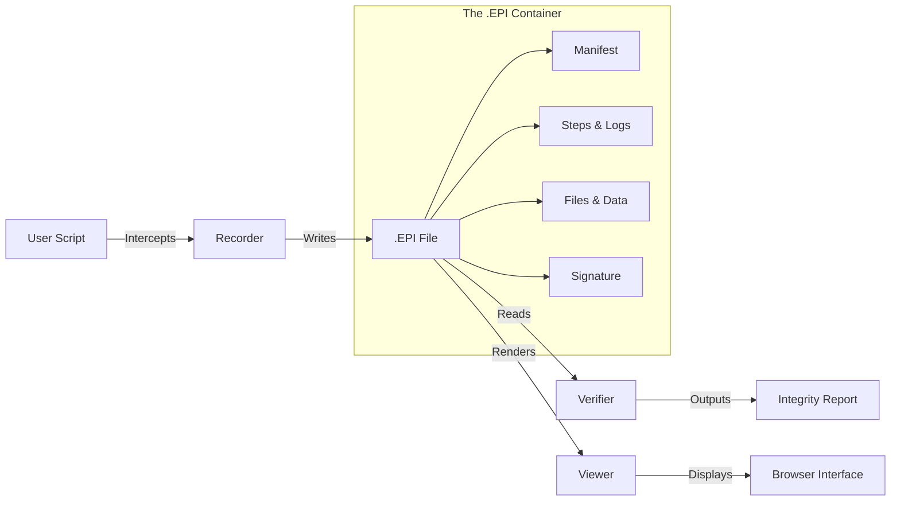

<div align="center">

# 📦 EPI
### Evidence Packaged Infrastructure

> **"Don't just log it. Sign it."**
> 
> *The Standard for Verifiable AI Evidence.*

[](LICENSE)
[](https://www.python.org/downloads/)
[](https://pypi.org/project/epi-recorder/)
[](https://colab.research.google.com/github/mohdibrahimaiml/EPI-V2.1.0/blob/main/colab_demo.ipynb)

<br/>

[🎥 **Watch the Demo**](https://colab.research.google.com/github/mohdibrahimaiml/EPI-V2.1.0/blob/main/colab_demo.ipynb)

> **See the Proof:** Watch how EPI transforms a standard Python script into an **immutable, cryptographically signed evidence package**.  
> *It's not just a recording. It's the "PDF" for AI Evidence.*

<br/>

[📚 **Read the Docs**](docs/CLI.md) &nbsp;•&nbsp; [🐛 **Report Bug**](https://github.com/mohdibrahimaiml/EPI-V2.1.0/issues)

</div>

---

## ⚡ The Problem: AI is a Black Box

When an AI Agent takes an action (spends money, signs a contract, or diagnoses a patient), **logs are not enough**.
Logs can be faked. Screenshots can be edited.

**If you can't prove it happened, it didn't happen.**

## 💎 The Solution: The "PDF" for Execution

**EPI** is a new file format (`.epi`) that acts as a **cryptographically signed receipt** for any AI workflow.
It captures the code, the data, the API calls, and the environment into a single, sealed evidence package.

| Feature | 📄 PDF (Document Standard) | 📦 EPI (Execution Standard) |
| :--- | :--- | :--- |
| **Purpose** | Visual Consistency | Computational Integrity |
| **Captures** | Text, Fonts, Images | Code, API Calls, OS State |
| **Trust** | "Looks Correct" | **"Cryptographically Proven"** |
| **Security** | ⚠️ Can run JS (Unsafe) | ✅ **Static HTML (Safe)** |
| **Analogy** | A digital photo | A flight recorder |

---

## 🚀 Quick Start (Zero Config)

### 1️⃣ Install
```bash
pip install epi-recorder
```

### 2️⃣ Record
Wrap any script. EPI intercepts shell commands, file I/O, and LLM calls (OpenAI, Anthropic, Ollama).
```bash
epi record --out evidence.epi -- python agent.py
```
*> Creates `evidence.epi` (a ZIP containing the code, logs, and signatures)*

### 3️⃣ View
Open the evidence in your browser. **Zero-install, works offline.**
```bash
epi view evidence.epi
```

---

## 🧩 Architecture



---

## 🔐 Security & Privacy

*   **Safe by Design**: The viewer is **100% static HTML/JSON**. It never executes the recorded code, making it safe to open files from untrusted sources.
*   **Privacy First**: API keys are automatically detected and **redacted** from logs.
*   **No Lock-In**: The format is open (ZIP + JSON). You can unzip it and audit the raw data anytime.

---

## 📚 Documentation

*   **[CLI Reference](docs/CLI.md)**: Master the `init`, `run`, `doctor`, and `keys` commands.
*   **[File Specification](docs/EPI-SPEC.md)**: Deep dive into the V2.1.0 format mechanics.

---

## 📄 License

**Apache 2.0** — Open for commercial and private use.

<div align="center">
  <br/>
  <b>Built for the future of the AI Economy.</b><br>
  <i>Turning opaque runs into verifiable proofs.</i>
</div>
