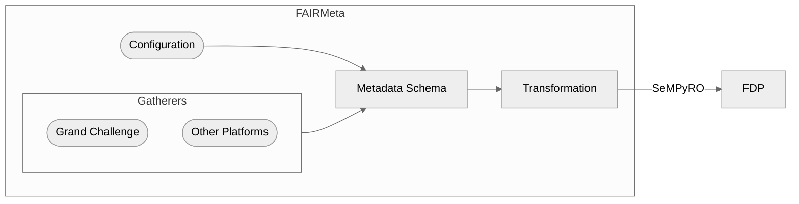

# FAIRMeta


**FAIRMeta** is a Python package that aims to automatically publish FAIR-compliant metadata to a FAIR Data Point (FDP) by combining static configuration files with harvested metadata from external platforms. This package was created as an internship project at Radboudumc, as a pilot, and therefore focuses on their FDP and metadata schema. The metadata schema they follow is created by [Health-RI](https://github.com/Health-RI/health-ri-metadata).

---

## Install
```shell
pip install fairmeta
```

---

## Architecture



Features gatherers which gather metadata from a platform which is combined with a configuration that contains the mapping from the platform to the metadata schema and static values. These are combined, transformed to Health-RI compliant metadata, and published to the FDP utilizing SeMPyRO which does additional validation and RDF transformation.

### Simple Demo
Using one line in the CLI where platform is a key from the config file:
```shell
fairmeta config.yaml platform -s identifier [--test] [-v]
```
Works for multiple datasets from a single platform:
```shell
fairmeta config.yaml platform -s identifier1 -s identifier2
```
Adding extra metadata can be done with extra yaml files. They are combined with the API data via a shared identifier:
```shell
fairmeta config.yaml platform -s identifier -c extra_data.yaml
```

Functions can of course be used in custom Python scripts. Many functions are ```@staticmethod``` because we did not use inheritance in the metadata schema, since properties differ between classes.
```python
# Gather metadata
from fairmeta.gatherers import GrandChallenge

GC_client = GrandChallenge()
slugs = ["identifier"]
GC_client.gather_data(slugs)

# Create metadata
from fairmeta.metadata_model import MetadataRecord

metadata_record = MetadataRecord.from_sources(config=config, 
    api_data=api_data,
)

# Validate & transform metadata
MetadataRecord.transform_values(metadata_record)
metadata_record.validate()

# Publish metadata to FDP
from fairmeta.uploader_radboudfdp import RadboudFDPClient

fdp_client = RadboudFDPClient()
catalog_name = "doesn't matter"
fdp_client.create_and_publish(
    metadata_record,
    catalog_name,
)
```

## Limitations
 - Not all properties in the Health-RI metadata schema are implemented.
 - Combining metadata from multiple platforms into a single dataset is not supported.
 - The metadata schema is defined manually, making it difficult to switch schemas or update the current one automatically.
 - Gathering metadata from Grand Challenge is iffy: since archives are not necessarily linked to challenges in a standard way. Currently the gatherer attempts to access the archive associated with a challenge via the same identifier in lowercase
 - The official [FAIR Data Point client](https://github.com/health-ri/fairclient) is not used due to compatability issues on the testing environment at the Radboudumc FDP. If this issue is resolved it would make sense to replace the RadboudFDPClient with the FAIR Data Point client.

 ## Development
Local testing requires setting up a [FAIR Data Point](https://docs.fairdatapoint.org/en/latest/about/about.html) locally.