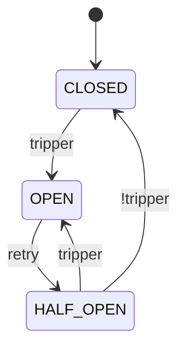

# Circuit Breaker

A Circuit Breaker is a mechanism that prevents a system from repeatedly trying to execute an operation that is likely to fail, which is essential for building resilient distributed systems.

## Core Concepts {#core-concepts}

It works just like an electrical circuit breaker in your home.

- When everything is normal, the circuit is **closed**, and calls flow through.
- If failures surpass a threshold, the circuit **opens**, and calls are blocked.
- After a timeout, the circuit enters a **half-open** state to test if the underlying service has recovered.

## State Transitions {#state-transitions}

A circuit breaker automatically transitions between three main states: `CLOSED`, `OPEN`, and `HALF_OPEN`. It also provides manual override states (`DISABLED`, `FORCED_OPEN`, `METRICS_ONLY`) for maintenance and testing.



### CLOSED: The Normal State {#state-closed}

This is the default operational state where all calls pass through to the protected service. The circuit breaker continuously monitors calls in the background.

- **Operation**: Allows all calls.
- **Monitoring**: Tracks successes and failures.
- **Transition**: Trips to `OPEN` if the failure threshold defined by the `tripper` is met.

```python
from fluxgate import CircuitBreaker

# Use defaults: trips at 50% failure rate after 100 calls, 60s cooldown
cb = CircuitBreaker("api")
```

### OPEN: The Failing State {#state-open}

When the failure threshold is exceeded, the circuit opens. In this state, it immediately rejects all calls without attempting to contact the service.

- **Operation**: Blocks all calls, raising a `CallNotPermittedError`.
- **Benefit**: Prevents an application from wasting resources on a failing service and gives the service time to recover.
- **Transition**: Moves to `HALF_OPEN` after the timeout defined by the `retry` strategy.

<!--pytest.mark.skip-->

```python
from fluxgate.errors import CallNotPermittedError

@cb
def call_api():
    return requests.get("https://api.example.com")

try:
    result = call_api()
except CallNotPermittedError as e:
    # The circuit is open, so execute fallback logic.
    print(f"Circuit is open: {e.message}")
    return {"fallback": "data"}
```

### HALF_OPEN: The Recovery State {#state-half-open}

After the retry timeout, the circuit moves to this state to test if the service has recovered.

- **Operation**: Allows a limited number of "probe" calls, as defined by the `permit` strategy.
- **Transition to CLOSED**: If the probe calls succeed, the circuit closes and returns to normal operation.
- **Transition to OPEN**: If the probe calls fail, the circuit re-opens to prevent further damage.

This gradual recovery approach prevents a "thundering herd" from overwhelming a service that is still fragile.

```python
from fluxgate import CircuitBreaker
from fluxgate.trippers import MinRequests, FailureRate
from fluxgate.permits import RampUp

cb = CircuitBreaker(
    name="api",
    # Use a stricter tripping condition during recovery testing.
    tripper=MinRequests(5) & FailureRate(0.3),
    # Start by allowing 10% of traffic, then ramp up to 80% over 60 seconds.
    permit=RampUp(initial=0.1, final=0.8, duration=60.0),
)
```

### METRICS_ONLY: Monitor Without Tripping {#state-metrics-only}

In this state, the circuit breaker tracks metrics but never trips open.

- **Operation**: Allows all calls to pass through, just like in the `CLOSED` state.
- **Use Case**: Safely gather metrics from a new service or during a load test before enabling active protection.

<!--pytest-codeblocks:cont-->

```python
# Collect metrics before enabling the breaker.
cb.metrics_only()

# When ready, activate the circuit breaker's normal lifecycle.
cb.reset()
```

### DISABLED: Bypass the Breaker {#state-disabled}

This state completely disables the circuit breaker.

- **Operation**: Allows all calls to pass through.
- **Monitoring**: Does not track any metrics.
- **Use Case**: Useful for debugging, running specific tests, or in emergency situations where you need to bypass the breaker entirely.

<!--pytest-codeblocks:cont-->

```python
# Disable the circuit breaker during an emergency.
cb.disable()

# Re-enable it later.
cb.reset()
```

### FORCED_OPEN: Manually Block Calls {#state-forced-open}

This state forces the circuit to be open and block all calls.

- **Operation**: Rejects all calls with `CallNotPermittedError`.
- **Recovery**: Does not automatically recover. It requires a manual `reset()` call.
- **Use Case**: Ideal for planned maintenance or for manually taking a service offline.

<!--pytest-codeblocks:cont-->

```python
# Force the circuit open during a planned deployment.
cb.force_open()

# After maintenance is complete, return to normal operation.
cb.reset()
```

## Usage {#usage}

You can apply a circuit breaker to your code in several ways.

### Decorator Style {#decorator-usage}

Using a decorator is the most common and convenient way to protect a function.

```python
from fluxgate import CircuitBreaker
from fluxgate.trackers import TypeOf

cb = CircuitBreaker(
    name="payment_api",
    tracker=TypeOf(ConnectionError, TimeoutError),  # Only track these errors
)

@cb
def charge_payment(amount: float):
    pass  # Your payment API call here
```

### Direct Call Style {#call-usage}

The `call` method is useful for protecting functions that you can't modify with a decorator, such as functions from a third-party library.

<!--pytest-codeblocks:cont-->

```python
def process_payment(amount: float):
    pass  # Your payment API call here

# Protect the function by wrapping it with .call()
result = cb.call(process_payment, amount=100.0)
```

### Async Support {#async-usage}

Fluxgate provides full support for modern `asyncio` applications via the `AsyncCircuitBreaker`.

!!! note
    To prevent a recovering service from being overwhelmed, `AsyncCircuitBreaker` limits the number of concurrent calls allowed in the `HALF_OPEN` state. This is controlled by the `max_half_open_calls` parameter (default is 10) and is managed internally by an `asyncio.Semaphore`.

```python
import asyncio
import httpx
from fluxgate import AsyncCircuitBreaker
from fluxgate.trackers import TypeOf

cb = AsyncCircuitBreaker(
    name="async_api",
    tracker=TypeOf(httpx.ConnectError),
    max_half_open_calls=5,  # Limit concurrent calls in HALF_OPEN to 5.
)

@cb
async def fetch_data():
    pass  # Your async HTTP call here

# Use await to call the async function
async def main():
    result = await fetch_data()

asyncio.run(main())
```

## Inspecting the Breaker's State {#info}

You can inspect the current state and metrics of a circuit breaker at any time using the `.info()` method.

<!--pytest-codeblocks:cont-->

```python
info = cb.info()
print(f"Circuit: {info.name}")
print(f"State: {info.state}")
print(f"Last state change: {info.changed_at}")
print(f"Reopens at: {info.reopens}")
print(f"Current metrics: {info.metrics}")

# Example output:
# Circuit: payment_api
# State: closed
# Last state change: 1234567890.123
# Reopens at: 0
# Current metrics: Metric(total_count=100, failure_count=5, total_duration=45.2, slow_count=3)
```

## Manual Control {#manual-control}

There may be times when you need to control the circuit breaker's state manually.

<!--pytest-codeblocks:skip-->

```python
# Reset to CLOSED state and clear all metrics.
cb.reset()

# Transition to METRICS_ONLY to monitor without tripping.
cb.metrics_only()

# Transition to DISABLED to bypass the breaker entirely.
cb.disable()

# Transition to FORCED_OPEN to manually block calls.
cb.force_open()

# You can also change state without notifying listeners.
cb.reset(notify=False)
```

## Error Handling and Fallbacks {#error-handling}

When a circuit is open, it raises a `CallNotPermittedError`. You can handle this by defining a fallback mechanism to provide an alternative response, such as returning cached data or a default value.

### Automatic Fallback with `fallback` (Recommended) {#fallback-parameter}

The easiest method is to provide a fallback function directly to the decorator. This function will be called automatically whenever an exception occurs.

<!--pytest.mark.skip-->

```python
# The fallback function receives the exception as an argument.
def handle_error(e: Exception) -> dict:
    if isinstance(e, CallNotPermittedError):
        return get_cached_data()  # Circuit is open
    if isinstance(e, TimeoutError):
        return get_stale_data()   # Operation timed out
    raise e  # Re-raise any other unexpected exceptions.

@cb(fallback=handle_error)
def api_call() -> dict:
    return requests.get("https://api.example.com").json()

# The fallback is invoked automatically on any exception.
result = api_call()
```

### Explicit Fallback with `call_with_fallback` {#call-with-fallback}

You can also specify a fallback explicitly for a single call.

<!--pytest.mark.skip-->

```python
result = cb.call_with_fallback(
    fetch_from_api,
    fallback_func=lambda e: get_cached_data(),
)
```

### Manual `try...except` Handling {#manual-try-except}

For the most control, you can use a standard `try...except` block.

<!--pytest.mark.skip-->

```python
from fluxgate.errors import CallNotPermittedError

@cb
def api_call():
    return requests.get("https://api.example.com")

try:
    result = api_call()
except CallNotPermittedError:
    # The circuit is open, so execute the fallback.
    result = get_cached_data()
except Exception as e:
    # The underlying service call failed.
    logging.error(f"API call failed: {e}")
    raise
```

## Complete Example {#complete-example}

Here is a complete example of a fully configured circuit breaker to protect a critical payment API.

<!--pytest.mark.skip-->

```python
import httpx
from fluxgate import CircuitBreaker
from fluxgate.trackers import Custom
from fluxgate.trippers import Closed, HalfOpened, MinRequests, FailureRate, SlowRate, FailureStreak
from fluxgate.retries import Backoff
from fluxgate.permits import RampUp
from fluxgate.listeners.log import LogListener
from fluxgate.listeners.prometheus import PrometheusListener

# Define a custom tracker to only count critical server-side errors as failures.
def is_retriable_error(e: Exception) -> bool:
    if isinstance(e, httpx.HTTPStatusError):
        return e.response.status_code >= 500  # 5xx errors are failures
    return isinstance(e, (httpx.ConnectError, httpx.TimeoutException))

payment_cb = CircuitBreaker(
    name="payment_api",
    tracker=Custom(is_retriable_error),
    tripper=(
        # Fast trip on 5 consecutive failures (protects during cold start).
        FailureStreak(5) |
        # Statistical trip based on failure/slow rates once enough data is collected.
        (MinRequests(20) & (
            (Closed() & (FailureRate(0.6) | SlowRate(0.3))) |
            (HalfOpened() & (FailureRate(0.5) | SlowRate(0.2)))
        ))
    ),
    retry=Backoff(
        initial=10.0,
        multiplier=2.0,
        max_duration=300.0,
        jitter_ratio=0.1  # Add jitter to prevent a thundering herd.
    ),
    permit=RampUp(
        initial=0.1,      # Start by allowing 10% of traffic.
        final=0.5,        # Gradually increase to 50%.
        duration=60.0     # Ramp up over 60 seconds.
    ),
    slow_threshold=3.0,  # Mark any call over 3 seconds as slow.
    listeners=[LogListener(), PrometheusListener()],
)

@payment_cb
def charge_payment(amount: float):
    response = httpx.post(
        "https://payment-api.example.com/charge",
        json={"amount": amount},
        timeout=5.0
    )
    response.raise_for_status()
    return response.json()

# Example usage with fallback logic
try:
    result = charge_payment(amount=100.0)
    print(f"Payment successful: {result}")
except CallNotPermittedError:
    print("Payment service is temporarily unavailable. Queuing payment for later.")
    # Fallback: Add the payment to a queue to be processed later.
    queue_payment(amount=100.0)
except httpx.HTTPStatusError as e:
    print(f"Payment failed with status {e.response.status_code}")
    raise
```

## Next Steps {#next-steps}

- [Components](components/index.md): Dive deeper into the components that make up a circuit breaker.
- [Examples](examples.md): See more real-world usage patterns and scenarios.
- [API Reference](api/core.md): Explore the complete API documentation.
