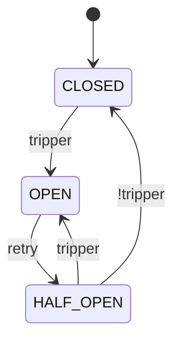

# Fluxgate

[](https://www.python.org/downloads/) [](https://github.com/byExist/fluxgate/blob/master/LICENSE)

동기 및 비동기 코드를 모두 완벽하게 지원하는 Python용 현대적이고 조합 가능한 Circuit Breaker 라이브러리입니다.

## 왜 Fluxgate인가?

Circuit breaker는 분산 시스템에서 서비스 상태를 모니터링하고 실패하는 서비스에 대한 호출을 일시적으로 차단하여 연쇄적인 실패를 방지합니다. Fluxgate는 다음 기능을 통해 이를 쉽게 만들어줍니다.

- **동기 & 비동기**: 동기 및 비동기 지원
- **조합 가능**: 간단하고 재사용 가능한 컴포넌트를 사용하여 복잡한 실패 감지 로직 구성
- **의존성 없음**: 코어 라이브러리는 외부 의존성이 없습니다.
- **완전한 타입 힌팅**: IDE 지원을 위한 완벽한 타입 힌트
- **모니터링 지원**: Prometheus, Slack 및 로깅을 통한 내장 모니터링

## 빠른 시작

### 설치

```bash
pip install fluxgate
```

### 기본 예제

```python
from fluxgate import CircuitBreaker

cb = CircuitBreaker("payment_api")

@cb
def call_payment_api(amount: float):
    pass  # 결제 API 호출
```

이게 전부입니다! Circuit breaker는 합리적인 기본값을 사용합니다.

- 실패율이 50%를 초과하면 트립 (최소 100회 호출 후)
- 복구 시도 전 60초 대기
- 복구 중 60초에 걸쳐 0%에서 100%까지 점진적으로 호출 허용

### 작동 방식

Circuit breaker는 서비스에 대한 호출을 허용할지 또는 차단할지 결정하는 상태 머신입니다. 다음 세 가지 주요 상태로 작동합니다.



- **CLOSED**: 기본 상태입니다. 모든 호출이 허용되며 `tracker`가 호출 결과를 모니터링합니다. `tripper` 조건으로 정의된 실패율이 임계값을 초과하면, 브레이커가 "트립"되어 `OPEN` 상태로 전환됩니다.
- **OPEN**: 이 상태에서 circuit breaker는 서비스에 대한 모든 호출을 차단하여 추가적인 실패를 방지합니다. 구성된 `retry` 로 일정 시간을 대기한 후 `HALF_OPEN` 상태로 전환됩니다.
- **HALF_OPEN**: 브레이커는 `permit`에 의해 제어되는 제한된 수의 호출을 허용하여 서비스가 복구되었는지 테스트합니다. 이 호출이 성공하면 브레이커는 `CLOSED` 상태로 돌아갑니다. 실패하면 다시 트립되어 `OPEN` 상태로 돌아갑니다.

## 핵심 컴포넌트

Fluxgate의 강점은 조합 가능한 컴포넌트에서 나옵니다. 컴포넌트들을 조합하여 필요에 맞는 정밀하고 유연한 실패 감지 로직을 만들 수 있습니다.

| 컴포넌트 | 목적 | 일반적인 구현 |
|---------|------|------------------------|
| **Windows** | 최근 호출 결과(성공/실패)를 수집하고 저장합니다. | `CountWindow(100)`: 최근 100개 호출을 저장합니다.<br/>`TimeWindow(60)`: 최근 60초 동안의 호출을 저장합니다. |
| **Trackers** | 호출 결과가 실패로 추적되어야 하는지 결정합니다. | `TypeOf(ConnectionError)`: 특정 예외 유형을 추적합니다.<br/>`Custom(func)`: 복잡한 로직을 위해 사용자 정의 함수를 사용합니다. |
| **Trippers** | `CLOSED` 상태에서 `OPEN` 상태로 회로를 트립시키는 조건을 정의합니다. | `FailureRate(0.5)`: 실패율이 50%를 초과하면 트립합니다.<br/>`AvgLatency(2.0)`: 평균 응답 시간이 2초를 초과하면 Open 합니다. |
| **Retries** | 회로가 `OPEN`에서 `HALF_OPEN`으로 전환되어야 하는 시점을 결정합니다. | `Cooldown(60.0)`: 60초 고정 쿨다운을 기다립니다.<br/>`Backoff(10.0)`: 10초부터 시작하여 지수 백오프 시간만큼 대기합니다. |
| **Permits** | `HALF_OPEN` 상태에서 허용되는 호출 수를 관리합니다. | `Random(0.5)`: 호출의 50%를 통과시킵니다.<br/>`RampUp(0.1, 0.8, 60)`: 60초 동안 허용 호출 비율을 점진적으로 증가시킵니다. |

## 비동기 지원

Asyncio 애플리케이션을 완벽하게 지원합니다.

```python
import asyncio
from fluxgate import AsyncCircuitBreaker

cb = AsyncCircuitBreaker("async_api")

@cb
async def call_async_api():
    pass  # 비동기 HTTP 호출

async def main():
    result = await call_async_api()

asyncio.run(main())
```

## 전체 예제

외부 결제 API를 위한 전체 구성 예제입니다.

<!--pytest.mark.skip-->

```python
import httpx
from fluxgate import CircuitBreaker
from fluxgate.windows import CountWindow
from fluxgate.trackers import Custom
from fluxgate.trippers import Closed, HalfOpened, MinRequests, FailureRate, FailureStreak
from fluxgate.retries import Backoff
from fluxgate.permits import RampUp
from fluxgate.listeners.log import LogListener
from fluxgate.listeners.prometheus import PrometheusListener

# 5xx 에러와 네트워크 실패만 추적
def is_retriable_error(e: Exception) -> bool:
    if isinstance(e, httpx.HTTPStatusError):
        return e.response.status_code >= 500
    return isinstance(e, (httpx.ConnectError, httpx.TimeoutException))

payment_cb = CircuitBreaker(
    name="payment_api",
    window=CountWindow(size=100),
    tracker=Custom(is_retriable_error),
    tripper=FailureStreak(5) | (MinRequests(20) & (
        (Closed() & FailureRate(0.6)) |
        (HalfOpened() & FailureRate(0.5))
    )),
    retry=Backoff(initial=10.0, multiplier=2.0, max_duration=300.0, jitter_ratio=0.1),
    permit=RampUp(initial=0.1, final=0.5, duration=60.0),
    listeners=[LogListener(), PrometheusListener()],
)

@payment_cb
def charge_payment(amount: float):
    response = httpx.post("https://payment-api.example.com/charge", json={"amount": amount})
    response.raise_for_status()
    return response.json()
```

## 다음 단계

- [컴포넌트](components/index.md) 알아보기 - Windows, Trackers, Trippers, Retries, Permits 심화 학습
- [예제](examples.md) 보기 - 실제 사용 패턴
- [API 레퍼런스](api/core.md) 읽기 - 완전한 API 문서
