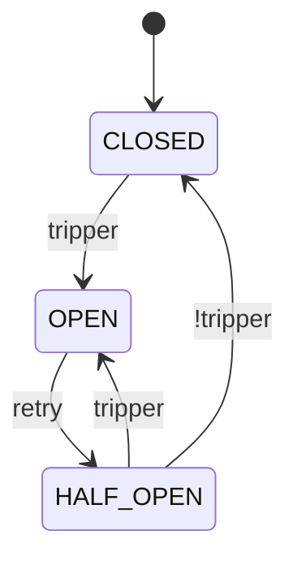

# Fluxgate

[](https://www.python.org/downloads/) [](https://github.com/byExist/fluxgate/blob/master/LICENSE)

A modern, composable circuit breaker library for Python with full support for both synchronous and asynchronous code.

## Why Fluxgate?

Circuit breakers prevent cascading failures in distributed systems by monitoring service health and temporarily blocking calls to failing services. Fluxgate makes this easy with:

- **Sync & Async**: First-class support for both synchronous and asynchronous code
- **Composable**: Build complex failure detection logic using simple, reusable components
- **Zero Dependencies**: Core library has no external dependencies
- **Fully Typed**: Complete type hints for better IDE support
- **Monitoring Ready**: Built-in monitoring with Prometheus, Slack, and logging

## Quick Start

### Installation

```bash
pip install fluxgate
```

### Basic Example

```python
from fluxgate import CircuitBreaker

cb = CircuitBreaker("payment_api")

@cb
def call_payment_api(amount: float):
    return requests.post("https://api.example.com/pay", json={"amount": amount})
```

That's it! The circuit breaker uses sensible defaults:

- Trips when failure rate exceeds 50% (after 100 calls minimum)
- Waits 60 seconds before attempting recovery
- Gradually increases allowed calls from 0% to 100% over 60 seconds during recovery

### How It Works

A circuit breaker is a state machine that determines whether to allow or block calls to a service. It operates in three main states:



- **CLOSED**: This is the default state. All calls are permitted and a `tracker` monitors their outcomes. If the failure rate exceeds a configured threshold (the `tripper` condition), the breaker "trips" and moves to the `OPEN` state.
- **OPEN**: In this state, the circuit breaker blocks all calls to the service, preventing further failures. After a configured `retry` timeout, it transitions to `HALF_OPEN`.
- **HALF_OPEN**: The breaker allows a limited number of "probe" calls (controlled by a `permit`) to test if the service has recovered. If these calls succeed, the breaker returns to `CLOSED`. If they fail, it trips again and returns to `OPEN`.

## Core Components

Fluxgate's power comes from its composable components. You can mix and match them to create precise and flexible failure detection logic tailored to your needs.

| Component | Purpose | Common Implementations |
|-----------|---------|------------------------|
| **Windows** | Collects and stores recent call outcomes (success/failure). | `CountWindow(100)`: Stores the last 100 calls.<br/>`TimeWindow(60)`: Stores calls from the last 60 seconds. |
| **Trackers** | Decides whether a call's outcome should be tracked as a failure. | `TypeOf(ConnectionError)`: Tracks specific exception types.<br/>`Custom(func)`: Use your own function for complex logic. |
| **Trippers** | Defines the condition for tripping the circuit from `CLOSED` to `OPEN`. | `FailureRate(0.5)`: Trips if failure rate exceeds 50%.<br/>`AvgLatency(2.0)`: Trips if average response time is over 2 seconds. |
| **Retries** | Determines when the circuit should transition from `OPEN` to `HALF_OPEN`. | `Cooldown(60.0)`: Waits for a fixed 60-second cooldown.<br/>`Backoff(10.0)`: Uses an exponential backoff strategy starting at 10 seconds. |
| **Permits** | Manages how many "probe" calls are allowed in the `HALF_OPEN` state. | `Random(0.5)`: Allows 50% of calls to pass through.<br/>`RampUp(0.1, 0.8, 60)`: Gradually increases the allowed call ratio over 60 seconds. |

## Async Support

Full support for asyncio applications:

```python
import asyncio
from fluxgate import AsyncCircuitBreaker

cb = AsyncCircuitBreaker("async_api")

@cb
async def call_async_api():
    pass  # Your async HTTP call here

async def main():
    result = await call_async_api()

asyncio.run(main())
```

## Complete Example

A fully configured circuit breaker for an external payment API:

<!--pytest.mark.skip-->

```python
import httpx
from fluxgate import CircuitBreaker
from fluxgate.windows import CountWindow
from fluxgate.trackers import Custom
from fluxgate.trippers import Closed, HalfOpened, MinRequests, FailureRate, FailureStreak
from fluxgate.retries import Backoff
from fluxgate.permits import RampUp
from fluxgate.listeners.log import LogListener
from fluxgate.listeners.prometheus import PrometheusListener

# Track only 5xx errors and network failures
def is_retriable_error(e: Exception) -> bool:
    if isinstance(e, httpx.HTTPStatusError):
        return e.response.status_code >= 500
    return isinstance(e, (httpx.ConnectError, httpx.TimeoutException))

payment_cb = CircuitBreaker(
    name="payment_api",
    window=CountWindow(size=100),
    tracker=Custom(is_retriable_error),
    tripper=FailureStreak(5) | (MinRequests(20) & (
        (Closed() & FailureRate(0.6)) |
        (HalfOpened() & FailureRate(0.5))
    )),
    retry=Backoff(initial=10.0, multiplier=2.0, max_duration=300.0, jitter_ratio=0.1),
    permit=RampUp(initial=0.1, final=0.5, duration=60.0),
    listeners=[LogListener(), PrometheusListener()],
)

@payment_cb
def charge_payment(amount: float):
    response = httpx.post("https://payment-api.example.com/charge", json={"amount": amount})
    response.raise_for_status()
    return response.json()
```

## Next Steps

- Learn about [Components](components/index.md) - Deep dive into windows, trackers, trippers, retries, and permits
- See [Examples](examples.md) - Real-world usage patterns
- Read [API Reference](api/core.md) - Complete API documentation
