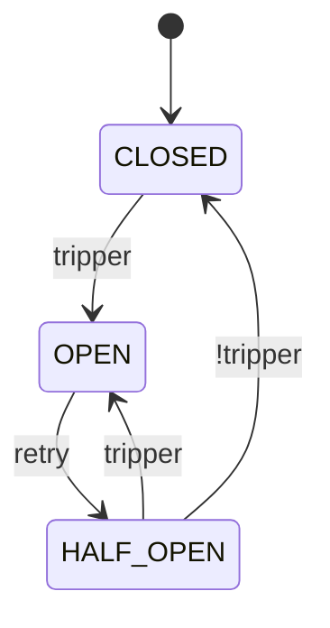

# Circuit Breaker

Circuit Breaker는 실패할 가능성이 있는 작업을 시스템이 반복적으로 실행하는 것을 방지하는 메커니즘으로, 회복력 있는 분산 시스템을 구축하는 데 필수적입니다.

## 핵심 개념 {#core-concepts}

회로 차단기와 유사한 방식으로 동작합니다.

- 모든 것이 정상일 때는 회로가 **Closed** 상태이며, 호출이 통과됩니다.
- 실패가 임계값을 초과하면 회로가 **Open**으로 전환되며, 호출이 차단됩니다.
- 타임아웃 후에 회로는 **Half Open** 상태로 진입하여 일정 호출을 통과시켜 테스트합니다.

## 상태 전환 {#state-transitions}

Circuit breaker는 `CLOSED`, `OPEN`, `HALF_OPEN`의 세 가지 주요 상태 사이를 자동으로 전환합니다. 또한 유지보수 및 테스트를 위해 수동 상태(`DISABLED`, `FORCED_OPEN`, `METRICS_ONLY`)를 제공합니다.



### CLOSED: 정상 상태 {#state-closed}

이것은 모든 호출이 보호된 서비스로 전달되는 기본 작동 상태입니다. Circuit breaker는 백그라운드에서 호출을 지속적으로 모니터링합니다.

- **작동**: 모든 호출을 허용합니다.
- **모니터링**: 성공 및 실패를 추적합니다.
- **전환**: `tripper`로 정의된 실패 임계값이 충족되면 `OPEN`으로 트립됩니다.

```python
from fluxgate import CircuitBreaker

# 기본값 사용: 100회 호출 후 50% 실패율에서 트립, 60초 쿨다운
cb = CircuitBreaker("api")
```

### OPEN: 실패 상태 {#state-open}

실패 임계값이 초과되면 회로가 열립니다. 이 상태에서는 서비스에 연락을 시도하지 않고 모든 호출을 즉시 거부합니다.

- **작동**: 모든 호출을 차단하고 `CallNotPermittedError`를 발생시킵니다.
- **Half Open으로 전환**: `retry`로 인해 `HALF_OPEN`으로 전환됩니다.

애플리케이션이 실패하는 서비스에 리소스를 낭비하는 것을 방지하고 서비스가 복구될 시간을 제공합니다.

<!--pytest.mark.skip-->

```python
from fluxgate.errors import CallNotPermittedError

@cb
def call_api():
    return requests.get("https://api.example.com")

try:
    result = call_api()
except CallNotPermittedError as e:
    # 회로가 열려 있으므로, 대체 로직을 실행합니다.
    print(f"Circuit is open: {e.message}")
    return {"fallback": "data"}
```

### HALF_OPEN: 복구 상태 {#state-half-open}

Retry로 일정 시간을 대기한 후 회로는 이 상태로 전환되어 서비스가 복구되었는지 테스트합니다.

- **작동**: `permit` 으로 정의된 제한된 수의 호출을 허용합니다.
- **CLOSED로 전환**: 호출이 성공하면 회로가 닫히고 정상 작동으로 돌아갑니다.
- **OPEN으로 전환**: 호출이 실패하면 회로는 다시 `OPEN` 상태로 전환됩니다.

이 점진적인 복구 접근 방식은 아직 불안정한 서비스에 "동시다발적인 요청"이 쇄도하는 것을 방지합니다.

```python
from fluxgate import CircuitBreaker
from fluxgate.trippers import MinRequests, FailureRate
from fluxgate.permits import RampUp

cb = CircuitBreaker(
    name="api",
    # 복구 테스트 중에는 더 엄격한 트립 조건을 사용합니다.
    tripper=MinRequests(5) & FailureRate(0.3),
    # 10%의 트래픽을 허용하는 것으로 시작하여 60초 동안 80%까지 점진적으로 증가시킵니다.
    permit=RampUp(initial=0.1, final=0.8, duration=60.0),
)
```

### METRICS_ONLY: 트립 없이 모니터링 {#state-metrics-only}

이 상태에서 circuit breaker는 Metric을 추적하지만 절대 트립되지 않습니다.

- **작동**: `CLOSED` 상태와 마찬가지로 모든 호출이 통과되도록 허용합니다.

활성 보호를 활성화하기 전에 새 서비스에서 또는 로드 테스트 중에 안전하게 Metric을 수집합니다.

<!--pytest-codeblocks:cont-->

```python
# 브레이커를 활성화하기 전에 Metric을 수집합니다.
cb.metrics_only()

# 준비가 되면 circuit breaker의 일반적인 수명 주기를 활성화합니다.
cb.reset()
```

### DISABLED: 브레이커 우회 {#state-disabled}

이 상태는 circuit breaker를 완전히 비활성화합니다.

- **작동**: 모든 호출이 통과되도록 허용합니다.
- **모니터링**: 어떠한 Metric도 추적하지 않습니다.

디버깅, 특정 테스트 실행 또는 브레이커를 완전히 우회해야 하는 긴급 상황에 유용합니다.

<!--pytest-codeblocks:cont-->

```python
# 긴급 상황 시 circuit breaker를 비활성화합니다.
cb.disable()

# 나중에 다시 활성화합니다.
cb.reset()
```

### FORCED_OPEN: 수동으로 호출 차단 {#state-forced-open}

이 상태는 회로를 강제로 열고 모든 호출을 차단합니다.

- **작동**: `CallNotPermittedError`와 함께 모든 호출을 거부합니다.
- **복구**: 자동으로 복구되지 않습니다. 수동 `reset()` 호출이 필요합니다.

계획된 유지보수 또는 서비스를 수동으로 오프라인으로 전환하는 데 사용합니다.

<!--pytest-codeblocks:cont-->

```python
# 계획된 배포 중에 회로를 강제로 엽니다.
cb.force_open()

# 유지보수 완료 후 정상 작동으로 돌아갑니다.
cb.reset()
```

## 사용 방법 {#usage}

코드에 circuit breaker를 여러 가지 방법으로 적용할 수 있습니다.

### 데코레이터 방식 {#decorator-usage}

데코레이터를 사용하는 것이 함수를 보호하는 가장 일반적이고 편리한 방법입니다.

```python
from fluxgate import CircuitBreaker
from fluxgate.trackers import TypeOf

cb = CircuitBreaker(
    name="payment_api",
    tracker=TypeOf(ConnectionError, TimeoutError),  # 이 에러만 추적
)

@cb
def charge_payment(amount: float):
    pass  # 결제 API 호출
```

### 직접 호출 방식 {#call-usage}

`call` 메서드는 데코레이터로 수정할 수 없는 함수(예: 서드파티 라이브러리의 함수)를 보호해야 할 때 유용합니다.

<!--pytest-codeblocks:cont-->

```python
def process_payment(amount: float):
    pass  # 결제 API 호출

# .call()로 함수를 감싸서 보호합니다.
result = cb.call(process_payment, amount=100.0)
```

### 비동기 지원 {#async-usage}

Fluxgate는 `AsyncCircuitBreaker`를 통해 최신 `asyncio` 애플리케이션을 완벽하게 지원합니다.

!!! note
    복구 중인 서비스에 과부하가 걸리는 것을 방지하기 위해 `AsyncCircuitBreaker`는 `HALF_OPEN` 상태에서 허용되는 동시 호출 수를 제한합니다. 이는 `max_half_open_calls` 매개변수(기본값은 10)에 의해 제어되며, 내부적으로 `asyncio.Semaphore`에 의해 관리됩니다.

```python
import asyncio
import httpx
from fluxgate import AsyncCircuitBreaker
from fluxgate.trackers import TypeOf

cb = AsyncCircuitBreaker(
    name="async_api",
    tracker=TypeOf(httpx.ConnectError),
    max_half_open_calls=5,  # HALF_OPEN 상태에서 동시 호출을 5개로 제한합니다.
)

@cb
async def fetch_data():
    pass  # 비동기 HTTP 호출

# await를 사용하여 비동기 함수를 호출합니다.
async def main():
    result = await fetch_data()

asyncio.run(main())
```

## 브레이커 상태 확인 {#info}

`.info()` 메서드를 사용하여 circuit breaker의 현재 상태와 Metric을 언제든지 확인할 수 있습니다.

<!--pytest-codeblocks:cont-->

```python
info = cb.info()
print(f"Circuit: {info.name}")
print(f"State: {info.state}")
print(f"Last state change: {info.changed_at}")
print(f"Reopens at: {info.reopens}")
print(f"Current metrics: {info.metrics}")

# 출력 예시
# Circuit: payment_api
# State: closed
# Last state change: 1234567890.123
# Reopens at: 0
# Current metrics: Metric(total_count=100, failure_count=5, total_duration=45.2, slow_count=3)
```

## 수동 제어 {#manual-control}

circuit breaker의 상태를 수동으로 제어해야 하는 경우가 있을 수 있습니다.

<!--pytest-codeblocks:skip-->

```python
# CLOSED 상태로 재설정하고 모든 Metric을 지웁니다.
cb.reset()

# 트립 없이 모니터링하기 위해 METRICS_ONLY로 전환합니다.
cb.metrics_only()

# 브레이커를 완전히 우회하기 위해 DISABLED로 전환합니다.
cb.disable()

# 호출을 수동으로 차단하기 위해 FORCED_OPEN으로 전환합니다.
cb.force_open()

# Listener에게 알림 없이 상태를 변경할 수도 있습니다.
cb.reset(notify=False)
```

## 오류 처리 및 Fallback {#error-handling}

회로가 열리면 `CallNotPermittedError`가 발생합니다. 캐시된 데이터 또는 기본값을 반환하는 것과 같은 대체 응답을 제공하기 위해 Fallback 메커니즘을 정의하여 이를 처리할 수 있습니다.

### `fallback`을 사용한 자동 Fallback {#fallback-parameter}

가장 쉬운 방법은 데코레이터에 직접 Fallback 함수를 제공하는 것입니다. 이 함수는 보호된 함수에서 **모든** 예외가 발생할 때마다 자동으로 호출됩니다. Fallback 함수는 예외 인스턴스를 받으므로 어떻게 처리할지 결정할 수 있습니다.

<!--pytest.mark.skip-->

```python
# Fallback 함수는 예외를 인수로 받습니다.
def handle_error(e: Exception) -> dict:
    if isinstance(e, CallNotPermittedError):
        return get_cached_data()  # 회로가 열림
    if isinstance(e, TimeoutError):
        return get_stale_data()   # 작업 시간 초과
    raise e  # 다른 예상치 못한 예외는 다시 발생시킵니다.

@cb(fallback=handle_error)
def api_call() -> dict:
    return requests.get("https://api.example.com").json()

# 예외 발생 시 Fallback이 자동으로 호출됩니다.
result = api_call()
```

### `call_with_fallback`을 사용한 명시적 Fallback {#call-with-fallback}

단일 호출에 대해 Fallback을 명시적으로 지정할 수도 있습니다.

<!--pytest.mark.skip-->

```python
result = cb.call_with_fallback(
    fetch_from_api,
    fallback_func=lambda e: get_cached_data(),
)
```

### 수동 `try...except` 처리 {#manual-try-except}

최대한의 제어를 위해 표준 `try...except` 블록을 사용할 수 있습니다.

<!--pytest.mark.skip-->

```python
from fluxgate.errors import CallNotPermittedError

@cb
def api_call():
    return requests.get("https://api.example.com")

try:
    result = api_call()
except CallNotPermittedError:
    # 회로가 열려 있으므로, Fallback을 실행합니다.
    result = get_cached_data()
except Exception as e:
    # 기본 서비스 호출이 실패했습니다.
    logging.error(f"API 호출 실패: {e}")
    raise
```

## 전체 예제 {#complete-example}

<!--pytest.mark.skip-->

```python
import httpx
from fluxgate import CircuitBreaker
from fluxgate.trackers import Custom
from fluxgate.trippers import Closed, HalfOpened, MinRequests, FailureRate, SlowRate, FailureStreak
from fluxgate.retries import Backoff
from fluxgate.permits import RampUp
from fluxgate.listeners.log import LogListener
from fluxgate.listeners.prometheus import PrometheusListener

# 중요한 서버 측 오류만 실패로 간주하도록 사용자 정의 Tracker를 정의합니다.
def is_retriable_error(e: Exception) -> bool:
    if isinstance(e, httpx.HTTPStatusError):
        return e.response.status_code >= 500  # 5xx 오류는 실패입니다.
    # 또한 네트워크 오류도 추적합니다.
    return isinstance(e, (httpx.ConnectError, httpx.TimeoutException))

payment_cb = CircuitBreaker(
    name="payment_api",
    tracker=Custom(is_retriable_error),
    tripper=(
        # 5회 연속 실패 시 빠른 트립 (콜드 스타트 보호).
        FailureStreak(5) |
        # 충분한 데이터가 수집되면 실패율/느린 호출율 기반 통계적 트립.
        (MinRequests(20) & (
            (Closed() & (FailureRate(0.6) | SlowRate(0.3))) |
            (HalfOpened() & (FailureRate(0.5) | SlowRate(0.2)))
        ))
    ),
    retry=Backoff(
        initial=10.0,
        multiplier=2.0,
        max_duration=300.0,
        jitter_ratio=0.1  # 동시다발적인 요청을 방지하기 위해 지터를 추가합니다.
    ),
    permit=RampUp(
        initial=0.1,      # 10% 트래픽 허용부터 시작합니다.
        final=0.5,        # 50%까지 점진적으로 증가시킵니다.
        duration=60.0     # 60초에 걸쳐 증가시킵니다.
    ),
    slow_threshold=3.0,  # 3초 이상의 모든 호출을 느린 호출로 표시합니다.
    listeners=[LogListener(), PrometheusListener()],
)

@payment_cb
def charge_payment(amount: float):
    response = httpx.post(
        "https://payment-api.example.com/charge",
        json={"amount": amount},
        timeout=5.0
    )
    response.raise_for_status()
    return response.json()

# Fallback 로직을 사용한 예제
try:
    result = charge_payment(amount=100.0)
    print(f"Payment successful: {result}")
except CallNotPermittedError:
    print("결제 서비스를 일시적으로 사용할 수 없습니다. 나중에 처리하기 위해 결제를 큐에 추가합니다.")
    # Fallback: 나중에 처리할 결제를 큐에 추가합니다.
    queue_payment(amount=100.0)
except httpx.HTTPStatusError as e:
    print(f"결제 실패: 상태 코드 {e.response.status_code}")
    raise
```

## 다음 단계 {#next-steps}

- [컴포넌트](components/index.md): circuit breaker를 구성하는 컴포넌트에 대해 자세히 알아보세요.
- [예제](examples.md): 더 많은 실제 사용 패턴과 시나리오를 확인하세요.
- [API 레퍼런스](api/core.md): 전체 API 문서를 살펴보세요.
