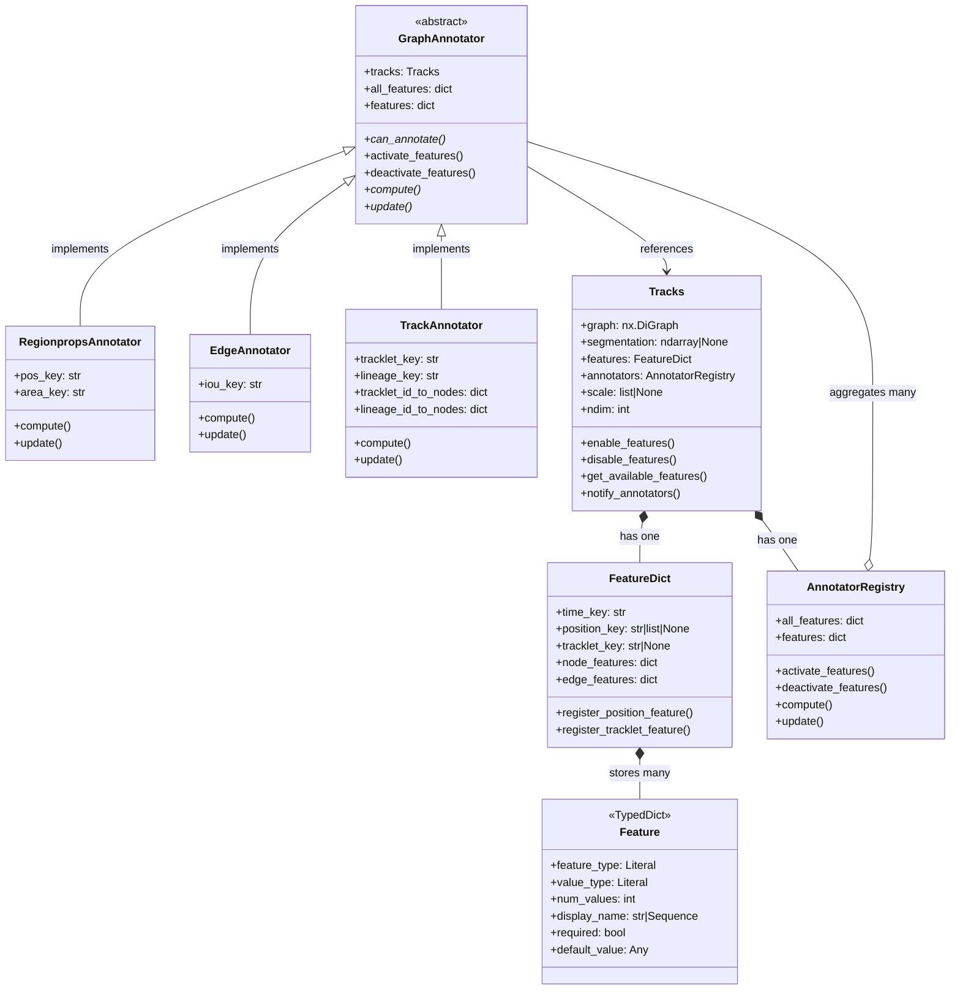

# Features

Funtracks has a **feature computation system** that manages attributes (features) from tracking graphs with optional segmentation data. The architecture separates:

1. **Feature metadata** (what features exist and their properties) - `Feature` class
2. **Feature computation** (how to calculate feature values) - `GraphAnnotator` class
3. **Feature storage** (where feature values live on the graph) - attributes on the graph nodes/edges
4. **Feature lifecycle** (when to compute, activate, or update features) - computation called by `Tracks`, updates triggered by `BasicActions`

## Core Components

### 1. Feature (TypedDict)

A `Feature` is a TypedDict that stores **metadata** about a graph feature.

??? "Show API documentation"

    ::: funtracks.features.Feature
        options:
          heading_level: 4
          show_root_heading: false
          show_source: false

### 2. FeatureDict

A `FeatureDict` is a dictionary (`dict[str, Feature]`) with special tracking for important feature keys:

??? "Show API documentation"

    ::: funtracks.features.FeatureDict
        options:
          heading_level: 4
          show_root_heading: false
          show_source: false

### 3. GraphAnnotator (Base Class)

An abstract base class for components that compute and update features on a graph.

??? "Show API documentation"

    ::: funtracks.annotators.GraphAnnotator
        options:
          heading_level: 4
          show_root_heading: false
          show_source: false

### 4. GraphAnnotator Implementations

| Annotator | Purpose | Requirements | Features Computed | API Reference |
|-----------|---------|--------------|-------------------|---------------|
| **RegionpropsAnnotator** | Extracts node features from segmentation using scikit-image's `regionprops` | `segmentation` must not be `None` | `pos`, `area`, `ellipse_axis_radii`, `circularity`, `perimeter` | [📚 API](../reference/funtracks/annotators/#funtracks.annotators.RegionpropsAnnotator) |
| **EdgeAnnotator** | Computes edge features based on segmentation overlap between consecutive time frames | `segmentation` must not be `None` | `iou` (Intersection over Union) | [📚 API](../reference/funtracks/annotators/#funtracks.annotators.EdgeAnnotator) |
| **TrackAnnotator** | Computes tracklet and lineage IDs for SolutionTracks | Must be used with `SolutionTracks` (binary tree structure) | `tracklet_id`, `lineage_id` | [📚 API](../reference/funtracks/annotators/#funtracks.annotators.TrackAnnotator) |

### 5. AnnotatorRegistry

A registry that manages multiple `GraphAnnotator` instances with a unified interface. Extends `list[GraphAnnotator]`.

??? "Show API documentation"

    ::: funtracks.annotators.AnnotatorRegistry
        options:
          heading_level: 4
          show_root_heading: false
          show_source: false

### 6. Tracks

The main class representing a set of tracks: a graph + optional segmentation + features.

??? "Show API documentation"

    ::: funtracks.data_model.Tracks
        options:
          heading_level: 4
          show_root_heading: false
          show_source: false

## Architecture Diagrams

### Class Diagram



## Initialization Lifecycle

Here's what happens when you create a `Tracks` instance.

```python
tracks = Tracks(graph, segmentation, ndim=3)
```

1. Basic Attribute Setup - save graph, segmentation, scale, etc. as instance variables
2. FeatureDict Creation - If features parameter is provided, use the provided FeatureDict
and assume all features already exist on the graph. If features=None, create a
FeatureDict with static features (time) and provided keys.
3. AnnotatorRegistry Creation - build an `AnnotatorRegistry` containing any Annotators that
work on the provided tracks
4. Core Computed Features Setup - If features parameter provided, activate all computed
features with keys in the features dictionary, so that updates will be computed.
**Does not compute** any features from scratch. Otherwise, try to detect which core
features are already present, activate those, and compute any missing ones from scratch.

### Core Features

These features are **automatically checked** during initialization:

1. **`pos` (position)**: Always auto-detected for RegionpropsAnnotator
2. **`area`**: Always auto-detected (for backward compatibility)
3. **`track_id` (tracklet_id)**: Always auto-detected for TrackAnnotator

### Example Scenarios

**Scenario 1: Loading tracks from CSV with pre-computed features**
```python
# CSV has columns: id, time, y, x, area, track_id
graph = load_graph_from_csv(df)  # Nodes already have area, track_id
tracks = SolutionTracks(graph, segmentation=seg)
# Auto-detection: pos, area, track_id exist → activate without recomputing
```

**Scenario 2: Creating tracks from raw segmentation**
```python
# Graph has no features yet
graph = nx.DiGraph()
graph.add_node(1, time=0)
tracks = Tracks(graph, segmentation=seg)
# Auto-detection: pos, area don't exist → compute them
```

**Scenario 3: Explicit feature control with FeatureDict**
```python
# Bypass auto-detection entirely
feature_dict = FeatureDict({"t": Time(), "pos": Position(), "area": Area()})
tracks = Tracks(graph, segmentation=seg, features=feature_dict)
# All features in feature_dict are activated, none are computed
```

**Scenario 4: Enable a new feature**

```python
tracks = Tracks(graph, segmentation)
# Initially has: time, pos, area (auto-detected or computed)

tracks.enable_features(["iou", "circularity"])
# Now has: time, pos, area, iou, circularity

# Check active features
print(tracks.features.keys())  # All features in FeatureDict (including static)
print(tracks.annotators.features.keys())  # Only active computed features
```

**Scenario 4: Disable a feature**

```python
tracks.disable_features(["area"])
# Removes from FeatureDict, deactivates in annotators
# Note: Doesn't delete values from graph, just stops computing/updating
```

## Extending the System
### Creating a New Annotator

1. **Subclass GraphAnnotator:**

    ```python
    from funtracks.annotators import GraphAnnotator

    class MyCustomAnnotator(GraphAnnotator):
        @classmethod
        def can_annotate(cls, tracks):
            # Check if this annotator can handle these tracks
            return tracks.some_condition

        def __init__(self, tracks, custom_key="custom"):
            super().__init__(tracks)
            self.custom_key = custom_key

            # Register features
            self.all_features[custom_key] = (CustomFeature(), False)

        def compute(self, feature_keys=None):
            # Compute feature values in bulk
            if "custom" in self.features:
                for node in self.tracks.graph.nodes():
                    value = self._compute_custom(node)
                    self.tracks.graph.nodes[node]["custom"] = value

        def update(self, action):
            # Incremental update when graph changes
            if "custom" in self.features:
                if isinstance(action, SomeActionType):
                    # Recompute only for affected nodes
                    pass
    ```

2. **Register in Tracks._get_annotators():**
    ```python
    if MyCustomAnnotator.can_annotate(tracks):
        ann = MyCustomAnnotator(tracks)
        tracks.annotators.append(ann)
        tracks.enable_features([key for key in ann.all_features()])
    ```
