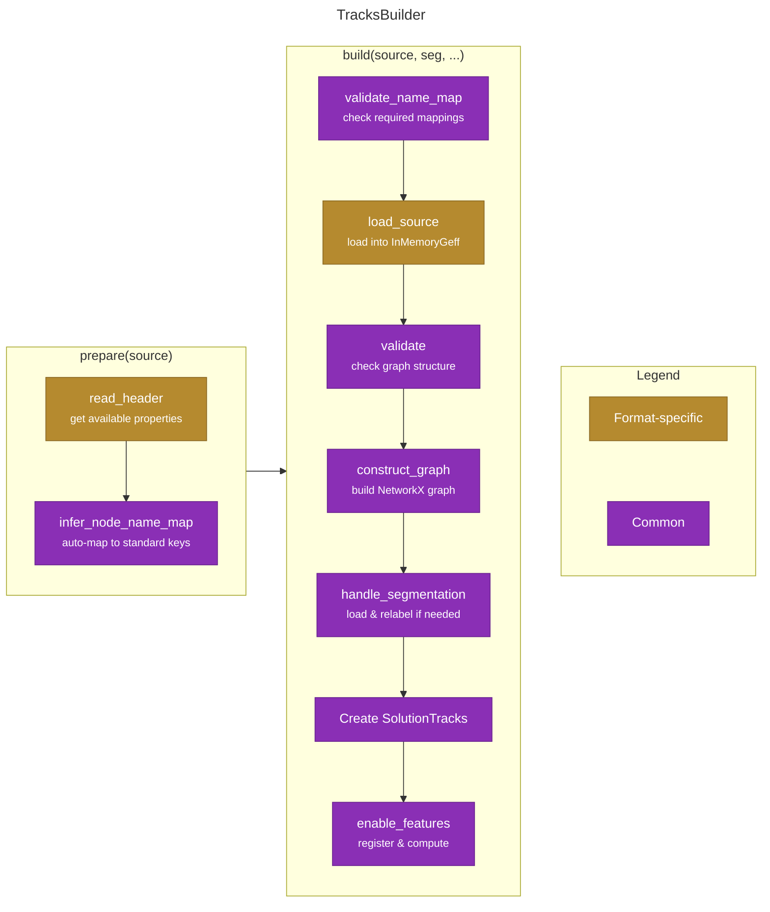

# Importing Tracks

This document describes the code architecture for importing tracking data from various formats into `funtracks` using the Builder Pattern.

## TracksBuilder Overview

The builder pattern provides a unified interface for importing tracks from different formats while sharing common validation and construction logic.



## Process Steps

### Preparation Phase

#### `read_header(source_path)` <span class="badge badge-gold">Format-specific</span>

??? "Show API documentation"

    ::: funtracks.import_export._tracks_builder.TracksBuilder.read_header
        options:
          heading_level: 5
          show_root_heading: false

#### `infer_node_name_map()` <span class="badge badge-purple">Common</span>

??? "Show API documentation"

    ::: funtracks.import_export._tracks_builder.TracksBuilder.infer_node_name_map
        options:
          heading_level: 5
          show_root_heading: false

#### `prepare(source_path)` <span class="badge badge-purple">Common</span>

??? "Show API documentation"

    ::: funtracks.import_export._tracks_builder.TracksBuilder.prepare
        options:
          heading_level: 5
          show_root_heading: false

### Build Phase

#### `validate_name_map()` <span class="badge badge-purple">Common</span>

??? "Show API documentation"

    ::: funtracks.import_export._tracks_builder.TracksBuilder.validate_name_map
        options:
          heading_level: 5
          show_root_heading: false

#### `load_source(source_path, name_map, node_features)` <span class="badge badge-gold">Format-specific</span>

Loads data from source file and converts to InMemoryGeff format. Implemented differently for each format.

??? "Show API documentation"

    ::: funtracks.import_export._tracks_builder.TracksBuilder.load_source
        options:
          heading_level: 5
          show_root_heading: false

#### `validate()` <span class="badge badge-purple">Common</span>

??? "Show API documentation"

    ::: funtracks.import_export._tracks_builder.TracksBuilder.validate
        options:
          heading_level: 5
          show_root_heading: false

#### `construct_graph()` <span class="badge badge-purple">Common</span>

??? "Show API documentation"

    ::: funtracks.import_export._tracks_builder.TracksBuilder.construct_graph
        options:
          heading_level: 5
          show_root_heading: false

#### `handle_segmentation(segmentation_path, scale)` <span class="badge badge-purple">Common</span>

??? "Show API documentation"

    ::: funtracks.import_export._tracks_builder.TracksBuilder.handle_segmentation
        options:
          heading_level: 5
          show_root_heading: false

#### `enable_features(tracks, node_features)` <span class="badge badge-purple">Common</span>

??? "Show API documentation"

    ::: funtracks.import_export._tracks_builder.TracksBuilder.enable_features
        options:
          heading_level: 5
          show_root_heading: false

#### `build(source, segmentation, ...)` <span class="badge badge-purple">Common</span>

??? "Show API documentation"

    ::: funtracks.import_export._tracks_builder.TracksBuilder.build
        options:
          heading_level: 5
          show_root_heading: false

## Format-Specific Builders

| Builder | Required Properties | Edge Properties | API Reference |
|---------|-------------------|-----------------|---------------|
| **CSVTracksBuilder** | `time`, `id`, `parent_id`, `[z]`, `y`, `x` | No | [API](../reference/funtracks/import_export/csv/#funtracks.import_export.csv.CSVTracksBuilder) |
| **GeffTracksBuilder** | `time`, `[z]`, `y`, `x` | Yes | [API](../reference/funtracks/import_export/geff/#funtracks.import_export.geff.GeffTracksBuilder) |

## Usage: Wrapper Functions vs Builder Pattern

Most users should use the **wrapper functions** which provide a simpler API:

### Recommended: Using Wrapper Functions

**GEFF Import** (auto-infers name_map):
```python
from funtracks.import_export import import_from_geff

tracks = import_from_geff(
    directory=Path("data.zarr"),
    name_map=None,  # Auto-infer column mappings
    segmentation_path=Path("seg.tif"),
    scale=[1.0, 1.0, 1.0],
    node_features={"area": True}
)
```

**CSV/DataFrame Import**:
```python
import pandas as pd
from funtracks.import_export import tracks_from_df

# Read CSV into DataFrame
df = pd.read_csv("tracks.csv")

# Load segmentation array
seg = ... # Load your segmentation array (e.g., from tiff, zarr)

# Import tracks
tracks = tracks_from_df(
    df=df,
    segmentation=seg,  # Pre-loaded segmentation array
    scale=[1.0, 1.0, 1.0],
    features={"Area": "area"}  # Load area from 'area' column
)
```

### Advanced: Using Builder Pattern Directly

For advanced use cases where you need to inspect/modify the inferred name_map:

**GEFF Builder**:
```python
from funtracks.import_export.geff._import import GeffTracksBuilder

builder = GeffTracksBuilder()
builder.prepare(Path("data.zarr"))  # Auto-infer name_map

# Inspect and optionally modify inferred mappings
print(builder.name_map)
builder.name_map["circularity"] = "circ"  # Override a mapping

tracks = builder.build(
    source_path=Path("data.zarr"),
    segmentation_path=Path("seg.tif"),
    scale=[1.0, 1.0, 1.0],
    node_features={"area": True}
)
```

**CSV Builder**:
```python
from funtracks.import_export.csv._import import CSVTracksBuilder

builder = CSVTracksBuilder()
builder.prepare("data.csv")  # Auto-infer name_map

# Inspect and modify
print(builder.name_map)
builder.name_map["time"] = "frame_number"

tracks = builder.build(
    source_path="data.csv",
    segmentation_path="seg.tif"
)
```
