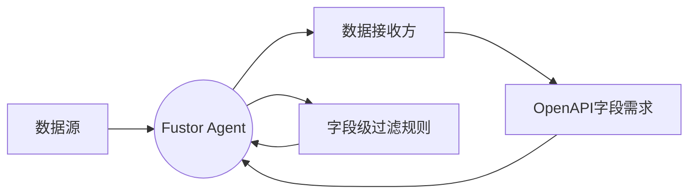
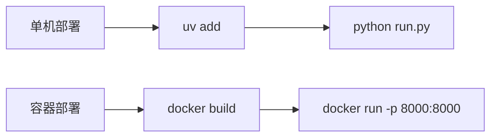

# Fustor Agent 服务

Fustor Agent 是一款轻量、可扩展、无侵入的实时数据供给工具 。它能够监听数据源（如MySQL）的实时变更，并根据需求方的OpenAPI schema，将数据精确、可控地推送到指定端点，旨在解决“数据孤岛”场景下的可控数据供给问题 。

## 一、 应用场景

### 数据孤岛场景下的可控数据供给

在复杂的IT环境中，核心数据通常存储在内部数据库中，而外部或非核心应用需要实时访问这些数据的部分字段。直接暴露数据库访问权限存在严重的安全风险，而传统的API开发模式又面临着开发周期长、需求变更响应慢的问题。Fustor Agent 正是为解决这一矛盾而生。

**可控性保障** ：

1.  所有组件部署在数据源一侧 。
2.  无需暴露原始数据库凭证 。
3.  通过字段级过滤精确控制供给范围 。
4.  提供一键启停功能实现即时切断 。

**实时性保证** ：

1.  低延迟实时监听数据源数据变更事件（如基于数据库binlog的变更监听） 。
2.  事件驱动的即时数据推送 。

## 二、 核心特点

1.  **轻量**：不依赖大型的第三方软件平台（如kafka、spark、elk等），可以尽量减少对用户数据服务器资源的占用 。
2.  **低代码**：数据接收方向用户提供一个需求schema（如openapi.json），本程序自动从中提取数据字段需求 。
3.  **无侵入**：用户无需修改业务逻辑，只需通过web ui 配置本地数据源字段和需求字段的映射关系 。
4.  **可扩展**：用户可以自行实现数据源驱动对接自己的数据源（如redis），可以自行实现接收方驱动对接自己的数据接收方的接口格式（如kafka消息） 。

## 三、 核心机制与高级功能

除了上述基本特点，Fustor Agent 在内核设计上包含多项先进机制，为数据供给的稳定性和性能提供了有力保障 。

### 稳健性与可靠性

  * **消息优先与恢复**：应用采用"消息优先，消费者驱动快照"模型。启动时，直接进入**消息同步**阶段以获取最低延迟的实时数据变化。当发生点位丢失或远端消费者需要补充历史数据时，由远端消费者触发**快照同步**作为补充机制。这种设计确保了实时数据的最小延迟，同时通过消费者驱动的快照机制来处理历史数据同步需求。
  * **内置背压处理**：当数据推送速度跟不上数据生产速度时，事件总线会自动阻塞生产者，防止因缓冲区溢出导致的数据丢失，确保数据流的完整性。

### 高性能与弹性

  * **极低的实时延迟**: 在消息同步阶段，系统采用事件驱动的动态批处理机制。在高流量时，它会自动以最大批次处理以保证吞吐量；在低流量时，它能在毫秒级延迟内处理并推送零星的实时事件，确保数据的新鲜度。
  * **自动内存管理**：事件总线具备垃圾回收机制，能够自动清理已被所有订阅者消费过的事件数据，有效防止内存泄漏，确保长期稳定运行 。
  * **动态负载均衡 (总线分裂)**：当多个同步任务共享一个实时消息总线时，系统能自动检测出消费速度过快的“快消费者”和“慢消费者” 。当两者差距过大时，会自动触发“总线分裂”机制，为快消费者创建一条独立的总线，避免其被慢消费者拖累，从而实现动态的自我性能优化。
  * **配置热更新**：对配置的修改不再需要重启整个服务。系统会自动检测已修改的配置，并允许您通过一次操作，优雅地重启所有受影响的同步任务来应用这些新配置，从而最大化系统可用性 。

### 可管理性与易用性

  * **内置 Web 控制台与 API**：Fustor Agent 提供开箱即用的 Web UI 和 RESTful API，用户可以方便地通过界面或接口管理配置、监控任务状态 。
  * **结构化日志查询**：系统提供强大的结构化日志 API，支持按日志级别、组件名称进行筛选和分页查询，极大地简化了问题排查和日常监控的难度。
  * **Prometheus 指标导出**：内置 `/metrics` 端点，以 Prometheus 格式导出核心性能指标，如事件生产/消费速率、事件总线队列大小、推送延迟等，方便接入现有的监控告警体系。

## 四、 核心架构

项目采用“服务-模型-驱动”三层逻辑架构，并围绕“同步任务实例” (`SyncInstance`) 构建其核心运行时。`SyncInstance` 作为一个控制器，负责编排“快照”和“消息”两个同步阶段。

1.  **`models/` - 数据模型层**：定义所有核心数据结构，主要是Pydantic模型。是整个应用数据形态的“真理之源” 。
2.  **`services/` - 核心服务层**：实现所有核心业务逻辑，如 `SyncInstance` 的生命周期管理、`EventBus` 的资源管理等。
3.  **`api/` - HTTP暴露层**：将`services/`中的业务逻辑暴露为HTTP API 。这一层应该是“薄”的，其主要工作是解析HTTP请求，调用`services/`函数 。
4.  **`drivers/` - 驱动层**: 实现了与外部世界交互的具体逻辑，如连接 MySQL、监控文件系统等。这是 Fustor Agent 可扩展性的核心。

## 五、 管理与维护

### Schema 缓存

为了优化性能和减少对源数据库的重复请求，Fustor Agent 会在第一次成功连接并发现数据源的字段后，将这些信息缓存到本地文件（位于 `~/.fustor/schema_cache/` 目录）。

  * 您可以通过命令行 `fustor_agent discover-schema --source-id <your-source-id>` 来手动触发特定数据源的 schema 发现与缓存。
  * 如果应用启动时发现某个已启用的数据源缺少 schema 缓存，该数据源将被**自动禁用**，以防止任务启动失败。您需要通过 Web UI 的配置向导或上述命令行重新生成缓存来恢复它。

### 运行时状态持久化

Fustor Agent 将所有正在运行的任务实例（包括同步任务和事件总线）的状态实时保存在 `~/.fustor/fustor_agent.state.json` 文件中。

  * **崩溃恢复**: 此文件是实现崩溃恢复的关键。当应用重启时，它会读取此文件，尝试恢复并重启之前正在运行的任务。
  * **状态重置**: 如果您需要完全重置所有任务的运行时状态（例如，在调试或遇到无法恢复的错误时），最直接的方法是：**停止 Fustor Agent 服务，然后删除 `~/.fustor/fustor_agent.state.json` 文件**，再重新启动服务。

## 六、 部署方式

