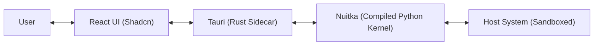

# FyodorOS

[](https://github.com/Kiy-K/FyodorOS/releases)
[](https://www.python.org/downloads/)
[](https://opensource.org/licenses/MIT)

    ███████╗██╗   ██╗ ██████╗ ██████╗  ██████╗ ██████╗
    ██╔════╝╚██╗ ██╔╝██╔═══██╗██╔══██╗██╔═══██╗██╔══██╗
    █████╗   ╚████╔╝ ██║   ██║██║  ██║██║   ██║██████╔╝
    ██╔══╝    ╚██╔╝  ██║   ██║██║  ██║██║   ██║██╔══██╗
    ██║        ██║   ╚██████╔╝██████╔╝╚██████╔╝██║  ██║
    ╚═╝        ╚═╝    ╚═════╝ ╚═════╝  ╚═════╝ ╚═╝  ╚═╝
    A Compiled AI Microkernel with Native Desktop Interface

The Operating System for Autonomous AI Agents.

## 🚀 Vision

We believe that for AI Agents to be truly useful and safe, they need an environment built for them. FyodorOS provides:

* **Structured Observation:** The OS state (Filesystem, Processes, Users) is a queryable DOM tree.
* **Cognitive Loop:** Built-in ReAct (Reasoning + Acting) loop at the kernel level.
* **Safety Sandbox:** A strict, rule-based verification layer that constraints Agent actions before execution.
* **Agent-Native Apps:** Standard tools (browser, explorer, calc) that return structured JSON/DOM instead of plain text.
* **Cloud Integration (v0.5.0):** Native Docker and Kubernetes support.
* **Long-Term Memory (v0.7.0):** Persistent semantic storage allowing agents to learn and recall information.
* **Desktop Interface (v0.8.0)** 🚀 [NEW]: A native desktop application bridging the Python kernel with a modern React UI.

## 📦 Installation

### Option A: User (Recommended)

Download the installer for Windows, Mac, or Linux from the [Releases](https://github.com/Kiy-K/FyodorOS/releases) page.

### Option B: Developer (Legacy/Headless)

You can install FyodorOS as a Python package for headless or CLI-only usage.

```bash
pip install fyodoros
playwright install chromium
```

## 🛠️ Development

To build the full Desktop experience from source, you need Node.js, Rust, and Python installed.

1. **Clone the Repository**

```bash
git clone https://github.com/Kiy-K/FyodorOS.git
cd fyodoros
```

2. **Install Frontend Dependencies**

```bash
cd gui
npm install
```

3. **Run in Development Mode**

```bash
npm run tauri dev
```

## 🗺️ Roadmap

See our detailed trajectory in [ROADMAP.md](./ROADMAP.md).

## 🏗️ Architecture

FyodorOS v0.8.0 adopts a hybrid architecture to combine the flexibility of Python AI libraries with the performance and native capabilities of Rust.



* **React UI**: A modern web-based interface for visualizing the OS state and Agent actions.
* **Tauri**: Handles window management and communicates with the Python kernel via a sidecar protocol.
* **Nuitka Kernel**: The Python core compiled into a standalone binary for performance and security, running the Agent loop and managing system resources.

## 🤝 Contributing

FyodorOS is an experimental sandbox. We welcome contributions to:

* Expand the standard library of Agent Apps.
* Improve the DOM representation of system state.
* Implement more complex Sandbox rules.

---

*Built for the future of Autonomous Computing.*
