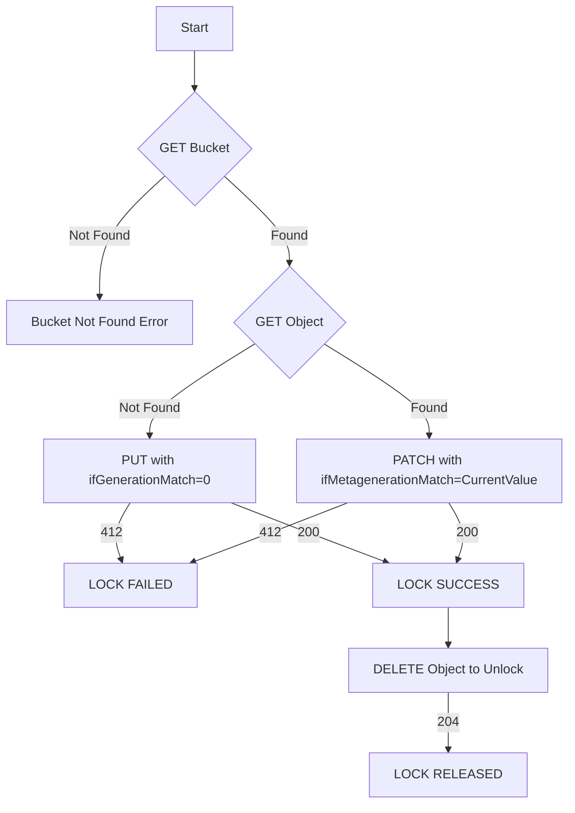

# gcs-atomic-lock

**gcs-atomic-lock** is a Python library that uses Google Cloud Storage (GCS) **object generations** and *
*metagenerations** to implement a lightweight distributed lock with strong, atomic semantics.  
It wraps GCS’s conditional write APIs and exposes a simple Python context manager for acquiring, updating, and releasing
a lock.

- **Language**: Python 3.10+
- **Package manager**: [uv](https://github.com/astral-sh/uv)
- **Status**: Library + unit tests
- **License**: See [LICENSE](./LICENSE)

---

## Features

- **Atomic lock acquisition**  
  Uses GCS’s `ifGenerationMatch=0` conditional write to ensure collision-free lock acquisition.
- **Safe lock updates**  
  Updates metadata with `ifMetagenerationMatch` to detect changes made by other processes.

---

## How It Works

1. **Check the lock object**
    - GET the lock object from the bucket.
    - If not found → lock is free (or expired).
    - If found → read `generation`, `metageneration`, and `metadata`.

2. **Acquire the lock**
    - PUT with `ifGenerationMatch=0`.
    - If the object already exists → **412 Precondition Failed** → acquisition fails.
    - If created successfully (200 OK) → lock acquired.

3. **Update the lock (optional)**
    - PATCH with `ifMetagenerationMatch=<current>`.
    - If another process updated it → **412** → treat as contention.
    - On success (200 OK) → metadata updated.

4. **Release the lock**
    - DELETE the object (204 No Content on success).
    - Optionally verify ownership via stored metadata before deletion.

## Flow



## Installation

```shell
pip install gcslock
```

## Example

### Authentication Requirement
Before running the example below, make sure you have authenticated with Google Cloud. You can either:

* Run
    ```shell
    gcloud auth application-default login
    ```
* **Or** create a Credentials instance using a Service Account key JSON file.

Without authentication, the library will not be able to access GCS.


### Code Example

```python
from gcslock import GcsLock, LockState
from gcslock.exception import GcsLockError
from google.oauth2.service_account import Credentials

# Optional: Authenticate with Google Cloud Service Account key JSON file
# cred = Credentials.from_service_account_file("path/to/service_account.json")

BUCKET = "your-bucket-name"
OBJECT = "locks/my-resource.lock"
OWNER = "your-owner-id"
LOCK_EXPIRES_SEC = 60

lock = GcsLock(lock_owner=OWNER)

try:
    with lock.acquire(
        bucket_name=BUCKET, object_key=OBJECT, expires_seconds=LOCK_EXPIRES_SEC
    ) as lock:
        # Critical section
        ...
except GcsLockError as e:
    print(f"Lock error: {e}")

```

## Use Cases

* Preventing concurrent execution in distributed job schedulers
* Coordinating resource access across multiple instances
* Building a lightweight distributed locking mechanism using GCS
