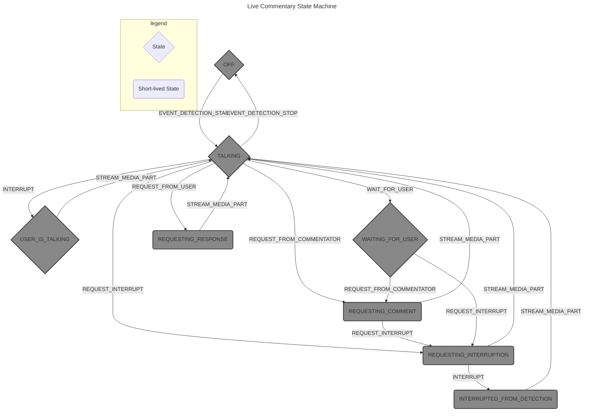

# Live Commentator Example 🎙️

The Live Commentator is a dynamic conversational agent that actively drives the
interaction, continuously generating commentary on input video and audio, asking
questions, and guiding the user towards accomplishing tasks. The user can
interact by asking questions, sharing a screen, or providing a camera feed. The
Live Commentator seamlessly transitions between these different scenarios,
adapting its commentary to the changing context. It utilizes Gemini's multimodal
capabilities and asynchronous function calls to provide an engaging and
responsive experience.

## 🚀 Running the commentator

We recommend the AI Studio version of the agent as it utilizes the echo
cancellation built into the browser. Please see commentator\_ais.py for
instructions.

## 🗣️ Conversation Logic

The Live Commentator agent logic is fully contained in the `LiveCommentator`
class in `commentator.py` and is developed as a GenAI Processor. This makes it
easier to combine with other processors such as `EventDetection` or
`RateLimitAudio`.

The Live Commentator acts as a state machine, transitioning between different
states based on user input, detected events in the video stream, and the model's
responses. It orchestrates the flow of data between the user, the event
detection processor, and the Gemini Live API, ensuring timely and relevant
commentary.

The key to the LiveCommentator's behavior is its ability to *interrupt* its
own commentary when notable new input is observed. This is achieved through a
combination of:

1.  **Event Detection**: A separate `EventDetection` processor analyzes the
    video stream for significant events (e.g., a person appearing, a new object
    being shown).
2.  **Voice Activity Detection (VAD)**: Built into the Gemini Live API, VAD
    detects when the user is speaking, allowing the user to interrupt the
    commentary.
3.  **Async Function Calls**: The Gemini API supports non-blocking function
    calls. The `LiveCommentator` uses this to schedule future commentary
    *without* interrupting the current utterance. This allows for a more natural
    and responsive experience. One async function call, `wait_for_user`, is
    returned by Gemini when the Live Commentator needs to wait for the user to
    answer a question or to do something. It waits for a set duration (currently
    5 seconds) and resumes the commentary if no relevant input is received.

## 🔄 State Machine

The LiveCommentator operates based on the following states and transitions.
`EVENT_DETECTION_(START|STOP)` are only for this schema (you will not find them
in code) and signify a request from the event detection processor to start or
stop the commentary. All the other states and actions are present in the code.

## ⏹️ States

*   **OFF**: The commentator is inactive. No commentary is generated. The user
    can still ask questions, but the commentator is not automatically generating
    output.
*   **TALKING**: The commentator is actively generating commentary or responding
    to the user. This is the "steady state" of operation.
*   **USER_IS_TALKING**: The user has started speaking (detected by VAD). The
    commentator is waiting for the user to finish. The commentator stopped
    talking.
*   **REQUESTING_INTERRUPTION**: An event has been detected that requires
    interrupting the current commentary. The commentator is about to send a
    request to the model to generate an interruptive comment. The commentator
    will keep talking while the request is sent.
*   **REQUESTING_COMMENT**: The commentator is requesting a new comment from the
    model. This happens when the commentator is turned on or when a scheduled
    comment is due. This happens when the commentator will soon finish its
    current comment.
*   **REQUESTING_RESPONSE**: The commentator is requesting a response to a
    user's question or input. This input is text-based. This is not used in the
    AI Studio version of the commentator (no text entry).
*   **INTERRUPTED_FROM_DETECTION**: The commentary should be interrupted by
    an event and the system is waiting for the model to generate the new audio.
    The commentator keeps talking until it receives the response of the model
    generating the interruption.
*   **WAITING_FOR_USER**: The commentator has finished speaking (perhaps it
    asked a question) and is waiting for the user to respond or for an event to
    occur. The commentator will only wait for a fixed amount of time; if the
    user doesn't respond within `MAX_SILENCE_WAIT_FOR_USER_SEC`, the commentator
    will resume commentating.

## ▶️ Actions

The `CommentatorStateMachine` uses the following `Action` enum to trigger state
transitions:

*   **TURN_ON**: Activates the commentator. The model will begin generating
    commentary. This action is triggered by the `start_commentating` async
    function call. The async nature of the function is what enables the flexible
    scheduling of the commentary: it can interrupt, wait until the current
    comment is done, or just be silent and let the user talk.
*   **TURN_OFF**: Deactivates the current commentator. The user can still
    ask questions, but the commentator will not automatically generate
    commentaries.
*   **STREAM_MEDIA_PART**: New audio has been received from the model. This
    action updates the internal state related to the current generation request
    (latency, audio duration, etc.) and typically transitions the state to
    `TALKING`.
*   **REQUEST_FROM_USER**: A request has been received from the user (e.g., a
    question or command). This triggers a request to the model.
*   **REQUEST_INTERRUPT**: The `EventDetection` processor has detected a
    significant event. This *prepares* for an interruption, but doesn't
    immediately stop the current audio. The state machine waits for the model to
    confirm the interruption.
*   **REQUEST_FROM_COMMENTATOR**: A scheduled comment is due. This triggers a
    request to the model to generate a new comment.
*   **INTERRUPT**: The user has interrupted the commentator (via VAD) or an
    event has been detected *and* the model has confirmed the interruption. This
    immediately stops the current audio output.
*   **WAIT_FOR_USER**: The model has decided to pause the commentary and wait
    for the user to respond or provide visual input. This is triggered by the
    `wait_for_user` async function call.

## 🔀 State Transitions and Logic

The `CommentatorStateMachine`'s `update` method defines the state transitions.
Here's a breakdown of the key transitions, illustrating how the commentator
responds to various events:

1.  **Starting Commentary (`OFF` -> `TALKING`)**:

    *   The event detection detects people in front of the camera: it sends a
        "start commentating" request to the model.
    *   The model triggers the `start_commentating` function.
    *   The `LiveCommentator` receives the function call.
    *   The state transitions to `TALKING`.
    *   A request is sent to the model to generate commentary
        (`REQUEST_FROM_COMMENTATOR`).

2.  **User Interrupts (`TALKING` -> `USER_IS_TALKING` ->
    `REQUESTING_RESPONSE`)**:

    *   The Gemini Live API's VAD detects the user speaking.
    *   The `LiveCommentator` receives an `interrupted` signal.
    *   The state transitions to `USER_IS_TALKING`.
    *   The current audio output is stopped.
    *   After a short delay (waiting for the user to finish their utterance),
        the state transitions to `REQUESTING_RESPONSE`, and a request is sent
        to the model to generate a response to the user.

3.  **Event Interrupts (`TALKING` -> `REQUESTING_INTERRUPTION` ->
    `INTERRUPTED_FROM_DETECTION` -> `TALKING`)**:

    *   The `EventDetection` processor detects a significant event.
    *   The `LiveCommentator` receives an `interrupt_request` signal.
    *   The state transitions to `REQUESTING_INTERRUPTION`.
    *   A request is sent to the model to generate a comment about the detected
        event (`REQUEST_INTERRUPT`). The model's response *confirms* the
        interruption.
    *   When the model confirms the interruption (by sending an `interrupted`
        response), the state transitions to `INTERRUPTED_FROM_DETECTION`.
    *   When the first audio part of the interrupting comment is received, the
        `LiveCommentator` *yields* the `interrupted` response to the rate
        limit audio processor, stopping the previous audio stream. It starts
        playing the new audio straightaway and transitions to `TALKING`.

4.  **Scheduled Comments (`TALKING` -> `REQUESTING_COMMENT` -> `TALKING`)**:

    *   The `LiveCommentator` tracks the duration of the current commentary.
    *   Before the current commentary finishes, a new comment is scheduled at a
        time that would make the model output the content of the new comment
        just after the current one is fully played. This scheduling is based on
        an estimate of TTFT (see [section](#⏱️-timing-and-latency) below). The
        state is still in `TALKING`.
    *   When the scheduled time arrives, the state transitions to
        `REQUESTING_COMMENT`.
    *   A request is sent to the model to generate the next comment
        (`REQUEST_FROM_COMMENTATOR`).
    *   When the first audio part of the new comment is received, the state
        transitions to `TALKING`.

5.  **Waiting for User (`TALKING` -> `WAITING_FOR_USER`)**:

    *   The `LiveCommentator` received a `wait_for_user` async tool call from
        the model.
    *   The state transitions to `WAITING_FOR_USER`.
    *   The current audio output is not interrupted. It is played until the end.
    *   Then a timer is started. If the user doesn't interrupt within
        `MAX_SILENCE_WAIT_FOR_USER_SEC`, a new comment is scheduled.
    *   If the user does interrupt by responding, the state transitions to
        `USER_IS_TALKING` and the logic from step 2 applies.
    *   If an event is detected, the state transitions as in step 3.

6.  **Stopping Commentary (`*` -> `OFF`)**:

    *   The `EventDetection` processor detects that there is no one in front of
        the camera. It sends a "stop commentating" request to the model.
    *   The `LiveCommentator` receives a tool call cancellation from the model
    *   The state transitions to `OFF`.
    *   Any scheduled comments are cancelled.

## ⏱️ Timing and Latency

The `LiveCommentator` keeps track of the latency of each generation request,
measured as the time from when the request is sent to the model, to when the
first audio part is received. The `LiveCommentator` uses a history of recent
latency values (also called "TTFT," or "time to first token," in the code) to
predict the latency of the *next* comment. This prediction is used to schedule
the next comment *just before* the current comment finishes, minimizing the gap
between utterances while still allowing for interruptions. The
`predict_next_ttft()` method calculates this predicted TTFT (using a mean-std
approach). The `tentative_trigger_time()` method calculates the time at which
the next comment *should* be triggered, based on the predicted TTFT and the
duration of the current audio.

## ℹ️ Usage Notes

*   The `LiveCommentator` expects audio and video input on the `realtime`
    substream. Other substreams are used for control signals.
*   The `EventDetection` processor is crucial for responsive interruptions. Its
    configuration (prompt, sensitivity) significantly impacts the commentator's
    behavior.
*   The `RateLimitAudio` processor is typically used *after* the
    `LiveCommentator` to ensure the audio output is played back at the correct
    speed and can be interrupted properly.

## 📜 License

This example is licensed under the Apache License, Version 2.0.

