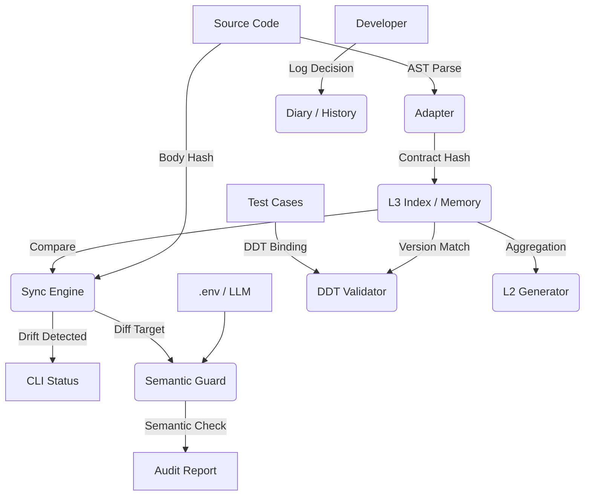

<div align="center">

# ⚓ HarborSpec
### The Context Governance Engine for Vibe Coding

[](https://github.com/your-org/harbor-spec/actions)
[](https://www.python.org/)
[](LICENSE)
[](https://github.com/your-org/harbor-spec)

**让 AI 像代码一样被管理，让上下文像 Git 一样可追溯。**
**它会辅助你完成“程序员到上下文工程师”的革命性转变。**

[理念] • [架构] • [快速开始] • [迁移指南] • [日常工作流] • [命令速查]

</div>

语言: [中文](README.md) | [English](README_en.md)

---

## 🌌 The Era of Vibe Coding

编程正在经历一场范式转移。我们正在从 "Writing Code"（逐行编写）转向 **"Vibe Coding"**（通过自然语言与 AI 协作生成）。

在这个新时代，**代码生成的边际成本趋近于零，但上下文维护的成本却在指数级上升。**
- AI 改了代码，Docstring 还没改？👉 **Context Drift (上下文漂移)**
- 测试用例还在测旧版本的逻辑？👉 **Validation Gap (验证断层)**
- 为什么上周我们要把这个参数改成 Optional？👉 **Memory Loss (决策遗忘)**

**Harbor** 应运而生。它是 **Copilot 的监管者**，是一套用于治理 AI 生成代码的 **"良知" (Conscience)** 与 **"记忆" (Memory)** 系统。

## 🛡️ Core Philosophy

Harbor 的核心设计理念基于 **L3 Contract Theory**：
1.  **Code is Volatile, Contract is Immutable**: 代码可由 AI 随意重写，但 L3 级契约（Docstring）是锚点，必须严格审计。
2.  **Noise is Signal**: 未索引的代码、未同步的文档，都是系统中的“噪音”。Harbor 将其显性化。
3.  **Trust, but Verify**: 信任 AI 的编码能力，但通过 AST 分析和 LLM 审计验证其产出。

## 🏗️ Architecture



-----

## ⚡ Quick Start

### 1\. Installation

```bash
pip install harbor-spec
```

### 2\. Initialize

在项目根目录运行初始化，Harbor 会自动探测项目结构并生成配置（包含 Git 感知过滤）：

```bash
harbor init
```

### 3\. Setup AI Role Rules (关键\!)

为了让 Trae/Cursor/Windsurf/Copilot 自动生成符合 Harbor 标准的代码，请配置 **Role Rules**。

<details>
<summary><strong>👉 点击展开：复制 Role Rules 到你的 .trae.role_rules 或 .cursorrules 或 .windsurfrules</strong></summary>

````markdown
# Harbor-spec L3 Documentation Standards

你是一个在此项目中工作的 **Harbor-spec 认证工程师**。
所有新编写或重构的 **Public API**（不以 `_` 开头的函数、类、方法）必须包含严格符合 **Harbor L3 Contract** 标准的 Docstring。

## 核心规则 (Critical Rules)
1.  **风格**: 使用 **Google Style** 格式，但增加了 Harbor 专用的扩展部分。
2.  **语言**: Docstring 的描述内容必须使用 **中文**。
3.  **强制标记**: 所有公共方法必须包含 `@harbor.scope: public` 标记。

## Docstring 结构模版
1.  **摘要**: 一句话概括。
2.  **Harbor Tags** (必须):
    * `@harbor.scope: public`
    * `@harbor.l3_strictness: strict`
    * `@harbor.idempotency: once`
3.  **Args / Returns / Raises**: 标准格式。

## 标准示例
```python
def build_index(self, incremental: bool = True) -> IndexReport:
    """构建或增量更新 L3 索引到缓存。

    功能:
      - 扫描配置的代码根目录，解析 Python 文件中的 L3 契约元数据。
      - 计算签名哈希与体哈希，生成索引条目。

    @harbor.scope: public
    @harbor.l3_strictness: strict
    @harbor.idempotency: once

    Args:
        incremental (bool): 是否启用增量构建。

    Returns:
        IndexReport: 构建统计。
    """
    ...
```
````

</details>

### 4\. Configure LLM

创建 `.env` 文件以启用语义审计和智能日志功能：

```ini
HARBOR_LLM_PROVIDER=openai  # 或 deepseek
HARBOR_LLM_API_KEY=sk-xxxxxx
HARBOR_LLM_BASE_URL=https://api.openai.com/v1
HARBOR_LANGUAGE=zh # 可选英文：en
```

### 5\. Build Baseline

锁定初始基线（将当前契约快照写入缓存），接管当前代码库：

```bash
harbor lock
```

-----

## 🛠️ Migration Guide (接管存量代码)

已有项目代码量巨大且没有 Docstring？使用 **交互式装饰器** 快速迁移。

### 1\. 扫描并标记 (Decorate)

```bash
harbor adopt backend/ --strategy safe
```

  * **Safe Mode (默认)**: 仅识别已有 Docstring 但缺少 `@harbor.scope` 的函数。
  * **Aggressive Mode**: `--strategy aggressive` 会识别所有 Public 函数，为无文档函数插入带 `TODO` 的模板。
  * **Dry Run**: 使用 `--dry-run` 预览变更。

### 2\. 更新索引

完成接管后，锁定基线：

```bash
harbor lock
```

-----

## 🔄 The Vibe Coding Workflow

### Step 1: Check Status

开始工作前，确保环境干净。

```bash
harbor status
# 输出: No changes detected.
```

### Step 2: Vibe Coding

使用 AI 助手修改代码。
*场景：你修改了 `utils.py` 的逻辑，但忘记更新 Docstring。*

### Step 3: Detect Drift

Harbor 发现代码“偷跑”。

```bash
harbor status
# 输出: M harbor.utils.func (Body changed, Contract static)
```

### Step 4: AI Audit

运行统一检查以同时验证语义与 DDT 绑定：

```bash
harbor check
# 输出: [Semantic] POSSIBLE_SEMANTIC_DRIFT ... 与 [DDT] Validation ...
```

### Step 5: Smart Diary (AI 智能日志) ✨

代码修改完成后，让 AI 帮你写决策日志。

```bash
harbor log
```

  * Harbor 会分析未索引的变更（Drift），自动生成结构化日志草稿。
  * **交互式确认**：你可以直接保存 `[Y]` 或微调 Summary `[e]`。

### Step 6: Lock & Record

锁定新的基线：

```bash
harbor lock
```

-----

## 🚀 What's New in v1.2.0

- Smart Configuration：`harbor init` 现已自动探测 Django/Node.js/Go/Java 技术栈，并融合 `.gitignore` 规则生成更稳健的默认配置
- SQLite Backend (WAL)：索引从 JSON 迁移至 SQLite，常驻 O(1) 内存占用、秒级启动与安全并发写入
- Parallel Indexing：`harbor lock` 利用多核并行解析与哈希，适配大型 Monorepo 的高吞吐构建
- Windows 兼容：全面适配路径归一化与并行处理，跨平台体验一致

v1.2.0 重点围绕“工业级稳定性与规模化性能”，让 Harbor 更适合在企业级代码库中长期运行。

## 🧩 Features Deep Dive

<details>
<summary><strong>📐 DDT (Decorator-Driven Testing)</strong></summary>

防止“假绿灯”。将测试用例与代码版本强绑定。

```python
from harbor.core.ddt import harbor_ddt_target

@harbor_ddt_target("backend.core.calculate_tax", l3_version=1)
def test_calculate_tax():
    ...
```

运行 `harbor ddt validate`，如果契约升级到 v2，Harbor 会强制测试失败。
推荐使用 `harbor check --fast`（仅运行 DDT 验证）。

</details>

<details>
<summary><strong>📚 L2 Documentation Generator</strong></summary>

自动生成模块级的 README，作为代码质量仪表盘。

```bash
harbor docs --module harbor/core --write
```

生成包含 Public API 列表、严格度状态及测试覆盖率的 Markdown 文档。

</details>

<details>
<summary><strong>⚙️ Configuration Management</strong></summary>

使用 CLI 管理配置，避免手写 YAML 出错。

```bash
harbor config list                   # 查看配置 (Rich表格)
harbor config add "scripts/**"       # 添加扫描路径
harbor config remove "legacy/**"     # 移除路径
```

</details>

<details>
<summary><strong>🚀 Performance Tuning (Monorepo)</strong></summary>

对于大型项目，性能与可扩展性至关重要：
- SQLite (WAL)：索引缓存持久化到 `.harbor/cache/harbor.db`，避免全量 JSON 读写，冷启动更快
- 并行构建：`harbor lock` 默认多核并行解析与哈希，吞吐显著提升
- 增量查询：`harbor status` 通过数据库增量对比，加速变更检测

此外，**排除无关目录**非常关键。`.harbor/config.yaml` 默认支持 Git 感知，但建议显式排除：

```yaml
exclude_paths:
  - ".venv/**"
  - "node_modules/**"  # 前端依赖必须排除
  - "**/tests/**"      # 排除测试代码被索引
  - "dist/**"
```

</details>

-----

## 📝 Commands Cheatsheet

| Command | Description |
| :--- | :--- |
| `harbor init` | 智能初始化项目配置 |
| `harbor status` / `harbor st` | 查看上下文状态（Drift/Modified） |
| `harbor lock` / `harbor commit` | 锁定当前 L3 契约快照为基线 |
| `harbor check` | 统一语义审计与 DDT 验证 |
| `harbor check --fast` | 仅运行 DDT 验证 |
| `harbor log` | 上下文感知日志：无参 AI 草稿，`-m` 手动写入 |
| `harbor log --export` | 导出 Diary Markdown |
| `harbor adopt` | 交互式接管遗留代码进入治理体系 |
| `harbor docs` | 生成模块级文档（L2） |
| `harbor config` / `harbor conf` | 管理扫描路径配置 |

-----

## 📄 License

MIT © 2025 Harbor-spec Authors.
