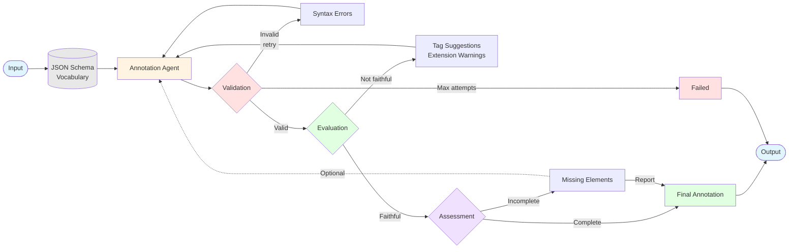

# HEDit

[](https://github.com/Annotation-Garden/hedit/actions/workflows/test.yml)
[](https://codecov.io/gh/Annotation-Garden/hedit)

Multi-agent system for converting natural language event descriptions into valid HED (Hierarchical Event Descriptors) annotations. Part of the [Annotation Garden Initiative](https://annotation.garden).

## Features

- **Multi-Agent Architecture**: Uses LangGraph to orchestrate specialized agents
  - **Annotation Agent**: Generates HED tags using JSON schema vocabulary (short-form tags)
  - **Validation Agent**: Validates HED compliance with detailed error feedback
  - **Evaluation Agent**: Assesses faithfulness & suggests closest tag matches
  - **Assessment Agent**: Identifies missing elements & dimensions

- **JSON Schema Support**: Uses official HED JSON schemas with short-form tags and extensionAllowed detection
- **Intelligent Validation**: Multi-stage validation with feedback loops and closest match suggestions
- **Local LLM Serving**: Uses Ollama with `gpt-oss:20b` model (20B parameters)
- **GPU Acceleration**: Optimized for NVIDIA RTX 4090 with CUDA support
- **Scalable**: Designed for 10-15 concurrent users
- **Auto-Configuration**: Model automatically pulled on first Docker start

## Documentation

📚 **[Full Documentation](docs/)** - Comprehensive guides for users, deployers, and developers

**Quick Links**:
- [Usage Guide](docs/guides/usage.md) - Getting started with HEDit
- **[Deployment Guide](DEPLOYMENT.md)** - Choose your deployment option (production, local GPU, or local dev)
- [API Reference](docs/api/) - API documentation
- [Development Guide](docs/development/) - Contribute to HEDit

## Deployment Options

HEDit supports multiple deployment scenarios. Choose the one that fits your needs:

### For Production (Recommended)
Deploy to a server or cloud platform with API key authentication, audit logging, and auto-updates.
**→ See [DEPLOYMENT.md](DEPLOYMENT.md) and [deploy/README.md](deploy/README.md)**

### For Local GPU Development
Run completely offline with Ollama and local GPU (requires NVIDIA RTX 3090/4090+).
**→ See [docs/deployment/docker-quickstart.md](docs/deployment/docker-quickstart.md)**

### For Quick Local Testing
Use your local Python environment with OpenRouter API (no GPU needed).
**→ See [Local Development Setup](#local-development-setup) below**

**Not sure which to choose?** See the [Deployment Decision Matrix](DEPLOYMENT.md#quick-decision-matrix)

## Architecture



**Legend:**
- 🔄 **Solid arrows**: Automatic loops
- ⋯⋯ **Dotted arrows**: Optional refinement
- 🔵 Input/Output | 🟡 Annotation | 🔴 Validation | 🟢 Evaluation | 🟣 Assessment

### Workflow Details

1. **Annotation Loop** (Automatic):
   - Generates HED annotation using short-form tags
   - Uses complete HED syntax rules (parentheses, curly braces, #, /)
   - Considers extensionAllowed tags for extensions
   - Maximum validation attempts: 5 (configurable)

2. **Validation Loop** (Automatic):
   - Checks syntax and tag validity
   - Provides specific error codes and messages
   - Loops back to annotation agent if errors found
   - Stops if max attempts reached

3. **Evaluation Loop** (Automatic):
   - Assesses faithfulness to original description
   - Validates tags against JSON schema vocabulary
   - Suggests closest matches for invalid tags
   - Warns about non-portable tag extensions
   - Loops back if not faithful

4. **Assessment Loop** (Optional):
   - Final completeness check
   - Identifies missing dimensions
   - Can trigger optional refinement or report only
   - Configurable behavior

## Installation

### Docker (Recommended - Self-Contained)
- Docker with NVIDIA Container Toolkit
- Docker Compose
- All dependencies (Python, Node.js, HED schemas, validator) included in image!

### Local Development
- Python 3.11+
- CUDA-capable GPU (for LLM serving)
- Node.js 18+ (for HED JavaScript validator)
- Conda (recommended)

### Quick Start (Docker)

```bash
# Clone repository
cd /path/to/hedit

# Build and start (auto-pulls model and includes all HED resources)
docker-compose up -d

# Monitor first start (~10-20 min for model download)
docker-compose logs -f

# Verify
curl http://localhost:38427/health

# Open frontend
open frontend/index.html
```

### Local Development Setup

1. **Create conda environment**:
```bash
source ~/miniconda3/etc/profile.d/conda.sh
conda create -n hedit python=3.11 -y
conda activate hedit
```

2. **Install dependencies**:
```bash
pip install -e ".[dev]"
```

3. **Clone HED resources** (if not using Docker):
```bash
# NOTE: Using forked hed-schemas with fix for JSON inheritance attributes
# TODO: Revert to hed-standard/hed-schemas once upstream fix is merged
git clone -b fix/json-inheritance-attributes https://github.com/neuromechanist/hed-schemas.git ../hed-schemas
git clone https://github.com/hed-standard/hed-javascript.git ../hed-javascript
cd ../hed-javascript && npm install && npm run build && cd -
```

## Usage

### Start the Backend Server

```bash
uvicorn src.api.main:app --reload --host 0.0.0.0 --port 38427
```

### API Endpoints

- `POST /annotate`: Generate HED annotation from natural language
- `POST /validate`: Validate HED annotation
- `GET /health`: Health check
- API URL: `http://localhost:38427`

## Development

### Run Tests
```bash
pytest
```

### Code Quality
```bash
ruff check src/ tests/
ruff format src/ tests/
```

### Coverage Report
```bash
pytest --cov=src --cov-report=html
```

## Project Structure

```
hedit/
├── src/
│   ├── agents/         # LangGraph agent implementations
│   ├── validation/     # HED validation integration
│   ├── utils/          # Helper utilities
│   └── api/            # FastAPI backend
├── frontend/           # Web UI
├── tests/              # Test suite
├── docs/               # Documentation
└── .context/
    └── plan.md        # Project roadmap
```

## License

MIT

## References

- [HED Standard](https://www.hedtags.org/)
- [HED Schemas](https://github.com/hed-standard/hed-schemas)
- [HED JavaScript Validator](https://github.com/hed-standard/hed-javascript)
- [LangGraph](https://github.com/langchain-ai/langgraph)
