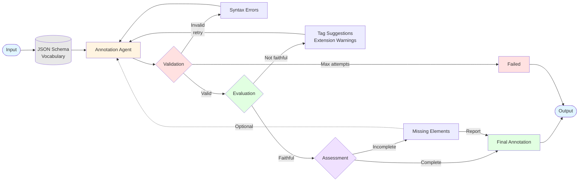

# HEDit

[](https://pypi.org/project/hedit/)
[](https://github.com/Annotation-Garden/hedit/actions/workflows/test.yml)
[](https://codecov.io/gh/Annotation-Garden/hedit)

Multi-agent system for converting natural language event descriptions into valid HED (Hierarchical Event Descriptors) annotations. Part of the [Annotation Garden Initiative](https://annotation.garden).

## Installation

```bash
pip install hedit
```

## Quick Start

```bash
# Initialize with your OpenRouter API key (get one at https://openrouter.ai)
hedit init --api-key sk-or-v1-xxx

# Generate HED annotation from natural language
hedit annotate "participant pressed the left button with their index finger"

# Annotate from an image
hedit annotate-image stimulus.png

# Validate an existing HED string
hedit validate "Sensory-event, Visual-presentation"

# Check API health
hedit health
```

## CLI Commands

| Command | Description |
|---------|-------------|
| `hedit init` | Configure API key and preferences |
| `hedit annotate "text"` | Convert natural language to HED |
| `hedit annotate-image <file>` | Generate HED from an image |
| `hedit validate "HED-string"` | Validate a HED annotation |
| `hedit health` | Check API status |
| `hedit config show` | Display current configuration |

### Options

```bash
# Use JSON output for scripting
hedit annotate "red circle appears" -o json

# Specify HED schema version
hedit annotate "button press" --schema 8.3.0

# Use a different API endpoint
hedit annotate "stimulus" --api-url https://api.annotation.garden/hedit-dev
```

### Configuration

Config files are stored in `~/.config/hedit/`:
- `config.yaml` - Settings (API URL, model, schema version)
- `credentials.yaml` - API key (stored securely)

## Features

- **Natural Language to HED**: Describe events in plain English, get valid HED annotations
- **Image Annotation**: Annotate visual stimuli directly from image files
- **Multi-Stage Validation**: AI agents generate, validate, evaluate, and refine annotations
- **Bring Your Own Key**: Uses OpenRouter API; you control your LLM costs and model choice
- **JSON Output**: Easy integration with scripts and pipelines
- **HED Schema Support**: Works with official HED schemas (8.x)

## How It Works

HEDit uses a multi-agent architecture powered by LangGraph:

1. **Annotation Agent**: Generates initial HED tags from your description
2. **Validation Agent**: Checks HED syntax and tag validity
3. **Evaluation Agent**: Assesses faithfulness and suggests improvements
4. **Assessment Agent**: Identifies missing elements for completeness

The agents work in feedback loops, automatically refining the annotation until it passes all validation checks.

## Documentation

- [HED Standard](https://hedtags.org) - Learn about HED annotations
- [OpenRouter](https://openrouter.ai) - Get an API key for LLM access
- [GitHub Issues](https://github.com/Annotation-Garden/HEDit/issues) - Report bugs or request features

## Server Deployment

For running your own HEDit API server, see the deployment options below.

### Docker (Self-Hosted API)
Deploy with Docker for production use with GPU acceleration.
**See [DEPLOYMENT.md](DEPLOYMENT.md) and [deploy/README.md](deploy/README.md)**

### Local Development
Run the API server locally for development.
**See [Local Development Setup](#local-development-setup) below**

## Architecture



**Legend:**
- 🔄 **Solid arrows**: Automatic loops
- ⋯⋯ **Dotted arrows**: Optional refinement
- 🔵 Input/Output | 🟡 Annotation | 🔴 Validation | 🟢 Evaluation | 🟣 Assessment

### Workflow Details

1. **Annotation Loop** (Automatic):
   - Generates HED annotation using short-form tags
   - Uses complete HED syntax rules (parentheses, curly braces, #, /)
   - Considers extensionAllowed tags for extensions
   - Maximum validation attempts: 5 (configurable)

2. **Validation Loop** (Automatic):
   - Checks syntax and tag validity
   - Provides specific error codes and messages
   - Loops back to annotation agent if errors found
   - Stops if max attempts reached

3. **Evaluation Loop** (Automatic):
   - Assesses faithfulness to original description
   - Validates tags against JSON schema vocabulary
   - Suggests closest matches for invalid tags
   - Warns about non-portable tag extensions
   - Loops back if not faithful

4. **Assessment Loop** (Optional):
   - Final completeness check
   - Identifies missing dimensions
   - Can trigger optional refinement or report only
   - Configurable behavior

## Installation

### Docker (Recommended - Self-Contained)
- Docker with NVIDIA Container Toolkit
- Docker Compose
- All dependencies (Python, Node.js, HED schemas, validator) included in image!

### Local Development
- Python 3.11+
- CUDA-capable GPU (for LLM serving)
- Node.js 18+ (for HED JavaScript validator)
- Conda (recommended)

### Quick Start (Docker)

```bash
# Clone repository
cd /path/to/hedit

# Build and start (auto-pulls model and includes all HED resources)
docker-compose up -d

# Monitor first start (~10-20 min for model download)
docker-compose logs -f

# Verify
curl http://localhost:38427/health

# Open frontend
open frontend/index.html
```

### Local Development Setup

1. **Create conda environment**:
```bash
source ~/miniconda3/etc/profile.d/conda.sh
conda create -n hedit python=3.11 -y
conda activate hedit
```

2. **Install dependencies**:
```bash
pip install -e ".[dev]"
```

3. **Clone HED resources** (if not using Docker):
```bash
# NOTE: Using forked hed-schemas with fix for JSON inheritance attributes
# TODO: Revert to hed-standard/hed-schemas once upstream fix is merged
git clone -b fix/json-inheritance-attributes https://github.com/neuromechanist/hed-schemas.git ../hed-schemas
git clone https://github.com/hed-standard/hed-javascript.git ../hed-javascript
cd ../hed-javascript && npm install && npm run build && cd -
```

## Usage

### Start the Backend Server

```bash
uvicorn src.api.main:app --reload --host 0.0.0.0 --port 38427
```

### API Endpoints

- `POST /annotate`: Generate HED annotation from natural language
- `POST /validate`: Validate HED annotation
- `GET /health`: Health check
- API URL: `http://localhost:38427`

## Development

### Run Tests
```bash
pytest
```

### Code Quality
```bash
ruff check src/ tests/
ruff format src/ tests/
```

### Coverage Report
```bash
pytest --cov=src --cov-report=html
```

## Project Structure

```
hedit/
├── src/
│   ├── agents/         # LangGraph agent implementations
│   ├── validation/     # HED validation integration
│   ├── utils/          # Helper utilities
│   └── api/            # FastAPI backend
├── frontend/           # Web UI
├── tests/              # Test suite
├── docs/               # Documentation
└── .context/
    └── plan.md        # Project roadmap
```

## License

MIT

## References

- [HED Standard](https://www.hedtags.org/)
- [HED Schemas](https://github.com/hed-standard/hed-schemas)
- [HED JavaScript Validator](https://github.com/hed-standard/hed-javascript)
- [LangGraph](https://github.com/langchain-ai/langgraph)
