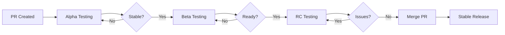

# Pre-Release Guide

This guide explains how to create and manage pre-releases (alpha, beta, RC) for testing new features before they reach the main release channels.

## Overview

Pre-releases allow you to test new features from pull requests without:
- Breaking the main version tags
- Publishing untested code to PyPI
- Affecting production users

### Pre-Release Types

- **Alpha** (`-alpha.N`): Early development, unstable, major changes expected
- **Beta** (`-beta.N`): Feature-complete, testing phase, minor changes expected
- **RC** (`-rc.N`): Release candidate, stable, minimal changes expected

## Creating a Pre-Release

### Prerequisites

1. **Permissions**: Only authorized users can create pre-releases
   - Access is controlled via the `prerelease` GitHub Environment
   - Requires approval from designated reviewers (configured in Settings → Environments)
   - See [Environment Protection](#environment-protection-required-setup) section for setup

2. **Pull Request**: Must have an open PR with the changes you want to test

### Steps

1. **Go to Actions tab** in GitHub
2. **Select "Pre-Release (RC/Alpha/Beta)" workflow**
3. **Click "Run workflow"** button
4. **Fill in the required fields**:
   - **PR number**: The PR number to create the release from
   - **Release type**: Choose `alpha`, `beta`, or `rc`
   - **Version increment**: Choose `major`, `minor`, or `patch`
   - **Pre-release number**: Sequential number (e.g., 1 for first alpha)
   - **Python version**: Python version to use (default: 3.13)

5. **Click "Run workflow"** to start the process

### Example Workflow

**Scenario**: You have PR #42 with a new feature and want to create the first alpha release.

Current version: `1.7.0`

**Inputs**:
- PR number: `42`
- Release type: `alpha`
- Version increment: `minor`
- Pre-release number: `1`

**Result**: Creates version `1.8.0-alpha.1` with tag `v1.8.0-alpha.1`

**Subsequent alphas** from the same PR:
- `1.8.0-alpha.2` (increment pre-release number)
- `1.8.0-alpha.3`

**Move to beta**:
- `1.8.0-beta.1` (change release type, reset number)

**Move to RC**:
- `1.8.0-rc.1` (change release type, reset number)

## Installing Pre-Releases

Pre-releases are **NOT** published to PyPI. Install directly from GitHub:

```bash
# Replace version and filename with your pre-release
pip install https://github.com/boogy/iam-policy-auditor/releases/download/v1.8.0-alpha.1/iam_policy_validator-1.8.0-alpha.1-py3-none-any.whl
```

Or clone and install locally:

```bash
git fetch origin pull/42/head:pr-42
git checkout pr-42
uv sync
uv run iam-validator --version
```

## Testing Pre-Releases

### In CI/CD Pipelines

```yaml
steps:
  - name: Install pre-release
    run: |
      pip install https://github.com/boogy/iam-policy-auditor/releases/download/v1.8.0-alpha.1/iam_policy_validator-1.8.0-alpha.1-py3-none-any.whl

  - name: Test validation
    run: |
      iam-validator validate --path ./policies/
```

### In GitHub Actions (using the action)

```yaml
steps:
  - uses: boogy/iam-policy-auditor@v1.8.0-alpha.1
    with:
      path: policies/
```

**Note**: For pre-release tags to work with the GitHub Action, you need to push the tag to the repository.

## Pre-Release Lifecycle

### Automatic Cleanup

Pre-releases are automatically deleted after **30 days** to prevent clutter.

- **Daily cleanup**: Runs at 00:00 UTC via [cleanup-prereleases.yml](.github/workflows/cleanup-prereleases.yml)
- **Dry run first**: First run is in dry-run mode to show what would be deleted
- **Manual trigger**: Can be triggered manually with custom retention period

### Manual Cleanup

To manually delete old pre-releases:

1. Go to **Actions** → **Cleanup Old Pre-Releases**
2. Click **Run workflow**
3. Configure options:
   - **Dry run**: `false` (to actually delete)
   - **Days old**: `30` (or custom value)
4. Click **Run workflow**

### What Gets Cleaned Up

✅ **Deleted automatically**:
- Alpha releases older than 30 days
- Beta releases older than 30 days
- RC releases older than 30 days

⛔ **Never deleted**:
- Stable releases (e.g., `v1.7.0`)
- Latest pre-release of each type (kept as reference)

## Branch Protection

### Environment Protection (Required Setup)

The pre-release workflow uses GitHub Environments to control who can create pre-releases. You **must** set this up before the workflow will work.

#### Setup Instructions

1. **Go to Repository Settings**:
   - Navigate to **Settings** → **Environments**
   - Click **New environment**

2. **Create the `prerelease` environment**:
   - Environment name: `prerelease` (must match exactly)
   - Click **Configure environment**

3. **Configure Protection Rules**:

   **Required reviewers**:
   - Check **Required reviewers**
   - Add users/teams who can approve pre-releases (e.g., maintainers)
   - Require at least 1 reviewer (recommended)

   **Deployment branches** (optional but recommended):
   - Select **Selected branches**
   - Add branch name patterns for allowed source branches
   - Or select **All branches** to allow any branch

4. **Save the environment**

#### How It Works

When someone triggers the pre-release workflow:

1. ✅ Workflow starts and validates inputs
2. ⏸️ **Workflow pauses** waiting for environment approval
3. 🔔 Designated reviewers receive notification
4. 👤 Reviewer approves or rejects in GitHub UI
5. ✅ If approved, workflow continues and creates pre-release
6. ❌ If rejected, workflow stops and no release is created

#### Benefits Over Hardcoded User Lists

- ✅ **No code changes**: Add/remove users through UI
- ✅ **Audit trail**: All approvals logged
- ✅ **Team support**: Can use GitHub teams, not just individuals
- ✅ **Flexible rules**: Time delays, multiple approvers, etc.
- ✅ **Built-in protection**: GitHub enforces at platform level

### Branch Protection for PRs

Recommended settings for PR branches:

1. **Require status checks**:
   - CI tests must pass
   - Linting must pass
   - Security scans must pass

2. **Require review**:
   - At least 1 approval for regular PRs
   - At least 2 approvals for pre-release PRs

3. **Restrict who can push**:
   - Only maintainers can create pre-releases
   - Only maintainers can approve pre-release PRs

## Best Practices

### Versioning Strategy

```
Current: 1.7.0

Alpha phase:    1.8.0-alpha.1, 1.8.0-alpha.2, ...
Beta phase:     1.8.0-beta.1, 1.8.0-beta.2, ...
RC phase:       1.8.0-rc.1, 1.8.0-rc.2, ...
Stable release: 1.8.0
```

### When to Use Each Type

**Alpha** (`-alpha.N`):
- ✅ Early feature development
- ✅ Breaking changes expected
- ✅ Internal testing only
- ❌ Not for production

**Beta** (`-beta.N`):
- ✅ Feature-complete
- ✅ External testing
- ✅ Bug fixes and polish
- ⚠️ Use with caution in staging

**RC** (`-rc.N`):
- ✅ Final testing before release
- ✅ No new features
- ✅ Only critical bug fixes
- ⚠️ Can be used in staging environments

### Release Workflow Example



### Communication

When creating a pre-release:

1. **Comment on PR**: Workflow automatically comments with installation instructions
2. **Tag reviewers**: Mention team members who should test
3. **Document changes**: List what needs testing
4. **Set expectations**: Clarify stability level

Example PR comment:
```markdown
## Testing Request

Pre-release `v1.8.0-alpha.1` is ready for testing.

**What's new**:
- Feature X implementation
- Performance improvements for Y

**Installation**:
```bash
pip install https://github.com/boogy/iam-policy-auditor/releases/download/v1.8.0-alpha.1/iam_policy_validator-1.8.0-alpha.1-py3-none-any.whl
```

**Test cases**:
- [ ] Validate policy with new feature X
- [ ] Benchmark performance for scenario Y
- [ ] Verify backward compatibility

@reviewer1 @reviewer2 please test and provide feedback.
```

## Troubleshooting

### Permission Denied

**Error**: User is not allowed to create pre-releases

**Solution**:
1. Check if your username is in `ALLOWED_USERS` in `.github/workflows/pre-release.yml`
2. Contact repository maintainer to add you

### PR Not Found

**Error**: PR #X is not open

**Solution**:
1. Verify PR number is correct
2. Ensure PR is in "Open" state
3. Check you have access to the repository

### Tests Failing

**Error**: Tests failed during pre-release build

**Solution**:
1. Check test results in workflow logs
2. Fix tests in the PR branch
3. Push changes to PR
4. Re-run the pre-release workflow

### Version Conflict

**Error**: Tag already exists

**Solution**:
1. Increment the pre-release number (e.g., `alpha.1` → `alpha.2`)
2. Or delete the old pre-release tag if it's a mistake:
   ```bash
   git push origin :refs/tags/v1.8.0-alpha.1
   gh release delete v1.8.0-alpha.1 --yes
   ```

## Security Considerations

### Pre-Release Security

1. **Limited distribution**: Pre-releases are only available via GitHub
2. **No PyPI publishing**: Prevents accidental production use
3. **Access control**: Only authorized users can create pre-releases
4. **Audit trail**: All pre-releases are logged in GitHub Actions

### Sensitive Information

⚠️ **Do not include in pre-releases**:
- API keys or secrets
- Internal URLs or configurations
- Customer data or PII
- Proprietary algorithms

### Testing in Isolated Environments

Always test pre-releases in:
- ✅ Development environments
- ✅ Staging environments with test data
- ✅ CI/CD pipelines with mocked services
- ❌ Production environments
- ❌ Customer-facing systems

## Support

For questions or issues with pre-releases:

1. **Create an issue**: [GitHub Issues](https://github.com/boogy/iam-policy-auditor/issues)
2. **Check workflow runs**: Review failed workflow logs
3. **Contact maintainers**: @boogy

---

**Related Documentation**:
- [Release Process](../CLAUDE.md#releasing)
- [Contributing Guidelines](../README.md)
- [Security Policy](../SECURITY.md)
