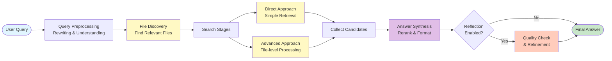

# KB-Bridge

[](https://github.com/egpivo/kb-bridge/actions)
[](https://app.codecov.io/github/egpivo/kb-bridge?branch=main)
<a href="https://pypi.org/project/kbbridge/"></a>


A Model Context Protocol (MCP) server for intelligent knowledge base search and retrieval with support for multiple backend providers.

## Installation

```bash
pip install kbbridge
```

## Quick Start

### Configuration

Create a `.env` file with your retrieval backend credentials:

```bash
# Required - Retrieval Backend Configuration
RETRIEVAL_ENDPOINT=https://api.dify.ai/v1  # Example: Dify endpoint
RETRIEVAL_API_KEY=your-retrieval-api-key
LLM_API_URL=https://your-llm-service.com/v1
LLM_MODEL=gpt-4o
LLM_API_TOKEN=your-token-here

# Optional
RERANK_URL=https://your-rerank-api.com
RERANK_MODEL=your-rerank-model
```

**Supported Backends:**

| Backend | Status | Notes |
|---------|--------|-------|
| Dify | Supported | Currently available |
| Others | Planned | Additional backends coming soon |

See `env.example` for all available configuration options.

### Running the Server

```bash
# Start server
python -m kbbridge.server --host 0.0.0.0 --port 5210

# Or using Makefile (if available)
make start
```

Server runs on `http://0.0.0.0:5210` with MCP endpoint at `http://0.0.0.0:5210/mcp`.

### Deployment Options

#### Option 1: Docker (Local Development / Simple Deployments)

For local development or simple single-container deployments:

```bash
# Build the image
docker build -t kbbridge:latest .

# Run with environment variables
docker run -d \
  --name kbbridge \
  -p 5210:5210 \
  --env-file .env \
  kbbridge:latest
```

For production deployments, use container orchestration platforms like Kubernetes with your preferred deployment method.

## Features

- **Backend Integration**: Extensible architecture supporting multiple retrieval backends
- **Multiple Search Methods**: Hybrid, semantic, keyword, and full-text search
- **Quality Reflection**: Automatic answer quality evaluation and refinement
- **Custom Instructions**: Domain-specific query guidance

## Workflow

KB-Bridge follows a multi-stage pipeline to ensure high-quality answers:



### Stage Details

**Query Preprocessing** (Optional)
- Query Rewriting: LLM-based expansion/relaxation to improve recall
- Query Understanding: Extract intent and decompose complex queries

**File Discovery**
- Semantic search to identify relevant files (recall-focused)
- Optional quality evaluation with automatic search expansion if quality is low

**Search Stages** (Parallel)
- **Direct Approach**: Simple query → retrieval → answer extraction (fallback)
- **Advanced Approach**: File-level processing with content boosting for precision

**Answer Synthesis**
- Rerank candidates by relevance (if reranking service available)
- Combine and deduplicate using LLM

**Quality Reflection** (Optional)
- Evaluate answer quality and refine if needed (up to max_iterations)

### Implementation Status

The orchestrator (`DatasetProcessor`) currently implements stages 1-3, 5-8. File Discovery Quality Evaluation (stage 4) is implemented but not yet integrated into the pipeline. See `.doc/FILE_DISCOVERY_EVALUATION_CONFIG.md` for details.

## Available Tools

- **`assistant`**: Intelligent search and answer extraction from knowledge bases
- **`file_discover`**: Discover relevant files using retriever + optional reranking
- **`file_lister`**: List files in knowledge base datasets
- **`keyword_generator`**: Generate search keywords using LLM
- **`retriever`**: Retrieve information using various search methods
- **`file_count`**: Get file count in knowledge base dataset

## Usage Examples

### Basic Query

```python
import asyncio
from fastmcp import Client


async def main():
    async with Client("http://localhost:5210/mcp") as client:
        result = await client.call_tool(
            "assistant",
            {
                "resource_id": "resource-id",
                "query": "What are the safety protocols?",
            },
        )
        print(result.content[0].text)

asyncio.run(main())
```

### With Custom Instructions

```python
await client.call_tool("assistant", {
    "resource_id": "hr_dataset",
    "query": "What is the maternity leave policy?",
    "custom_instructions": "Focus on HR compliance and legal requirements."
})
```

### With Query Rewriting

```python
await client.call_tool("assistant", {
    "resource_id": "resource-id",
    "query": "What are the safety protocols?",
    "enable_query_rewriting": True  # Enables LLM-based query expansion/relaxation
})
```

### With Document Filtering

```python
await client.call_tool("assistant", {
    "resource_id": "resource-id",
    "query": "What are the safety protocols?",
    "document_name": "safety_manual.pdf"  # Limit search to specific document
})
```

## Integration with Dify

You can plug KB-Bridge into a Dify Agent Workflow instead of calling MCP tools directly:

1. **Configure MCP Connection**
   - MCP server URL: `http://localhost:5210/mcp`
   - Add auth headers: `X-RETRIEVAL-ENDPOINT`, `X-RETRIEVAL-API-KEY`, `X-LLM-API-URL`, `X-LLM-MODEL`
2. **Create an Agent Workflow**
   - Add an “MCP Tool” node
   - Select tool: `assistant`
   - Map workflow variables to `resource_id`, `query`, and other tool parameters
3. **Run Queries**
   - User input → Agent → MCP `assistant` tool → Structured answer with citations

## Development

```bash
# Install development dependencies
pip install -e ".[dev]"

# Run tests
pytest tests/

# Format code
black kbbridge/ tests/

# Lint code
ruff check kbbridge/ tests/
```

## License

Apache-2.0
