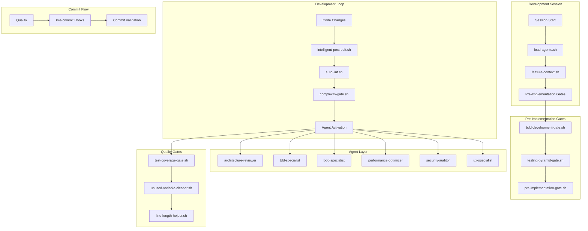
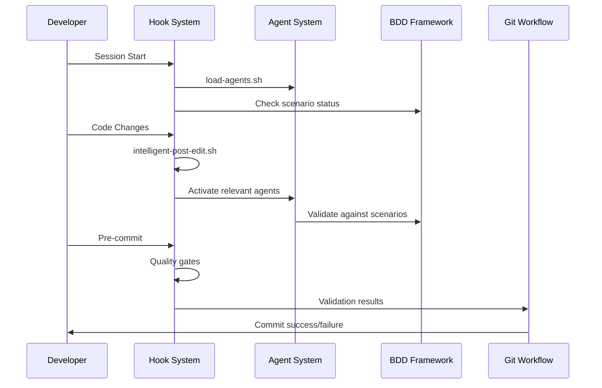
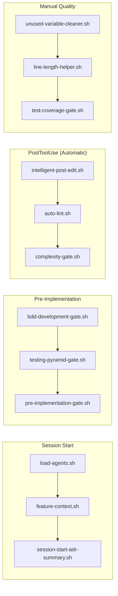
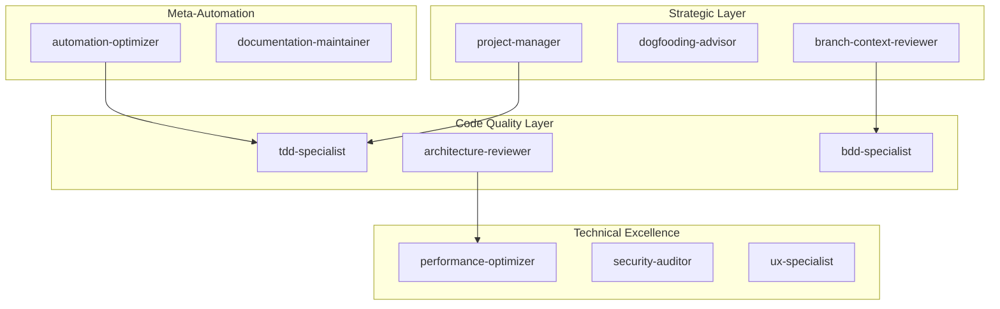
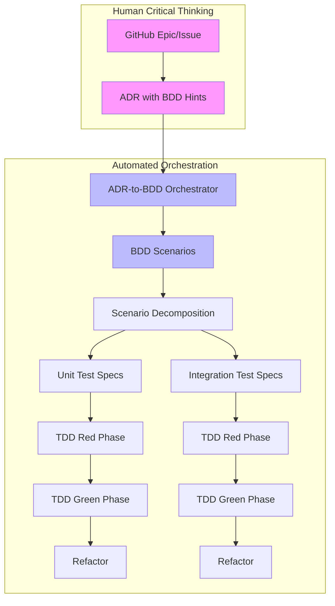
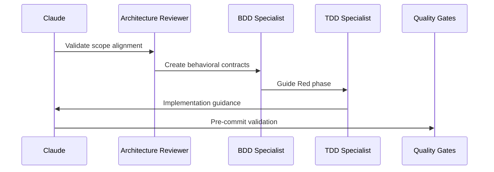
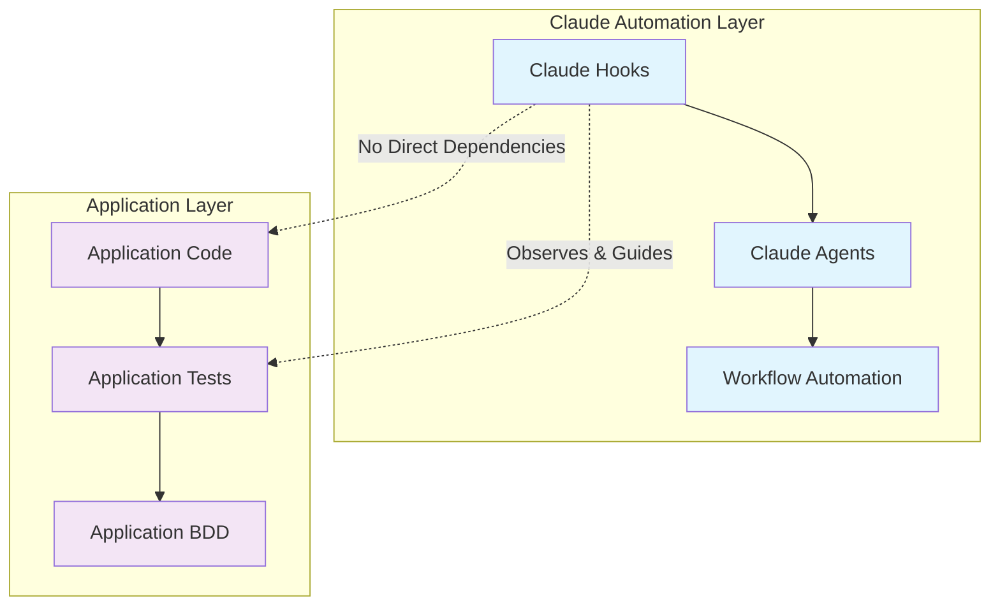

# Claude Code Automation Framework Architecture

This directory contains the comprehensive automation system for llm-orc development, combining intelligent hooks and specialized agents to enforce architectural discipline, maintain code quality, and prevent scope drift through BDD-driven development guardrails.

## System Overview & Philosophy

### Core Architecture Principles

The automation framework follows **ADR-004: BDD as LLM Development Guardrails**, implementing behavioral contracts that guide LLM-assisted development toward architecturally compliant implementations:

- **Issue-Driven Development**: All work aligns with specific GitHub issues and ADR scope
- **Branch Context Enforcement**: Branch names define scope boundaries for focused development
- **BDD Guardrails**: Behavioral contracts prevent architectural drift and ensure ADR compliance
- **TDD Discipline**: Red→Green→Refactor cycle with intelligent agent handoff
- **Progressive Quality Gates**: Automated fixes → Interactive guidance → Preventive blocks
- **Performance-First**: Fast execution to avoid interrupting development flow

### Framework Architecture Diagram



### Automation Integration Flow



## Hook System Architecture

### Hook Categories & Execution Flow

#### SessionStart Hooks
- **`load-agents.sh`**: Initializes specialized development agents for session
- **`feature-context.sh`**: Provides issue context and BDD scenario status
- **`session-start-adr-summary.sh`**: Shows current ADR compliance state

#### Pre-Implementation Gates
- **`bdd-development-gate.sh`**: Ensures BDD scenarios exist before implementation
- **`testing-pyramid-gate.sh`**: Shows pyramid health (70% unit, 20% integration, 10% BDD)
- **`pre-implementation-gate.sh`**: Validates architectural alignment with ADR scope

#### PostToolUse Hooks (Automatic)
- **`intelligent-post-edit.sh`**: Context-aware agent activation based on file patterns
- **`auto-lint.sh`**: Immediate formatting fixes (ruff check --fix, ruff format)
- **`complexity-gate.sh`**: Real-time complexity feedback with refactoring guidance

#### Development Workflow (Manual)
- **`implementation-checkpoint.sh`**: Continuous validation during development
- **`bdd-test-migrator.sh`**: Migrates passing tests to appropriate pyramid locations
- **`development-workflow-guide.sh`**: Provides workflow guidance and next steps

#### Quality Maintenance (Manual)
- **`unused-variable-cleaner.sh`**: Interactive cleanup of unused variables
- **`line-length-helper.sh`**: Refactoring suggestions for long lines (>88 chars)
- **`test-coverage-gate.sh`**: Ensures 95% test coverage before commits

#### ADR Lifecycle Management
- **`adr-lifecycle-manager.sh`**: Tracks ADR implementation progress
- **`bdd-unit-test-generator.sh`**: Generates unit tests from BDD scenarios

### Hook Timing Strategy



### Intelligent Agent Activation Patterns

The `intelligent-post-edit.sh` hook analyzes file patterns and activates relevant agents:

**File Pattern Triggers**:
- `src/llm_orc/core/` → `architecture-reviewer`, `performance-optimizer`
- `src/llm_orc/schemas/` → `architecture-reviewer`, `bdd-specialist`
- `tests/` → `tdd-specialist`, `bdd-specialist`
- `CLI interface files` → `ux-specialist`
- `Security-related files` → `security-auditor`
- `ADR changes` → `bdd-specialist`, `architecture-reviewer`

## Agent System Architecture

### Agent Philosophy & Design

Agents follow **2025 best practices for sub-agent design**:
- **Single Responsibility**: Each agent has one clear expertise domain
- **Proactive Language**: Descriptions use "PROACTIVELY" and "MUST BE USED" for better auto-selection
- **Tool Restrictions**: Limited tool access for security and performance
- **Cost Optimization**: Strategic model selection (Sonnet vs Haiku) based on complexity

### Agent Orchestration Strategy



### Core Development Agents

#### **llm-orc-architecture-reviewer** (Sonnet, Green)
- **Responsibility**: Ensures architectural alignment with multi-agent orchestration principles
- **Tools**: Read, Edit, Grep, Glob, WebFetch
- **Activation**: Core component changes, schema modifications, ADR updates
- **Key Functions**:
  - Component design review against established patterns
  - Performance impact assessment for async/parallel execution
  - API design consistency validation
  - Integration pattern compliance

#### **llm-orc-tdd-specialist** (Haiku, Red)
- **Responsibility**: Enforces strict TDD methodology (Red→Green→Refactor cycle)
- **Tools**: Read, Write, Edit, Bash, Grep, Glob
- **Activation**: Test file modifications, TDD cycle guidance
- **Key Functions**:
  - Red phase guidance (failing tests first)
  - Green phase validation (minimal implementation)
  - Refactor phase safety (behavior preservation)

#### **llm-orc-bdd-specialist** (Sonnet, Purple)
- **Responsibility**: Maintains BDD scenarios as architectural guardrails per ADR-004
- **Tools**: Read, Write, Edit, Grep, Glob
- **Activation**: Feature development, ADR changes, scope validation
- **Key Functions**:
  - Behavioral contract creation
  - Scenario-driven implementation guidance
  - ADR compliance validation through scenarios

#### **llm-orc-performance-optimizer** (Haiku, Orange)
- **Responsibility**: Identifies and addresses async execution and resource management bottlenecks
- **Tools**: Read, Edit, Bash, Grep, Glob
- **Activation**: Core execution changes, ensemble modifications
- **Key Functions**:
  - Async pattern optimization
  - Resource usage analysis
  - Parallel execution enhancement

#### **llm-orc-security-auditor** (Haiku, Yellow)
- **Responsibility**: Audits credential management, API security, and secure coding practices
- **Tools**: Read, Grep, Glob
- **Activation**: Security-sensitive file changes, credential handling
- **Key Functions**:
  - Credential management review
  - API security validation
  - Secure coding pattern enforcement

#### **llm-orc-ux-specialist** (Haiku, Cyan)
- **Responsibility**: Improves CLI interface, configuration management, and developer ergonomics
- **Tools**: Read, Edit, Grep, Glob
- **Activation**: CLI interface changes, configuration modifications
- **Key Functions**:
  - User experience optimization
  - Configuration interface design
  - Developer workflow enhancement

### Strategic & Meta Agents

#### **llm-orc-project-manager** (Sonnet, Blue)
- **Responsibility**: Manages development priorities and strategic roadmap guidance
- **Tools**: Read, WebFetch, WebSearch, Task
- **Activation**: Strategic planning, issue assessment
- **Key Functions**:
  - Priority management
  - Strategic alignment validation
  - Roadmap guidance

#### **automation-optimizer** (Sonnet, Magenta)
- **Responsibility**: Optimizes the entire automation ecosystem for maximum effectiveness
- **Tools**: Read, Bash, Grep, Glob
- **Activation**: Automation performance issues, workflow optimization
- **Key Functions**:
  - Agent usage pattern analysis
  - Hook performance optimization
  - Workflow integration enhancement

### Agent Tool Permissions & Security

```yaml
Development Agents:
  tools: [Read, Write, Edit, Bash, Grep, Glob]
  security: Restricted bash commands, file system access

Strategic Agents:
  tools: [Read, WebFetch, WebSearch, Task]
  security: No file system modification, external access only

Meta Agents:
  tools: [Read, Bash, Grep, Glob]
  security: Analysis only, limited system access
```

## BDD Development Guardrails (ADR-004)

### BDD as LLM Development Compass

The framework implements **executable behavioral specifications** that serve as guardrails, ensuring LLM-assisted development:
- Respects architectural decisions from ADRs
- Maintains coding standards compliance
- Follows TDD discipline
- Implements correct behavior, not just working code

### Issue-to-Behavior Translation Framework

```gherkin
Feature: Agent Execution Retry Logic (GitHub Issue #45)
  """
  LLM Development Guidance:

  This scenario translates issue #45 requirements into behavioral expectations
  that must be satisfied while respecting existing architectural patterns.

  Architectural Constraints (from ADRs):
  - ADR-003: Use exponential backoff with jitter for retry logic
  - ADR-001: Maintain Pydantic schema compliance throughout execution
  - ADR-002: Ensure composable primitive patterns aren't violated

  Coding Standards Requirements:
  - Exception chaining: raise NewException() from original_exception
  - Type safety: All function signatures must include return type annotations
  - Async patterns: Use asyncio.gather() for concurrent operations
  """
```

### BDD Integration Points

- **SessionStart**: Detects missing BDD scenarios for current issue
- **PreImplementation**: Generates behavioral contracts before coding
- **PostToolUse**: Updates scenarios when implementation changes
- **Continuous**: Validates implementation against behavioral contracts

## Configuration & Customization

### Hook Configuration

Hooks are configured in `.claude/settings.local.json`:

```json
{
  "permissions": {
    "allow": [
      "Bash(uv run pytest:*)",
      "Bash(make test:*)",
      "Bash(.claude/hooks/testing-pyramid-gate.sh:*)"
    ]
  }
}
```

### Agent Loading

Agents are automatically loaded via `.claude/hooks/load-agents.sh` on session start:

```bash
# Load all specialized development agents
claude agent load .claude/agents/llm-orc-architecture-reviewer.md
claude agent load .claude/agents/llm-orc-tdd-specialist.md
# ... additional agents
```

### Customizing Automation Behavior

#### Adding New Hooks
1. Create executable shell script in `.claude/hooks/`
2. Add appropriate error handling and exit codes
3. Update `.claude/settings.json` with hook configuration
4. Test with various file types and edge cases

#### Adding New Agents
1. Create markdown file with YAML frontmatter
2. Include "PROACTIVELY" and "MUST BE USED" in description
3. Specify appropriate tools and model
4. Test with `.claude/hooks/load-agents.sh`

## ADR-Driven Development Orchestration

### Workflow Philosophy

The framework distinguishes between:
- **Human Critical Thinking Phase**: GitHub issue analysis and ADR authoring
- **Automated Orchestration Phase**: ADR→BDD→TDD→Code translation

### ADR-to-Implementation Pipeline



### ADR Template with BDD Mapping Hints

ADRs should include BDD mapping hints to enable automated orchestration:

```yaml
## BDD Mapping Hints
behavioral_capabilities:
  - capability: "Script agents generate parameters dynamically"
    given: "A script with parameter_generator metadata"
    when: "Script executes in ensemble context"
    then: "Output becomes typed input for next agent"

test_boundaries:
  unit:
    - ScriptResolver.discover_parameter_generators()
    - TypeConverter.json_to_agent_request()
  integration:
    - script_to_agent_parameter_flow
    - ensemble_parameter_passing

validation_rules:
  - "Pydantic schema validation at boundaries"
  - "Type safety with mypy strict mode"
  - "Exception chaining for error context"
```

## Best Practices for Claude

### Development Workflow Integration

#### Phase 1: Human Critical Thinking
1. **Issue Analysis**: Understand the epic/feature requirements
2. **ADR Authoring**: Document architectural decisions with BDD hints
3. **Review & Approval**: Human validation of approach

#### Phase 2: Automated Orchestration
1. **ADR Status Change**: Mark ADR as "In Progress"
2. **Orchestrator Activation**: `llm-orc-adr-to-bdd-orchestrator` takes over
3. **BDD Generation**: Automated scenario creation from ADR hints
4. **Test Decomposition**: Break scenarios into unit/integration specs
5. **TDD Cycles**: Red→Green→Refactor with minimal intervention
6. **Progress Tracking**: Monitor completion across ADRs

#### During Development
1. **Follow Hook Recommendations**: Trust intelligent hook suggestions
2. **Use Targeted Agents**: Activate agents proactively based on work type
3. **Validate Scope Frequently**: Ensure work stays within branch context
4. **Maintain TDD Discipline**: Red→Green→Refactor cycle with agent guidance

#### Before Committing
1. **Quality Gates**: Run manual quality hooks if needed
2. **Test Coverage**: Ensure 95% coverage with `test-coverage-gate.sh`
3. **ADR Compliance**: Validate against current ADR requirements
4. **Hook Response**: Address all hook recommendations

### Agent Handoff Protocol



### Warning Signs & Recovery

#### Scope Drift Indicators
- Working on files outside issue scope
- Implementing features not in current ADR
- Ignoring hook recommendations without justification
- Testing components unrelated to branch context
- Mixing architectural concerns

#### Emergency Recovery Process
1. **Stop immediately** when scope drift is identified
2. **Use `llm-orc-architecture-reviewer`** for immediate scope validation
3. **Consult branch context** - what does the branch name/issue require?
4. **Review ADR alignment** - does this work advance the current ADR?
5. **Pivot back to scope** - abandon out-of-scope work if necessary

### Commit Discipline

#### Requirements for Any Commit
- All tests pass (`make test`)
- No linting violations (`make lint`)
- Single logical unit of work
- Aligns with current issue/ADR scope

#### Commit Message Standards
- No AI attribution (per project requirements)
- Natural, human-style messages
- Focus on "why" rather than "what"
- Reference issue numbers when relevant

## Practical Examples

### Example: Adding Retry Logic (Issue #45)

#### 1. Session Start
```bash
# Hooks automatically run
.claude/hooks/load-agents.sh          # Load agents
.claude/hooks/feature-context.sh      # Show issue context
.claude/hooks/bdd-development-gate.sh # Check BDD scenarios
```

#### 2. Pre-Implementation
```bash
# Manual validation
.claude/hooks/pre-implementation-gate.sh
.claude/hooks/testing-pyramid-gate.sh
```

#### 3. Development Loop
```bash
# Automatic after file changes
.claude/hooks/intelligent-post-edit.sh  # Activates performance-optimizer
.claude/hooks/auto-lint.sh              # Format code
.claude/hooks/complexity-gate.sh        # Check complexity
```

#### 4. Agent Activation
- **architecture-reviewer**: Validates retry pattern alignment
- **performance-optimizer**: Reviews async retry implementation
- **bdd-specialist**: Ensures behavioral contracts are met
- **tdd-specialist**: Guides Red→Green→Refactor cycle

### Example: Schema Changes

#### File Pattern Detection
```bash
# Modifying src/llm_orc/schemas/script_agent.py triggers:
- architecture-reviewer (schema design validation)
- bdd-specialist (contract updates)
```

#### Agent Handoff
1. **architecture-reviewer**: Validates schema design against ADR-001
2. **bdd-specialist**: Updates behavioral scenarios for schema changes
3. **tdd-specialist**: Ensures tests validate schema contracts

## Testing Strategy Integration

### Current Testing Pyramid Status
- **Unit Tests**: 93 (62%) - Target: 70%
- **Integration Tests**: 8 (5%) - Target: 20%
- **BDD Tests**: 50 (33%) - Target: 10%

**Issue**: Inverted pyramid - hooks guide toward proper balance

### Testing Hooks Integration
- **`testing-pyramid-gate.sh`**: Shows current balance and recommendations
- **`bdd-test-migrator.sh`**: Moves passing BDD tests to unit/integration layers
- **`test-coverage-gate.sh`**: Ensures 95% coverage before commits

## Separation of Concerns

### Critical Principle: Claude Automation ≠ Application Code

The automation framework maintains strict separation between:

#### Claude Automation Layer (`.claude/`)
- **Purpose**: Development process automation and quality gates
- **Scope**: Hooks, agents, and workflow automation
- **Dependencies**: Claude Code CLI, external tools (git, uv, pytest)
- **Location**: `.claude/hooks/`, `.claude/agents/`, `.claude/README.md`

#### Application Layer (`src/`, `tests/`)
- **Purpose**: llm-orc application logic and tests
- **Scope**: Core functionality, unit tests, integration tests, application BDD
- **Dependencies**: Python packages, application frameworks
- **Location**: `src/llm_orc/`, `tests/`

### Architectural Boundaries



### What Belongs Where

#### ✅ Claude Automation (`.claude/`)
- BDD development gates and scenario validation
- Issue-to-BDD mapping workflows
- ADR compliance checking
- Testing pyramid monitoring
- Agent-driven code review and guidance
- Development workflow optimization

#### ✅ Application Code (`src/`, `tests/`)
- Core llm-orc functionality (agents, ensembles, scripts)
- Unit tests for application components
- Integration tests for cross-component functionality
- Application-specific BDD scenarios for behavioral contracts
- Performance benchmarks and application metrics

#### ❌ Anti-Patterns (What NOT to do)
- Application tests calling `.claude/hooks/` scripts
- Application code importing Claude-specific modules
- Claude hooks directly modifying application source code
- Mixing ADR-004 meta-automation with application BDD scenarios
- Application dependencies on Claude Code CLI tools

### ADR-004 Implementation Separation

**ADR-004 is about Claude automation, not application BDD:**

- **Claude Automation Framework**: The hooks, agents, and processes that help Claude maintain architectural compliance
- **Application BDD Tests**: The behavioral contracts for llm-orc's actual functionality (script agents, ensembles, etc.)

The confusion occurred when application BDD tests began testing the meta-automation framework instead of focusing on application behavior.

## Advanced Automation Features

### Intelligent Context Awareness

The system maintains context across:
- **Branch scope**: Current issue and ADR focus
- **File patterns**: Automatic agent activation
- **Development phase**: Pre-implementation, development, pre-commit
- **Testing pyramid**: Health monitoring and rebalancing

### Meta-Optimization

The `automation-optimizer` agent continuously:
- Analyzes agent usage patterns
- Monitors hook execution performance
- Identifies automation gaps and redundancies
- Optimizes workflow integration

### Performance Monitoring

All hooks are designed for:
- **Fast execution**: Avoid workflow interruption
- **Error resilience**: Graceful handling of edge cases
- **User choice**: Interactive prompts with escape routes
- **Context preservation**: Maintain development flow

---

**Remember**: This automation system is designed to enhance development velocity while maintaining architectural integrity. Trust the hooks, use the agents proactively, and let the BDD guardrails guide implementation toward ADR-compliant solutions.

The framework creates a symbiotic relationship between human developers and AI assistance, where behavioral contracts ensure that increased development speed doesn't compromise architectural quality or long-term maintainability.