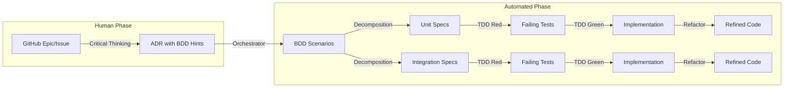

# ADR-004: BDD as LLM Development Guardrails & Architectural Enforcement

## Status
Implemented

## Implementation Status

### ✅ Core Framework (Complete)
- [x] BDD scenarios created in .claude/hooks/ and .claude/agents/
- [x] Core automation framework implemented
- [x] Hook system operational (bdd-development-gate.sh, testing-pyramid-gate.sh)
- [x] Agent system integrated (llm-orc-bdd-specialist, llm-orc-tdd-specialist)
- [x] Automation framework documented in .claude/README.md
- [x] Separation of concerns between Claude automation and application
- [x] ADR template with BDD mapping hints (docs/adr-template-with-bdd-hints.md)
- [x] Testing pyramid discipline enforcement (warning system operational)

### 🔄 Enhancements (Nice-to-have)
- [ ] ADR-to-BDD orchestrator agent
- [ ] Multi-ADR coordination hook
- [ ] Epic progress tracking system
- [ ] CI pipeline integration with GitHub workflows
- [ ] Pre-commit BDD validation hooks
- [ ] Automated documentation generation from scenarios
- [ ] Performance benchmarks and metrics collection

**Note**: The testing-pyramid-gate.sh warning that triggered this review actually demonstrates the system is working correctly - it's detecting coverage gaps and providing feedback as designed.

## BDD Integration
- **Scenario File**: .claude/hooks/ automation framework implementation
- **Test Command**: Manual hook execution and agent activation
- **Priority Scenario**: "Issue-to-BDD scenario generation workflow"

## Implementation Progress Log
- 2025-09-20: Core automation framework operational
- 2025-09-20: Proper separation between Claude automation and application achieved
- 2025-09-20: Application BDD tests cleaned of Claude-specific dependencies

## Architectural Compliance
- **Related ADRs**: ADR-001, ADR-002, ADR-003 (validation through automation)
- **Validation Rules**: Separation of concerns between automation and application
- **Breaking Changes**: None - Claude automation is orthogonal to application

## Context

### LLM-Assisted Development Challenges
As llm-orc development increasingly relies on LLM assistance (Claude, GitHub Copilot, etc.), we face specific challenges that traditional development processes don't address:

1. **Architectural Drift**: LLMs may implement features without understanding architectural constraints from ADRs
2. **Context Loss**: LLMs receive GitHub issues but lack behavioral context linking requirements to architecture
3. **Standards Inconsistency**: LLMs may not consistently apply coding standards (type safety, exception chaining, async patterns)
4. **TDD Discipline**: LLMs need clear behavioral specifications to drive proper Red→Green→Refactor cycles
5. **Pattern Adherence**: LLMs may solve problems in ways that violate established architectural patterns

### Current Development Flow Gaps
```
GitHub Issue → LLM Analysis → Implementation Attempt
     ↓              ↓                    ↓
 Vague           Incomplete        Architectural
Requirements    Context           Non-compliance
```

**Missing:** Behavioral contracts that bridge requirements to architecture

### Vision: BDD as LLM Development Compass
Create **executable behavioral specifications** that serve as guardrails, ensuring LLM-assisted development:
- Respects architectural decisions from ADRs
- Maintains coding standards compliance
- Follows TDD discipline
- Implements the right behavior, not just working code

## Decision

Implement **ADR-driven BDD orchestration framework** that automates the translation of human-authored ADRs into executable behavioral contracts, enabling LLM assistants to autonomously deliver tested implementations through BDD→TDD→Code pipelines with minimal human intervention after the ADR phase.

## Detailed Design

### Core Philosophy: ADR-Driven Orchestration

The framework recognizes two distinct phases:
1. **Human Critical Thinking**: Issue definition and ADR authoring
2. **Automated Orchestration**: ADR→BDD→TDD→Code translation

#### ADR-to-BDD Orchestration Architecture


#### Enhanced ADR Template with BDD Mapping
```yaml
# ADR-XXX: Title

## Status
{Status}

## BDD Mapping Hints
behavioral_capabilities:
  - capability: "Primary behavior to implement"
    given: "Initial state or precondition"
    when: "Triggering action"
    then: "Expected outcome"

test_boundaries:
  unit:
    - "Component or function to test"
    - "Pure logic to validate"
  integration:
    - "Cross-component interaction"
    - "External service boundary"

validation_rules:
  - "Type safety requirements"
  - "Performance constraints"
  - "Error handling patterns"

## Context
{Original context}

## Decision
{Original decision}
```

### Core Philosophy: Behavioral Contracts for LLMs

#### 1. Issue-to-Behavior Translation Framework
```gherkin
# features/github-issues/issue-45-agent-retry-logic.feature

Feature: Agent Execution Retry Logic (GitHub Issue #45)
  """
  LLM Development Guidance:
  
  This scenario translates issue #45 requirements into behavioral expectations
  that must be satisfied while respecting existing architectural patterns.
  
  Architectural Constraints (from ADRs):
  - ADR-003: Use exponential backoff with jitter for retry logic
  - ADR-001: Maintain Pydantic schema compliance throughout execution
  - ADR-002: Ensure composable primitive patterns aren't violated
  
  Coding Standards Requirements:
  - Exception chaining: raise NewException() from original_exception
  - Type safety: All function signatures must include return type annotations
  - Async patterns: Use asyncio.gather() for concurrent operations
  - Line length: Maximum 88 characters with proper line breaking
  """

  Background:
    Given an llm-orc development environment
    And existing ADR constraints must be respected
    And coding standards must be maintained

  Scenario: Implement retry logic that respects architectural boundaries
    Given an agent configuration prone to transient failures
    And retry settings with exponential backoff per ADR-003
    And maximum retry attempts set to 3
    When the agent execution encounters TimeoutError on first 2 attempts
    And succeeds on the 3rd attempt
    Then the system should retry with exponential backoff intervals
    And each retry should include jitter to prevent thundering herd
    And all exceptions should maintain proper exception chaining
    And the final AgentResult should include retry metadata
    And execution should complete within overall ensemble timeout
    And no existing Pydantic schemas should be modified
    And the implementation should pass mypy strict type checking
```

#### 2. ADR Compliance Validation Framework
```gherkin
# features/architectural-compliance/adr-003-error-handling.feature

Feature: ADR-003 Error Handling Pattern Compliance
  """
  LLM Architectural Enforcement:
  
  This feature ensures any error handling implementation follows
  the established patterns from ADR-003, preventing architectural drift.
  """

  Scenario Template: Error handling follows ADR-003 patterns
    Given any component that handles exceptions
    When an error occurs during execution
    Then exceptions should be chained using 'from' clause
    And error context should be preserved throughout the stack
    And user-facing errors should be wrapped in domain-specific exceptions
    And internal errors should include diagnostic information
    And retry logic should use exponential backoff with jitter
    And circuit breaker patterns should be applied for external services

  Scenario: Agent execution error propagation
    Given an agent that encounters an API timeout
    When the timeout occurs during model inference
    Then the timeout should be caught and chained
    And wrapped in AgentExecutionTimeoutError
    And include agent name and timeout duration
    And propagate to ensemble execution level
    And trigger retry logic if configured
    And maintain proper async exception handling
```

#### 3. Coding Standards Enforcement
```gherkin
# features/coding-standards/type-safety-compliance.feature

Feature: Type Safety Compliance Enforcement
  """
  LLM Standards Guardrails:
  
  These scenarios ensure all LLM-generated code maintains
  the strict type safety requirements defined in coding standards.
  """

  Scenario: Function signatures maintain type safety
    Given any new function implementation
    When the function is added to the codebase
    Then it must include parameter type annotations
    And it must include return type annotation
    And it must use modern type syntax (str | None not Optional[str])
    And generic types must be properly specified (list[str] not list)
    And the function must pass mypy strict type checking
    And line length must not exceed 88 characters

  Scenario: Exception handling maintains standards
    Given any exception handling code
    When exceptions are caught and re-raised
    Then original exceptions must be chained using 'from'
    And exception messages must be descriptive
    And exception types must be domain-appropriate
    And no bare 'except:' clauses are allowed
    And async exception handling must be properly structured
```

#### 4. TDD Integration Framework
```gherkin
# features/tdd-discipline/red-green-refactor-cycle.feature

Feature: TDD Cycle Discipline for LLM Development
  """
  LLM TDD Guidance:
  
  These scenarios provide the behavioral specifications that should
  drive the Red phase of TDD, ensuring proper test-first development.
  """

  Scenario: Red Phase - Write failing test for retry logic
    Given a need to implement agent retry functionality
    When I start the TDD cycle
    Then I should first write a test that expects retry behavior
    And the test should fail because retry logic doesn't exist yet
    And the test should validate the complete behavioral specification
    And the test should include error cases and edge conditions
    And the test should verify ADR compliance

  Scenario: Green Phase - Minimal implementation to pass tests
    Given failing tests for retry functionality
    When I implement the minimal solution
    Then all tests should pass
    And the implementation should satisfy behavioral requirements
    And no additional features should be implemented
    And the code should maintain architectural compliance

  Scenario: Refactor Phase - Improve structure while maintaining behavior
    Given working retry implementation with passing tests
    When I refactor for better code structure
    Then all existing tests must continue to pass
    And code quality should improve (complexity, readability)
    And architectural patterns should be better expressed
    And no behavioral changes should occur
```

### LLM Development Workflow Integration

#### 1. Issue Analysis Workflow
```python
# Development workflow for LLMs receiving GitHub issues

def analyze_github_issue_with_bdd(issue_number: int) -> LLMDevelopmentPlan:
    """
    LLM workflow for translating GitHub issues to implementation plan.
    
    1. Load relevant BDD scenarios based on issue labels/content
    2. Identify applicable ADR constraints
    3. Extract behavioral requirements from scenarios
    4. Plan TDD cycle with proper Red phase
    5. Generate implementation strategy that respects guardrails
    """
    
    # Step 1: Find relevant BDD scenarios
    scenarios = find_bdd_scenarios_for_issue(issue_number)
    
    # Step 2: Extract architectural constraints
    adr_constraints = extract_adr_references(scenarios)
    
    # Step 3: Plan implementation approach
    return LLMDevelopmentPlan(
        behavioral_requirements=scenarios,
        architectural_constraints=adr_constraints,
        tdd_cycle_plan=plan_red_green_refactor(scenarios),
        coding_standards=extract_standards_requirements(scenarios)
    )
```

#### 2. BDD-Driven Development Steps
```gherkin
Feature: LLM Development Process with BDD Guardrails

  Scenario: LLM receives GitHub issue and uses BDD for guidance
    Given an LLM assistant receives GitHub issue #45 "Add retry logic"
    When the LLM analyzes the issue for implementation
    Then it should first consult relevant BDD scenarios
    And identify applicable ADR constraints from scenario documentation
    And extract behavioral requirements from scenario descriptions
    And plan TDD cycle starting with Red phase
    And ensure implementation approach respects architectural guardrails
    And validate coding standards compliance throughout implementation

  Scenario: LLM implements feature following BDD behavioral contracts
    Given BDD scenarios defining expected retry behavior
    And ADR constraints for error handling patterns
    When the LLM implements the retry functionality
    Then it should write failing tests that match BDD scenarios first
    And implement minimal code to satisfy behavioral contracts
    And ensure all ADR compliance requirements are met
    And maintain coding standards throughout implementation
    And refactor only after tests pass, preserving behavior
```

### Framework Architecture: pytest-bdd + Custom Extensions

#### 1. Core BDD Framework Setup
```python
# conftest.py - BDD test configuration
import pytest
from pytest_bdd import scenarios, given, when, then
from llm_orc.testing.bdd_extensions import (
    ADRComplianceValidator,
    CodingStandardsValidator,
    ArchitecturalPatternValidator
)

# Load all BDD scenarios
scenarios('features/')

@pytest.fixture
def adr_compliance_validator():
    """Validates implementation against ADR requirements."""
    return ADRComplianceValidator()

@pytest.fixture
def coding_standards_validator():
    """Validates code meets strict coding standards."""
    return CodingStandardsValidator()
```

#### 2. Custom BDD Extensions for Architectural Compliance
```python
# llm_orc/testing/bdd_extensions.py

class ADRComplianceValidator:
    """Validates implementation compliance with ADR constraints."""
    
    def validate_error_handling_adr_003(self, implementation_code: str) -> bool:
        """Ensure error handling follows ADR-003 patterns."""
        # Check for proper exception chaining
        # Validate exponential backoff patterns
        # Ensure circuit breaker implementations
        pass
    
    def validate_pydantic_schemas_adr_001(self, schemas: list) -> bool:
        """Ensure Pydantic schema compliance per ADR-001."""
        # Validate schema structure
        # Check type safety compliance
        # Ensure backward compatibility
        pass

class CodingStandardsValidator:
    """Validates code meets project coding standards."""
    
    def validate_type_annotations(self, function_code: str) -> bool:
        """Ensure all functions have proper type annotations."""
        # Check parameter annotations
        # Validate return type annotations
        # Ensure modern type syntax usage
        pass
    
    def validate_exception_chaining(self, exception_code: str) -> bool:
        """Ensure proper exception chaining patterns."""
        # Check for 'from' clause usage
        # Validate exception message quality
        # Ensure no bare except clauses
        pass
```

#### 3. BDD Step Definitions with Architectural Enforcement
```python
# steps/architectural_compliance_steps.py

@given('existing ADR constraints must be respected')
def ensure_adr_constraints(adr_compliance_validator):
    """Setup ADR compliance validation for scenario."""
    pytest.current_scenario.adr_validator = adr_compliance_validator

@then('exceptions should be chained using \'from\' clause')
def validate_exception_chaining(coding_standards_validator, captured_exceptions):
    """Validate proper exception chaining in implementation."""
    for exception in captured_exceptions:
        assert coding_standards_validator.validate_exception_chaining(exception)

@then('the implementation should pass mypy strict type checking')
def validate_mypy_compliance(implementation_files):
    """Ensure implementation passes strict mypy validation."""
    result = subprocess.run(['mypy', '--strict'] + implementation_files)
    assert result.returncode == 0, "Implementation failed mypy strict checking"

@then('no existing Pydantic schemas should be modified')
def validate_schema_stability(adr_compliance_validator, original_schemas):
    """Ensure backward compatibility of existing schemas."""
    current_schemas = load_current_schemas()
    assert adr_compliance_validator.validate_schema_compatibility(
        original_schemas, current_schemas
    )
```

### CI Integration for LLM Development Validation

#### 1. BDD Guardrails Pipeline
```yaml
# .github/workflows/bdd-guardrails.yml
name: BDD Guardrails Validation

on:
  pull_request:
    paths: ['src/**', 'tests/**']

jobs:
  validate-llm-development:
    runs-on: ubuntu-latest
    steps:
      - uses: actions/checkout@v3
      
      - name: Setup Python Environment
        uses: actions/setup-python@v4
        with:
          python-version: '3.12'
          
      - name: Install Dependencies
        run: |
          pip install -e .
          pip install pytest-bdd
          
      - name: Run BDD Architectural Compliance
        run: |
          pytest tests/bdd/features/architectural-compliance/ \
            --bdd-guardrails \
            --adr-compliance-strict
            
      - name: Run BDD Coding Standards Validation
        run: |
          pytest tests/bdd/features/coding-standards/ \
            --coding-standards-strict \
            --mypy-integration
            
      - name: Run BDD TDD Discipline Validation
        run: |
          pytest tests/bdd/features/tdd-discipline/ \
            --validate-test-first-development
            
      - name: Generate Compliance Report
        run: |
          python scripts/generate_compliance_report.py \
            --bdd-results results.json \
            --output compliance-report.md
```

#### 2. Pre-commit Integration
```yaml
# .pre-commit-config.yaml
repos:
  - repo: local
    hooks:
      - id: bdd-guardrails
        name: BDD Guardrails Validation
        entry: python scripts/validate_bdd_compliance.py
        language: python
        pass_filenames: false
        always_run: true
```

### LLM Development Examples

#### 1. Issue Analysis with BDD Guidance
```
GitHub Issue #45: "Add retry logic to agent execution"

LLM Analysis Process:
1. Consult features/github-issues/issue-45-agent-retry-logic.feature
2. Extract behavioral requirements:
   - Must use exponential backoff per ADR-003
   - Must maintain Pydantic schema compliance
   - Must include proper exception chaining
3. Plan TDD cycle:
   - Red: Write test expecting retry behavior
   - Green: Implement minimal retry logic
   - Refactor: Improve structure while preserving behavior
4. Validate architectural compliance throughout
```

#### 2. Implementation with BDD Validation
```python
# LLM-generated implementation guided by BDD scenarios

async def execute_agent_with_retry(
    self, 
    agent_config: AgentConfig, 
    input_data: str,
    retry_config: RetryConfig
) -> AgentResult:
    """Execute agent with retry logic per BDD scenario requirements."""
    
    last_exception: Exception | None = None
    
    for attempt in range(retry_config.max_attempts):
        try:
            result = await asyncio.wait_for(
                self._execute_single_agent(agent_config, input_data),
                timeout=agent_config.timeout_seconds
            )
            
            # Include retry metadata per BDD scenario requirement
            result.retry_metadata = RetryMetadata(
                attempts_made=attempt + 1,
                total_duration=time.time() - start_time
            )
            return result
            
        except asyncio.TimeoutError as e:
            last_exception = e
            if attempt < retry_config.max_attempts - 1:
                # Exponential backoff with jitter per ADR-003
                delay = calculate_backoff_delay(attempt, retry_config)
                await asyncio.sleep(delay)
            
    # Proper exception chaining per coding standards
    raise AgentExecutionTimeoutError(
        f"Agent failed after {retry_config.max_attempts} attempts"
    ) from last_exception
```

## Benefits

### Architectural Consistency
- **ADR Enforcement**: Automatic validation that implementations respect architectural decisions
- **Pattern Adherence**: Behavioral contracts prevent architectural drift
- **Design Integrity**: LLM implementations stay true to established patterns

### Development Quality
- **Standards Compliance**: Automated validation of coding standards
- **Type Safety**: Enforced type annotation and mypy compliance
- **Error Handling**: Consistent exception patterns across all LLM-generated code

### LLM Development Enhancement
- **Clear Guidance**: Behavioral specifications provide implementation direction
- **Context Preservation**: ADR constraints embedded in scenarios prevent context loss
- **TDD Discipline**: Scenarios drive proper test-first development

### Maintainability
- **Behavioral Documentation**: Scenarios serve as living documentation
- **Change Safety**: BDD scenarios catch regressions in architectural compliance
- **Refactoring Confidence**: Behavioral contracts enable safe code improvements

## Trade-offs

### Implementation Overhead
- **Scenario Maintenance**: BDD scenarios must be kept current with ADR changes
- **Framework Complexity**: Additional testing layer requires learning and maintenance
- **CI Pipeline**: Extended build times due to comprehensive behavioral validation

### Development Workflow Changes
- **Process Discipline**: Developers must write BDD scenarios before implementation
- **Tool Learning**: Team needs familiarity with pytest-bdd and custom extensions
- **Documentation Burden**: Scenarios require detailed architectural context

### Performance Considerations
- **Test Execution Time**: Behavioral tests may run longer than unit tests
- **CI Resource Usage**: Comprehensive validation increases pipeline resource consumption
- **Development Velocity**: Initial setup and learning curve may slow development

## Implementation Strategy

### Phase 1: Core Framework (Current Sprint)
1. **Setup pytest-bdd** with custom extensions for ADR validation
2. **Create pilot scenarios** for one GitHub issue (retry logic)
3. **Implement ADR compliance validators** for error handling patterns
4. **CI integration** with basic BDD guardrails validation

### Phase 2: Standards Integration
1. **Coding standards validators** for type safety and exception handling
2. **mypy integration** with BDD scenario validation
3. **Pre-commit hooks** for BDD compliance checking
4. **Documentation generation** from BDD scenarios

### Phase 3: Comprehensive Coverage
1. **BDD scenarios for all ADRs** with architectural pattern validation
2. **GitHub issue templates** linking to relevant BDD scenarios
3. **LLM development workflow** documentation with BDD integration
4. **Community contribution** guidelines including BDD requirements

### Phase 4: Advanced Automation
1. **Automated scenario generation** from ADR changes
2. **Issue-to-BDD mapping** for faster LLM development cycles
3. **Performance benchmarking** through behavioral scenarios
4. **Architectural evolution tracking** via scenario compliance metrics

## Success Metrics

### Architectural Compliance
- **ADR Violation Rate**: 0% of merged code violates established ADR patterns
- **Pattern Consistency**: 100% of similar implementations follow same patterns
- **Architectural Drift**: Zero instances of unintentional pattern violations

### Code Quality
- **Standards Compliance**: 100% of code passes coding standards validation
- **Type Safety**: Zero mypy errors in strict mode
- **Exception Handling**: 100% proper exception chaining compliance

### LLM Development Effectiveness
- **Implementation Speed**: Faster issue-to-implementation cycle with BDD guidance
- **First-Pass Quality**: Higher percentage of LLM code passing review on first submission
- **Context Preservation**: Reduced architectural guidance needed during code review

### Maintainability
- **Scenario Coverage**: 100% of ADRs have corresponding BDD scenarios
- **Documentation Accuracy**: BDD scenarios accurately reflect current implementation
- **Refactoring Safety**: Zero behavioral regressions during code improvements

This ADR establishes BDD as a crucial tool for maintaining architectural integrity and development quality in an LLM-assisted development environment, ensuring that the benefits of AI assistance don't come at the cost of architectural consistency or code quality.