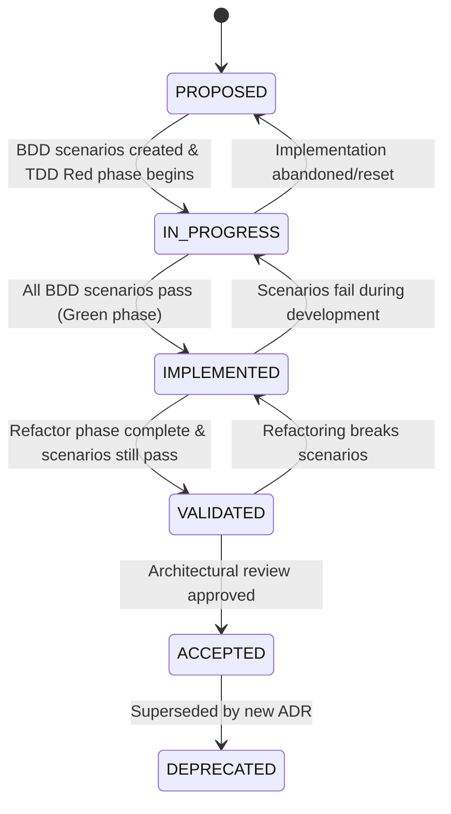

# ADR Lifecycle Management Process

## Overview

This document defines the lifecycle management process for Architecture Decision Records (ADRs) integrated with our BDD-driven development approach.

## ADR Status Lifecycle

### Status Definitions

```python
class ADRStatus(Enum):
    PROPOSED = "proposed"         # Initial state when ADR is written
    IN_PROGRESS = "in_progress"   # Implementation has begun with BDD scenarios
    IMPLEMENTED = "implemented"   # All BDD scenarios pass (Green phase)
    VALIDATED = "validated"       # Post-refactor validation complete
    ACCEPTED = "accepted"         # Final approval and documentation complete
    DEPRECATED = "deprecated"     # Replaced by newer ADR
```

### State Transition Rules



## Integration with BDD-Driven TDD

### Phase 1: PROPOSED → IN_PROGRESS
**Trigger**: BDD scenarios created and Red phase TDD begins

**Requirements**:
- [ ] BDD feature file exists in `tests/bdd/features/adr-{number}-*.feature`
- [ ] BDD scenarios include ADR compliance validation
- [ ] Step definitions created with failing tests (Red phase)
- [ ] Implementation tasks added to project tracking

**ADR File Updates**:
```yaml
## Status
In Progress

## Implementation Status
- [x] BDD scenarios created in tests/bdd/features/adr-001-pydantic-interfaces.feature
- [ ] Core implementation begun
- [ ] All BDD scenarios passing
- [ ] Refactor phase complete
- [ ] Architectural compliance validated

## BDD Integration
- **Scenario File**: tests/bdd/features/adr-001-pydantic-interfaces.feature
- **Test Command**: `uv run pytest tests/bdd/ -k adr-001`
- **Priority Scenario**: "Script agent executes with JSON input/output contract"
```

### Phase 2: IN_PROGRESS → IMPLEMENTED
**Trigger**: All BDD scenarios pass (TDD Green phase)

**Requirements**:
- [ ] All BDD scenarios for this ADR pass
- [ ] Core architectural patterns implemented
- [ ] Type safety and coding standards maintained
- [ ] No architectural violations detected

**Validation Commands**:
```bash
# Validate BDD scenarios pass
uv run pytest tests/bdd/features/adr-001-*.feature -v

# Validate type safety
uv run mypy src/ --strict

# Validate coding standards
uv run ruff check src/
```

### Phase 3: IMPLEMENTED → VALIDATED
**Trigger**: Refactor phase complete with scenarios still passing

**Requirements**:
- [ ] Post-refactor BDD scenarios still pass
- [ ] Code quality metrics improved
- [ ] No behavioral changes detected
- [ ] Performance benchmarks maintained

**Validation Process**:
1. Run full BDD scenario suite
2. Compare before/after metrics
3. Validate architectural pattern consistency
4. Ensure backward compatibility

### Phase 4: VALIDATED → ACCEPTED
**Trigger**: Architectural review and approval complete

**Requirements**:
- [ ] Peer review completed
- [ ] Documentation updated
- [ ] Integration examples provided
- [ ] Migration path documented (if applicable)

## ADR File Template Structure

```yaml
# ADR-{number}: {Title}

## Status
{PROPOSED|IN_PROGRESS|IMPLEMENTED|VALIDATED|ACCEPTED|DEPRECATED}

## Implementation Status
{Phase-specific checklist - see below}

## BDD Integration
- **Scenario File**: tests/bdd/features/adr-{number}-{slug}.feature
- **Test Command**: uv run pytest tests/bdd/ -k adr-{number}
- **Priority Scenario**: "{Most important scenario}"

## Context
{Original content}

## Decision
{Original content}

## Implementation Progress Log
{Timestamped updates on progress}

## Architectural Compliance
- **Related ADRs**: {List of dependent/related ADRs}
- **Validation Rules**: {Specific compliance requirements}
- **Breaking Changes**: {Any backward compatibility impacts}
```

## Implementation Status Templates

### For PROPOSED Status
```yaml
## Implementation Status
- [ ] BDD scenarios created
- [ ] Step definitions implemented (Red phase)
- [ ] Implementation tasks planned
- [ ] Dependencies identified
```

### For IN_PROGRESS Status
```yaml
## Implementation Status
- [x] BDD scenarios created in {scenario_file}
- [ ] Core implementation begun
- [ ] Schema system implemented
- [ ] Integration layer complete
- [ ] All BDD scenarios passing
- [ ] Error handling compliance (ADR-003)
- [ ] Type safety validation
```

### For IMPLEMENTED Status
```yaml
## Implementation Status
- [x] BDD scenarios created in {scenario_file}
- [x] Core implementation complete
- [x] All BDD scenarios passing
- [x] Integration tests passing
- [ ] Refactor phase complete
- [ ] Performance benchmarks met
- [ ] Documentation updated
```

### For VALIDATED Status
```yaml
## Implementation Status
- [x] All implementation complete
- [x] All BDD scenarios passing
- [x] Refactor phase complete
- [x] Performance benchmarks met
- [ ] Peer review complete
- [ ] Integration examples provided
- [ ] Migration documentation complete
```

## Automation Integration

### Git Hooks
```bash
# .git/hooks/pre-commit
#!/bin/bash
# Validate ADR status consistency with BDD scenario state

python scripts/validate_adr_consistency.py
```

### CI Integration
```yaml
# .github/workflows/adr-lifecycle-validation.yml
name: ADR Lifecycle Validation

on:
  pull_request:
    paths: ['docs/adrs/**', 'tests/bdd/**']

jobs:
  validate-adr-lifecycle:
    runs-on: ubuntu-latest
    steps:
      - name: Validate ADR Status Consistency
        run: |
          python scripts/validate_adr_lifecycle.py

      - name: Check BDD Scenario Coverage
        run: |
          python scripts/check_bdd_coverage.py docs/adrs/

      - name: Validate Status Transitions
        run: |
          python scripts/validate_status_transitions.py
```

### Helper Scripts

#### ADR Status Updater
```python
# scripts/update_adr_status.py
"""Update ADR status based on BDD scenario results."""

import sys
from pathlib import Path
from enum import Enum

class ADRStatus(Enum):
    PROPOSED = "proposed"
    IN_PROGRESS = "in_progress"
    IMPLEMENTED = "implemented"
    VALIDATED = "validated"
    ACCEPTED = "accepted"
    DEPRECATED = "deprecated"

def update_adr_status(adr_number: str, new_status: ADRStatus) -> None:
    """Update ADR status and implementation checklist."""
    adr_file = Path(f"docs/adrs/{adr_number:03d}-*.md")

    # Update status line
    # Update implementation status checklist
    # Validate transition is allowed
    # Log transition with timestamp

def validate_transition(current_status: ADRStatus, new_status: ADRStatus) -> bool:
    """Validate status transition follows allowed rules."""
    allowed_transitions = {
        ADRStatus.PROPOSED: [ADRStatus.IN_PROGRESS],
        ADRStatus.IN_PROGRESS: [ADRStatus.IMPLEMENTED, ADRStatus.PROPOSED],
        ADRStatus.IMPLEMENTED: [ADRStatus.VALIDATED, ADRStatus.IN_PROGRESS],
        ADRStatus.VALIDATED: [ADRStatus.ACCEPTED, ADRStatus.IMPLEMENTED],
        ADRStatus.ACCEPTED: [ADRStatus.DEPRECATED],
    }
    return new_status in allowed_transitions.get(current_status, [])
```

#### BDD Scenario Coverage Checker
```python
# scripts/check_bdd_coverage.py
"""Ensure all ADRs have corresponding BDD scenarios."""

def check_adr_bdd_coverage() -> bool:
    """Verify all ADRs have BDD scenarios."""
    adrs = list(Path("docs/adrs/").glob("*.md"))
    bdd_features = list(Path("tests/bdd/features/").glob("adr-*.feature"))

    missing_scenarios = []
    for adr in adrs:
        adr_number = extract_adr_number(adr.name)
        expected_feature = f"adr-{adr_number:03d}-*.feature"

        if not any(feature.name.startswith(f"adr-{adr_number:03d}")
                  for feature in bdd_features):
            missing_scenarios.append(adr.name)

    return len(missing_scenarios) == 0
```

## Usage Examples

### Updating ADR-001 to IN_PROGRESS
```bash
# After creating BDD scenarios for ADR-001
python scripts/update_adr_status.py 001 in_progress
```

### Checking if ADR-001 is ready for IMPLEMENTED status
```bash
# Run BDD scenarios to validate implementation
uv run pytest tests/bdd/features/adr-001-*.feature -v

# If all pass, update status
python scripts/update_adr_status.py 001 implemented
```

### Validating ADR lifecycle consistency
```bash
# Check all ADRs have proper BDD coverage
python scripts/check_bdd_coverage.py

# Validate current status matches implementation reality
python scripts/validate_adr_consistency.py
```

## Benefits

1. **Clear Progress Tracking**: Explicit status provides visibility into implementation progress
2. **BDD Integration**: Status transitions tied to behavioral validation
3. **Automated Validation**: Scripts ensure consistency between status and implementation
4. **Architectural Compliance**: BDD scenarios enforce ADR compliance throughout lifecycle
5. **Documentation Accuracy**: Status reflects actual implementation state

This lifecycle management process ensures ADRs remain living documents that accurately reflect implementation progress while maintaining architectural integrity through BDD-driven validation.