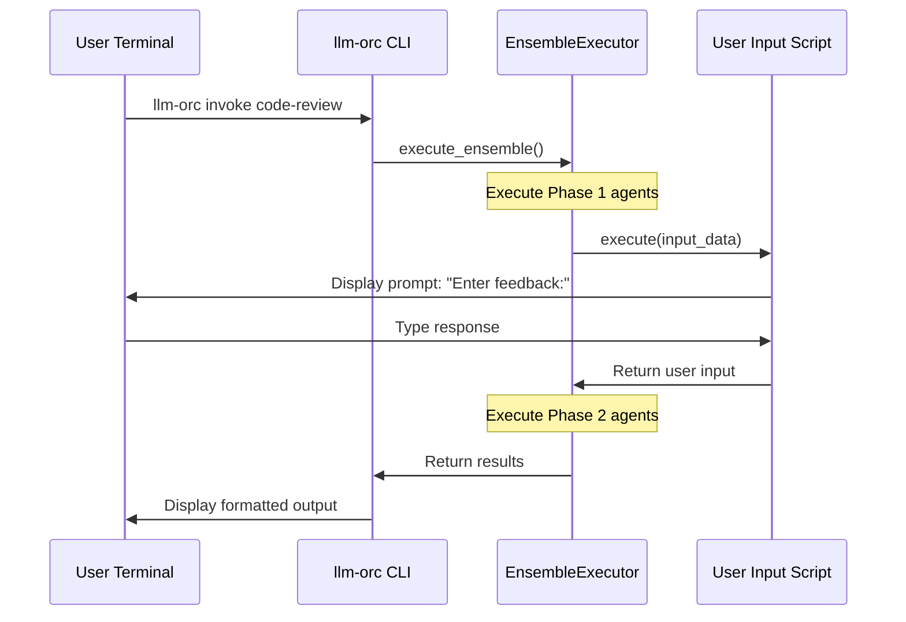
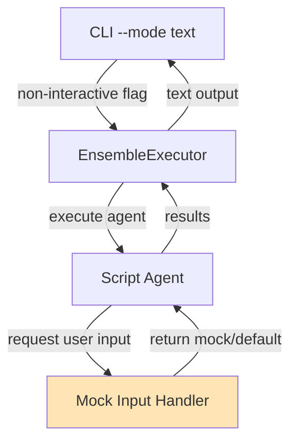
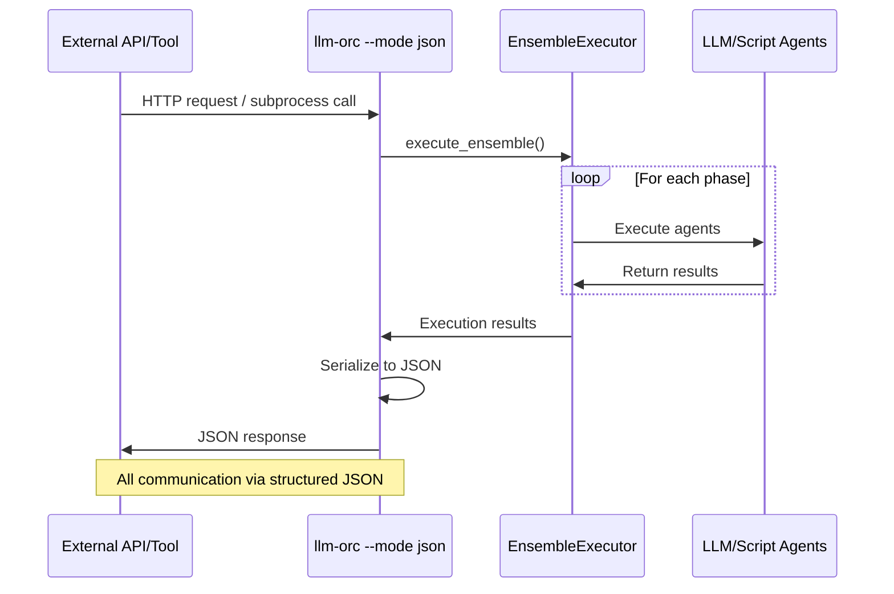
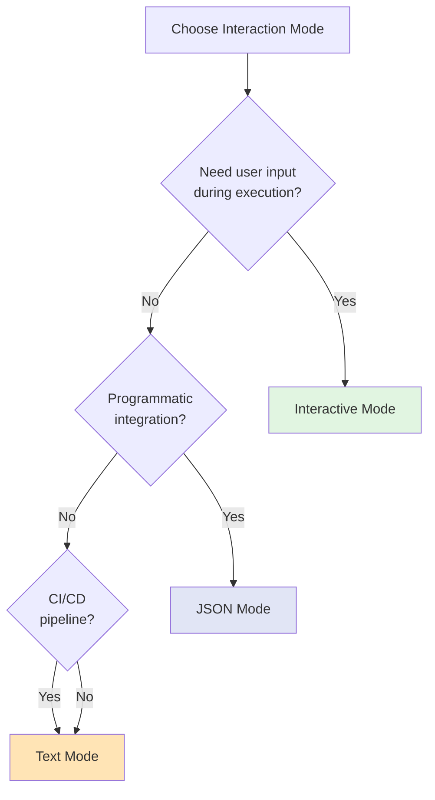

# CLI Interaction Modes

## Overview

llm-orc supports three interaction modes for ensemble execution, each optimized for different use cases:

1. **Interactive Mode** - Human-in-the-loop workflows with real-time user input
2. **Text Mode** - Non-interactive execution with text output
3. **JSON Mode** - Programmatic integration with structured JSON output

## Mode Comparison

| Feature | Interactive | Text | JSON |
|---------|------------|------|------|
| **User Input** | Real-time prompts | Pre-configured/mocked | Pre-configured/mocked |
| **Output Format** | Human-readable text | Plain text | Structured JSON |
| **Use Case** | Development, debugging | CI/CD, scripts | API integration, automation |
| **Agent Output** | Streamed during execution | Collected and displayed | Full result object |
| **Error Display** | Detailed with context | Summary with stack trace | Structured error object |

## Interactive Mode

### Usage

```bash
# Default mode when running from terminal
llm-orc invoke ensemble-name
llm-orc invoke --interactive ensemble-name
```

### Behavior

**User Input Agents:**
```yaml
agents:
  - name: get-user-feedback
    script: primitives/user-interaction/get_user_input.py
    parameters:
      prompt: "Enter your feedback:"
      multiline: true
```

**Terminal Interaction:**
```
🎯 Executing ensemble: code-review-workflow
📋 Phase 1: Analyzing code...
✓ analyzer completed (2.3s)

💬 get-user-feedback prompts:
Enter your feedback:
> [User types response here]
Good analysis, but add security concerns

✓ get-user-feedback completed (15.2s)
📋 Phase 2: Synthesizing results...
✓ synthesizer completed (1.8s)

✅ Ensemble completed successfully (19.3s total)
```

### Architecture Flow



### Features

- **Real-time streaming** - Agent outputs appear as they complete
- **Progress indicators** - Visual feedback during execution
- **Rich formatting** - Colors, emojis, and structured text
- **Error recovery** - Interactive prompts for error handling
- **Interrupt handling** - Graceful Ctrl+C support

### Example: Interactive Code Review

```yaml
name: interactive-code-review
description: Code review with human feedback

agents:
  - name: analyzer
    model_profile: gpt-4-turbo
    system_prompt: "Analyze code for issues"

  - name: human-review
    script: primitives/user-interaction/get_user_input.py
    depends_on: [analyzer]
    parameters:
      prompt: |
        AI Analysis Complete. Review findings:
        ${analyzer.analysis}

        Additional concerns or feedback?
      multiline: true

  - name: final-report
    model_profile: claude-sonnet
    system_prompt: "Generate final report with AI and human feedback"
    depends_on: [human-review]
```

**Execution:**
```bash
$ llm-orc invoke interactive-code-review

🎯 Starting: interactive-code-review

📋 Phase 1: Analysis
🤖 analyzer analyzing...
✓ analyzer completed (3.2s)

Analysis found:
- 2 potential security issues
- 3 code style violations
- 1 performance concern

💬 human-review prompts:
AI Analysis Complete. Review findings:
[... analysis shown ...]

Additional concerns or feedback?
> The performance concern about the database query is valid.
> We should also check for SQL injection in the user input handler.

✓ human-review completed (45.1s)

📋 Phase 2: Synthesis
🤖 final-report synthesizing...
✓ final-report completed (2.1s)

✅ Review complete! (50.4s total)
```

## Text Mode

### Usage

```bash
# Force text mode (disables interactive input)
llm-orc invoke --mode text ensemble-name
llm-orc invoke --no-interactive ensemble-name

# Redirect output
llm-orc invoke --mode text ensemble-name > results.txt
```

### Behavior

**User Input Agents:**
User input scripts receive pre-configured mock responses or fail if not configured:

```yaml
agents:
  - name: get-input
    script: primitives/user-interaction/get_user_input.py
    parameters:
      prompt: "Enter value:"
      # In text mode, must provide default or mock response
      mock_response: "automated test value"
```

**Terminal Output:**
```
[2025-09-29 10:00:00] Starting ensemble: code-review-workflow
[2025-09-29 10:00:00] Phase 1: analyzer
[2025-09-29 10:00:02] Phase 1 complete (2.3s)
[2025-09-29 10:00:02] Phase 2: synthesizer
[2025-09-29 10:00:04] Phase 2 complete (1.8s)
[2025-09-29 10:00:04] Ensemble completed (4.1s)

Final Results:
==============
[Agent outputs formatted as text]
```

### Architecture Flow



### Features

- **Non-interactive execution** - No user prompts
- **Plain text output** - Easy parsing and redirection
- **Timestamped logs** - Execution timeline
- **CI/CD friendly** - Exit codes and error messages
- **Deterministic** - Reproducible results with mocked inputs

### Example: Automated Testing

```bash
# Run ensemble in CI pipeline
#!/bin/bash
set -e

echo "Running code analysis..."
llm-orc invoke --mode text code-analysis > analysis-results.txt

if grep -q "CRITICAL" analysis-results.txt; then
    echo "Critical issues found!"
    exit 1
fi

echo "Analysis passed!"
```

## JSON Mode

### Usage

```bash
# JSON output mode
llm-orc invoke --mode json ensemble-name
llm-orc invoke --output json ensemble-name

# Parse with jq
llm-orc invoke --mode json ensemble-name | jq '.results[] | select(.success == true)'
```

### Output Format

```json
{
  "ensemble_name": "code-review-workflow",
  "execution_id": "exec_20250929_100000",
  "status": "success",
  "duration_seconds": 4.1,
  "timestamp": "2025-09-29T10:00:00Z",
  "phases": [
    {
      "phase_number": 1,
      "agents": ["analyzer"],
      "duration_seconds": 2.3,
      "status": "success"
    },
    {
      "phase_number": 2,
      "agents": ["synthesizer"],
      "duration_seconds": 1.8,
      "status": "success"
    }
  ],
  "results": {
    "analyzer": {
      "success": true,
      "data": {
        "issues_found": 6,
        "severity": "medium",
        "details": [...]
      },
      "metadata": {
        "model": "gpt-4-turbo",
        "tokens": 1250
      }
    },
    "synthesizer": {
      "success": true,
      "data": {
        "report": "...",
        "recommendations": [...]
      },
      "metadata": {
        "model": "claude-sonnet",
        "tokens": 890
      }
    }
  },
  "metadata": {
    "cost_usd": 0.0234,
    "total_tokens": 2140
  }
}
```

### Architecture Flow



### Features

- **Structured output** - Machine-parseable JSON
- **Complete metadata** - Execution details, costs, timing
- **Error details** - Structured error objects with stack traces
- **API integration** - Easy consumption by other tools
- **Programmatic control** - Full access to execution state

### Example: API Integration

```python
import subprocess
import json

def run_code_analysis(code_path: str) -> dict:
    """Run llm-orc analysis and return structured results."""

    result = subprocess.run(
        [
            "llm-orc", "invoke",
            "--mode", "json",
            "code-analysis",
            "--parameter", f"code_path={code_path}"
        ],
        capture_output=True,
        text=True,
        check=True
    )

    return json.loads(result.stdout)

# Usage
analysis = run_code_analysis("src/main.py")

if analysis["status"] == "success":
    issues = analysis["results"]["analyzer"]["data"]["issues_found"]
    print(f"Found {issues} issues")

    if issues > 0:
        details = analysis["results"]["analyzer"]["data"]["details"]
        for issue in details:
            print(f"  - {issue['severity']}: {issue['message']}")
```

### Error Format

```json
{
  "ensemble_name": "code-review-workflow",
  "execution_id": "exec_20250929_100000",
  "status": "error",
  "error": {
    "type": "ScriptExecutionError",
    "message": "Script primitives/analysis.py failed with exit code 1",
    "details": {
      "script_path": "/path/to/primitives/analysis.py",
      "exit_code": 1,
      "stderr": "FileNotFoundError: data.json not found"
    },
    "stack_trace": "...",
    "agent_name": "analyzer",
    "phase": 1
  },
  "partial_results": {
    "previous_agents": {...}
  },
  "duration_seconds": 1.2,
  "timestamp": "2025-09-29T10:00:00Z"
}
```

## Mode Selection Decision Tree



## Configuration

### Global Defaults

```yaml
# ~/.llm-orc/config.yaml
defaults:
  interaction_mode: interactive  # or 'text', 'json'
  output_format: pretty           # or 'minimal', 'json'
  color_output: true
```

### Per-Ensemble Configuration

```yaml
# ensemble.yaml
name: automated-analysis
description: Analysis ensemble for CI/CD

execution:
  default_mode: text  # Override global default
  allow_interactive: false  # Prevent interactive prompts
  output_format: json
```

### Environment Variables

```bash
# Force specific mode
export LLM_ORC_MODE=json
llm-orc invoke ensemble-name

# Disable colors for logs
export LLM_ORC_NO_COLOR=1
llm-orc invoke ensemble-name
```

## Best Practices

### Development
- Use **Interactive Mode** for development and debugging
- Enable verbose logging: `llm-orc invoke --verbose ensemble-name`
- Test user input flows manually before automation

### Testing
- Use **Text Mode** with mocked inputs for unit/integration tests
- Provide `mock_response` parameters for all user input agents
- Assert on output text patterns or exit codes

### Production
- Use **JSON Mode** for API integration and automation
- Parse JSON output for programmatic control flow
- Implement error handling based on structured error objects

### CI/CD
- Use **Text Mode** or **JSON Mode** depending on needs
- Set non-zero exit codes on ensemble failure
- Log outputs to files for debugging: `llm-orc invoke --mode text ensemble > logs/run.txt`

## Related Documentation

- [Script Agent Architecture](script-agent-architecture.md) - How script agents integrate
- [ADR-005: Multi-Turn Conversations](adrs/005-multi-turn-agent-conversations.md) - Conversation state and input handling
- [Ensemble Configuration](ensemble-configuration.md) - Ensemble YAML syntax