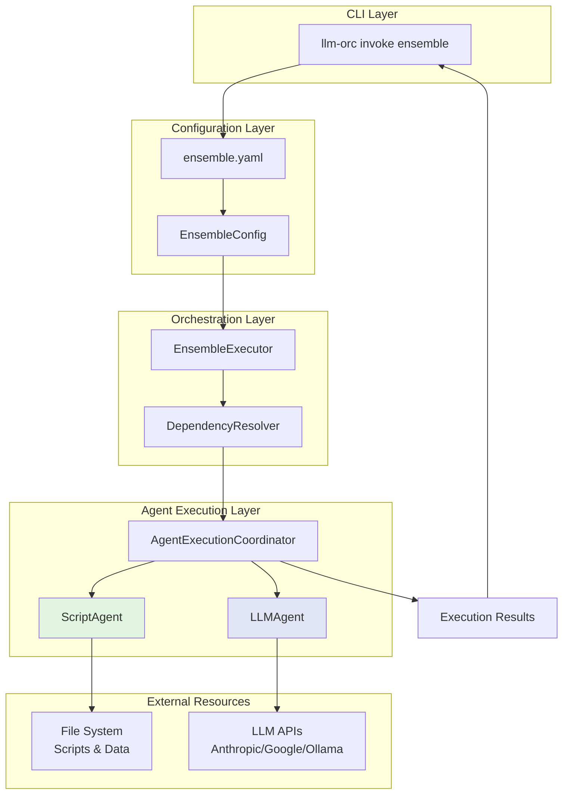
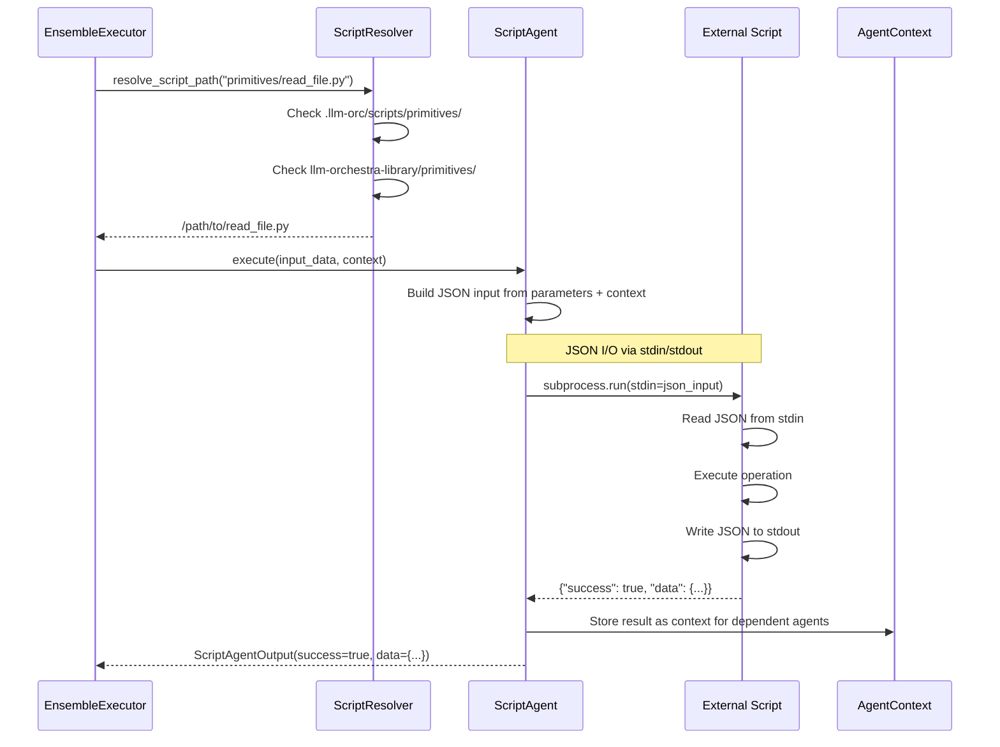
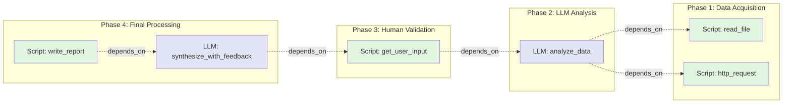
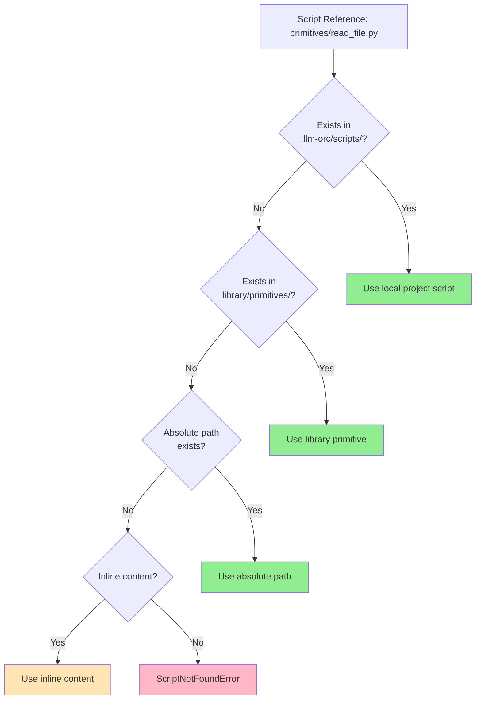
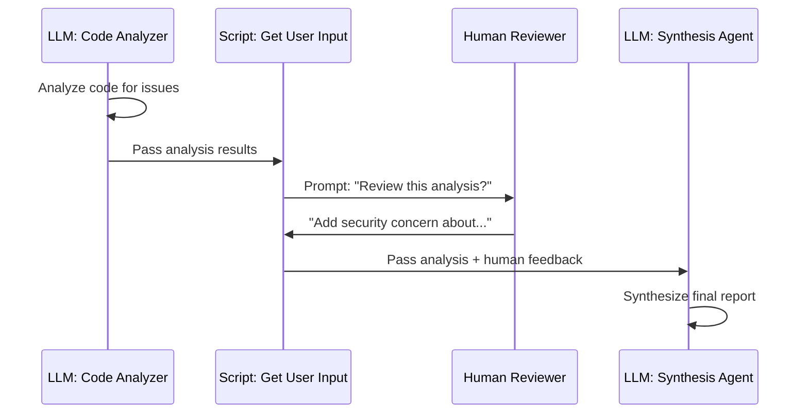
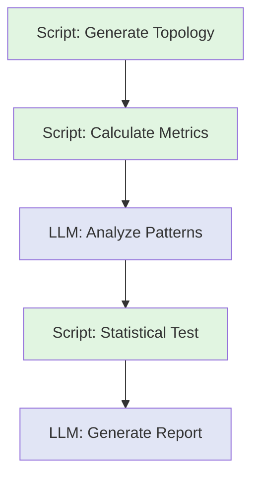

# Script Agent Architecture

## Overview

Script agents enable deterministic processing, external tool integration, and human-in-the-loop workflows within llm-orc's ensemble orchestration system. They interoperate seamlessly with LLM agents through a unified JSON I/O interface based on Pydantic schemas.

**Key Architectural Documents:**
- [ADR-001: Pydantic Script Agent Interfaces](adrs/001-pydantic-script-agent-interfaces.md)
- [ADR-002: Composable Primitive System](adrs/002-composable-primitive-agent-system.md)
- [ADR-003: Testable Script Contracts](adrs/003-testable-script-agent-contracts.md)
- [ADR-006: Library-Based Primitives](adrs/006-library-based-primitives-architecture.md)

## Core Principles

### 1. Implicit Agent Typing

Agents are identified by fields present, not explicit type declarations:

```yaml
agents:
  # Script agent - identified by 'script' field
  - name: data-extractor
    script: primitives/file-ops/read_file.py
    parameters:
      path: "data.json"

  # LLM agent - identified by 'model_profile' field
  - name: analyzer
    model_profile: gpt-4-turbo
    system_prompt: "Analyze the extracted data"
    depends_on: [data-extractor]
```

### 2. Pure Primitive-Driven Architecture

Complex behaviors emerge from primitive composition. No special modes or infrastructure:

```yaml
# Interactive game = loop + user input + LLM generation
name: cyberpunk-detective
agents:
  - name: game-loop
    script: primitives/control-flow/loop_until_quit.py

  - name: player-input
    script: primitives/user-interaction/get_user_input.py
    depends_on: [game-loop]

  - name: narrative-generator
    model_profile: creative-storyteller
    depends_on: [player-input]
```

### 3. Library-Based Content Separation

Primitives live in `llm-orchestra-library` submodule, not in core application:

```
llm-orc/                          # Orchestration infrastructure
└── src/llm_orc/
    ├── agents/script_agent.py    # Script execution engine
    ├── core/execution/
    │   └── script_resolver.py    # Script discovery
    └── schemas/script_agent.py   # Type-safe I/O schemas

llm-orchestra-library/            # Orchestrable content
└── primitives/
    ├── file-ops/
    ├── user-interaction/
    ├── data-transform/
    └── research/
```

## Agent Type Comparison

### Script Agents vs LLM Agents

| Aspect | Script Agent | LLM Agent |
|--------|-------------|-----------|
| **Identification** | Has `script` field | Has `model_profile` field |
| **Execution** | Subprocess with JSON I/O | API call with text I/O |
| **Determinism** | Fully deterministic | Non-deterministic (unless cached) |
| **Cost** | Free (local execution) | API costs per request |
| **Capabilities** | File I/O, external tools, user input | Natural language reasoning |
| **Caching** | Results cached by input hash | Optional response caching |
| **Use Cases** | Data processing, validation, external integration | Analysis, generation, reasoning |

## System Architecture

### High-Level Ensemble Execution Flow



### Script Agent Execution Detail



### Mixed Agent Type Ensemble



## JSON I/O Contract

All script agents communicate via JSON I/O following Pydantic schemas:

### Input Schema (ScriptAgentInput)

```python
class ScriptAgentInput(BaseModel):
    """Base input schema for all script agents."""
    agent_name: str
    input_data: str
    context: dict[str, Any] = Field(default_factory=dict)
    dependencies: dict[str, Any] = Field(default_factory=dict)
```

**Example Input:**
```json
{
  "agent_name": "data-processor",
  "input_data": "Process this data",
  "context": {
    "execution_id": "abc123",
    "timestamp": "2025-09-29T10:00:00Z"
  },
  "dependencies": {
    "data-extractor": {
      "success": true,
      "data": {"records": [1, 2, 3]}
    }
  }
}
```

### Output Schema (ScriptAgentOutput)

```python
class ScriptAgentOutput(BaseModel):
    """Base output schema for all script agents."""
    success: bool
    data: Any = None
    error: str | None = None
    metadata: dict[str, Any] = Field(default_factory=dict)
```

**Example Output:**
```json
{
  "success": true,
  "data": {
    "processed_records": 3,
    "results": [...]
  },
  "metadata": {
    "execution_time_ms": 150,
    "script_version": "1.0.0"
  }
}
```

### Category-Specific Schemas

Different primitive categories have specialized schemas (see [ADR-002](adrs/002-composable-primitive-agent-system.md)):

**User Interaction:**
```python
class UserInteractionInput(BaseModel):
    agent_name: str
    prompt: str
    multiline: bool = False
    validation_pattern: str | None = None
```

**File Operations:**
```python
class FileOperationInput(BaseModel):
    agent_name: str
    operation: Literal["read", "write", "append"]
    path: str
    content: str | None = None
```

**Data Transformation:**
```python
class DataTransformInput(BaseModel):
    source_data: Any
    transformation: str
    parameters: dict[str, Any] = Field(default_factory=dict)
```

## Script Resolution

### Search Path Priority

ScriptResolver finds scripts in this order:

1. **Relative paths from project root** - `.llm-orc/scripts/`
2. **Library primitives** - `llm-orchestra-library/primitives/`
3. **Absolute paths** - `/usr/local/bin/script.py`
4. **Inline content** - Backward compatibility (deprecated)



### Example Resolution

```yaml
agents:
  # Resolved from library
  - name: reader
    script: primitives/file-ops/read_file.py
    # → llm-orchestra-library/primitives/file-ops/read_file.py

  # Resolved from local project
  - name: custom-processor
    script: scripts/custom/process_data.py
    # → .llm-orc/scripts/custom/process_data.py

  # Absolute path
  - name: system-tool
    script: /usr/local/bin/analyzer.py
    # → /usr/local/bin/analyzer.py
```

## Primitive Categories

### Core Primitives (in llm-orchestra-library)

#### File Operations (`primitives/file-ops/`)
- `read_file.py` - Read file content with encoding support
- `write_file.py` - Write content to file
- `list_files.py` - List directory contents
- `file_exists.py` - Check file existence

#### User Interaction (`primitives/user-interaction/`)
- `get_user_input.py` - Prompt for user input
- `confirm_action.py` - Yes/no confirmation
- `select_option.py` - Multiple choice selection
- `pause_for_review.py` - Pause for human review

#### Data Transformation (`primitives/data-transform/`)
- `json_extract.py` - Extract fields from JSON
- `json_merge.py` - Merge multiple JSON objects
- `json_filter.py` - Filter JSON by criteria
- `format_markdown.py` - Convert data to markdown

#### Control Flow (`primitives/control-flow/`)
- `loop_until.py` - Conditional looping
- `replicate_n_times.py` - Repeat execution N times
- `aggregate_results.py` - Combine multiple outputs
- `conditional_execute.py` - Conditional execution

#### Research & Analytics (`primitives/research/`)
- `t_test.py` - Statistical significance testing
- `anova.py` - Analysis of variance
- `effect_size.py` - Cohen's d calculation
- `compare_populations.py` - Population comparison

#### Network Science (`primitives/network-science/`)
- `generate_topology.py` - Create network topologies
- `calculate_centrality.py` - Centrality metrics
- `detect_communities.py` - Community detection
- `measure_emergence.py` - Emergent properties

## Use Case Patterns

### Pattern 1: Human-in-the-Loop Code Review



**Ensemble Configuration:**
```yaml
name: code-review-with-human
agents:
  - name: analyzer
    model_profile: gpt-4-turbo
    system_prompt: "Analyze code for issues"

  - name: get-human-review
    script: primitives/user-interaction/get_user_input.py
    depends_on: [analyzer]
    parameters:
      prompt: "Review AI analysis. Any additional concerns?"
      multiline: true

  - name: synthesizer
    model_profile: claude-sonnet
    system_prompt: "Synthesize automated and human feedback"
    depends_on: [get-human-review]
```

### Pattern 2: Network Science Experiment



**Ensemble Configuration:**
```yaml
name: network-topology-study
agents:
  - name: generate-network
    script: primitives/network-science/generate_topology.py
    parameters:
      topology_type: small_world
      nodes: 100
      k: 6
      p: 0.1
    cache: true  # Deterministic results cached

  - name: calculate-metrics
    script: primitives/network-science/calculate_centrality.py
    depends_on: [generate-network]

  - name: analyze-patterns
    model_profile: network-analyst
    system_prompt: "Analyze network topology for emergence patterns"
    depends_on: [calculate-metrics]

  - name: statistical-test
    script: primitives/research/t_test.py
    depends_on: [analyze-patterns]
    parameters:
      baseline_type: random_network
      alpha: 0.05

  - name: generate-report
    model_profile: research-writer
    system_prompt: "Generate academic research report"
    depends_on: [statistical-test]
```

### Pattern 3: Interactive Narrative Game

```yaml
name: cyberpunk-detective
description: Interactive fiction with AI narration

agents:
  - name: game-state
    script: scripts/game/state_manager.py
    parameters:
      initial_state:
        location: neon_alley
        inventory: [neural_link, coffee_credits]

  - name: narrator
    model_profile: creative-storyteller
    system_prompt: "Create atmospheric cyberpunk narrative"
    depends_on: [game-state]

  - name: player-input
    script: primitives/user-interaction/get_user_input.py
    depends_on: [narrator]
    parameters:
      prompt: "> "

  - name: update-state
    script: scripts/game/process_action.py
    depends_on: [player-input]
```

## Error Handling and Exception Chaining

Script agents use proper exception chaining (ADR-003):

```python
try:
    result = subprocess.run(
        [script_path],
        input=json_input,
        capture_output=True,
        timeout=30
    )
except subprocess.TimeoutExpired as e:
    raise ScriptExecutionError(
        f"Script {script_path} timed out after 30s"
    ) from e
except subprocess.CalledProcessError as e:
    raise ScriptExecutionError(
        f"Script {script_path} failed with exit code {e.returncode}"
    ) from e
```

## Testing and Validation

### Contract Validation

All primitives implement `ScriptContract` for type safety:

```python
class ScriptContract(ABC):
    @classmethod
    @abstractmethod
    def input_schema(cls) -> type[BaseModel]:
        """Input schema for validation."""
        pass

    @classmethod
    @abstractmethod
    def output_schema(cls) -> type[BaseModel]:
        """Output schema for validation."""
        pass
```

### BDD Testing

Behavior-driven tests validate script agent functionality:

```gherkin
Scenario: Script agent executes with JSON I/O
  Given a script agent with JSON input/output contract
  When the agent executes with valid input
  Then output conforms to ScriptAgentOutput schema
  And downstream agents receive structured data
```

Run tests:
```bash
# All script agent tests
uv run pytest tests/bdd/ -k "script"

# Specific ADR tests
uv run pytest tests/bdd/ -k "adr-001"
```

## Performance Considerations

### Caching

Script agents support result caching for deterministic operations:

```yaml
agents:
  - name: expensive-calculation
    script: primitives/research/monte_carlo.py
    parameters:
      iterations: 1000000
    cache: true  # Results cached by input hash
```

### Parallel Execution

Independent script agents execute in parallel:

```yaml
agents:
  # These three run concurrently (no dependencies)
  - name: read-file-1
    script: primitives/file-ops/read_file.py
    parameters: {path: "data1.json"}

  - name: read-file-2
    script: primitives/file-ops/read_file.py
    parameters: {path: "data2.json"}

  - name: read-file-3
    script: primitives/file-ops/read_file.py
    parameters: {path: "data3.json"}
```

## Future Enhancements

See [ADR-005](adrs/005-multi-turn-agent-conversations.md) for multi-turn conversation support (70% implemented).

### Planned Features
- LLMResponseGenerator for automated conversation testing
- Visual workflow designer for ensemble composition
- Advanced conversation patterns (branching, merging)
- Performance optimization for large-scale ensembles
- Artifact management with versioned execution history

## Related Documentation

- [Coding Standards](coding-standards.md) - Code quality requirements
- [ADR Index](adrs/README.md) - Architecture decision records
- [Development Workflow](commands.md) - Make commands and TDD cycle