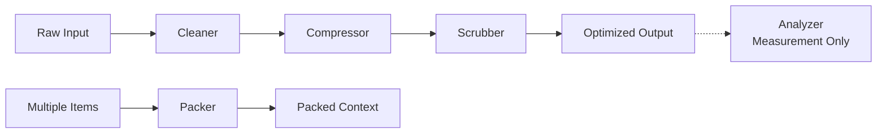

# Modules Overview

Prompt Refiner is organized into 5 core modules plus measurement utilities.

## The 5 Core Modules

### 1. Cleaner - Clean Dirty Data

The Cleaner module removes unwanted artifacts from your text.

**Operations:**

- **[StripHTML](../api-reference/cleaner.md#striphtml)** - Remove or convert HTML tags
- **[NormalizeWhitespace](../api-reference/cleaner.md#normalizewhitespace)** - Collapse excessive whitespace
- **[FixUnicode](../api-reference/cleaner.md#fixunicode)** - Remove problematic Unicode characters
- **[JsonCleaner](../api-reference/cleaner.md#jsoncleaner)** - Strip nulls/empties from JSON, minify

**When to use:**

- Processing web-scraped content
- Cleaning user-generated text
- Compressing JSON from RAG APIs
- Normalizing text from various sources

[Learn more →](cleaner.md){ .md-button }

### 2. Compressor - Reduce Size

The Compressor module reduces token count while preserving meaning.

**Operations:**

- **[TruncateTokens](../api-reference/compressor.md#truncatetokens)** - Smart text truncation with sentence boundaries
- **[Deduplicate](../api-reference/compressor.md#deduplicate)** - Remove similar or duplicate content

**When to use:**

- Fitting content within context windows
- Optimizing RAG retrieval results
- Reducing API costs

[Learn more →](compressor.md){ .md-button }

### 3. Scrubber - Security & Privacy

The Scrubber module protects sensitive information.

**Operations:**

- **[RedactPII](../api-reference/scrubber.md#redactpii)** - Automatically redact personally identifiable information

**When to use:**

- Before sending data to external APIs
- Compliance with privacy regulations
- Protecting user data in logs

[Learn more →](scrubber.md){ .md-button }

### 4. Packer - Context Budget Management

The Packer module manages context budgets with intelligent priority-based item selection.

**Operations:**

- **[MessagesPacker](../api-reference/packer.md#messagespacker)** - Pack items for chat completion APIs
- **[TextPacker](../api-reference/packer.md#textpacker)** - Pack items for text completion APIs

**When to use:**

- RAG applications with multiple documents
- Chatbots with conversation history
- Managing context windows with size limits
- Combining system prompts, user input, and documents

[Learn more →](packer.md){ .md-button }

### 5. Strategy - Preset Strategies

The Strategy module provides benchmark-tested preset strategies for quick setup.

**Strategies:**

- **[MinimalStrategy](../api-reference/strategy.md#minimalstrategy)** - 4.3% reduction, 98.7% quality
- **[StandardStrategy](../api-reference/strategy.md#standardstrategy)** - 4.8% reduction, 98.4% quality
- **[AggressiveStrategy](../api-reference/strategy.md#aggressivestrategy)** - 15% reduction, 96.4% quality

**When to use:**

- Quick setup without manual configuration
- Benchmark-tested optimization presets
- Extending with additional custom operations

[Learn more →](../api-reference/strategy.md){ .md-button }

---

## Measurement Utilities

### Analyzer - Measure Impact

The Analyzer module **measures optimization impact but does not transform prompts**. Use it to track token savings and demonstrate ROI.

**Operations:**

- **[TokenTracker](../api-reference/analyzer.md#tokentracker)** - Measure token savings and calculate ROI
- **[Token Counters](../api-reference/analyzer.md#token-counter-functions)** - Built-in functions for counting tokens

**When to use:**

- Demonstrating cost savings to stakeholders
- A/B testing optimization strategies
- Monitoring optimization impact over time
- Calculating ROI for prompt optimization

[Learn more →](analyzer.md){ .md-button }

---

## Combining Modules

The real power comes from combining modules:

### Pipeline Example

```python
from prompt_refiner import (
    TokenTracker,              # Analyzer
    StripHTML,                 # Cleaner
    NormalizeWhitespace,       # Cleaner
    TruncateTokens,            # Compressor
    RedactPII,                 # Scrubber
    character_based_counter,   # Token counter
)

original_text = "Your text here..."

# Build pipeline
pipeline = (
    StripHTML()
    | NormalizeWhitespace()
    | TruncateTokens(max_tokens=1000)
    | RedactPII()
)

# Track optimization with TokenTracker
with TokenTracker(pipeline, character_based_counter) as tracker:
    result = tracker.process(original_text)

# Show token savings
stats = tracker.stats
print(f"Saved {stats['saved_tokens']} tokens ({stats['saving_percent']})")
```

### Packer Example

```python
from prompt_refiner import (
    MessagesPacker,
    ROLE_SYSTEM,
    ROLE_QUERY,
    ROLE_CONTEXT,
    StripHTML,
)

# Manage RAG context for chat APIs with automatic priorities
packer = MessagesPacker(
    system="You are a helpful assistant.",
    query="What is prompt-refiner?",
)

# Add retrieved documents with automatic cleaning
for doc in retrieved_docs:
    packer.add(
        doc.content,
        role=ROLE_CONTEXT,  # Auto-assigned PRIORITY_HIGH
        refine_with=StripHTML(),
    )

messages = packer.pack()  # Returns List[Dict] directly
```

## Module Relationships



**Note:** Analyzer (dotted line) measures but doesn't transform the output.

## Best Practices

1. **Order matters**: Clean before compressing, compress before redacting
2. **Use Packer for RAG**: When managing multiple documents with priorities
3. **Test your pipeline**: Different inputs may need different operations
4. **Measure impact**: Use TokenTracker to track token savings and demonstrate ROI
5. **Start simple**: Begin with one module and add more as needed
