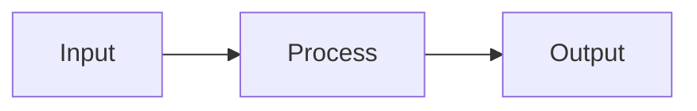

# mdpres

Markdown to HTML presentation generator.

## Installation

```bash
# Clone the repository
git clone <repo-url>
cd html-presentation

# Install dependencies
uv sync
```

## Quick Start

```bash
# Create an example presentation
uv run mdpres example

# Build HTML
uv run mdpres build example.md

# Open in browser
open example.html
```

## Usage

### Commands

```bash
# Build presentation
uv run mdpres build slides.md

# With output file and theme
uv run mdpres build slides.md -o presentation.html --theme nord

# Create example file
uv run mdpres example

# List available themes
uv run mdpres themes
```

### Markdown Format

Slides are separated by horizontal rule `---`:

```markdown
---
title: Presentation Title
author: Author Name
---

# Title

First slide (title slide)

---

## Second Slide

- Item 1
- Item 2
- Item 3

---

## Code

```python
def hello(name):
    return f"Hello, {name}!"
```

---

## Diagram


```

### Supported Elements

| Element | Syntax |
|---------|--------|
| Headers | `# H1`, `## H2`, `### H3` |
| Bold | `**text**` or `__text__` |
| Italic | `*text*` or `_text_` |
| Code | `` `code` `` |
| Links | `[text](url)` |
| Images | `` |
| Lists | `- item` or `1. item` |
| Blockquotes | `> quote` |
| Code blocks | ` ```language ... ``` ` |
| Mermaid | ` ```mermaid ... ``` ` |

### Slide Directives

Add HTML comments to customize slides:

```markdown
<!-- class: centered special -->
<!-- type: custom -->

# Slide with classes
```

## Themes

| Theme | Description |
|-------|-------------|
| `dark` | Dark theme (default) |
| `light` | Light theme |
| `nord` | Nordic color palette |
| `dracula` | Popular dark theme |

```bash
uv run mdpres build slides.md --theme dracula
```

## Presentation Navigation

| Key | Action |
|-----|--------|
| `Right` / `Space` / `PageDown` | Next slide |
| `Left` / `PageUp` | Previous slide |
| `Home` | First slide |
| `End` | Last slide |
| `f` | Toggle fullscreen |

On mobile devices use swipe gestures.

## Development

```bash
# Install dev dependencies
uv sync

# Run tests
uv run pytest

# Linter
uv run ruff check .

# Format code
uv run ruff format .

# Type checking
uv run pyrefly check
```

## License

MIT
