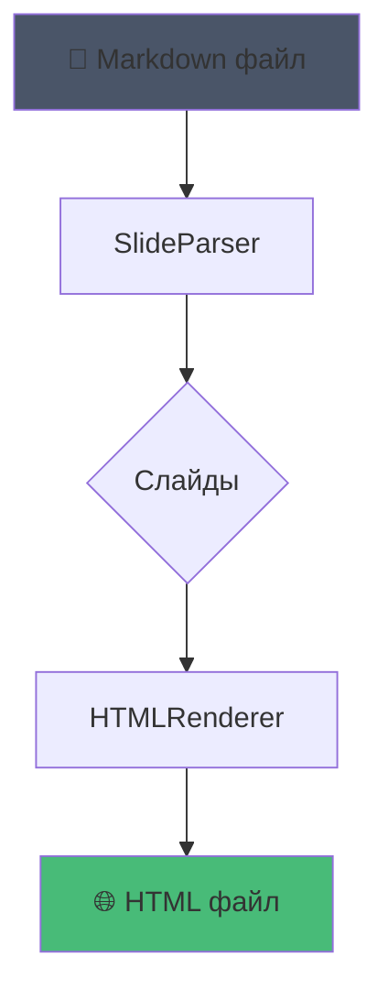
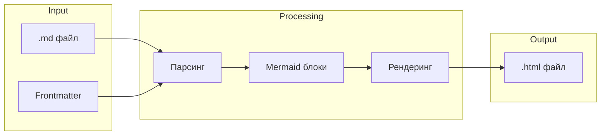

# mdpres

Markdown → HTML Презентации

---

## Что умеет?

- Простой **markdown** синтаксис
- Разделение слайдов через `---`
- **Mermaid** диаграммы из коробки
- 4 встроенные темы
- Навигация: стрелки, swipe, клавиши

---

## Пример кода

```python
from mdpres import SlideParser, HTMLRenderer

# Парсим markdown
parser = SlideParser(content).parse()

# Рендерим в HTML
html = HTMLRenderer(parser, theme='dark').render()
```

---

## Архитектура



---

## Процесс сборки



---

## Темы

| Тема | Стиль |
|------|-------|
| dark | Тёмная, индиго акцент |
| light | Светлая, классика |
| nord | Скандинавская палитра |
| dracula | Популярная тёмная тема |

---

## Использование

```bash
# Создать пример
mdpres example

# Собрать презентацию
mdpres build slides.md

# С выбором темы
mdpres build slides.md --theme nord -o output.html
```

---

## Roadmap

1. ~~MVP с базовым markdown~~ ✅
2. ~~Mermaid диаграммы~~ ✅
3. Live preview сервер
4. Анимации фрагментов
5. Экспорт в PDF
6. Кастомные темы

---

# Спасибо!

> mdpres — простые презентации из markdown

**GitHub:** github.com/you/mdpres
