# MoAI-ADK System Architecture

Comprehensive guide to MoAI-ADK's architecture, including the 5-tier agent hierarchy, component relationships, data flows, and system integration patterns.

## Architecture Overview

MoAI-ADK (Agentic Development Kit) is built on a layered architecture that separates concerns while maintaining tight integration between components.

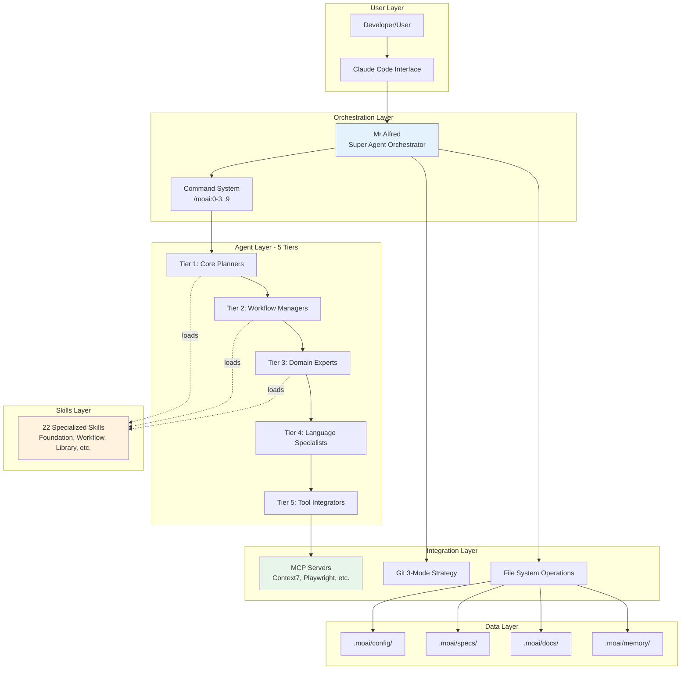

---

## Core Components

### 1. Mr.Alfred - Super Agent Orchestrator

**Role**: Central orchestrator that manages all commands, agents, and skills.

**Responsibilities**:
- User request analysis (8-step process)
- Agent selection and delegation
- Skill loading and management
- Token budget optimization
- Quality assurance coordination

**Decision Flow**:

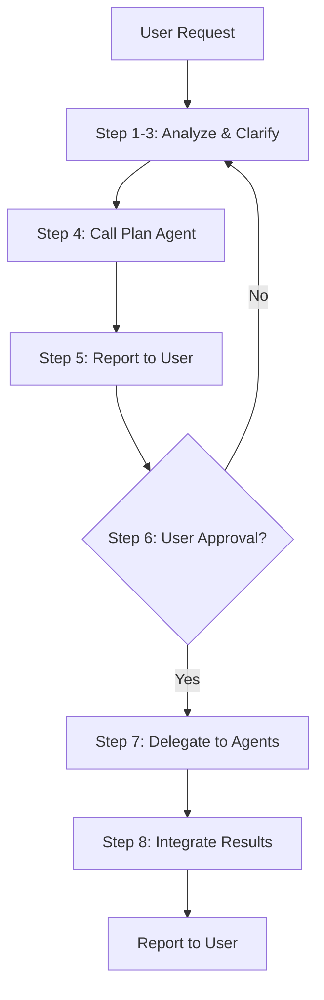

**Configuration**:
```json
// .moai/config/config.json
{
  "language": {
    "conversation_language": "ko",
    "agent_prompt_language": "ko"
  },
  "constitution": {
    "enforce_tdd": true,
    "test_coverage_target": 90
  }
}
```

---

### 2. Five-Tier Agent Hierarchy

#### Tier 1: Core Planners (2 agents)

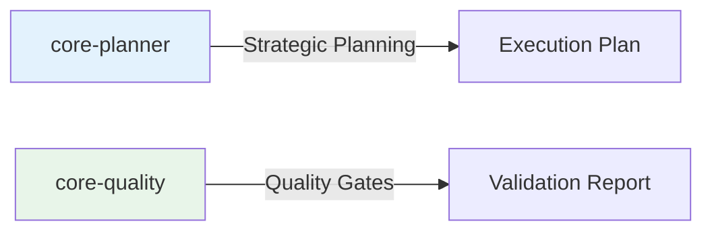

**core-planner**:
- Analyzes user requests
- Creates execution strategies
- Estimates complexity and time
- Recommends agent combinations

**core-quality**:
- Enforces TRUST 5 principles
- Validates test coverage (85%+)
- Runs quality gates
- Auto-generates missing tests

#### Tier 2: Workflow Managers (6 agents)

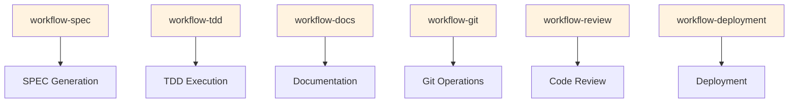

**Responsibilities**:
- **workflow-spec**: EARS format SPEC creation
- **workflow-tdd**: RED-GREEN-REFACTOR cycle management
- **workflow-docs**: Documentation generation and validation
- **workflow-git**: Git operations, branching, PR creation
- **workflow-review**: Code review and analysis
- **workflow-deployment**: Deployment orchestration

#### Tier 3: Domain Experts (9 agents)

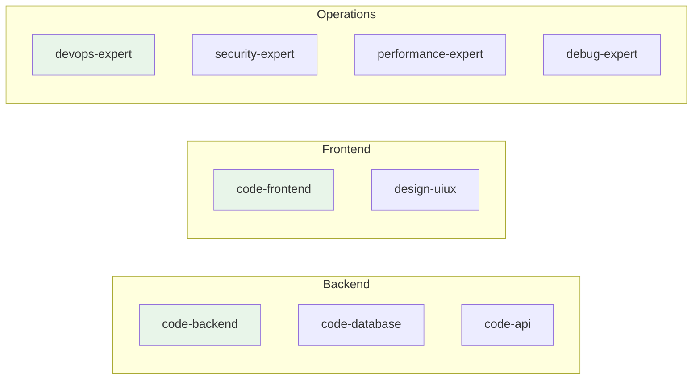

**Specializations**:
- **code-backend**: Server-side logic, APIs, business logic
- **code-frontend**: UI implementation, React/Vue/Angular
- **code-database**: Schema design, migrations, optimization
- **code-api**: RESTful/GraphQL API design
- **security-expert**: OWASP Top 10, threat modeling
- **performance-expert**: Profiling, optimization, caching
- **design-uiux**: Design systems, accessibility (WCAG 2.1)
- **devops-expert**: CI/CD, containerization, infrastructure
- **debug-expert**: Error analysis, debugging strategies

#### Tier 4: Language Specialists (5 agents)

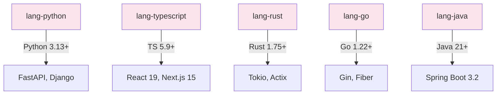

**Language-Specific Expertise**:
- Latest language features and idioms
- Framework best practices
- Performance optimization patterns
- Testing frameworks and tooling

#### Tier 5: Tool Integrators (4 agents)

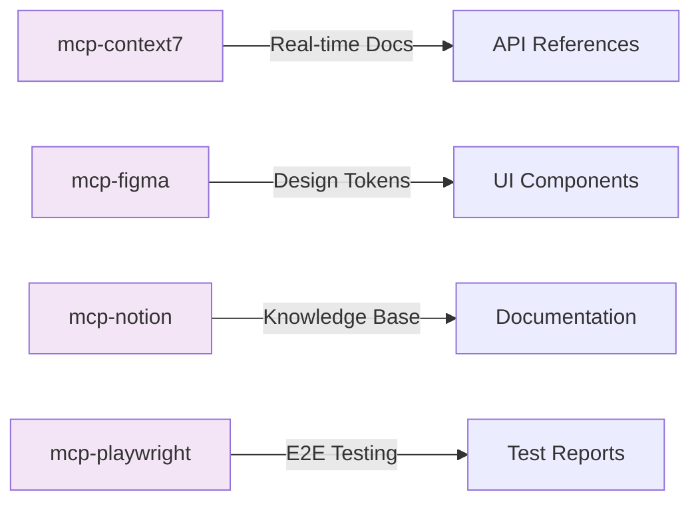

**External Integrations**:
- **mcp-context7**: Latest library documentation and version checking
- **mcp-figma**: Design system sync, UI kit integration
- **mcp-notion**: Workspace management, content databases
- **mcp-playwright**: Web testing, visual regression

---

### 3. Skills System

**Architecture**:

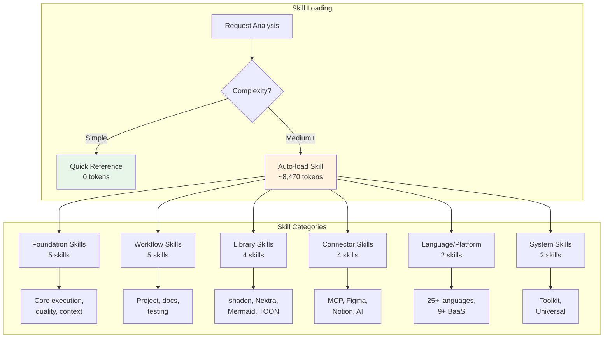

**Progressive Disclosure Structure**:
1. **Quick Reference (30s)**: Core capabilities, triggers
2. **Implementation Guide (5min)**: Features, when to use, patterns
3. **Core Patterns (10+min)**: Detailed implementations
4. **Advanced Documentation**: Deep-dive modules
5. **Works Well With**: Related components

---

### 4. Command System

**Command Execution Flow**:

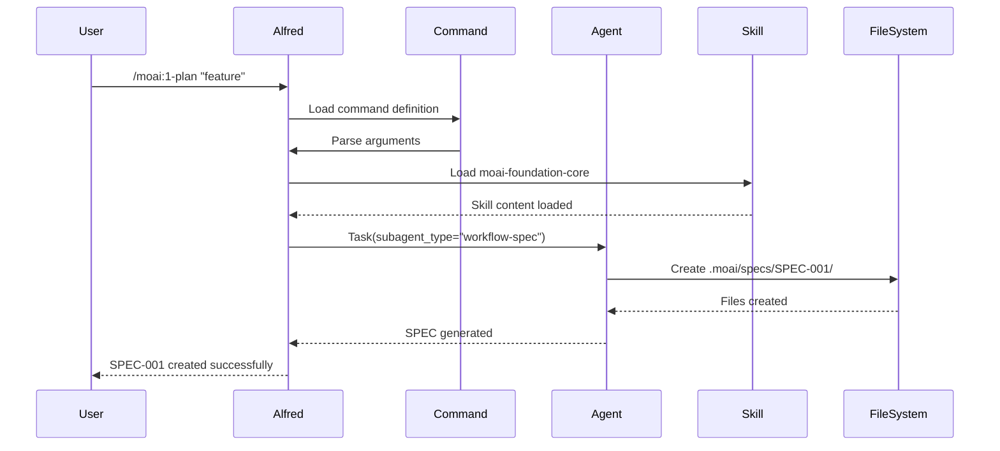

**Available Commands**:
1. `/moai:0-project` → manager-project agent
2. `/moai:1-plan` → workflow-spec agent
3. `/moai:2-run` → workflow-tdd + domain experts
4. `/moai:3-sync` → workflow-docs + workflow-git
5. `/moai:9-feedback` → manager-strategy agent
6. `/clear` → System command (context reset)

---

### 5. Data Layer

**Directory Structure**:

```
.moai/
├── config/
│   ├── config.json           # Main configuration
│   └── presets/              # Git strategy presets
├── specs/
│   └── SPEC-{ID}/
│       ├── spec.md           # Requirements (EARS)
│       ├── plan.md           # Implementation plan
│       ├── acceptance.md     # Acceptance criteria
│       └── implementation.md # Implementation notes
├── docs/
│   ├── architecture.md
│   ├── api-reference.md
│   └── guides/
├── memory/
│   └── last-session-state.json  # Session persistence
├── logs/
│   └── sessions/
└── reports/
    └── quality/
```

**Data Flow**:

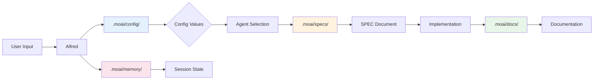

---

## Integration Patterns

### 1. MCP Server Integration

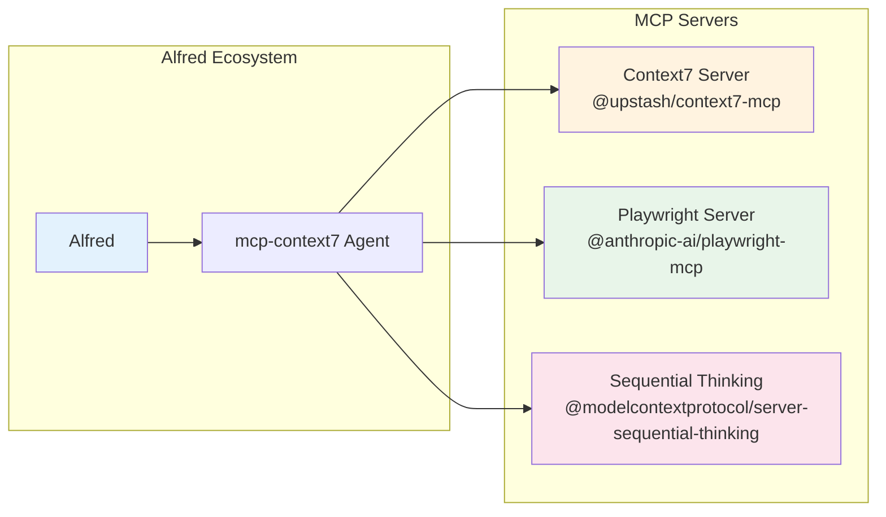

**Configuration** (.mcp.json):
```json
{
  "mcpServers": {
    "context7": {
      "command": "npx",
      "args": ["-y", "@upstash/context7-mcp@latest"]
    },
    "playwright": {
      "command": "npx",
      "args": ["-y", "@anthropic-ai/playwright-mcp@latest"]
    }
  }
}
```

### 2. Git 3-Mode Strategy

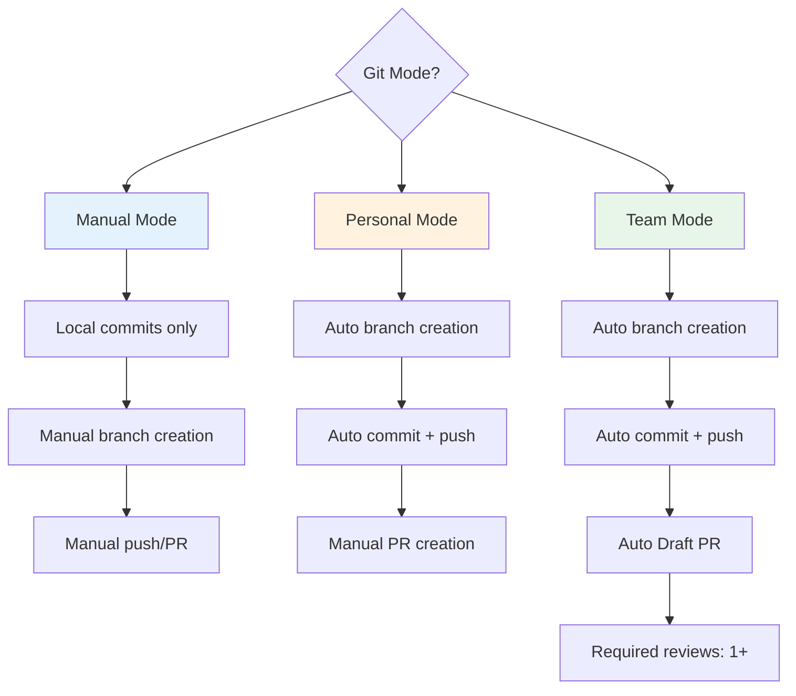

**Configuration**:
```json
{
  "git_strategy": {
    "mode": "manual",  // "personal" or "team"
    "automation": {
      "auto_branch": false,
      "auto_commit": true,
      "auto_pr": false,
      "auto_push": false
    }
  }
}
```

### 3. TDD Workflow Integration

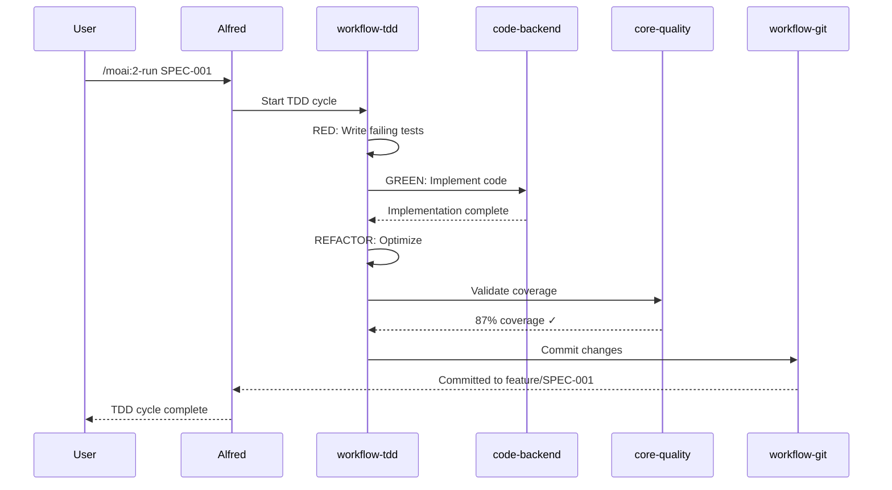

---

## Token Budget Architecture

### Context Window Management

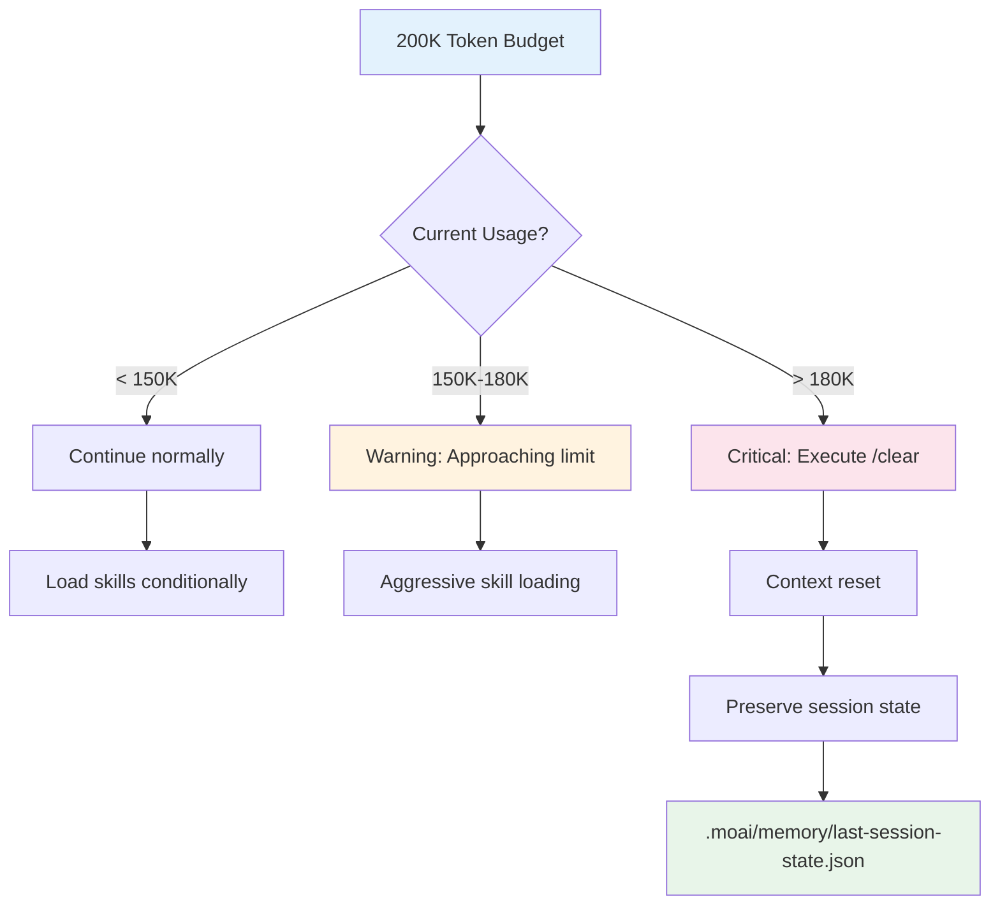

**Optimization Strategies**:
1. **Conditional Skill Loading**: Only load when needed
2. **Quick Reference**: 0-token inline docs for simple tasks
3. **Task Delegation**: New 200K context per agent
4. **Aggressive /clear**: Reset at natural boundaries

---

## Security Architecture

### IAM & Permissions

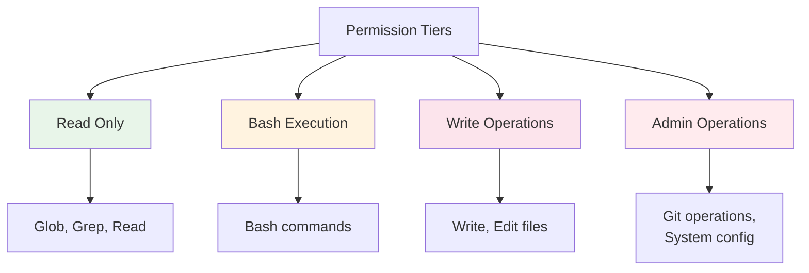

**Permission Hierarchy**:
- **Read**: Lowest risk (file reading, searching)
- **Bash**: Medium risk (command execution)
- **Write**: High risk (file modifications)
- **Admin**: Highest risk (Git, system changes)

**Configuration** (.claude/settings.json):
```json
{
  "permissions": {
    "allowedTools": ["Read", "Glob", "Grep", "Bash", "Write", "Edit"],
    "allowedDirectories": [
      "/Users/goos/worktrees/MoAI-ADK/SPEC-NEXTRA-001"
    ]
  }
}
```

---

## Performance Characteristics

### Agent Delegation Performance

| Pattern | Token Cost | Response Time | Use Case |
|---------|------------|---------------|----------|
| Quick Reference | 0 tokens | \<1s | Simple queries |
| Single Skill Load | ~8,470 tokens | 1-2s | Medium complexity |
| Multi-Skill Load | ~25,000 tokens | 3-5s | High complexity |
| Multi-Agent Sequential | Variable | 10-30s | Complex workflows |
| Multi-Agent Parallel | Variable | 5-15s | Independent tasks |

### Skill Loading Performance

```python
# Performance comparison
if complexity == "simple":
    # 0 tokens, instant
    use_quick_reference()

elif complexity == "medium":
    # 8,470 tokens, ~1-2s
    Skill("moai-foundation-core")

elif complexity == "high":
    # 25,000+ tokens, ~3-5s
    Skill("moai-foundation-core")
    Skill("moai-lang-unified")
    Skill("moai-platform-baas")
```

---

## Extension Points

### 1. Custom Agents

Create custom agents in `.claude/agents/`:

```yaml
---
name: custom-agent
type: expert
domain: custom-domain
skills: moai-foundation-core, moai-lang-unified
---

# Agent Implementation
```

### 2. Custom Skills

Create custom skills in `.claude/skills/`:

```markdown
---
name: custom-skill
version: 1.0.0
---

## Quick Reference (30 seconds)
## Implementation Guide (5 minutes)
## Core Patterns
```

### 3. Custom Commands

Create custom commands in `.claude/commands/`:

```markdown
---
command: /custom:action
description: Custom workflow command
---

# Command Implementation
```

---

## Deployment Architecture

### Local Development

```
Developer Machine
├── MoAI-ADK Project
├── Claude Code (Alfred)
├── MCP Servers (local)
└── Git (local repository)
```

### Team Collaboration

```
Team Environment
├── GitHub Repository
│   ├── .moai/ (shared config)
│   ├── .claude/ (shared resources)
│   └── src/ (code)
├── CI/CD Pipeline
│   ├── Quality Gates
│   ├── Test Execution
│   └── Documentation Build
└── Shared MCP Servers
```

---

## Related Resources

- [5-Tier Agent Hierarchy](/advanced/agents-guide)
- [Skills Library](/skills)
- [Command Reference](/commands)
- [TRUST 5 Quality](/advanced/trust5-quality)
- [Performance Optimization](/advanced/performance-optimization)

---

**Last Updated**: 2025-11-28
**Architecture Version**: 2.0
**Status**: Production
