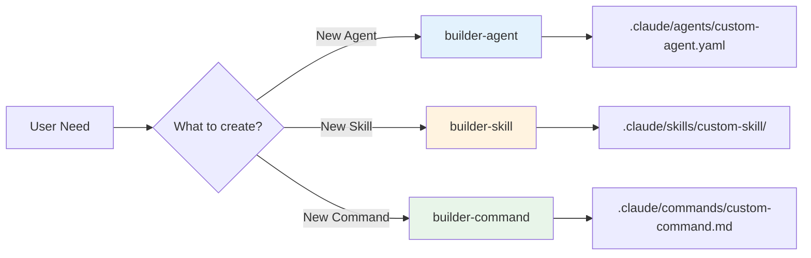

# Builder Agents: Meta-Level Creation

MoAI-ADK provides three specialized builder agents that enable you to extend the framework by creating custom agents, skills, and commands.

## Overview

Builder agents are meta-level tools that generate standardized MoAI-ADK components:

| Builder | Creates | Output Location | Use Case |
|---------|---------|-----------------|----------|
| builder-agent | Custom sub-agents | `.claude/agents/` | Domain-specific automation |
| builder-skill | Custom skills | `.claude/skills/` | Reusable knowledge modules |
| builder-command | Custom commands | `.claude/commands/` | Workflow automation |



---

## builder-agent

### Purpose
Create standardized sub-agents with proper YAML frontmatter, skills integration, and delegation patterns.

### Usage

```bash
Task(subagent_type="builder-agent", prompt="""
Create a custom agent for:
- Name: security-scanner
- Domain: Security Analysis
- Skills: moai-foundation-security, moai-lang-unified
- Purpose: Automated security vulnerability scanning
""")
```

### Generated Output

```yaml
---
name: security-scanner
type: expert
domain: security-analysis
tier: 3
skills: moai-foundation-security, moai-lang-unified
version: 1.0.0
status: active
---

# Security Scanner Agent

## Quick Reference (30 seconds)
## Implementation Guide (5 minutes)
## 5 Core Patterns
## Works Well With
```

### Agent Template Structure

```
.claude/agents/security-scanner.yaml
├── YAML Frontmatter
│   ├── name: Unique identifier
│   ├── type: expert|manager|builder|mcp
│   ├── domain: Specialization area
│   ├── tier: 1-5 hierarchy level
│   ├── skills: Comma-separated skill list
│   └── version: Semantic versioning
└── Markdown Content
    ├── Quick Reference
    ├── Implementation Guide
    ├── Core Patterns
    └── Integration Points
```

---

## builder-skill

### Purpose
Create Progressive Disclosure-structured skills with consistent formatting and documentation.

### Usage

```python
Task(subagent_type="builder-skill", prompt="""
Create a skill for:
- Name: moai-testing-visual
- Category: Testing
- Domain: Visual regression testing
- Key Features: Snapshot comparison, diff reporting, CI integration
""")
```

### Generated Structure

```
.claude/skills/moai-testing-visual/
├── SKILL.md (main skill file)
│   ├── Quick Reference (30 seconds)
│   ├── Implementation Guide (5 minutes)
│   ├── 5 Core Patterns
│   └── Works Well With
├── modules/
│   ├── core.md (core implementation details)
│   ├── advanced.md (advanced patterns)
│   └── reference.md (API reference)
└── examples/
    ├── basic-example.md
    └── advanced-example.md
```

### Skill Template

```markdown
---
name: moai-testing-visual
description: Visual regression testing with snapshot comparison
version: 1.0.0
updated: 2025-11-28
status: active
category: testing
---

## Quick Reference (30 seconds)
Core capabilities, auto-triggers, key patterns

## Implementation Guide (5 minutes)
- Features
- When to use
- Core patterns (3 examples)

## 5 Core Patterns
Pattern 1-5 with detailed implementations

## Advanced Documentation
Links to modules/ directory

## Works Well With
Related agents, skills, commands
```

---

## builder-command

### Purpose
Create slash commands with argument parsing, skill integration, and agent delegation patterns.

### Usage

```bash
Task(subagent_type="builder-command", prompt="""
Create a command for:
- Name: /moai:test
- Purpose: Run comprehensive test suite
- Arguments: --coverage, --watch, --bail
- Agents: workflow-testing, core-quality
""")
```

### Generated Command

```markdown
---
command: /moai:test
description: Run comprehensive test suite with coverage
arguments:
  - name: coverage
    type: boolean
    default: true
  - name: watch
    type: boolean
    default: false
  - name: bail
    type: boolean
    default: false
agents:
  - workflow-testing
  - core-quality
version: 1.0.0
---

# /moai:test - Test Execution Command

## Syntax
\`\`\`bash
/moai:test [--coverage] [--watch] [--bail]
\`\`\`

## Examples
\`\`\`bash
/moai:test                    # Run all tests with coverage
/moai:test --watch            # Watch mode for development
/moai:test --bail --coverage  # Stop on first failure
\`\`\`

## Implementation
[Command execution logic]

## Related Commands
## Related Skills
```

---

## Best Practices

### Creating Custom Agents

**DO**:
✅ Follow naming convention: `{type}-{domain}` (e.g., `expert-security`)
✅ Assign to appropriate tier (1-5)
✅ Load only necessary skills
✅ Define clear delegation patterns
✅ Include usage examples

**DON'T**:
❌ Create agents for one-time tasks
❌ Duplicate existing agent functionality
❌ Violate tier hierarchy
❌ Load all skills unconditionally

### Creating Custom Skills

**DO**:
✅ Follow Progressive Disclosure structure
✅ Use `moai-{category}-{name}` naming
✅ Keep SKILL.md under 500 lines
✅ Move details to modules/
✅ Include real-world examples

**DON'T**:
❌ Create monolithic skills (>1000 lines)
❌ Duplicate existing skill content
❌ Skip Quick Reference section
❌ Forget "Works Well With" section

### Creating Custom Commands

**DO**:
✅ Use `/moai:` or `/custom:` prefix
✅ Define clear argument schema
✅ Specify required agents
✅ Provide usage examples
✅ Document error handling

**DON'T**:
❌ Create commands for rare operations
❌ Use complex argument parsing
❌ Skip error handling
❌ Forget to document arguments

---

## Real-World Examples

### Example 1: Custom Security Agent

```python
# Create security scanning agent
Task(subagent_type="builder-agent", prompt="""
Agent specification:
- Name: expert-security-scanner
- Tier: 3 (Domain Expert)
- Domain: Security & Vulnerability Analysis
- Skills: moai-foundation-security, moai-lang-unified, moai-platform-baas
- Capabilities:
  - OWASP Top 10 vulnerability scanning
  - Dependency security audit
  - Code pattern security analysis
  - Security best practices enforcement
""")

# Use the new agent
result = Task(subagent_type="expert-security-scanner", prompt="""
Analyze this codebase for security vulnerabilities:
- SQL injection risks
- XSS vulnerabilities
- Authentication weaknesses
- Dependency vulnerabilities
""")
```

### Example 2: Custom Testing Skill

```python
# Create visual regression testing skill
Task(subagent_type="builder-skill", prompt="""
Skill specification:
- Name: moai-testing-visual-regression
- Category: Testing
- Features:
  - Percy integration for visual diffs
  - Chromatic for Storybook
  - Playwright screenshot comparison
  - CI/CD pipeline integration
- Auto-trigger: When UI components change
- Core Patterns:
  1. Baseline snapshot creation
  2. Visual diff comparison
  3. Approval workflow
  4. CI integration
  5. Multi-browser testing
""")

# Load and use the skill
Skill("moai-testing-visual-regression")
```

### Example 3: Custom Deployment Command

```python
# Create deployment automation command
Task(subagent_type="builder-command", prompt="""
Command specification:
- Name: /moai:deploy
- Purpose: Automated deployment to staging/production
- Arguments:
  --environment: staging|production
  --skip-tests: boolean (default: false)
  --rollback: boolean (default: false)
- Agents: devops-expert, core-quality, workflow-git
- Workflow:
  1. Run quality gates (unless --skip-tests)
  2. Build production bundle
  3. Deploy to target environment
  4. Run smoke tests
  5. Rollback if failures (or if --rollback)
""")

# Use the new command
/moai:deploy --environment production
```

---

## Integration Patterns

### Agent + Skill Composition

```python
# Create custom agent with custom skill
Task(subagent_type="builder-skill", prompt="Create moai-ai-codegen skill")
Task(subagent_type="builder-agent", prompt="""
Create expert-ai-coder agent using:
- moai-ai-codegen (custom skill)
- moai-lang-unified (existing skill)
- moai-foundation-quality (existing skill)
""")

# Use combined power
Task(subagent_type="expert-ai-coder", prompt="Generate AI-powered code")
```

### Command + Agent Orchestration

```python
# Create command that orchestrates multiple agents
Task(subagent_type="builder-command", prompt="""
Create /moai:full-stack command that:
1. Calls expert-backend for API
2. Calls expert-frontend for UI
3. Calls expert-database for schema
4. Calls core-quality for validation
5. Calls workflow-docs for documentation
""")

# Single command executes full workflow
/moai:full-stack "user authentication system"
```

---

## Validation & Quality

### Agent Validation

Builder agents automatically validate:
- ✅ YAML frontmatter structure
- ✅ Naming conventions
- ✅ Tier assignment correctness
- ✅ Skills existence
- ✅ Documentation completeness

### Skill Validation

Builder skills automatically validate:
- ✅ Progressive Disclosure structure
- ✅ File size limits (\<500 lines for SKILL.md)
- ✅ Module organization
- ✅ Example quality
- ✅ "Works Well With" completeness

### Command Validation

Builder commands automatically validate:
- ✅ Argument schema correctness
- ✅ Agent references validity
- ✅ Documentation completeness
- ✅ Error handling patterns
- ✅ Usage example accuracy

---

## Related Resources

- [Agent Guide](/advanced/agents-guide) - 26 existing agents
- [Skills Library](/skills) - 22 existing skills
- [Commands Reference](/commands) - 6 core commands
- [Architecture](/advanced/architecture) - System architecture

---

**Last Updated**: 2025-11-28
**Builder Agents**: 3
**Version**: 2.0
